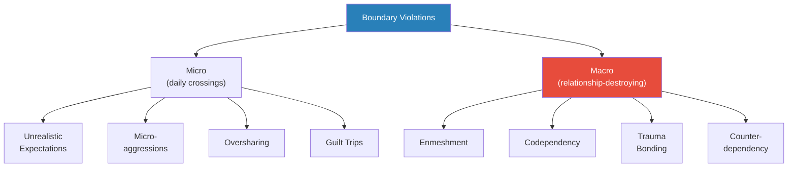
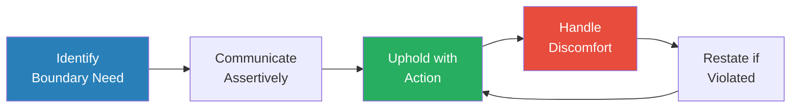
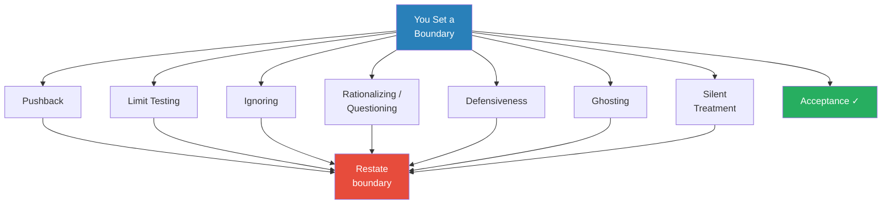
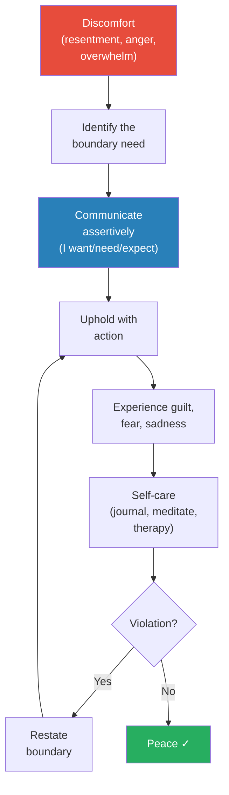
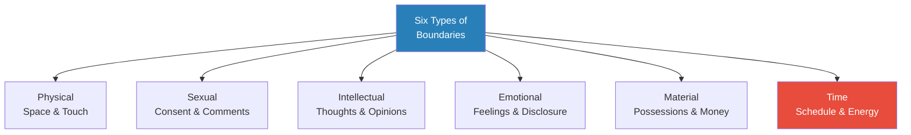

# Set Boundaries, Find Peace — Nedra Glennon Tawwab

> Nedra Tawwab is a licensed therapist who has spent fourteen years watching clients walk through her door disguising boundary issues as anxiety, burnout, codependency, and resentment.
> Her thesis is disarmingly simple: most relationship problems are boundary problems in disguise.
> The book breaks boundaries into six concrete types — physical, sexual, intellectual, emotional, material, and time — and provides exact scripts for communicating them, a framework for handling every possible response, and a realistic acknowledgment that guilt is inevitable and survivable.
> What distinguishes this book from other boundary texts is Tawwab's identity as a Black woman therapist who explicitly addresses collectivist family dynamics, cultural obligation, and the particular guilt that comes from asserting yourself within families that treat independence as betrayal.
> This is not abstract theory — it is a field manual, complete with Instagram poll data, real client stories, and word-for-word scripts you can use today.

---

## About the Author

Nedra Glennon Tawwab is a licensed clinical social worker and relationship therapist based in Charlotte, North Carolina, with over fourteen years of clinical experience. She built a massive following on Instagram (@nedratawwab) through posts about boundary issues, mental health, and relationships — her "Signs That You Need Boundaries" post went viral and demonstrated the enormous unmet need for boundary education. She was featured in a 2019 *New York Times* article, "Instagram Therapists Are the New Instagram Poets." This book grew directly from the thousands of questions she received from followers who desperately wanted help with boundary-setting but had no idea where to start. She writes from personal experience: her own struggles with codependency, family boundaries, and learning to say no.

---

## The Big Idea

- <b style="color: #2980b9">Boundaries</b> are expectations and needs that help you feel safe and comfortable in your relationships — they are not walls, not selfishness, and not cruelty
- Most problems people bring to therapy — anxiety, depression, burnout, resentment, codependency — are <b style="color: #e74c3c">boundary problems in disguise</b>
- Setting a boundary has two parts: **communication** (saying what you need) and **action** (upholding it through behaviour) — most people fail at the second part
- <b style="color: #27ae60">Guilt is a normal, inevitable, survivable part of boundary-setting</b> — there is no such thing as guilt-free boundaries, and waiting until you feel no guilt means waiting forever
- People cannot read your mind — unspoken boundaries are not boundaries at all
- Boundaries are not a one-time event but an ongoing practice that must be restated, refreshed, and consistently upheld
- The people who resist your boundaries the most are the people who benefited the most from you having none

---

## Key Concepts at a Glance

| Concept | One-line summary |
|---------|-----------------|
| **Three Levels of Boundaries** | Porous (too open), rigid (walls), healthy (aware + communicative) |
| **Six Types of Boundaries** | Physical, sexual, intellectual, emotional, material, time |
| **Two Parts to Boundary-Setting** | Communication (stating needs) + Action (upholding them) |
| **Assertive Communication** | Clear, direct I-statements without apology or over-explanation |
| **The Acclimation Period** | Time needed for others to adjust to your new boundaries |
| **Micro vs Macro Violations** | Small daily boundary violations vs enmeshment, codependency, trauma bonding |
| **Blurred Boundaries** | Indirect attempts (gossip, advice, hints) that aren't actual boundaries |
| **Ultimatums vs Threats** | Ultimatums have follow-through; threats are empty — only ultimatums work |
| **Boundaries with Self** | Self-care, self-talk, keeping your word to yourself |
| **People-Pleasing** | Making others happy at the cost of your own happiness |
| **Worst-Case-Scenario Thinking** | Fear-based hypothesis about what will happen; almost never accurate |
| **Counterdependency** | Rigid boundaries that push everyone away — the opposite extreme of porous |

---

## Part 1: Understanding Boundaries

### Preface and Introduction — A Therapist's Confession

*Before launching into theory, Tawwab shares her own boundary story — she is not writing from clinical distance but from lived experience.*

- Tawwab's life before healthy boundaries was "overwhelming and chaotic" — she struggled with codependency, unfulfilling relationships, and the inability to speak up
- She carried resentment for years, hoping others would guess her mood and wishes — "They went about their day while I suffered in silence"
- Things that once seemed impossible — like saying "I won't be able to help you move" — now come out firmly
- Setting boundaries is an ongoing practice: "The moment I let up on setting perimeters, my old problems resurface"
- She feared that standing up for herself would cost her relationships — but discovered the personal cost of not standing up was far higher
- <b style="color: #27ae60">Key insight from her clinical practice:</b> people never come to therapy knowing they have boundary issues — they come for anxiety, conflicts, time management, social media stress — and she gently tells them: "You have an issue with boundaries"
- Her Instagram post "Signs That You Need Boundaries" went viral, demonstrating the enormous unmet need for boundary education
- 85 percent of her weekly Instagram Q&A questions pertain to boundaries
- Common questions people ask: "My friends get drunk every week and it makes me uncomfortable — what can I do?" / "I can't stop saying yes to my brother who constantly asks to borrow money" / "My parents want me to come home for the holidays but I want to go to my partner's family's house"
- The number one reason people avoid setting boundaries: <b style="color: #e74c3c">fear of someone getting mad at them</b>
- "Fear is not rooted in fact. Fear is rooted in negative thoughts and the story lines in our heads."
- **Reasons people don't respect your boundaries:**
  - You don't take yourself seriously
  - You don't hold people accountable
  - You apologise for setting boundaries
  - You allow too much flexibility
  - You speak in uncertain terms
  - You haven't verbalised your boundaries — they're all in your head
  - You assume stating your boundaries once is enough
  - You assume people will figure out what you want based on how you act when they violate a boundary

---

### Chapter 1 — What the Heck Are Boundaries?

*Tawwab opens with her working definition and immediately shows that "boundary issues" are hiding behind almost every presenting problem in therapy.*

- <b style="color: #2980b9">Boundaries</b> are expectations and needs that help you feel safe and comfortable in your relationships
- They are a safeguard against overextending, a self-care practice, a way to define roles, communicate acceptable behaviour, and feel safe
- Signs you need boundaries:
  - You feel overwhelmed
  - You feel resentful toward people who ask for help
  - You avoid phone calls from people who might ask for something
  - You feel burned out
  - You fantasise about dropping everything and disappearing
  - You have no time for yourself

> [!example] Kim: The People-Pleaser Who Couldn't Say No
> - Kim, newly married and excelling at work, prided herself on being "the best" at everything — best friend, best daughter, best sister, best coworker
> - Being the best meant always saying yes; saying no was "mean" and "selfish"
> - She arrived in therapy hoping to figure out how to create more time — not realising you cannot create more time
> - Tawwab pointed out that Kim needed to lighten her load, not extend her day
> - Kim's refusal to say no was the root of her worry, stress, and crippling anxiety
> **The lesson:** You cannot create more time. You can only do less.

- Three levels of boundaries:
  - **Porous:** weak, poorly expressed — leads to depletion, codependency, enmeshment, people-pleasing, inability to say no
  - **Rigid:** walls to keep others out — comes from fear of vulnerability or history of being taken advantage of; no exceptions even when healthy to bend
  - <b style="color: #27ae60">**Healthy:**</b> awareness of your emotional, mental, and physical capacities combined with clear communication; comfortable saying no *and* hearing no

- Two parts to setting boundaries:
  1. **Communication:** verbally stating your needs using assertive statements — people cannot assume your boundaries from body language alone
  2. **Action:** upholding what you communicate through behaviour — this is where most people fail

---

- **Boundaries are for you AND the other person:**
  - Many people believe that once a limit is set, others will fall in line — so they don't take action after communicating
  - Lack of action invites continued violations
  - It's your responsibility to follow through
  - The biggest fear: how others will respond

- **Common responses when you share your boundaries** (Tawwab prepares the reader for every possibility):
  - **Pushback:** "Well, I don't know if I can do that" / "This isn't fair" — handle by acknowledging concern then restating boundary
  - **Limit testing:** "I'll check with you again" — handle by naming it: "You are testing my limits"
  - **Ignoring:** acting as if boundary was misunderstood — handle by restating immediately, requesting they repeat it back
  - **Rationalizing/Questioning:** "Why are you asking me to change?" — handle by keeping response short: "This is what's healthy for me"
  - **Defensiveness:** turning the issue back on you — handle with "I" statements, one issue at a time
  - **Ghosting:** disappearing without explanation — handle by sending a precise text mentioning the behaviour
  - **Silent treatment:** present but not really — handle by verbalising: "You seem upset. Can we talk?"
  - **Acceptance:** "Thank you for letting me know" — the healthy response and, in Tawwab's experience, the most common one
- <b style="color: #27ae60">Despite all the fear, most people will graciously accept your requests</b> — unhealthy responses are a sign you needed boundaries a long time ago

---

### Chapter 2 — The Cost of Not Having Healthy Boundaries

*Tawwab catalogues the real-world damage that boundary-less living creates — burnout, mental health deterioration, and relationship collapse.*

> [!example] Erica: The Single Mother on Strike
> - Erica was a single mother of two girls, working forty hours a week as an accountant
> - She based her idea of motherhood on the polished images she saw on social media and from other mothers around her
> - During tax season, she unravelled: dishes piled up, laundry went two weeks undone, kids ate frozen food
> - She mentally said "Screw it" and went on an unintentional strike — doing as little as possible at home while still performing at work
> - The difference: work offered support, praise, and reasonable expectations; home was "thankless, never-ending, and mundane"
> - Her aha moment: her anger toward her ex-husband was being redirected toward her children
> **The lesson:** Burnout doesn't come from working hard — it comes from working without boundaries, support, or self-care.

- <b style="color: #e74c3c">Seven causes of burnout:</b>
  - Not knowing when to say no
  - Not knowing *how* to say no
  - Prioritising others over yourself
  - People-pleasing
  - Superhero syndrome ("I can do it all")
  - Unrealistic expectations
  - Not being appreciated for what you do

- Boundaries and mental health:
  - **Anxiety:** the biggest trigger is the inability to say no — you agree to things, then become anxious about getting them all done
  - **Depression:** Tawwab treats depression by starting with tiny boundary wins — correcting a wrong restaurant order, asking for help in a store
  - **Borderline Personality Disorder:** blurred sense of where you end and others begin
  - **Dependent Personality Disorder:** inability to be alone, no room for boundaries

> [!tip] Core Insight
> Without boundaries, relationships usually end — or we become so fed up from mistreatment that we explode. Either way, the absence of boundaries destroys the relationship it was supposed to protect.

- **What relationships without boundaries look like:**
  - Carlos lent his car to his roommate without setting any expectations — his roommate returned it smelling of cigarette smoke with the tank nearly empty
  - Carlos was disappointed, but he had never communicated his standards
  - "People can't meet a standard that we never express. Boundaries are not *unspoken* rules."
  - "Common sense" is based on personal experience — it is not the same for everyone
  - Without boundaries, relationships operate on magical thinking: hoping things will repair themselves

- **Things people do to avoid setting boundaries:**
  - **Move away:** "I just moved away so they would stop asking me to do things" — but unhealthy boundaries follow you wherever you go
  - **Gossip:** processing frustration by talking about people instead of to them — builds resentment, solves nothing
  - **Complain:** playing the victim — "Why does everyone expect so much from me?"
  - **Avoid:** hoping the problem will go away — creates new problems; Tawwab's own example of avoiding a man she was dating until she finally said: "I don't like you in the same way you like me. I think you should stop calling." — he stopped calling, and both were free
  - **Cutoff:** abruptly disconnecting without explanation — before cutting someone off, ask: Have I set any boundaries? Is the other person even aware of my issues?

---

### Chapter 3 — Why Don't We Have Healthy Boundaries?

*Tawwab traces boundary problems back to childhood — parentification, emotional neglect, and family systems that punish assertiveness.*

> [!example] Justin: The Parentified Child
> - At twelve, after his parents' divorce, Justin's mother told him: "You are now the man of the house"
> - He began watching his younger brothers, starting dinners, getting them ready for bed, even bringing them when he hung out with friends
> - His mother used him as an emotional confidant about the divorce
> - At twenty-nine, he was still the go-to person for everyone — friends, parents, brothers, girlfriends
> - He always dated "project" people who needed help; his longest relationship lasted nine months
> - He was self-sufficient and self-reliant to a fault — couldn't receive help from anyone
> - Recovery: learning to redirect his brothers to their parents, allowing others to be there for him
> **The lesson:** Parentified children grow into adults who can give endlessly but cannot receive — and their relationships fail because of it.

- Where boundaries are learned:
  - **Family is the primary teacher** — we learn whether our needs will be met by how parents respond
  - Parents who force children to hug adults they don't want to hug are violating boundaries
  - When saying no leads to punishment ("You're being mean"), children learn that boundaries are wrong
  - **Modelling matters:** children imitate parents, not their words — if your mother never practised self-care, you learned self-care is selfish

- <b style="color: #e74c3c">It was never your job</b> (for children who experienced parentification):
  - To be the man of the house
  - To be a confidant for your parent
  - To take care of your siblings
  - To figure things out without emotional support
  - To keep the peace within a chaotic home

- Nine reasons people can't set boundaries:
  - Fear of being mean
  - Fear of being rude
  - People-pleasing
  - Anxiety about future interactions
  - Feeling powerless
  - Getting value from helping others
  - Projecting your feelings about being told no onto others
  - Not knowing where to start
  - Believing certain relationships can't have boundaries

- **Childhood issues that impact adult boundary-setting:**
  - **Trauma:** any event that causes deep distress — shifts brain and body into survival mode — if survival depends on relationships, setting boundaries in those relationships feels impossible
  - **Abuse:** physical and emotional abuse are themselves boundary violations — victims learn to view abuse as expected; trauma bonding limits ability to set limits
  - **Emotional neglect:** unintentional failure to provide emotional support — "Emotional neglect is unintentional, while emotional abuse is more deliberate" — people who experienced neglect are confused about what happened and struggle to believe anyone would honour their requests
  - **Enmeshment:** prevents establishing a sense of individuality — leads to believing you're responsible for how others feel — meeting the emotional needs of a parent is not a job for a child

- **Thought patterns that stop boundary-setting:**
  - "You fear being mean" — but how do you know what others see as mean? Assumptions are not facts
  - "You're a people-pleaser" — the hardest thing is accepting that some people won't like your boundaries; not being liked by everyone is a small consequence compared to healthier relationships
  - "You get your value from helping others" — helpers who are overwhelmed need boundaries too; you can help people *and* set limits
  - "You believe certain relationships can't have boundaries" — "I can't tell my mother..." becomes "How can I tell my mother..."

- **Uncomfortable feelings that arise from boundary-setting:**
  - **Guilt:** number one question; there is no guilt-free boundary; guilt comes from programming that having needs is "bad"; it's a feeling, not a permanent state
  - **Sadness:** comes from wanting people to "just get it" without being told
  - **Betrayal:** setting boundaries is NOT betrayal of family/friends — NOT setting them is betrayal of yourself
  - **Remorse:** feeling you said the wrong thing — but expressing something difficult can save relationships

---

### Chapter 4 — The Six Types of Boundaries

*Tawwab provides the taxonomy: every boundary you'll ever need falls into one of six categories, each with its own violations and scripts.*

> [!example] Alex: The Oversharer
> - Within ten minutes of meeting anyone, Alex would tell them her life story
> - When people didn't reciprocate, she thought something was wrong with them
> - Her father had told her everything — including details of her mother's affair — modelling "we don't keep secrets"
> - But when Alex tried to share, her father dismissed her and told her how to think
> - She couldn't trust her own decisions without external validation
> - Friends began distancing themselves, overwhelmed by her constant need for connection
> **The lesson:** Oversharing is often a boundary violation learned in childhood — when a parent shares age-inappropriate information, the child loses their sense of appropriate emotional pacing.

- <b style="color: #2980b9">The six types:</b>

| Type | What It Covers | Example Violation | Example Boundary Statement |
|------|---------------|-------------------|---------------------------|
| **Physical** | Personal space, touch, privacy | Forcing hugs, standing too close, reading someone's journal | "I'm more of a handshaker; I don't want to hug." |
| **Sexual** | Consent, comments, acts | Sexual comments, innuendos, touching without consent | "Your comments about my appearance make me uncomfortable." |
| **Intellectual** | Thoughts, opinions, age-appropriate info | Ridiculing beliefs, dismissing opinions, demeaning a parent in front of a child | "You can disagree without being mean or rude." |
| **Emotional** | Feelings, disclosure pace, confidentiality | Oversharing, invalidating feelings, telling someone how to feel | "My feelings are valid. Don't tell me how I should feel." |
| **Material** | Possessions, loans | Never returning items, damaging possessions, loaning without permission | "I can't loan you my car this weekend." |
| **Time** | How you manage and share time | Calling repeatedly for non-emergencies, expecting someone to drop everything | "I'm unable to stay late today." |

- <b style="color: #27ae60">Time is the type people struggle with most</b> — it touches work-life balance, self-care, favours, and prioritising your own needs
- Ways to honour your time boundaries:
  - Before saying yes, check your calendar — don't squeeze in another event
  - When busy, allow calls to go to voicemail and texts to go unread until convenient
  - Stop accepting favour requests from people who won't reciprocate

- **Honouring physical boundaries:**
  - Verbalise your need for distance — don't assume people will notice discomfort
  - Your boundaries are constantly changing — if you allowed hugs before but now feel uncomfortable, you have every right to say so
  - Let someone know: "I'm not comfortable with that anymore"

- **Honouring emotional boundaries:**
  - In an Instagram poll, 72% said they had shared a friend's secret with someone else — reasons included: "the secret was too burdensome," "I can't keep a secret," "I tell my partner everything"
  - Ask people: "Do you want me to just listen, or are you looking for feedback?" — this simple question can transform relationships
  - Share only with people you trust who can hold space for your emotions
  - Set a pace for disclosure — sharing too much too soon is a boundary violation

---

### Chapter 5 — Boundary Violations

*Tawwab distinguishes between micro violations (small daily boundary crossings) and macro violations (enmeshment, codependency, trauma bonding) that can destroy relationships.*

- **Micro violations:**
  - Unrealistic expectations (expecting instant responses, expecting others to anticipate needs)
  - Comments about appearance or identity (microaggressions around race, gender, sexuality)
  - Oversharing (telling personal details in inappropriate contexts)
  - Guilt trips (intentionally making someone feel bad to get compliance)

- <b style="color: #e74c3c">Macro violations — the big four:</b>
  - **Enmeshment:** inability to be different from the other person; no individual identity; oversharing; rejection if you attempt independence
  - **Codependency:** believing we must help people avoid consequences; enabling unhealthy behaviour; our own needs go unmet
  - **Trauma bonding:** being manipulated into believing abuse is your fault; cycling from harsh treatment to kindness; gaslighting
  - **Counterdependency:** rigid boundaries to keep everyone at emotional distance; difficulty being vulnerable; pushing people away when things get serious

*Micro violations erode relationships slowly through daily friction; macro violations restructure the entire relationship around dysfunction.*

---

### Chapter 6 — Identify and Communicate Your Boundaries

*Tawwab provides her three-step process and addresses the emotions that arise — guilt, fear, sadness, remorse, and awkwardness.*

> [!example] Eric and His Alcoholic Father
> - Eric grew up with an alcoholic father, Paul, who became verbally aggressive when drunk
> - Eric's mother made excuses: "You know he doesn't mean it"
> - At family gatherings, everyone joined Paul in drinking, enabling his behaviour
> - Eric had never directly told his father about the impact of his drinking — only passive-aggressive hints (ignoring calls, telling his mother)
> - His first assertive boundary: "Dad, I don't want to talk to you when you're drunk. I will talk to you when you're sober."
> - Paul became defensive, denied he was drunk, called Eric a liar
> - Eric's follow-through: the next time Paul called drunk, Eric said "It sounds like you've been drinking. I will talk to you later" — then hung up without waiting for a response
> - Over time, drunk calls became infrequent
> - Ultimate boundary: "Dad, I'm hosting a barbecue. I expect you to arrive sober. If you seem under the influence, I will ask you to leave."
> **The lesson:** The first boundary is the hardest. Consistency is what teaches people you are serious.

- <b style="color: #2980b9">Three-step process:</b>
  1. **Identify** the boundary you need (tune into discomfort — resentment, anger, overwhelm)
  2. **Communicate** it using assertive I-statements: "I want...", "I need...", "I expect..."
  3. **Deal with discomfort** — guilt, fear, sadness, remorse, awkwardness

> [!abstract] Assertive Boundary Statements
> - "I want you to stop asking me when I'm getting married."
> - "I need you to call me before you stop by."
> - "I expect you to return my car with a full tank of gas."
> - "I won't be able to help you this time."
> - "Thanks, but that doesn't work for me."

- <b style="color: #e74c3c">Four ways to unsuccessfully communicate a boundary:</b>
  - **Passive:** "I'm uncomfortable sharing my needs, so I'll keep them to myself"
  - **Aggressive:** attacking with harsh, demanding words instead of stating what you want
  - **Passive-Aggressive:** acting upset without clearly stating needs; hoping others will figure it out
  - **Manipulation:** guilting or coercing people into compliance

- **Dealing with guilt (Tawwab's most-asked-about topic):**
  - There is no such thing as guilt-free boundaries — "How can I set one without feeling guilty?" / "You can't."
  - Guilt comes from programming: from the moment many of us were born, we were made to feel guilty for having wants and needs
  - Example: an adult says "Hug me," the kid says "I don't want to," the adult says "I'm going to feel so sad if you don't" — the intention is to evoke guilt
  - Some children are trained to be seen and not heard — asking for what you want is "disrespectful"
  - <b style="color: #27ae60">Guilt is a feeling, not a limitation</b> — you can carry on with your life while feeling guilty, just as you carry on while feeling excited
  - "Have you ever been excited about something? You didn't stop everything because of it. You carried on with your life. You can also carry on while feeling guilty."
  - If boundaries ruin a relationship, the relationship was already on the edge
  - If guilt is bothering you: engage in your favourite self-care practice, do grounding techniques (meditation, yoga)
  - Affirmations: "It's healthy for me to have boundaries" / "Other people have boundaries that I respect" / "Setting boundaries is a sign of a healthy relationship"

- **Dealing with fear:**
  - "They're going to act weird" / "I'll feel awkward" / "They may not talk to me again"
  - When someone has a history of rage, it's understandable to fear setting limits — but we victimise ourselves further when fear prevents us from doing what we need to do
  - Eric's father had accepted boundaries in other areas (taking shoes off at the door, not smoking in the house, going to church) — he was capable of honouring limits when he wanted to

- **Dealing with awkwardness:**
  - "Things are going to be weird" — the worry itself creates the uncomfortable tone
  - Solution: just act normal — if you talk to the person daily, call them the next day
  - Assuming people will honour your boundaries and acting accordingly creates a self-fulfilling prophecy of normalcy

- **Ways to communicate boundaries (in different relationship stages):**
  - In **current relationships:** identify areas needing limits → state needs clearly → don't over-explain → be consistent → restate when necessary
  - In **new relationships:** mention what you want casually as you get to know people → have open discussions about why having your needs met matters → be clear about expectations → the first time someone violates a boundary, let them know
  - With **difficult people:** decide beforehand how you'll deal with pushback → restate assertively → correct violations in real time → accept they're entitled to their response → manage your own discomfort

- **The acclimation period:**
  - Allow time for people to adjust — if you've tolerated behaviour for years, they'll be shocked
  - They may say: "My drinking was never a problem before" or "Why have you changed?"
  - During adjustment, you will need to repeat your boundaries — try not to explain yourself
  - Religiously uphold them: letting violations slide puts you back at square one
  - "Setting boundaries is new for you and the other person. Allow both of you to acclimate."

- **What to avoid when setting boundaries:**
  - <b style="color: #e74c3c">Never apologise</b> — apologising gives the impression that your expectations are negotiable (67% of Tawwab's Instagram poll participants said they can't set boundaries without apologising)
  - Don't waver — don't let people get away with a violation even once
  - Don't say too much — answering one or two questions is fine, but don't let the conversation become a negotiation
  - Stick to the original statement as much as possible

---

### Chapter 7 — Blurred Lines

*Tawwab addresses the indirect, ineffective attempts people make instead of setting real boundaries — gossip, unsolicited advice, pushing values, and threats without follow-through.*

> [!example] Chloe and Her Brother Ray
> - Chloe was tired of enabling her "man-child" brother who always asked to borrow money and never paid it back
> - Her mother's constant refrain: "Family is family no matter what you think of them"
> - Chloe's failed boundaries: telling Ray "This is the last time I'm loaning you money" — then giving in
> - Chloe's blurred boundaries: gossiping about Ray to their mother; commenting on his lifestyle instead of setting direct limits
> - Solution: simple, immediate response — "I can't help you" — without explanation or future promises
> - Setting time boundaries with Ray: simply stopped initiating contact
> - Setting boundaries with her mother: "Mom, if you keep talking about the importance of family after I've asked you to stop, I will end our conversation or change the subject."
> **The lesson:** Blurred boundaries — gossip, hints, indirect complaints — are not boundaries. Only direct, clear statements followed by consistent action create change.

- **Four common blurred-boundary patterns:**
  1. Gossiping about the person instead of talking to them
  2. Telling people how to live their lives (unsolicited advice)
  3. Instructing others about what they should tolerate in their relationships
  4. Pushing your values on others

- **Ultimatums vs threats:**
  - An ultimatum is a choice with a designated consequence you *intend to uphold*
  - A threat is an ultimatum you don't follow through on — people learn not to respect threats
  - Healthy ultimatum: "If you come over unannounced, I won't open the door"
  - Unhealthy ultimatum: "We need to have kids or else"

*Boundary-setting is a cycle, not a one-time event — you will need to restate and uphold boundaries repeatedly before they become the new normal.*

---

### Chapter 9 — Honouring Your Boundaries

*Tawwab turns the lens inward: boundaries with yourself — self-care, self-talk, self-sabotage, people-pleasing, and keeping your word to yourself.*

- **Boundaries with self:**
  - Self-care is the root of boundary-setting — it's saying no to something to say yes to your own well-being
  - Self-talk: stop speaking to yourself in ways you would never speak to someone else
  - Self-sabotage: procrastinating, quitting near goals, staying in unhealthy relationships, negative self-narratives
  - Self-betrayal: changing who you are to stay in relationships, pretending to be someone else
  - <b style="color: #27ae60">People-pleasing is making others happy at the cost of your own happiness</b> — it happens because we want to be accepted

- **The power of saying no:**
  - Saying no to others is saying yes to yourself
  - If you've said no and people keep asking, tell them to *stop asking*
  - "Maybe" and "I'll see" do not mean no — be clear
  - When you engage in activities you don't enjoy, you take time away from yourself

- **Keeping your word to yourself:**
  - Use direct language: "I'm going to quit drinking for thirty days" not "I'll try to stop"
  - Confidence in your boundaries is the cure for self-sabotage
  - "The ultimate form of intrinsic motivation is when a habit becomes part of your identity" — James Clear

---

### Chapter 8 — Trauma and Boundaries

*Tawwab dedicates an entire chapter to how childhood trauma — abuse, neglect, parentification — creates adults with fundamentally broken boundary systems.*

- The Adverse Childhood Experiences (ACE) survey measures exposure to trauma — higher scores correlate with physical and mental health problems in adulthood
- <b style="color: #e74c3c">Common childhood boundary violations:</b>
  - Physical abuse — the most overt violation of a child's physical boundaries
  - Emotional abuse — telling a child how to feel, dismissing their experience
  - Parentification — placing a child in adult roles (confidant, caretaker, mediator)
  - Sexual abuse — children cannot consent; adults must maintain appropriate boundaries
  - Witnessing domestic violence — traumatised even without being directly abused

> [!example] Amber: The Child Who Became the Parent
> - Amber grew up as the primary caretaker for her younger siblings while her mother worked multiple jobs
> - At twelve, she was managing household finances, cooking meals, and mediating sibling disputes
> - As an adult, she couldn't stop caretaking — she chose partners who needed fixing, friends who needed saving
> - When she tried to set boundaries, the guilt was overwhelming: "But they need me"
> - Recovery: understanding that her caretaking was a trauma response, not a personality trait
> **The lesson:** Parentified children become adults who feel guilty for existing without serving someone else's needs. Their boundaries were stolen before they knew they had them.

- **How trauma impacts boundary-setting:**
  - If survival depended on pleasing an abusive parent, you learned that boundaries = danger
  - Trauma bonding makes you believe you deserve mistreatment
  - Hypervigilance from childhood means you scan for threats constantly — but the threat you miss is the one inside your own pattern
  - Recovery begins with recognising that the survival strategy that kept you alive as a child is now keeping you stuck as an adult

---

## Part 2: Applied Boundaries

### Chapter 10 — Family

*The hardest arena for boundary-setting — because family is where the patterns began and where the guilt is deepest.*

> [!example] James, Tiffany, and Debra (The Mother-in-Law Triangle)
> - James and Tiffany's marriage was dominated by his mother Debra — an invisible third force
> - James ran every decision past Debra: wedding, house, finances
> - Tiffany withdrew from family events and retreated when Debra visited
> - In therapy, most disputes traced back to Debra, not to anything between James and Tiffany
> - Key intervention: the couple created boundaries around what topics to keep between themselves, when to share information, and how to talk about their marriage to others
> - James struggled: his mother knew exactly what to say to get him to comply
> - Over time, he became firm — and realised he could set boundaries with his mother while maintaining closeness
> **The lesson:** You become an adult when you set boundaries with your parents. Closeness and boundaries are not opposites — they are prerequisites for each other.

- <b style="color: #2980b9">Signs you need boundaries with your parents:</b>
  - Parents know intimate details of your relationship
  - Parents are involved in your disputes with others
  - Parents don't respect your opinion
  - You say yes to parents out of obligation
  - Parents enter your personal space without asking

- **Cultural complexity:** Tawwab explicitly acknowledges that in collectivist cultures, boundary-setting with family feels like betrayal — but the cost of not setting them is your mental health

- **Boundaries with parents look like:**
  - Expressing your feelings openly
  - Managing your time in a way that works for your schedule
  - Not pressing yourself to attend every family event
  - Not allowing them to show up unannounced
  - Withholding intimate details of your relationship
  - Saying no to gifts given with the hope of controlling your behaviour
  - Introducing your partner when you're ready, not when they demand
  - Handling your own disputes without their involvement

- **The enmeshed family system:**
  - In enmeshed families, there is no individual identity — every decision is a group decision
  - Information flows freely without privacy — "no secrets" means "no boundaries"
  - If one person attempts to set limits, the system treats it as betrayal
  - <b style="color: #e74c3c">Enmeshment is not closeness</b> — it's a system that sacrifices individual wellbeing for the appearance of togetherness
  - Recovery: reclaim your individual identity; make decisions independently; bring other people into your support network

- **Boundaries with parents in collectivist cultures:**
  - In many cultures, setting boundaries with parents feels like treason
  - Parents may invoke religion, tradition, or family honour to override your boundaries
  - Tawwab acknowledges this is real and difficult — but the cost of not setting boundaries is your mental health, your marriage, and your children's wellbeing
  - "Tough love is you creating and keeping healthy boundaries"
  - It's okay to share *why* a boundary is important to you, even if you don't have to — cultural contexts sometimes require more explanation to earn understanding
  - "Family is family" is used to override boundaries and dismiss pain — but love should be earned through respect, not enforced through guilt

- **Setting boundaries with siblings:**
  - Sibling dynamics often carry childhood roles into adulthood — the caretaker, the golden child, the scapegoat
  - You may need to set boundaries around: lending money, emotional labour, mediating family conflicts, comparisons
  - "Loyalty" in dysfunctional families means silence — in healthy families, it means honesty

- **Boundaries with aging parents:**
  - Adults are confused about how to navigate interactions with aging parents
  - The dynamic must shift from child to adult-child — but parents don't always welcome this shift
  - You may need to set boundaries around: financial demands, unannounced visits, unsolicited parenting advice, emotional dumping, triangulation with siblings
  - Being a caregiver to an aging parent requires boundaries more than ever — burnout in this role is extremely common

---

### Chapter 11 — Romantic Relationships

*Tawwab identifies communication as the number one issue in romantic relationships — and shows how boundary-setting is the foundation of lasting intimacy.*

- The primary issues in romantic relationships: communication, fidelity, finances, household duties, children, outside forces (in-laws, friends)
- <b style="color: #2980b9">Communication is the leading cause of most divorces and breakups</b>
- Boundary issues in dating arise when you oversell and underdeliver — agreeing to things in the beginning you can't sustain
- Unspoken expectations are the silent killer: "for some reason we all want our partner to read our minds"

> [!example] Malcolm and Nicole: When Needs Go Unspoken
> - Malcolm and Nicole had been together for years but argued constantly
> - Nicole felt Malcolm never listened; Malcolm felt Nicole was always criticising
> - In therapy, it emerged that neither had ever clearly stated their needs — they assumed the other should "just know"
> - When they learned to use assertive statements ("I need you to put your phone down when I'm talking to you"), the fighting decreased dramatically
> **The lesson:** The most loving thing you can do in a relationship is tell your partner what you need — clearly, directly, without assuming they should already know.

- **Assertiveness in romantic relationships:**
  - Assertive communication: "When you ____, I feel ____. I would like you to ____."
  - Create an environment for openness — pick the right time and place for difficult conversations
  - Don't ambush your partner with boundaries during arguments
  - Boundaries grow and change as relationships evolve — especially during transitions (moving in, marriage, children)

- **Boundaries with co-parents after divorce:**
  - Co-parenting requires boundaries about communication frequency, decision-making, introducing new partners, and speaking about each other in front of children
  - Your children's wellbeing is the organising principle for all co-parenting boundaries

---

### Chapter 12 — Friendships

*Tawwab defines healthy vs unhealthy friendships and provides tools for navigating — or exiting — toxic ones.*

- Toxic friendships: "One day you look around and think, 'Why am I even friends with this person?'"
- Unhealthy friendships are the result of unhealthy boundaries — feeling like you give more than you receive, interactions that end in arguments
- Friends are your chosen family — these relationships should bring ease, comfort, support, and fun, not excess drama
- <b style="color: #27ae60">Signs of a healthy friendship:</b>
  - Mutual respect and reciprocity
  - Feeling energised, not drained, after spending time together
  - Ability to say no without guilt or punishment
  - Honest feedback delivered with care
  - Celebrating each other's successes without jealousy

- **Common friendship boundary issues:**
  - The friend who always cancels plans
  - The friend who only calls when they need something
  - The friend who competes with you rather than supports you
  - The friend who gossips about you to others
  - The friend who crosses your emotional boundaries by sharing your secrets

- **When to end a friendship:**
  - You've set boundaries and they've been consistently violated
  - The relationship is one-sided despite your efforts
  - You dread interactions with this person
  - The friendship negatively impacts your mental health
  - Before ending: ask yourself whether you've been clear about your needs

---

### Chapter 13 — Work

*Tawwab dismantles the myth of the toxic workplace — and shows how many "toxic" environments are actually environments where the person has no boundaries.*

> [!example] Janine: Not a Toxic Workplace After All
> - Janine had worked at her job for twelve years and thought her only option was to leave
> - Her coworker Sammie came to her cubicle daily to gossip; Janine participated because she didn't want to seem rude
> - Sammie kept asking Janine out for after-work drinks; Janine kept giving excuses instead of saying no
> - Janine helped coworkers with their assignments and took on extra projects from her boss
> - She considered her workplace toxic because she felt overworked and frustrated
> - But when we examined the situation: Janine had never set a single boundary
> - She wasn't in a toxic work environment — she just hadn't been setting appropriate boundaries
> **The lesson:** Before you leave a job, ask: "Have I tried setting any boundaries?" Unhealthy boundaries will follow you to any workplace.

- **Boundaries at work sound like:**
  - "I won't be able to take on any additional projects."
  - "I cannot work past five o'clock."
  - "I don't check work emails while on vacation."
  - "I need more assistance with my workload."

- **Burnout prevention:**
  - Don't allow a single vacation day to go unused — in 2018, American workers failed to use 768 million days of paid time off
  - Make time for yourself outside work — hobbies that have nothing to do with your job
  - Take lunch breaks away from your desk — if you must eat at your desk, don't work while eating
  - "The more you appear to handle, the more work you'll be expected to handle"
  - Tawwab's own anti-burnout practices: cap of 15-20 clients per week, three days for clients and two for other work, only seeing clients within her niche, speaking to potential clients before taking them on, sharing after-hours contact boundaries with clients, seeing her own therapist, taking multiple vacations per year

- **How to communicate boundaries to your boss:**
  - Use "I" language — make it about you, not them
  - Don't say: "You always give me things to do when you know my plate is full" (boss feels attacked)
  - Instead say: "I work best with deadlines. As you give me an assignment, I will prioritise your request, but if something is urgent, please let me know"
  - If your boss refuses to acknowledge healthy boundaries, bring others into the situation — reach out to HR
  - If your boss works evenings and vacations and expects you to do the same, advocate for reasonable expectations: "It's important to me to recharge when I'm out of the office in order to be fully present when I'm at work"

- **Boundaries for entrepreneurs:**
  - Charge your full fee; offer reduced rates sparingly
  - Don't work all the time — you're the boss, you define your limits
  - Avoid hustle-culture language: "hustle harder," "on the grind," "rest later"

- **Saying no to social invitations at work:**
  - "Thanks for inviting me to your holiday party, but I won't be able to make it"
  - "It's kind of you to invite me to lunch, but I'd like to spend time alone during lunch"
  - "After work, I like to go home and relax"
  - You can allow a coworker to follow you on social media but restrict what they can view
  - There is no such thing as the perfect employee — you can have ethical boundaries and still be great at your job

---

### Chapter 14 — Social Media and Technology

*Tawwab addresses the modern frontier of boundary issues — screen addiction, FOMO, comparison, and digital consumption. This is new territory for boundary literature, and Tawwab writes about it from personal experience as both a consumer and a content creator.*

> [!example] Tiffany and Lacey: The Phone in the Bathroom
> - Tiffany's partner Lacey was attached to her phone — carrying it room to room, spending an hour in the bathroom with it
> - Whenever Tiffany asked what Lacey was doing, she'd answer through the door: "I'm using the bathroom!"
> - Tiffany was convinced Lacey's phone usage was preventing them from connecting
> - As full-time students who didn't live together, their time was already limited
> - In therapy, Tiffany described Lacey as a "stressor" — she loved her girlfriend but hated the constant preoccupation
> - They had never directly talked about the phone usage — Tiffany assumed Lacey "should know better"
> - Solution: simple, direct requests — "While we're watching this movie, I'd like you to put your phone down" / "Put your phone down so we can hold hands"
> - Tiffany was surprised by how easily Lacey complied — Lacey had no idea her phone usage was a problem
> **The lesson:** People cannot fix problems they don't know about. Technology boundaries require the same direct communication as any other type.

- Adults and teenagers report higher anxiety and depression from FOMO and comparison
- Your digital consumption is within your control — if you continue to follow something that bothers you, you agree to be bothered
- <b style="color: #e74c3c">Signs you need digital boundaries:</b>
  - Constantly checking your phone when you should focus on something else
  - Spending excessive time on your phone (average: three hours/day)
  - Using your phone as an escape from parenting, working, or being present
  - Your technology usage hurts your mental or emotional health

- **Tawwab's personal journey with social media:**
  - She went from barely using social media to becoming an influencer when her boundary content went viral in 2019
  - From 2,000 followers to 100,000 in six months
  - Lessons: "There is always someone out there whose standards you aren't meeting" / "People are much harsher when they think you won't respond" / "Once you start responding to them, you agree to partake in an argument"
  - Before 2017, she enjoyed the "joy of missing out" (JOMO) — being out of the loop had advantages

- **Tawwab's practical technology boundary advice:**
  - Curate your feed to support your goals (trying to save money? unfollow fashion influencers)
  - Designate specific times to check news — turn off news alerts on your phone
  - Make peace with being out of the loop sometimes
  - It's okay to unfollow people — even people you know in real life
  - Use the block feature without guilt — "some people feel entitled to your time, but your time is yours to manage"
  - If being informed comes at the cost of your sanity, make a temporary choice to minimise digital usage

- **Following friends and family on social media:**
  - Once you start following someone, how do you stop?
  - "I hate following my friend because she pretends to be someone she's not"
  - "My sister posts too many pictures of her kids"
  - "I'm so annoyed by my boss's political commentary, but I'm afraid to unfollow him"
  - Solutions: mute (they won't know), restrict what you share with them, unfollow if necessary

- **Boundaries with devices in relationships:**
  - Phone usage is a massive source of relationship conflict
  - Make specific requests: "While we're watching this movie, I'd like you to put your phone down"
  - Model the behaviour you want — put your own phone down first
  - Set device-free zones: dinner table, bedroom, date nights

- **Boundaries with devices for children:**
  - Technology will continue to advance — children need boundaries with devices from early ages
  - Parents must model healthy device usage — children learn from watching
  - Set clear rules about screen time, content, and when devices are put away

---

### Chapter 15 — Now What?

*Tawwab closes with a framework for ongoing boundary practice — because boundaries are not a destination but a lifelong practice.*

- **Depersonalising boundaries:**
  - When someone sets a boundary with you, don't take it personally
  - Their boundary is about their needs, not about your worth
  - Model the response you'd want: "Thank you for letting me know"
  - Accept and honour other people's boundaries — it teaches you to respect your own

- **Accepting and letting go:**
  - Some relationships won't survive your boundaries — and that's information, not tragedy
  - Not everyone is capable of meeting your needs — accept this and redirect your energy
  - Letting go is not giving up — it's making space for something healthier
  - "You can't change people, but you can change how you deal with them"

- **When boundaries collide:**
  - Both partners may have conflicting needs — this is normal
  - Solution: communicate openly, find compromise, or accept the difference
  - Colliding boundaries are not evidence of incompatibility — they're evidence that two separate people with separate needs are in a relationship

- **Calling yourself a "boundaried person":**
  - Identity drives behaviour: when boundary-setting becomes part of who you are, consistency follows naturally
  - James Clear quote Tawwab cites: "The ultimate form of intrinsic motivation is when a habit becomes part of your identity"
  - Don't say "I'm trying to set boundaries" — say "I'm a person with healthy boundaries"

- Boundaries are an ongoing, ever-changing practice — they grow and evolve as you do
- **Refreshing:** as you change, create new expectations — "This is no longer working for me; I would like..."
- **Restating:** over time, people assume your boundaries have expired — remind them
- You can't change people, but you can change:
  - How you deal with them
  - What you accept
  - How you react to them
  - How often you interact with them
  - What role they play in your life

> [!tip] Core Insight
> If you don't uphold your boundaries, others won't either. You can't tell a friend to stick to a three-drink maximum if you proceed to have five. Model the boundaries you wish to see.

---

## Commonly Asked Questions About Boundaries

*Tawwab addresses the questions she receives most frequently — from clients, Instagram followers, and workshop participants.*

- **"Is it okay to cut someone off?"**
  - Before cutting someone off, ask: Have I set any boundaries? Is the other person aware of my issues? Have I tried restating?
  - Cutting off should be the last resort — but it is a valid option when boundaries have been consistently violated and the relationship is harmful
  - Sometimes the relationship is unhealthy because you've never spoken up — try that first

- **"Can I set boundaries with my parents?"**
  - Yes — in every relationship, you can set boundaries. It's a matter of *how*
  - In collectivist families, sharing *why* a boundary matters to you can make it more acceptable
  - You don't have to agree to everything your parents want just because they raised you
  - "Disrespectful" is often what people call boundaries they don't like

- **"What if my boundaries collide with someone else's?"**
  - Both boundaries are valid — the solution is communication, compromise, or acceptance
  - Example: you want to visit your parents for Thanksgiving; your partner wants to stay home — neither is wrong
  - In healthy relationships, colliding boundaries become opportunities for creative problem-solving

- **"Is it okay to set boundaries via text?"**
  - State your boundary using any means necessary — in person is ideal, but text or email is acceptable
  - Some conversations are best had in person; others are better in writing because it removes the pressure of an immediate face-to-face reaction
  - The same rules apply: be clear, use direct wording, don't over-explain

- **"How long should I wait to see if a boundary works?"**
  - Give people time to acclimate — if you've tolerated problematic behaviour for years, the other person will be shocked
  - Be consistent; don't let violations slide because you "don't feel like arguing"
  - If after consistent, repeated boundary-setting nothing changes, reevaluate the relationship

- **"What if I feel like I'm the only one setting boundaries?"**
  - You probably are — and that's okay. Someone has to go first
  - Your boundary-setting will model the behaviour for others in your life
  - Over time, the people who remain in your life will be the ones who respect boundaries

---

## Self-Assessment: Are Your Boundaries Porous, Rigid, or Healthy?

*Tawwab includes a self-assessment quiz at the end of the book. Here are the core indicators for each type.*

| Porous Boundaries | Rigid Boundaries | Healthy Boundaries |
|-------------------|------------------|--------------------|
| You overshare personal information | You never share personal information | You share appropriately with trusted people |
| You have difficulty saying no | You say no to almost everything | You say no when needed, yes when willing |
| You are codependent | You avoid vulnerability | You allow appropriate vulnerability |
| You are a people-pleaser | You are emotionally unavailable | You are warm but boundaried |
| You accept mistreatment to keep relationships | You push people away at the first sign of closeness | You address problems directly and early |
| You depend on others' opinions for decisions | You refuse to ask for help even when you need it | You seek input while making your own decisions |
| You fear rejection above all else | You fear intimacy above all else | You tolerate the discomfort of both |

- Most people don't fit purely into one category — you might have porous boundaries at work and rigid boundaries in romance, or vice versa
- The goal is to move toward healthy across all six types: physical, sexual, intellectual, emotional, material, time

---

## Common Responses to Boundaries

*Most people will respond with acceptance. Unhealthy responses are a sign you needed boundaries a long time ago — and that the relationship needs reevaluation.*

---

## The Boundary-Setting Cycle

*Tawwab's process is cyclical: boundaries are set, tested, restated, and reinforced — they are a practice, not a one-time declaration.*

---

## Tawwab's Anti-Burnout Practices (Personal Example)

*Tawwab practices what she preaches — and shares her own boundary system to demonstrate that a boundary-focused life is sustainable.*

- She caps her client load at 15-20 per week — not the maximum she could see, but the maximum that allows her to be effective
- She dedicates three days to clients and two days to writing and other projects
- She only sees clients within her niche (relationship issues) — she doesn't try to be everything to everyone
- Before taking on new clients, she speaks to them to see if they "align energetically"
- She shares her after-hours contact boundaries with clients upfront
- On client days, she's intentional about managing energy: avoiding draining conversations outside work
- She spends quiet time before her first session to set the tone for the day
- She recognises that she doesn't have to be a therapist outside of work hours — "I don't counsel people off the clock"
- She sees her own therapist to process issues as they come up
- She takes multiple vacations throughout the year
- "Is it unbelievable to think that a person who talks about boundaries all the time could actually have some pretty decent ones?"

---

## The Six Boundary Types at a Glance

*Time boundaries are the most commonly violated type — they affect work-life balance, self-care, and every relationship you have.*

---

## Boundary Truths to Remember

*Throughout the book, Tawwab returns to these core truths. They are worth internalising.*

- "Boundaries are the gateway to healthy relationships."
- "Clarity saves relationships."
- "Boundaries are the cure to most relationship problems."
- "Fear is not rooted in fact. Fear is rooted in negative thoughts and the story lines in our heads."
- "People don't know what you want. It's your job to make it clear."
- "Saying no to others allows you to say yes to yourself."
- "If you don't uphold your boundaries, others won't either."
- "Setting a boundary is the first step. Following through is the harder and more important step."
- "Don't betray yourself to please others."
- "Boundaries are not a restriction. They help you achieve your goals, build healthy relationships, and live according to your values."
- "The root of self-care is setting boundaries."
- "You can't change people, but you can change how you deal with them, what you accept, how you react, and who you allow in your life."
- "Confidence in your boundaries is the cure for self-sabotage."
- "The people who resist your boundaries the most are the people who benefited most from you having none."
- "You have the privilege of not answering questions that make you uncomfortable."
- "Short-term discomfort for a long-term healthy relationship is worth it every time."
- "People will not guess my needs. They go about their day while I suffer in silence."
- "It took me years to not feel guilty setting limits with others, because I didn't know that guilt was normal when you're doing something that you believe to be mean."
- "Boundaries grow and expand over time as our needs change."
- "We can't create more time, but we can do less, delegate, or ask for help."
- "When you get distracted with other people's stuff, you take time away from yourself."
- "Unhealthy boundaries will follow you wherever you go unless you learn to verbalize them."
- "Sometimes we know we need to set boundaries, but we have no clue how or where to start. This book serves as a guide."
- "Having healthy boundaries has changed my life in ways that I didn't know were possible."

---

## Summary of Key Boundary Scripts

*Tawwab provides exact words to use throughout the book. Here are the most important, organised by context.*

- **Family boundaries:**
  - "Mom, I've asked you to stop talking about ____. If you continue, I will end the conversation."
  - "I love you, but I'm not able to help you with that."
  - "I won't be able to make it to the family gathering this weekend."
  - "I'd appreciate it if you called before coming over."
  - "I'm not comfortable discussing my relationship with you."

- **Work boundaries:**
  - "I won't be able to take on any additional projects right now."
  - "I cannot work past five o'clock today."
  - "I don't check work emails while on vacation."
  - "I need more assistance with my workload."
  - "Let's chat during lunch. I have projects I need to push through right now."

- **Friendship boundaries:**
  - "I'm not able to help you with that this time."
  - "I need you to keep what I share with you confidential."
  - "I don't want to talk about that topic."
  - "I'm not available this weekend, but let's plan something for next week."

- **Romantic relationship boundaries:**
  - "When we have a disagreement, I'd like you to use a lower tone."
  - "It's important to me that you honour plans we set up."
  - "I need you to put your phone down when we're talking."
  - "I don't feel comfortable with you sharing details of our relationship with your friends."

- **Self-boundaries:**
  - "I speak to myself as gently as I would talk to a small child."
  - "I allow myself to make mistakes without judging myself harshly."
  - "I say no to things that don't contribute to my growth."
  - "I sleep when I'm tired. I rest when my body needs it."

- **Technology boundaries:**
  - "I'm putting my phone away during dinner."
  - "I don't respond to messages after 8 PM."
  - "I'm taking a break from social media this week."
  - "I've muted/unfollowed accounts that affect my mental health."

- **The universal boundary response:**
  - When a boundary is violated: "I mentioned before that ____. I need you to respect this."
  - When someone persists: "Stop asking. My answer is no."
  - When someone guilts you: "Your response seems like you're trying to change my mind. I've made my decision."
  - When someone gives the silent treatment: "I notice you seem upset. I want to talk about it, but I'm not going to take back my boundary."
  - When someone ghosts you: send a clear message mentioning the behaviour you're noticing and how it makes you feel
  - When you feel guilty: "Setting this boundary doesn't make me a bad person. It makes me a healthy one."

- **Quick tips for handling boundary violations (Tawwab's four tips):**
  1. Speak up in the moment — saying anything is better than saying nothing
  2. Verbalise boundaries organically in conversation: "I don't like it when people come over without calling first"
  3. If someone violates a boundary you've already verbalised, tell them how the violation makes you feel, then restate
  4. Don't let people slide — not even once

- **Five ways to communicate a boundary (review):**
  - Passive: letting it slide (ineffective)
  - Passive-aggressive: acting upset without stating needs (ineffective)
  - Aggressive: being rigid, inflexible, and demanding (ineffective)
  - Manipulation: coercing people into compliance (ineffective)
  - <b style="color: #27ae60">Assertive: telling people exactly what you desire clearly and firmly (the only effective method)</b>

---

## Verdict

- **Greatest contribution:** Tawwab demystifies boundaries into something utterly practical. She gives you the exact words to say, anticipates every possible response, and normalises the guilt that stops most people from ever trying. The six-type framework (physical, sexual, intellectual, emotional, material, time) is immediately usable — you can identify which type of boundary you need within seconds of feeling uncomfortable. Her Instagram poll data throughout the book makes the reader feel less alone in their struggle.

- **Weaknesses:** The book is repetitive in places — the same core message (communicate + uphold + manage discomfort) is restated across multiple chapters with different examples. The scripts, while enormously useful, can feel formulaic and may not translate directly to high-conflict situations involving abuse or personality disorders. Tawwab briefly mentions trauma bonding and enmeshment but doesn't go deep on these — readers dealing with narcissistic parents or abusive partners will need supplementary material.

- **Who benefits most:** Anyone who recognises themselves in the signs — overwhelmed, resentful, burned out, unable to say no — and wants a step-by-step, script-ready guide to changing their relationships. Particularly valuable for people from collectivist family cultures where boundary-setting triggers enormous guilt. Also excellent for therapists and coaches looking for practical frameworks to share with clients.

- **How it compares:** This is the accessible, modern, Instagram-generation companion to [[When I Say No I Feel Guilty - Manuel J. Smith]] (which provides the classic assertiveness framework). It pairs perfectly with [[Not Nice - Aziz Gazipura]] (which goes deeper on people-pleasing psychology) and [[Recovering From Emotionally Immature Parents - Lindsay C. Gibson]] (which explains why your parents violated your boundaries in the first place). For readers dealing with codependency, [[Codependent No More - Melody Beattie]] provides the foundational framework that Tawwab builds on. For readers dealing with overt parental abuse, [[Emotional Blackmail - Susan Forward]] addresses the manipulation tactics in more depth.
