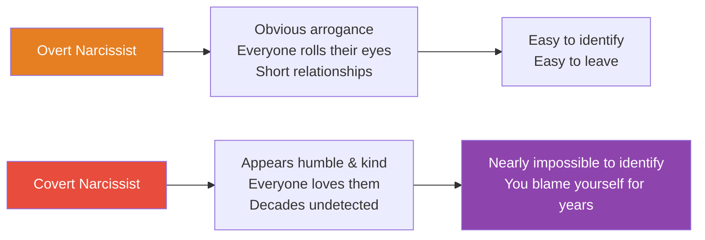
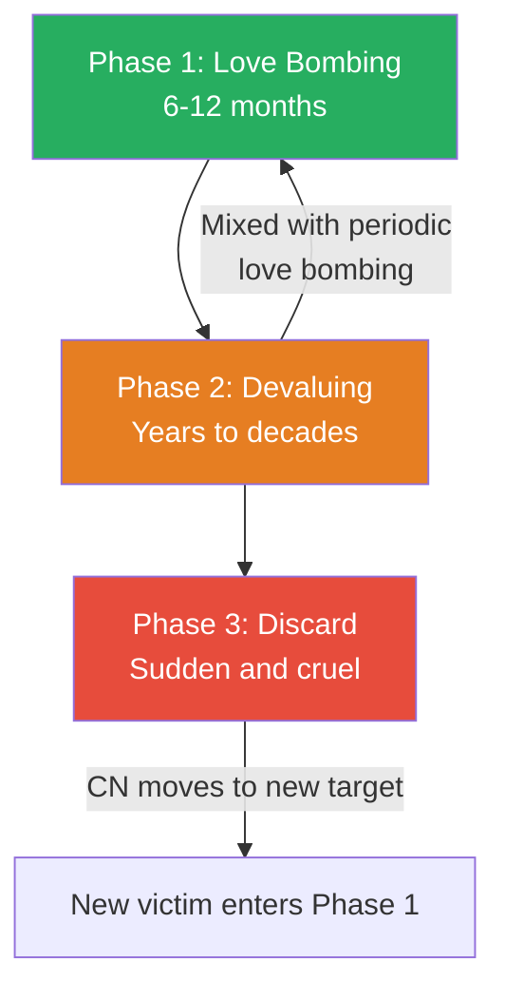
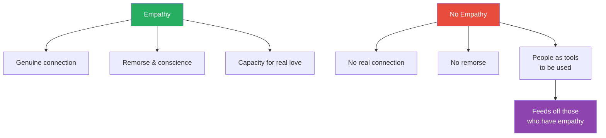
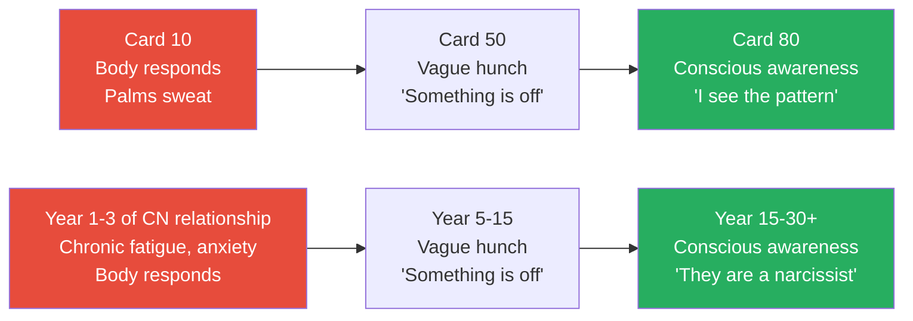
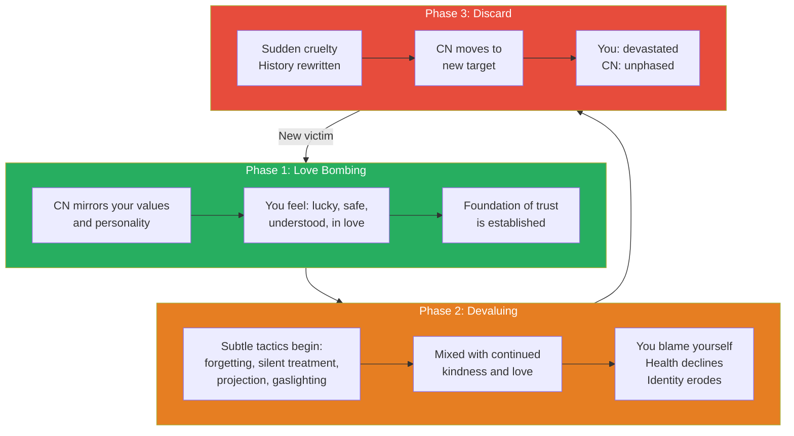

# The Covert Passive-Aggressive Narcissist — Debbie Mirza

> Debbie Mirza's thesis is devastating in its simplicity: the most dangerous narcissists don't look like narcissists at all.
> They look like the nicest person you've ever met. Your friends envy you. Your family adores them. Your therapist is impressed by how self-aware they seem.
> But underneath the charm, the humility, and the apparent empathy, they are systematically dismantling your identity, your confidence, and your ability to trust your own mind — and doing it so invisibly that you'll blame yourself for years before you ever suspect them.
> Mirza calls them covert passive-aggressive narcissists, and this book — built from over one hundred survivor interviews — is a field guide to recognising their three-phase cycle, their arsenal of invisible tactics, and the road back to yourself after they've finished with you.
> Written not by a clinician but by a survivor who spent years piecing together the puzzle from her own life and the lives of others, it is the book she needed and couldn't find — comprehensive, validating, and relentlessly specific.

---

## About the Author

Debbie Mirza is a life coach, author, and singer-songwriter based in Monument, Colorado. She is herself a survivor of multiple covert narcissistic relationships — romantic partners, family members, and professional contacts. After years of searching for resources that described her specific experience and finding only books about overt narcissism, she decided to write the book she had needed. She interviewed over one hundred survivors worldwide — men and women, across romantic relationships, parent-child dynamics, and workplace settings — to ensure the book captured the full range of covert narcissistic abuse. She also interviewed therapists and life coaches who specialise in this area. She is the author of *The Safest Place Possible: A Guide to Healing and Transformation* and runs a coaching practice focused on helping survivors of covert narcissistic abuse recover their sense of self.

---

## The Big Idea

- Most people picture a narcissist as someone flashy, arrogant, and obviously self-centred — the overt narcissist whom everyone in the room rolls their eyes at
- <b style="color: #2980b9">The covert narcissist is the opposite</b> — they appear humble, kind, empathetic, easy-going, and deeply caring
- They are well-liked by almost everyone: charming without being creepy, attentive without being overbearing, spiritual without being preachy
- <b style="color: #e74c3c">Their greatest weapon is plausible deniability</b> — every act of cruelty is wrapped in enough ambiguity that you can never quite prove what just happened
- You are usually the ONLY person who sees their true nature — friends, family, and even therapists will side with the covert narcissist because they only experience the mask
- They operate a universal three-phase cycle: <b style="color: #2980b9">love bombing</b> (idealisation that hooks you), <b style="color: #2980b9">devaluing</b> (invisible erosion over years or decades), and <b style="color: #2980b9">discard</b> (sudden, cruel abandonment with total rewrite of history)
- The targets are not naive, weak, or codependent — they are chosen precisely because they are empathetic, self-reflective, nurturing, and honest
- <b style="color: #27ae60">The body knows before the mind</b> — your chronic fatigue, depression, UTIs, and anxiety were your body screaming what your conscious mind wasn't yet ready to hear
- Recovery requires recognising that you were in love with an illusion, not a real person — and that the confusion, self-blame, and cognitive dissonance you feel are the natural consequences of being expertly manipulated, not evidence that something is wrong with you

The fundamental danger of the covert narcissist is this asymmetry — the overt narcissist's mask is thin and cracks easily, but the covert narcissist's mask can hold for decades, fooling everyone including the victim.

---

## Key Concepts at a Glance

| Concept | One-line summary |
|---------|-----------------|
| **Covert narcissist (CN)** | A narcissist who hides all toxic traits behind a mask of humility, empathy, and kindness |
| **Plausible deniability** | Every cruel act is ambiguous enough that you can never quite prove it was intentional |
| **The three phases** | Love bombing → devaluing → discard: the universal cycle of covert narcissistic abuse |
| **Love bombing** | Intense idealisation that creates the foundation of trust exploited for years to come |
| **Devaluing** | Invisible, years-long erosion of self-worth through subtle tactics mixed with periodic kindness |
| **The discard** | Sudden, cruel abandonment where the CN rewrites the entire history of the relationship |
| **Mirroring** | The CN becomes whoever you need them to be — your soul mate, your spiritual twin, your perfect match |
| **The "forgetting" tactic** | Forgetting 70% of small requests — each too minor to complain about, cumulatively devastating |
| **Intermittent reinforcement** | Random alternation of cruelty and kindness — the most powerful conditioning tool in psychology |
| **Cognitive dissonance** | Holding two incompatible beliefs: "this person loves me" and "this person is abusing me" |
| **Golden child / scapegoat** | CN parents divide children into those who supply adoration and those who resist |
| **The body knew** | Physical symptoms (candida, UTIs, chronic fatigue) that precede conscious awareness of abuse |
| **Constants** | People in your life who consistently, unconditionally love you — the reference point for real love |
| **Flying monkeys** | People the CN recruits to their side who unknowingly enforce the CN's version of reality |

---

## Chapter 1: What Is a Covert Passive-Aggressive Narcissist?

*Mirza establishes the distinction that the entire book rests on: covert narcissists have all the same core traits as overt narcissists — they just hide every single one of them.*

- The DSM-IV lists the diagnostic criteria for Narcissistic Personality Disorder: grandiosity, fantasies of power, belief in being "special," need for excessive admiration, sense of entitlement, interpersonal exploitation, lack of empathy, envy, arrogance
- <b style="color: #2980b9">Overt narcissists</b> display these traits openly — they brag, show off, and irritate everyone around them
  - People in the room roll their eyes and say "Oh yeah, he's terrible"
  - Overt narcissists tend to have shorter marriages because they are recognisable
- <b style="color: #e74c3c">Covert narcissists hide every one of these traits</b> because their reputation is their top priority
  - They appear humble, kind, empathetic, easy to talk to
  - They can be pastors, therapists, doctors, professors, non-profit leaders, military officers
  - They have a grandiose sense of self but disguise it as modesty
  - They require excessive admiration but act like they don't need it
  - They lack empathy but have learned to mirror it flawlessly
- It is common for people to be married to a covert narcissist for 10, 20, 30, even 40+ years without recognising the abuse
- Children of covertly narcissistic parents typically don't realise the truth until their thirties
- George Simon's distinction applies: passive-aggression resists through inaction (foot-dragging, sulking), while <b style="color: #2980b9">covert aggression</b> actively pursues dominance under cover of charm
- Mirza draws the parallel to cults: the documentary *Holy Hell* shows how a covert narcissist led a large following for over twenty years — the followers weren't stupid, they were smart, kind, talented people who were exploited by someone who appeared to love and care about them
- After leaving a CN relationship, cult deprogramming would actually be more beneficial than standard therapy — the effects are profoundly similar
- CNs seem to get worse around middle age and rarely change because they blame others and don't think they have a problem
- They tend not to have deep, long-lasting friendships — they have many acquaintances who know them on a surface level but no one who truly knows them
- They are rarely without a partner — after discarding one target, they move quickly to the next

> [!tip] Core Insight
> The word "covert" is the key. All the DSM-IV narcissistic traits are present — grandiosity, entitlement, lack of empathy — but they are hidden because the covert narcissist knows that being liked is more useful than being feared.

| Feature | Overt Narcissist | Covert Narcissist |
|---------|-----------------|-------------------|
| **Self-image** | Openly brags about achievements | Appears humble, modest, self-deprecating |
| **Empathy** | Clearly doesn't care | Mirrors empathy convincingly — tears, concern, listening |
| **Relationships** | Short — people leave quickly | Decades — victims don't recognise the abuse |
| **Public perception** | "He's so annoying" | "He's the nicest guy I know" |
| **Aggression** | Overt — yelling, threats, put-downs | Covert — subtle looks, "forgetting," passive punishment |
| **Victim's experience** | Knows they're being abused | Doesn't know — blames themselves |
| **Therapist's read** | Easily identified | Often missed entirely — even impressed by the CN |
| **After breakup** | Others validate your experience | Others wonder why you can't move on — "He was so nice!" |

- A common struggle: survivors have a very hard time explaining what they went through because in their mind it doesn't sound that bad
- Whenever someone uses the phrase "crazy-making" in a support group, the room erupts in nodding — everyone recognises it
- Many survivors start sentences with: "I know this might not seem that bad, and I'm embarrassed even saying it, but..."
- After they share, other survivors respond: "I totally get that!"
- The recovery journey typically begins when someone — a therapist, attorney, or friend — first suggests the word "narcissist"
- Many victims initially reject the term because their partner doesn't match the overt profile they've read about
- It is the addition of the word "covert" that changes everything — suddenly the puzzle pieces fall into place

---

### The Therapist Problem

- Most therapists are not educated on covert narcissism — only the overt type is taught in graduate programmes
- Mirza interviewed a woman who went to therapy for ten years, trying multiple therapists, for depression, anxiety, and lack of energy
  - None of them recognised she was in an abusive relationship
  - Finally, after ten years, a new therapist told her within fifteen minutes: "You are in an abusive relationship"
  - The others couldn't see it — neither could she
- This is devastatingly common: victims spend years thinking something is wrong with THEM, getting treated for symptoms rather than causes
- <b style="color: #e74c3c">If you go to therapy, find a therapist who specifically understands covert narcissism</b> — a well-meaning therapist who applies standard frameworks may inadvertently validate the CN's narrative and further harm you
- Some therapists, upon meeting the CN in couples therapy, are actually impressed by how kind and self-aware the CN seems — this retraumatises the victim

---

## Chapter 2: The Three Phases

*Mirza maps the universal cycle that every covert narcissistic relationship follows — a cycle so consistent that survivors from different continents, different decades, and different relationship types describe it in almost identical language.*

The three phases are not strictly sequential — the first two alternate throughout the relationship, creating a dizzying whirlwind of confusion, until the discard arrives like a bolt from the blue.

### Phase 1: Love Bombing

- The idealisation phase typically lasts six months to a year, though this can vary
- <b style="color: #27ae60">This is the foundation</b> — it creates the belief system that the victim relies on for years to come
- Survivors describe the CN during this phase in remarkably consistent language:
  - "He was so kind." "She was out of my league." "He talked about his feelings." "We were so much alike." "I felt safe with him." "She had everything I was looking for."
  - "He was kind of shy." "He seemed tender." "He was a really good listener." "He could get along with anyone."
  - "He was spiritual, open, and philosophical." "He was soft, which was so nice after experiencing anger in other relationships."
  - "My friends and family were so happy for me that I had found such a great guy."
- The CN <b style="color: #2980b9">mirrors</b> you — they become whoever you need them to be
  - If you're spiritual, they become your spiritual twin
  - If you value emotional openness, they talk about their feelings with unprecedented vulnerability
  - If you've been hurt before, they seem like the healing balm
  - CNs are chameleons who don't have a strong sense of self — they pick up what a person wants and become that
  - People are impressed by how well the CN can relate to all types of people
- They observe your insecurities and build you up in those exact areas — storing the information for later use as weapons
- They hook you with sympathy — sharing childhood wounds that make you want to love them harder
- They will test you — after six months to a year, they introduce doubt and negativity to see if you'll fight for the relationship
  - When the target kicks into "fixing" mode, the CN knows they've found someone who will stick with them through anything
  - This proves to the CN that the grooming has worked
- <b style="color: #e74c3c">Taking a CN to therapy early is dangerous</b> — it becomes a training ground where they learn which parts of their mask are cracking and what you need to see
  - The therapist tells them what they're doing wrong — and the CN uses this information to strengthen the disguise
  - They do what the therapist suggests just long enough to impress both the target and the therapist
  - Their heart isn't in it, but they act like it is

> [!example] Sara and Timothy — The Therapy Training Ground
> - Sara dated Timothy for a year of bliss before issues began
> - They went to couples therapy — she was impressed he agreed, as most men she'd dated wouldn't
> - In therapy, Timothy learned exactly what she wanted and what he needed to do to impress both Sara and the therapist
> - He shared that he'd never felt anyone really wanted to know him — Sara's empathetic heart melted
> - She spent the next 25 years trying to love him the way he said he'd never been loved
> - He used her sympathy to control and manipulate her for decades
> - During the discard, Timothy told Sara it was clear to him she had never really loved him
> **The lesson:** The love bombing phase lays the foundation that makes every subsequent manipulation possible.

### Phase 2: Devaluing

- The word "de-value" says it all — you begin to receive the message that you have no value, no matter what you do
- <b style="color: #e74c3c">The devaluing is mixed with continued kindness</b> — love letters, affection, shared laughter — which makes it invisible
  - You continue to believe this is a good relationship because the love bombing never fully stops
  - You tell friends how lucky you are — and you sincerely believe it
  - Your friends tell you they wish their partner were more like yours
- Over years, you notice your health declining, a low-level depression, chronic fatigue — but you attribute these to work stress, diet, exercise, anything except the relationship
- The CN uses subtle tactics:
  - Not calling when they said they would
  - Not showing up for appointments they promised to attend
  - The silent treatment — making you wonder what you did wrong
  - Controlling you through moods and facial expressions
  - Saying "nothing is wrong" when you can feel that something is profoundly wrong
  - Inviting you somewhere and then making you feel unwanted when you arrive
- <b style="color: #e74c3c">Projection</b> — they project their own faults onto you, and you accept the blame without noticing
  - They call you controlling when they are the one controlling
  - They call you selfish when they are the one who only cares about themselves
  - They accuse you of not taking responsibility when they take none themselves
- Over time, the victim becomes responsible for everything because asking the CN for help isn't worth the anger and irritation it provokes
  - You learn it's just easier to do things on your own
  - The CN does not want to give in the relationship, only receive
- The mixed messages wreak havoc on your heart, mind, and body:
  - Kindness and cruelty alternate unpredictably
  - Your self-worth declines so gradually you don't notice
  - You slowly forget the free spirit you used to be
- Real love never has mixed messages — and when the final discard happens, the truth about who the CN really was comes into painful focus
- Mirza makes a critical observation about what you don't notice: what ISN'T there
  - The CN never pursues understanding of you
  - The CN never takes responsibility for their part in problems
  - The CN never feels bad that you feel bad
  - The absence of these things is itself the devaluing — you just can't see it because you're looking at what IS there (the occasional kindness) instead of what isn't

> [!example] Susan's Journals — 18 Years of Invisible Devaluing
> - Susan thought she had almost the perfect marriage — issues in their sex life, but everything else seemed great
> - After the discard, she re-read her journals from the entire relationship
> - She found an entry from before the wedding: "I have this strange fear that I will be taken advantage of and not even see it"
> - Her body had known from the very beginning
> - With educated eyes, she saw story after story of sabotaged vacations, sabotaged birthdays, subtle demeaning
> - He never acknowledged her as a mother, wife, or accomplished person
> - He made her feel too opinionated, too strong, too loud — through looks and silences, never direct words
> - Yet at the same time, he told her she was beautiful, gave heartfelt cards, planned road trips
> - She never connected her declining health, weight gain, and chronic fatigue to the relationship
> **The lesson:** The devaluing is so subtle and so mixed with genuine-seeming kindness that victims can live inside it for decades without recognising it.

### Phase 3: The Discard

- The discard is sudden, cruel, and accompanied by a total rewrite of history
- The CN becomes someone the victim has never seen before — hurling insults, using every vulnerability shared over the years as a weapon
- They throw a conglomeration of partial truths, blatant lies, bizarre conclusions, compliments, "poor me" proclamations, and superior thinking — all delivered in an incredibly condescending way
- <b style="color: #e74c3c">The contrast is devastating</b>:
  - You are devastated, crying, curled up — they are calm, rational, already planning their new life
  - You are searching for answers — they are letting you know how much happier they are without you
  - You feel like you're going crazy — they seem eerily unphased
  - You are trying to connect and understand — they are listing everything wrong with you
  - You feel like your world is ending — they seem to be crossing something off their to-do list
- Their behaviour in this phase can be manic — rage-filled emails followed hours later by an email thanking you for how well you loved them
  - One moment they bring home dinner for you and the kids
  - The next moment they are screaming that you've ruined every friendship they ever had
- The CN usually initiates the breakup but waits for the victim to actually file for divorce — they want to be seen as the victim, not the destroyer
  - They want people to feel sorry for them and see you as the one to blame
  - How they look to others is their top priority, even during the destruction of the relationship
- They move on to a new target almost immediately, often before the divorce is final
- They deliberately choose significant moments for the discard — your birthday, your family's lake house, a family vacation
- <b style="color: #2980b9">The mask cracks when you start trusting yourself</b> — the stronger you become, the less they can control you, and when you stop being useful as a supply, their rage becomes more overt
- The discard is when the DSM-IV narcissistic traits become most visible: the entitlement, superiority, and arrogance come to the surface, though they remain covert with everyone except you

> [!example] Bill's Birthday Discard
> - Bill's wife of 26 years told him she was done being married to him on his birthday
> - After years of telling him how handsome and amazing he was, she said: "I have never fully trusted you! Most women would have never lasted this long with you!"
> - She continued with a long list of devastating, shocking words
> - The timing was not a coincidence — CNs sabotage dates and places that mean something to you
> **The lesson:** The discard is timed for maximum damage, and the contrast between who they were and who they become is the most disorienting part of the entire experience.

---

## Chapter 3: Traits of Targets

*Mirza demolishes the assumption that victims of covert narcissists are naive, weak, or codependent — the truth is the opposite.*

- Targets are chosen for their strengths, not their weaknesses:
  - Empathetic, nurturing, self-reflective, honest
  - People-pleasers who take responsibility for others' feelings
  - Highly intuitive and aware of toxic behaviour in others — they pick up when something is off with other people
  - Many are in the mental health field themselves
  - They are often idealists and optimists who see the best in people
- <b style="color: #27ae60">"Some of the smartest people I've met are people who have been in relationships with covert narcissists"</b>
- CNs specifically seek out these traits — without them, the CN has no use for you, and their tactics wouldn't work
- The very traits that make you a good person make you a good target:
  - Your empathy makes you excuse their behaviour — "He must be hurting inside"
  - Your self-reflection makes you blame yourself — "Maybe I really am too sensitive"
  - Your honesty makes you trust their words — "He's always been so open with me"
  - Your nurturing nature makes you want to heal their childhood wounds — "If I just love him enough, he'll change"
  - Your people-pleasing makes you tolerate more and more — "I don't want to be difficult"
- People who are with healthy partners don't search the internet for "toxic relationships," "energy vampires," "hidden abuse," or "covert narcissism" — if you're searching, you're on the right track
  - Similarly, people going through a normal breakup or divorce don't search these terms either
  - If your body feels weak and flustered around someone, it knows something is not right
- <b style="color: #e74c3c">You can be highly intelligent, psychologically aware, and still be fooled by a CN</b> — because the love bombing phase is designed to fool exactly that kind of person
- Many victims who have been through the experience wonder if they are codependent — but Mirza argues that many are not
  - They have been manipulated into behaving in ways they normally wouldn't
  - When they get out and begin to see clearly, they come back to themselves — and in fact become a much stronger version of their previous self
- You were a target, a victim, and you are a survivor:
  - **Target**: Covert narcissists specifically selected you
  - **Victim**: You were harmed — that is the direct definition
  - **Survivor**: You experienced subtle, manipulative abuse and you are still here — many people come out of these relationships not wanting to be here anymore

> [!tip] Core Insight
> You were targeted because of your beautiful traits — your empathy, your honesty, your capacity for deep love. These are not weaknesses. They are exactly what the CN needed to exploit, and exactly what will carry you through recovery.

---

## Chapter 4: Traits of a Covert Narcissist

*Mirza catalogues the specific behavioural signatures that distinguish a covert narcissist from a merely difficult partner — drawn from over one hundred survivor interviews.*

- **No strong sense of self** — they are chameleons who become whoever they are around, picking up what each person wants and becoming that
- **Silent rage** — you feel their anger without them ever raising their voice; it emanates from them like heat from pavement
- **Lying** — not dramatic lies, but a steady stream of small distortions that erode your grip on reality
- **Hoovering** — sucking you back in just when you start to pull away, with sudden kindness, charm, or vulnerability
- **Constant criticism** — cloaked as "concern," "advice," or "just being honest"; you feel put down but can't point to a direct insult
- **Jealousy** — they become threatened when you succeed and subtly undermine your confidence; CN mothers may get jealous of their own daughters
- **Projection** — they accuse you of the exact things that are true about them: manipulative, controlling, selfish, not taking responsibility
- **Words don't match actions** — they say they love you while behaving in ways that consistently devalue you; they promise to change and never do
- **Emotional disconnection** — they act like they care but you feel hollow when you're with them; there is no real back-and-forth, it almost feels scripted
- <b style="color: #2980b9">Flying monkeys</b> — people the CN recruits to their side who unknowingly enforce the CN's version of reality; they will reach out to your friends and family to undermine you
- **They sabotage birthdays, holidays, vacations** — anything that means something to you; they are moody and irritable during events you care about
- **They are not protective** — when someone criticises or attacks you, they stay silent or passively suggest the criticism might be correct
- **They create drama** — then put others down for being "so dramatic"; they are the hidden source of every conflict
- **They create stories in their head** — accusing you of thoughts and motives that have no basis in reality, speaking with total conviction
- **They belittle you and "teach" you** — speaking to you in condescending ways as though educating a child about how life works
- **They have no desire to truly know you** — the interest they showed in the beginning was an act of manipulation, not genuine curiosity
- **They have no interest in making the relationship great** — survivors consistently report being the one planning dates, initiating communication, and trying to work through problems
- **They withhold praise** — your accomplishments go unacknowledged; they take credit for your successes ("You only did well because I helped")
- **There are always strings attached** — every gift, every favour comes with an unspoken obligation

> [!example] Sherry's Unprotected Heart
> - Someone was verbally abusive to Sherry in front of her CN husband
> - Her husband did nothing to defend her
> - Then they all went out to dinner together — including the man who had just attacked her
> - Her CN husband chatted with everyone, including the abuser, as if nothing had happened
> - Without saying a word, he sent clear messages: she was not worthy of respect, her feelings didn't matter, she was alone in this relationship
> **The lesson:** A healthy partner protects you. A CN doesn't just fail to protect — they normalise the attack by acting as though it didn't happen.

> [!example] Susan's Surgery — Punishment Disguised as Concern
> - Susan's CN husband Harry brought her home from the hospital after surgery
> - While she was still coming out of anaesthesia, he sat at her bedside and confronted her about her "bad behaviour"
> - He told her she didn't seem very appreciative of his help at the hospital when she was waking up
> - He needed more from her than that, he said
> - She could barely focus on his words through the pain and grogginess
> - He made sure to be absent during most of her recovery — she was on her own to heal and care for the kids
> **The lesson:** CNs despise taking care of you and will punish you passively for the inconvenience of needing them.

---

## Chapters 4-5: Control and Manipulation

*Mirza uses a vivid metaphor to frame the entire manipulation chapter: the frog in boiling water. If you put a frog in boiling water, it dies a quick and painful death. But if you put it in lukewarm water and slowly turn up the heat, the frog dies without ever noticing what is happening. This is what it is like to live with a CN — your essence, your spirit, the light inside you slowly drains out of you without you noticing. You feel depressed and unmotivated, but you attribute it to everything except the relationship.*

The biggest indicator that someone is manipulating you is how you feel around them. When you are with someone with pure intentions, you feel good about yourself, strong. When you are being manipulated, you doubt yourself, feel small, see them as knowing more than you, and feel confused and out of sorts. These are red flags.

---

## Chapter 5: Control and Manipulation Tactics

*Mirza unpacks the specific mechanisms through which covert narcissists maintain invisible control — each tactic operating below the level of conscious awareness.*

### Gaslighting

- <b style="color: #2980b9">Gaslighting</b> grows seeds of doubt in your memory, perception, and sanity
- CNs accomplish this through persistent denial, deflection, lying, and blame
- The messages you absorb: "They are always right" and "You cannot trust yourself"
- It destabilises you, keeping you in a weakened state so the CN can maintain control
- After years of gaslighting, victims begin to doubt their own memories and judgment
- If you find yourself withholding information from friends and family out of embarrassment or shame, someone may be gaslighting you
- Common signs: feeling hopeless, joyless, confused; second-guessing yourself constantly; questioning whether you are "too sensitive"; making excuses for the CN's behaviour to others
- Mark's CN wife would say "That didn't happen" when he mentioned events from the past, then add: "Who are you going to believe, you with the bad memory or me with the good one?" — this went on for twenty years
- Some CNs take extreme measures — moving your purse to another room to make you think you're losing your mind
- One woman Mirza interviewed actually made appointments with neurologists because she thought something was seriously wrong with her brain

> [!example] John and the Neurologist
> - John's CN boss deleted files from his computer and failed to tell him about meetings
> - Over years, John became convinced his memory was rapidly deteriorating
> - His health declined, but he wrote it off as stress from long hours
> - The gaslighting was so effective that John, in his mid-thirties, went to see a neurologist
> - He was convinced he had early-onset dementia
> - It was not dementia — it was years of systematic gaslighting by his boss
> **The lesson:** Gaslighting is so subtle and persistent that the victim will seek medical explanations for cognitive problems that don't exist rather than suspect the person causing them.

### The "Forgetting" Tactic

- <b style="color: #e74c3c">This is death by a thousand paper cuts</b> — the most insidious tactic in the CN's arsenal
- The CN "forgets" approximately 70% of small requests — picking up water, buying apples, running an errand
- Each instance is too small to complain about — "It was an honest mistake"
- They seem genuinely sorry each time but never go back to correct the "mistake"
- Over years, it creates learned helplessness and progressively lower expectations
- You stop asking for things because the disappointment isn't worth it

### Disappointing Birthdays

- <b style="color: #e74c3c">Birthdays always end in tears</b> — but the victim can never explain exactly why
- The CN buys gifts, sometimes takes you to dinner — but the gifts show no knowledge of who you are
- They tell long stories about the effort that went into the gift, creating pressure to perform gratitude
- When they make grandiose gestures, other people are always present to witness their generosity
- In private, there are no special moments that show how well they know you and love you
- You end up crying and apologising for something — often for not being appreciative enough

> [!example] Amy's 30-Year Marriage — The Opening Story
> - Amy's divorce attorney told her: "Your husband is a narcissist"
> - She couldn't believe it — he was the nicest guy, everybody loved him
> - She researched narcissism but the descriptions didn't match — her husband wasn't flashy or arrogant
> - A therapist asked odd questions: "Did he forget things a lot? Like when you asked him to pick up apples?"
> - "Yes! About 70% of the time." She'd never thought of that as a trait
> - "Did he ever go back and get you water?" the therapist asked. "No. Never."
> - Her birthdays were always awful — she'd end up crying and apologising, but couldn't explain why
> - When he made grandiose gestures, other people were always watching; in private, nothing showed he knew or loved her
> - The term "covert passive-aggressive narcissist" changed everything — it was the missing piece
> - Amy now leads healing retreats in Peru and feels free for the first time in decades
> **The lesson:** The "forgetting" tactic and the disappointing birthday are two of the clearest diagnostic signatures of covert narcissistic abuse — small enough to be invisible individually, devastating in aggregate.

### Triangulation

- The CN acts as a messenger between two people, pitting them against each other without either noticing the CN is the instigator
- They will lie to a neighbour about things you supposedly said, then report to you what the neighbour "said" about you
- Both parties feel anger and tension toward each other while the CN watches from the sidelines, maintaining their innocent reputation
- This can go on for years, with the CN stoking the fire by feeding both parties false information
- Another form: the CN tells a new girlfriend about a woman at work who keeps flirting with him — creating an illusion of desirability while instilling fear of being replaced
- Another form: the CN tells a new partner detailed stories of how terrible their ex was — this controls the new partner's behaviour ("I must never be like that") while also generating sympathy
- During the discard: the CN confides in a third party (often someone who barely knows you) and then makes sure you know that this person agrees everything is your fault
- <b style="color: #e74c3c">Triangulation keeps you distracted</b> — attributing your pain to other people instead of seeing the real mastermind behind all of it

> [!example] Don and Jackie — Manufacturing Distrust
> - After a year of dating, Don told Jackie that his sister said she was a bad driver and had made her make the bed while Jackie sat and read a magazine
> - Jackie was confused — she knew she was a good driver, and she would never make a guest make her bed
> - She began questioning herself: "Did I drive recklessly? Did I do something that made her feel that way?"
> - Don told her she should "maybe try harder with his family"
> - For the next several years, Jackie worked desperately to connect with his family, feeling constant insecurity and pressure
> - Every so often Don would relay another family member's supposed complaint, keeping tensions high
> - Jackie never noticed that the source of all the information was Don himself
> **The lesson:** Triangulation keeps you insecure and focused on earning approval from others — while the CN controls the narrative from behind the scenes.

### Intermittent Reinforcement

- <b style="color: #2980b9">Psychology experts consider this the most powerful motivator in existence</b>
- Random alternation of cruelty and periodic affection conditions you to keep trying
- Neuroscientist Robert Sapolsky's monkey experiment demonstrates the mechanism:
  - Monkeys trained to press a lever for a consistent reward showed dopamine spikes in anticipation
  - When scientists changed the rules so rewards came only 50% of the time, unpredictably, dopamine rose to levels comparable to cocaine
  - "You never get more behaviour out of an organism than when you have introduced a maybe"
- This is exactly what CNs do: love bombing establishes the reward, then intermittent reinforcement during devaluing keeps you working desperately for the "maybe"
- You lower your standards until you become grateful for mediocre treatment you would never have tolerated at the beginning

### Blame

- CNs blame their victims for everything — and do it with such conviction that you accept responsibility for things that have nothing to do with you
- Mirza compiles a devastating list of actual blame statements from her interviews:
  - "It's your fault the kids don't like me"
  - "It's your fault I was never happy"
  - "It's your fault I had an affair" (because you wouldn't get a Brazilian wax)
  - "It's your fault I watch porn"
  - "It's your fault I'm depressed and angry"
  - "It's your fault I abuse you"
- And the grand finale, the ultimate projection: "You blame me for everything because you won't take any personal responsibility"

### Deflecting the Focus

- When you confront a CN about something they did, you somehow end up apologising to them
- They turn the conversation around so that your legitimate grievance becomes evidence of YOUR problems
- They are masters of making themselves the victim in every exchange

> [!example] Kevin the Spiritual Leader — Deflection as Enlightenment
> - Kevin, a spiritual leader at a healing centre in Costa Rica, spoke to women attendees in inappropriate ways
> - When one woman confronted him about his behaviour, he replied in a gentle voice: "It sounds like you are being triggered, Sara. What is this bringing up for you?"
> - He framed his inappropriate behaviour as her growth opportunity
> - She left confused, feeling like something was wrong with HER that she needed to fix
> - His deflection allowed him to keep his status as the revered leader while she absorbed the shame
> **The lesson:** Deflection is most dangerous when it is wrapped in the language of growth, healing, or spirituality — because it makes accountability sound like pathology.

### Other Tactics

| Tactic | How it works | Effect on victim |
|--------|-------------|-----------------|
| **Distorting reality** | Accusations so absurd you pause to wonder if they're right — "You've washed your hands of our daughter!" while you're buying her clothes and cooking her meals | Keeps you spinning and off-balance |
| **The false apology** | Quick, easy apologies followed by zero behaviour change — they apologise better than anyone you know, then repeat the same behaviour within days | You learn it's not worth confronting them |
| **Minimisation** | "You're overreacting" / "It wasn't that bad" / "You're too sensitive" | You doubt your own feelings and reality |
| **Projection** | They accuse you of the exact traits they possess — calling you manipulative, controlling, selfish | You end up defending yourself against their faults |
| **Punishing** | Silent treatment, financial control, sabotaging events, "forgetting," being irritable at concerts or trips you saved up for | Learned helplessness; you stop having expectations |
| **Indirect insults** | Comments that sound innocent but carry a passive-aggressive payload — said with an innocent look that makes you question whether it was an insult at all | Constant low-level wounding that you can't name |
| **Mixed messages** | "Go after your dreams!" during the marriage, then "You should have been working the whole time — you only married me for my money" during the discard | Cognitive dissonance and inability to think clearly |

> [!example] Sue at the Buffet — The Invisible Insult
> - Sue's CN husband Stuart knew she was insecure about being 40 pounds overweight and was trying to eat better
> - He also knew that in 27 years, she had never eaten out alone — it wasn't her personality
> - On a family vacation, she went down early to the restaurant to journal with coffee while waiting for the family
> - When Stuart and the kids arrived, he looked at her and said cheerfully: "Oh, you came down here and ate the buffet by yourself?"
> - There were no plates at her table — their daughter looked at him with a confused face and said sarcastically: "Like mom would ever do that..."
> - Stuart would call Sue "overly sensitive" and "high maintenance" if she reacted
> - To outsiders, it was just a question — to someone who had lived with years of covert messages about her unworthiness, it was a precisely targeted wound
> **The lesson:** Covert insults use the victim's known insecurities as ammunition, delivered with an innocent tone that makes any reaction look like overreaction.

> [!example] Joanne's Mediation Email — The Compliment-Put-Down-Pity Cycle
> - The night before mediation to decide financial support, Joanne's CN ex-husband sent a three-page email
> - He asked her to think about his health, said he didn't like the idea of supporting her long-term
> - Joanne felt enormous stress — without support, she'd be homeless after years as a stay-at-home mother
> - She forwarded the email to her attorney, who replied with one word: "Whatever"
> - At mediation, the attorney pulled up the email and pointed out a pattern Joanne couldn't see:
>   - Every paragraph followed the same structure: compliment, then put-down, then pity statement
>   - Paragraph after paragraph, the same cycle repeated
> - Joanne was stunned — she had read the email multiple times and never noticed the pattern
> - If he had just been cruel, she would not have been affected — but cruelty mixed with kindness threw her into a state where she couldn't think clearly
> **The lesson:** The CN's manipulation has a structural pattern — compliment/put-down/pity — that is invisible to the victim but immediately recognisable to a trained eye.

---

## Chapter 6: Covert Narcissistic Parents

*Mirza reveals how covert narcissism operates in the parent-child relationship — creating the template that makes adult children perfect targets for CN romantic partners.*

- <b style="color: #e74c3c">Most children of CN parents don't realise the truth until their thirties</b>
- To the outside world, the CN parent appears perfect — the volunteer mom, the patient dad, the coach everyone loves
- CN parents fall into two categories that cause the same damage:
  - **Overly enmeshed** — controlling every aspect of the child's life under the guise of love
  - **Uninvolved** — connecting only when the conversation centres on something interesting to the CN

### Golden Child / Scapegoat Dynamic

- The CN parent lavishes attention on the "golden child" who provides the most adoration
- The child who resists, thinks independently, or stops supplying attention becomes the scapegoat
- The golden child learns: love is conditional on being perfect, on never challenging the parent
- The scapegoat learns: something is fundamentally wrong with them
- Both are set up for unhealthy adult relationships

### Messages Received

- Children of CN parents absorb devastating messages — sometimes spoken directly, sometimes delivered through looks, silence, and manipulation:
  - "You can't trust yourself"
  - "You are responsible for my happiness"
  - "You will never be as perfect as me"
  - "You can't do anything on your own"
  - "No matter how perfect you are, you will never be enough"
  - "You are only wanted when you are nice — no one will want all of you"
  - "You ruined my life, and you need to atone for it"
  - "You are beautiful, smart, and lazy"
  - "You have all this wonderful stuff, but you don't use it"
- One woman summarised it perfectly: "You are so beautiful, you are better than all the other kids, and you are shit"
- <b style="color: #27ae60">This is the essence of intermittent reinforcement applied to a developing identity</b> — praise and degradation mixed together during the years when a child is forming their sense of self

### How Children of CN Parents Feel

- Mirza asked her interviewees how they felt growing up with a CN parent. Their answers were strikingly consistent:
  - "I felt under stress a lot" / "I was hyper-aware of mom's mood changes"
  - "I felt like I was on edge, waiting to know how to feel"
  - "I second-guessed myself a lot" / "I learned not to trust my own decision-making"
  - "I felt like everything was always my fault"
  - "I felt like I was walking on eggshells, never knowing what would set her off"
  - "I felt like there was no way I could win and have her full approval"
  - "I felt like I would never make it in life without her"
  - "I felt like a showpiece" / "I felt confined, suffocated"
  - "I felt starving for a self-identity"
  - "She controlled me through her emotions"
  - "My childhood felt like soul rape"
- Then she asked: how would other people describe your CN parent?
  - "She's so nice" / "He's such a good listener" / "She really cares" / "He is so patient" / "A great mom and wife"
- <b style="color: #e74c3c">The gap between these two lists is the entire story of covert narcissistic parenting</b>

### CN Parents Manipulate Children Against the Healthy Parent

- CN parents will subtly programme children to distrust the parent who is actually there for them
- They paint the healthy parent as the source of all problems while positioning themselves as the victim
- One woman and her father spent years separated because of the CN mother's manipulation — now, in adulthood, they are getting to know each other, and the bond is beautiful
- Children learn to make excuses for the CN parent's absence and unhealthy behaviour because it's all they've ever known

> [!example] Gail and Her Mother — The Intoxicating Charm
> - Gail hated when her friends came over because her mother would turn on an intoxicating charm that swept everyone away
> - Her friends would leave thinking what a great life Gail had
> - She was dying inside, and no one could see it
> - At home, she walked on eggshells, trying to match her mother's emotions to maintain peace
> - Her mother told her constantly how great a mother she was compared to other parents
> - As a child, Gail believed it — her mother seemed like a gift, a treasure, a pillar of the community
> - It wasn't until her mid-thirties that she recognised her mother was a covert narcissist
> **The lesson:** The CN parent's public persona is so convincing that even their own children believe it for decades — and the contrast between that public persona and the private reality is what makes the abuse so isolating.

> [!example] Christy's Graduation Gift — Hope and Disappointment
> - After her college graduation, Christy came home to find a very large, beautifully wrapped box
> - Despite years of disappointing gifts that showed her mother didn't know her, there was still a glimmer of hope
> - She opened it excitedly to find lime green towels and a set of white plastic hangers
> - Her heart sank
> - Even after decades of disappointment, she still hoped this time might be different
> - Then came the shame for not being grateful — she smiled and said thank you
> - Christy told Mirza she has lived with a permanent low-level sadness her whole life
> **The lesson:** The cycle of hope and disappointment is itself a form of intermittent reinforcement — and the shame the victim feels for being disappointed is the CN's most effective silencing tool.

> [!example] Rhonda's Sheltered Life — Manufactured Dependency
> - Rhonda's CN mother kept her sheltered with strict rules, talking constantly about "evil people in the world"
> - She kept Rhonda close, creating an unhealthy dependency and a deep fear of anything outside the home
> - Rhonda is in her forties now and still struggles with trusting her own decision-making
> - Her mother still belittles her through "concern": "Have you thought about this? I'm just really concerned you're going to get hurt"
> - Rhonda described her mother's compliments as "compliments laced with shit"
> **The lesson:** CN parents don't just damage their children — they manufacture dependency, ensuring the child never develops the confidence to function without them.

> [!example] Allie's Martyr Mom — Guilt as Control
> - Allie's mother was heavily involved in her life — praised her constantly, made sure she excelled in school
> - She would redo Allie's school projects to make them more impressive
> - She would make dinner and make an enormous deal of it — as though it were a heroic sacrifice
> - Allie grew up feeling responsible for her mother's anxiety and stress
> - She believed: "If I didn't exist, her mom would be happier"
> - Normal parenting activities were presented as extraordinary burdens, generating guilt in the child
> **The lesson:** The martyr CN parent weaponises normal caregiving — transforming every meal, every school supply run, into evidence of their sacrifice that the child must repay with compliance and adoration.

> [!example] The Annie Get Your Gun Phenomenon
> - Autumn discovered something bizarre when she met other daughters of CN mothers
> - She remembered her mother walking around the house singing: "Anything you can do I can do better. I can do anything better than you"
> - When she shared this at a support group, other women couldn't believe it — their mothers had done the same thing
> - Multiple daughters of CN mothers, independently, all had this identical memory of their mother singing the same competitive song
> **The lesson:** The patterns of covert narcissistic parenting are so consistent that even the specific songs CN mothers sing to their children are the same across different families.

---

## Chapter 7: In the Workplace

*Mirza shows that the three-phase cycle is not limited to romantic relationships — CN bosses run the same playbook, with the same devastating consequences.*

- Most covert narcissists are financially successful — they want to look good, and an impressive career is part of the image
- They are often found in leadership positions: the boss everyone loves, the partner everyone admires
- CN bosses begin with love bombing: making you feel valued, lucky, excited about the opportunity
  - They make grandiose promises about your future, your career, your financial success
  - They might become a trusted friend — families barbecuing together on weekends, kids becoming friends
- Then the subtle devaluing begins — and because everyone else loves the boss, you have nobody to confide in
  - Tom voiced concerns to colleagues and got: "What are you talking about? You have the greatest boss ever!"
  - He got the message: there is no one to confide in, and he probably misread things
- <b style="color: #2980b9">The same gaslighting tactics operate</b>: deleted files, "forgotten" meetings, making you question your memory
  - Sally's boss would call her late at night with work "crises" — boundaries crossed, respect not shown
  - He started bringing up "concerns" about her memory, teasing her about it, but passing it off as a joke
- CN bosses take credit for your work in charming, underhanded ways that make you feel like a jerk if you mention it
  - You fear losing your job and learn to keep quiet
- They sabotage you — telling you about meetings right before they start (knowing you can't make them), adding workload when you're struggling, doing nothing to help you succeed
- They smear your name to colleagues under the guise of "concern" — "I'm really worried about Sally's mental health"
- They give strange gifts designed to provoke a reaction that makes you look oversensitive to onlookers
- The result: loss of confidence, isolation, health decline, and — in the worst cases — seeking medical help for problems that don't exist

> [!example] Emma's Stolen Motherhood
> - Emma had two young children and important family events on the calendar
> - Her CN boss was completely aware of how important these dates were
> - Yet she would add more work and appointments to Emma's schedule during exactly those dates
> - For years, Emma missed her children's milestones because of her boss's "scheduling needs"
> - Before this job, Emma was social, confident, a go-getter
> - After leaving, she started to feel like her old self — but found herself questioning everyone, suspicious of kindness, not as outgoing as she used to be
> **The lesson:** The CN boss doesn't just damage your work life — they damage your family life, your confidence, and your ability to trust anyone ever again.

> [!tip] Core Insight
> The workplace CN is particularly dangerous because your livelihood depends on the relationship. You cannot simply leave — and the CN knows this, using your financial dependence as additional leverage.

---

## Chapter 8: Sex with a Covert Narcissist

*Mirza reveals sex as the most intimate and therefore most devastating arena of covert narcissistic control — and argues it is also the most reliable "decoder" for the truth of the relationship.*

- Sex with a CN is always about the CN — their pleasure, their ego, their needs
- It is one of the most common and most insidious forms of gaslighting a CN uses
- <b style="color: #e74c3c">Many survivors have never had an orgasm with their CN partner</b> — and carry years of shame about it, telling no one
  - What woman in her forties wants to admit she has never had an orgasm? So she stays quiet for decades.
  - She tries to "fix" herself — books, articles, therapy — concluding she just isn't a sexual person
- The CN uses this shame as a control mechanism: "You're letting me down. You're not meeting my needs."
  - They make demeaning comments: suggesting she could be a nun, wondering aloud if she might be a lesbian
  - They weaponise the victim's weight gain with subtle put-downs that further destroy self-image
- The victim ends up believing that because she doesn't give the CN enough sex, she doesn't deserve love or kindness — she stops expecting anything better
- <b style="color: #27ae60">The body is an accurate barometer</b>: if you lost desire for sex, it was because your body knew you were not emotionally safe
  - Your body cannot relax and experience natural release with someone who is not truly loving you
  - The loss of desire is not a dysfunction — it is your body protecting you

### Sex as Decoder — Mirza's Key Framework

- Mirza developed a framework she calls the "sex as decoder" exercise after noticing patterns across dozens of interviews:
  - **Question 1:** Describe sex at the beginning of your relationship — what was your partner like? How did you feel?
    - This reveals the love bombing phase and who the CN pretended to be
  - **Question 2:** When did sex start to feel different? How did it change? How did you feel during and after?
    - This reveals the truth of who the CN actually is and the truth of the entire relationship
- One woman's answers to Question 2: "It felt confusing. I felt used. It was all about him. He wasn't tender. He blamed me for us not having a good sex life. He took no responsibility even though he said he did. It never felt like I could connect with him on a deep level. It felt like it was all up to me to make it work."
- <b style="color: #2980b9">Every description of the sexual relationship maps directly onto the relationship as a whole</b>:
  - "It felt confusing" = the relationship was confusing
  - "I felt like I was being used" = she was being used
  - "It was all about him" = the relationship was all about him
  - "His body felt limp, like there was no life in him" = he was a shell of a man, relying on her for life
- When Mirza asked friends in genuinely healthy long-term marriages (17-20+ years) the same questions, the contrast was stark:
  - "Sex is fun with my husband"
  - "I feel loved, safe"
  - "He loves to give me pleasure and see me feeling really good"
  - "Even when it's mediocre, it's still good. During those times we just laugh"
  - "I feel incredibly loved and cherished"
- <b style="color: #27ae60">If you were in a relationship where you lost the desire for sex, that is because your body is super smart</b> — if you were experiencing real love, you would have wanted sex, experienced orgasms easily, and it would have felt like love every time

> [!example] Dawn's 25-Year Sexual Shutdown
> - When Dawn dated her CN, sex was great — romantic, easy, fun, connected
> - Soon after marriage, something shifted — she told Brad she felt used after sex but couldn't explain why
> - He looked concerned and acted like he cared — but then redirected the conversation to what she might need to change about herself
> - He told her she was "too sensitive" and "reading into things"
> - She lost the ability to orgasm; he showed her articles from Playboy about positions to try
> - Even his "helpfulness" was about him — he wanted her to orgasm so he would feel good about himself as a lover
> - She felt terrible about letting him down; he did nothing to stop her from believing it was her fault
> - He became more distant, punishing her passively for years — sabotaging vacations, being irritable on birthdays
> - She accepted the bad treatment because she believed she didn't deserve better: she wasn't giving him sex, so why should she expect kindness?
> - After divorce, at a meditation retreat, a kind man shook her hand and she felt sensations she hadn't felt in decades — something awakened
> - She later married that man and discovered the truth: she is a deeply sexual person who was manipulated into believing she wasn't
> **The lesson:** Sex is the body's most honest barometer. When you can't orgasm with your partner, it's not because something is wrong with you — it's because your body knows you are not emotionally safe.

> [!example] Melanie's Catch-22 — You Can Never Win
> - Melanie's story was similar to Dawn's — no orgasm for years, deep shame
> - After confiding in girlfriends on a trip, she started to explore her own body and achieved orgasm on her own
> - Excited, she brought this sexual awakening to her marriage — wanting sex every day
> - After about a week, her CN husband told her he didn't want to have sex anymore
> - His reason: "Now all you want to do is orgasm, and I don't feel like you really care about me"
> - The biggest area of control he had over her was now gone — he couldn't blame her for not wanting sex
> - Without that leverage, she could no longer be his supply
> - After 18 years of marriage, he was done — he moved out and moved on to another target within months
> **The lesson:** With a CN, you can never win no matter what you do. If you don't want sex, it's your fault. If you do want sex, it's still your fault. They must always have something to hold over you.

---

## Chapter 9: Divorcing a Covert Narcissist

*Mirza warns that the normal rules of divorce do not apply when your ex is a covert narcissist — and well-meaning advice from people who don't understand can be actively dangerous.*

- <b style="color: #e74c3c">An amicable divorce is not possible with a CN</b>
- The discard phase intensifies during divorce: smear campaigns, financial manipulation, using children as weapons, flying monkeys, lies, crazy-making conversations, triangulation, total absence of empathy
- CNs move on immediately to a new target while you are devastated
- They leave you with all responsibilities — selling the house, arranging schools, handling bills, caring for the kids — a sudden and complete abandonment
- They are strategic with money: transferring funds to inaccessible accounts, fighting to minimise support, dragging proceedings out for years
  - Many victims were stay-at-home parents or earned small incomes — their survival depends on financial support from the CN
  - The CN knows this and uses it as leverage: "Your survival depends on me, and I can take that away"
- CNs will charm their attorney, the mediator, and the judge — appearing as good-hearted people who care about their kids
  - They will trigger you during mediation by saying things designed to make you emotional
  - They want you to look like the crazy one — falling apart while they appear calm and stable
  - Request that mediation be set up so you never see the CN — the mediator walks between rooms
- The smear campaign doesn't end after the divorce — it can continue for years
  - Any threat to the CN's ego creates a <b style="color: #2980b9">narcissistic injury</b> that they rarely get over
  - Filing for divorce is the ultimate narcissistic injury — it provokes relentless revenge

> [!example] Amy's Mom — The Four-Year Smear Campaign
> - Four years after her divorce, Amy's mother received a long email from Amy's ex-CN husband
> - He told Amy's mother how much he loved and respected her, how hard this email was to write
> - Then he shared "the truth" about her daughter — stories of Amy hoarding money, lying, using her mother
> - He had not spoken to Amy's mother in over four years — he clearly didn't care about her
> - Amy was getting stronger, establishing boundaries, becoming harder to manipulate
> - He tried to hurt Amy by severing her relationship with her own mother
> - Normal people move on after divorce; CNs don't
> **The lesson:** The CN's campaign to control you doesn't end with the divorce papers — it can extend to attacking your relationships with family members years later.

### Using the Kids

- CNs use children as pawns without caring how it affects them
- They talk to children in subtle ways that plant seeds of doubt about the healthy parent
- They align with the child who gives them no conflict while marginalising the one who questions them
- With legal matters and flying monkeys, they talk as though they deeply care about the kids — but their actions never match their words
- They are so convincing that judges, mediators, and attorneys easily believe the picture they paint

### Why Normal Divorce Advice Fails

| Normal advice | Why it fails with a CN |
|--------------|----------------------|
| "Communicate a lot with your ex — it's healthier for the kids" | CNs use communication to confuse, control, and manipulate — limit to logistics only via email/text |
| "Never talk badly about your ex to your kids" | Partially true — but kids need to know that certain behaviour is not okay when the CN is actively undermining the healthy parent |
| "Things will calm down after the divorce" | CNs don't calm down — smear campaigns and revenge can continue for years, even decades |
| "Try to be fair and reasonable" | CNs exploit fairness as a weakness — you need a tough attorney who understands narcissism |
| "Both of you just need to move on" | You are ready to move on; the CN is not — they continue to seek control and revenge |

> [!example] Denise's Suicidal Journal
> - During her divorce, Denise wrote in her journal: "I don't want to be here anymore. I think the kids will be okay if I took my life."
> - The relentless barrage of verbal and emotional abuse had taken her to the edge
> - She made it through — she knows now her kids would not have been okay
> - She is rebuilding her life
> **The lesson:** The emotional toll of divorcing a CN can be life-threatening. If you are feeling this despair, you are not alone — it is the natural result of narcissistic abuse, not evidence of your weakness.

---

## Chapter 10: Why Do They Abuse?

*Mirza's answer to this question is deliberately brief and deliberately blunt: we don't really know for sure why, and it doesn't really matter.*

- Common theories: childhood abuse, unmet needs, self-hatred, trauma, lack of identity, being spoiled, not being loved growing up, being both idealised and made to feel worthless
- Some of these may be true — but Mirza argues that focusing on the "why" traps victims:
  - You spend energy trying to figure out the CN instead of healing yourself
  - You get stuck in the darkness of narcissism and never give your own light a chance to come forth
  - You make excuses that keep you in the relationship:
    - "He had a rough childhood"
    - "She doesn't know how to love because she didn't have a good mom"
    - "He is wounded, so he is lashing out from a place of pain"
    - "He's just scared — it's fear beneath the anger"
    - "She's tired and under a lot of stress"
  - <b style="color: #e74c3c">Excusing their behaviour kept us in an abusive relationship and kept them completely unaccountable</b>
- Not all wounded people become abusers — some of the kindest people Mirza knows came from severely abusive backgrounds and did not turn out to be narcissists
- CNs are not interested in getting help, do not think they have a problem, and rarely change
  - Most do not think they have a problem — so spending hours trying to figure out "why" isn't helping them or you
- Whether their abuse is conscious or unconscious is debatable:
  - In some ways they are not conscious — they are out of touch with who they really are, shells of their real selves
  - But judging, criticising, and manipulating are conscious acts
  - There are professed narcissists who explain exactly what they are thinking when they manipulate — they are completely aware
- <b style="color: #27ae60">The answer is to let them own their own issues and focus on your own healing</b>
  - When we let go of trying to figure out the "why," we let go of them
  - Then we are left with ourselves, which at first can feel lonely — but the more we go inside and care for our own wounded heart, the stronger we will feel

> [!tip] Core Insight
> Trying to understand why the CN abuses you is itself a trap — it keeps you focused on them instead of on your own recovery. Whatever the reason, the abuse is not your responsibility, and understanding their psychology will not make them change.

---

## Chapter 11: The Most Dangerous Trait of All

*Mirza identifies the single trait that makes everything else possible: the complete absence of empathy.*

- Without empathy, there is no remorse, no genuine connection, no real love
- People with no empathy have no remorse and act out of pure selfishness — hurting others and not feeling bad about it
- They excuse their destructive behaviour and blame others — they never feel the weight of what they've done
- CNs are "shells of their real self" — they don't have the warm core spark of life within them
- They cannot feel the magic of a sunset, the transcendence of real connection, or the depth of authentic love
- Because they are devoid of life-giving energy, they feed off people who have it — which is why they target empathetic individuals
- If a CN were alone on a deserted island, they would waste away — they cannot sit with themselves and feel the peace that resides in all our spirits
- <b style="color: #e74c3c">Mirza sees this as a broader societal problem</b> — a growing number of people in positions of power lack empathy, and decisions made without empathy prioritise money and power over people
- When empathy isn't in leadership — whether in a family, a company, or a country — decisions are made that serve the few at the expense of the many
- <b style="color: #27ae60">The good news: you have empathy, and that means you have the capacity to heal, to connect, to feel real love</b>
- Your empathy is not a weakness to be hidden — it is the very thing that makes you valuable to the world
- You will learn to put up boundaries with energy vampires and use your tender heart to reach out to those who gratefully receive it
- Your heart will expand, and a newfound strength will develop that can move mountains

> [!example] The Homeless Woman at Windsor Castle
> - While visiting England, Mirza was walking past Windsor Castle, feeling numb from a fresh smear campaign by a CN in her life
> - She passed a homeless woman sitting on the ground with a coin container
> - Something stopped her — she turned around and asked: "May I sit by you?"
> - The woman, shocked, said yes — and told her story of being kicked out by an abusive father and living on the streets ever since
> - Mirza felt a kinship: their paths were different but the pain was the same — both had experienced life-sucking trauma
> - She was bothered by hundreds of people from different continents walking past this woman every day, choosing to buy useless items instead of helping
> - She gave her money and a hug: "I'm so sorry. Lots of love to you today."
> - The woman embraced her back: "Thank you for being so kind."
> **The lesson:** Empathy is what changes the world. It is what heals, what enables real connection, what allows us to see what really matters. And it is the one thing the covert narcissist will never have.

Without empathy, the CN is an energy parasite — drawn to people who have the life force they lack, draining them, and moving on to the next source when the current one is depleted.

---

## Chapter 12: Your Body Knew — Common Illnesses

*Mirza presents the most viscerally convincing evidence in the book: your body was trying to warn you for years before your conscious mind caught up.*

### The Iowa Card Game Experiment

- Scientists at the University of Iowa placed four decks of cards in front of students — two red (high risk, high loss) and two blue (modest, gradual gains)
- The students' job: turn over cards and maximise winnings
- After about fifty cards, students had a hunch something was different between the decks
- After about eighty cards, most had consciously figured out the pattern
- <b style="color: #2980b9">But here is the crucial finding</b>: scientists had hooked each student to a machine measuring sweat gland activity in their palms
  - By the tenth card, their palms were already sweating as a stress response to the red decks
  - By the tenth card, their behaviour was already changing — they were choosing blue cards more often
  - The body knew 70 cards before the conscious mind caught up

The card game is simple; living with a CN is not. But the principle is identical — your body's stress response activated years before your conscious mind was willing to see the truth.

### Common Illnesses Among Survivors

- Mirza catalogued physical conditions from her 100+ interviews and cross-referenced with Inna Segal's *The Secret Language of Your Body*:

| Illness | Probable emotional causes (per Segal) | Connection to CN relationship |
|---------|--------------------------------------|-------------------------------|
| **Candida** | Self-doubt, feeling trapped, frustrated with partner, difficulty trusting | Exactly what victims feel during devaluing |
| **Chronic strep throat** | Anger, rage, hurt, feeling inferior, not knowing how to stand up for yourself | Common in children of CN parents |
| **Urinary tract infections** | Tremendous guilt and fear, belief something is wrong with you, allowing manipulation, sexual shame | Extremely common among women with CN partners |
| **Fibromyalgia** | Chronic pain without clear physical cause | Body holding years of emotional trauma |
| **Depression** | Loss of life force, feeling trapped, hopelessness | Universal among survivors |
| **Anxiety** | Hypervigilance, walking on eggshells, never knowing what will happen | The body's alarm system in permanent activation |
| **Asthma** | Feeling suffocated, unable to breathe freely | Mirrors the emotional suffocation of CN relationships |
| **Chronic fatigue** | Energy depletion, the body shutting down to protect itself | The CN has been draining your life force for years |

- When Mirza read the probable emotional causes from Segal's book to survivors, many were brought to tears — it was exactly how they felt in the relationship
- Dana developed severe candida about a year into dating her CN — the emotional causes (self-doubt, feeling trapped, difficulty trusting, frustrated with partner) were exactly what she was feeling at the time, but she had explained them all away because he was such a "great guy"
- Jane had chronic strep throat as a child raised by a CN mom — the emotional causes (anger, rage, feeling inferior, not knowing how to stand up for yourself) were her entire childhood experience
- Part of healing is learning to trust yourself — and recognising that your body has been your most reliable ally all along, even when you couldn't see it
- <b style="color: #27ae60">The truth is that you are your best barometer for truth — your body is here to help you, to guide you</b>

> [!tip] Core Insight
> If you've been suffering from unexplained chronic illness while in a relationship with a CN, your body has been trying to tell you the truth for years. You can trust it more than anything and anyone.

---

## Chapter 13: What Survivors Feel

*Mirza compiles the emotional landscape of survivors — both during the relationship and during the painful awakening afterward — to help readers see that they are not alone.*

### During the Relationship

- "I felt stripped of confidence, happiness, joy, and excitement for life"
- "I felt like so many things were wrong with me"
- "I felt like I was never good enough"
- "I felt old, tired, weathered"
- "I felt lifeless, drained"
- "I felt like the CN was interesting and I was dull"
- "I felt needy when I was around him"
- "I didn't feel free to be myself, all of me"

### During the Awakening

- "I feel such deep grief like I've never felt before, and I find myself crying uncontrollably at times"
- "Sometimes I wonder if I'll ever feel happy. I look at people laughing and wonder if I'll ever feel that."
- "I feel suspicious of new people I meet, not knowing who I can trust"
- "I stay home a lot. I don't feel like being social"
- "I feel discouraged because he seems so happy and I'm still falling apart"
- "I have symptoms of PTSD — flashbacks, depression, anxiety, withdrawal, emotional numbing, reliving different events, feelings of guilt and shame"
- "I try to explain the relationship to friends, and it never sounds that bad when I say it out loud. Then I question myself and feel even more despair."
- "I find it hard to date because I no longer trust 'the nicest people.' It's also hard to trust myself to choose someone healthy."
- "There are days I find myself entertaining thoughts of leaving this planet. It all feels like too much."
- "I'm so used to being sabotaged that I'm constantly waiting for the next ball to drop"
- But also: "The more my eyes are opening the lighter I am feeling"
- And: "I'm beginning to dream again and starting to actually feel excited about my future"
- And: "I got an angry email from my ex, and I noticed I felt the same trauma I always feel — but I was able to move on faster this time"

---

- As you heal, you will find yourself going through waves of different emotions
- Some days: strength and hope; other days: despair and paralysis
- You might feel progress — and then an email or phone call from the CN sends you into emotional shutdown
- <b style="color: #27ae60">This is normal, and each cycle of recovery is shorter than the last</b>
- What you have been through is not a small thing:
  - You were conned, manipulated, lied to, and brainwashed
  - You were belittled, talked down to, and treated with disrespect
  - You were blamed for things that had nothing to do with you
  - You experienced the illusion of love, not the real thing
- <b style="color: #27ae60">But you are still here — and that makes you a survivor</b>

### The Healing Progression

- Recovery is not linear — it moves in waves
- Good days alternate with days of despair, often triggered by an email, a text, or seeing the CN
- You might feel like you're making progress, then a rage-filled email arrives and flattens you — you cry for days, feel paralysed, slip into despair
- <b style="color: #27ae60">The key marker of progress: you bounce back faster each time</b>
- One day, the list of things the CN said were "wrong" with you won't trigger anxiety anymore — you'll look at it and think: "That's so not true. And most of these are projections of who he is."

> [!example] Mary's Breakthrough — The List That Lost Its Power
> - Mary had been feeling strong, building a new life, making progress
> - Then a three-page assault on her character arrived by email, filled with lies and manipulation — it flattened her for days
> - But she noticed she bounced back faster than the last time
> - Months later, while cleaning, she found an old journal from the divorce period
> - Inside was a list of all the cruel things her CN ex had said were "wrong" with her
> - For years, she had mentally reviewed these accusations — they had affected her deeply
> - This time, she looked at the list and felt almost completely unphased
> - She went through each item and thought: "That's so not true. That's not even close to who I am."
> - Then she noticed: most of what he said about her was actually true of HIM — pure projection
> - Something else struck her: "This was all so mean." For years, she'd been so focused on "What if he's right?" that she never registered how cruel the words were
> - Mary even looks different now — her friends say she looks ten years younger
> **The lesson:** The healing progression is real. With time, education, and surrounding yourself with real love, the CN's words lose their power entirely. You will see through the projection, and meanness will feel foreign instead of normal.

---

## Chapter 14: The Road to Healing and Restoration

*Mirza maps the path from devastation to freedom — not as a quick fix but as a fundamental transformation of how you see yourself, others, and love.*

### Recognising the Truth

- <b style="color: #27ae60">The first and hardest step: accepting that you were in love with an illusion</b>
- The person you loved did not exist — the CN was playing a role
- This realisation is agonising at first but eventually becomes liberating, because truth always sets you free
- It validates years of confusion, unexplained exhaustion, health issues, and sexual confusion

### Cognitive Dissonance — The Hardest Part

- <b style="color: #2980b9">Cognitive dissonance</b> is when you hold two conflicting beliefs simultaneously: "this person is kind and loving" and "this person has been manipulating me for years"
- When you hold a belief strongly enough, you will fight against contradictory evidence no matter how overwhelming it is
- This stirs up tremendous insecurity, confusion, and anxiety in the body
- What makes it even harder: people around you see the CN in a positive light, reinforcing the belief you want to hold
- This is why recovery takes so long — it requires a complete paradigm shift, not just a gradual adjustment
- With time, education, and support, the eyes open more and more
- The brain looks for evidence to support beliefs — retraining it to see truth from different angles is an active process
- <b style="color: #e74c3c">Cognitive dissonance is one of the most challenging parts of healing</b> — it takes an incredible amount of mental strength to look past beliefs you have held for years and be open to the reality presenting itself

### You Were Abused

- It is easy to diminish what you experienced because no one hit you or physically abused you
- Victims often wonder if they are blowing things out of proportion or overdramatising
- The word "abuse" feels too strong — we associate it with bruises and visible scars
- <b style="color: #e74c3c">But covert emotional and psychological abuse is in some ways more dangerous than overt abuse</b>:
  - When someone is hitting you or yelling at you, it is clearly abuse — you know what is happening
  - Covert abuse is hidden and subtle — the manipulative tactics not only hurt you, they chip away at your identity, your self-worth, and make you believe it's all your fault
  - This is what happens in cults — leaders who make you feel loved can also talk you into destroying yourself
- Do not diminish what you have experienced — you have been controlled and manipulated for years
- You are a victim of abuse AND an incredibly strong survivor because you are still here

### This Was Not Your Fault

- Two forces make victims blame themselves:
  - The CN is constantly telling you (directly or through inference) that everything is your fault
  - You are a self-reflective person who naturally takes responsibility — you don't want to blame others
- <b style="color: #27ae60">The way you were treated was not your fault — your beautiful traits were exploited, not the cause of the problem</b>
- No decent human being should take advantage of another person's vulnerability
- Since covert narcissists lack empathy, are self-focused, use people, and take no responsibility for their actions, it is impossible for ANYONE to have a healthy relationship with them
  - It doesn't matter what you did or think you could have done differently
  - The problem was never you — it was the absence of empathy in the other person

### Find Support

- This is a time when you may want to isolate yourself — that instinct makes sense after what you've been through
- But connection is essential to healing:
  - Find a therapist or coach who specifically focuses on narcissistic abuse — not all therapists understand covert narcissism
  - Join a support group — sitting in a room with others who have been through the same thing is profoundly healing
  - The biggest thing survivors want: stories — hearing others' experiences validates your own and proves you're not crazy
- When survivors find each other, there is an immediate connection, a feeling of safety and understanding
  - You find yourselves enthusiastically nodding with relief when you hear each other's stories
  - The feeling of "I'm not the only one" is itself a powerful first step toward healing
- Online resources, YouTube channels, and books are helpful — but use your own intuition as a guide
  - If your stomach tightens or your head feels foggy while consuming content, move to another source
  - Not everyone giving information on narcissism is giving accurate information — trust your body

### A Healing Exercise

- Mirza provides a structured exercise that helped many survivors achieve breakthrough clarity:
  1. **Write a list** of everything the CN has said is wrong with you — direct statements and insinuations
  2. **Evaluate each item**: Is this really true about you? If you're confused, ask a trusted friend who knows you well
  3. **Check for projection**: Go back over each statement and ask — is this actually true of the CN who said it? You will be amazed how many are projections
  4. **Write the truth**: Below the CN's list, write a list of your actual beautiful characteristics — ask a friend to help if needed
- The first time through, it's difficult — each subsequent time, the truth becomes easier to see
- One day you will look at the CN's list and feel almost completely unphased — that's the breakthrough

### Find Your "Constants"

- Jackson MacKenzie's term from *Psychopath Free* — the people who consistently, unconditionally love you
- They have loved you for years; you feel safe with them; you feel calmed, not anxious, in their presence
- If you don't have human constants, it might be an animal you care for, or how you feel watching a sunset
- <b style="color: #2980b9">Your constants are the reference point for what real love actually looks and feels like</b>
- When you're around a constant, notice: Do you feel discombobulated? Does your stomach tighten? Do they list what's wrong with you? Do you end up in tears?
  - The answer is no — and that contrast reveals the truth of the CN relationship
- Mirza shares her own constant — her best friend Liz, whom she has known since age twelve:
  - They talk almost every week and have for 28 years
  - She has only experienced unconditional love and acceptance from Liz
  - She can think clearly after talking to Liz — in fact, she calls Liz specifically when she's confused
  - She has never felt judged, put down, or drained by Liz
- <b style="color: #27ae60">Eventually, you will become one of your own constants</b> — when you start feeling unconditional love coming from yourself, that is the life-changer

### Traits of Real Love

| Real love | CN's counterfeit |
|-----------|-----------------|
| They treat you with respect | They treat you with conditional, performance-based approval |
| They stand up for you | They stay silent or agree with your critics |
| They believe in you | They undermine your confidence |
| They really know you | They have a shallow, distorted picture of who you are |
| They want you to be happy | They want you to supply them with energy |
| They enjoy you | They tolerate you when you're useful |
| Sex: they cherish your body and love to give you pleasure | Sex: it's all about them, your pleasure is irrelevant |
| They feel excited when you succeed | They feel threatened and subtly sabotage you |
| Their honesty comes from love | Their "honesty" comes from a desire to wound |
| They defend you to others | They smear your name to others |

### Physical Nurturing

- Your body has stored years of emotional trauma as cellular memory — many survivors experience complex PTSD
- <b style="color: #2980b9">Healing modalities Mirza recommends</b>:
  - **Massage** — direct physical care for a body that has been neglected and traumatised
  - **Reiki** — calms the body and spirit, reminding the body how it feels to be at peace; helps release trapped emotions
  - **TRE (Trauma Release Exercises)** — a series of exercises that bring muscles to fatigue, triggering automatic shaking that releases deep patterns of stress and trauma from the body; created by Dr. David Berceli
  - **Walking in nature** — soothing to the soul; whatever brings calm and peace allows both emotional and physical healing
  - **Retreats** — investing in yourself as an act of self-care and self-worth
- Mirza specifically recommends sexual self-exploration — reconnecting with your body after years of the CN shutting down your sexuality
  - Orgasm releases oxytocin, creating feelings of safety and contentment
  - This helps the body relearn what pleasure feels like and establishes the truth that your body is beautiful, desirable, and worthy of pleasure
  - It also helps dissolve the shame carried from the toxic relationship

### Boundaries

- <b style="color: #27ae60">No contact is the gold standard</b> — if you can cut the CN out entirely, do it
  - Block their phone number, their emails — use technology to your advantage
  - Just like coming out of a cult, you need to completely get away to gain clarity and strength
- If co-parenting: communicate only by email and text, stick to logistics, never share personal feelings
  - If they try to rope you into personal conversations, do not engage
  - They will try to trigger you — take time before responding, breathe, ignore anything personal
- <b style="color: #e74c3c">If you open up to them, if you are vulnerable in any way, they will hurt you</b> — protect your heart and share your feelings only with trusted friends, counsellors, or coaches
- The more you are away from them, the clearer you will be able to see the truth

### Emotions

- A lot of feelings will come up during healing — anger, grief, sadness, depression
- <b style="color: #27ae60">Allow yourself to feel every one of them</b>:
  - Allow yourself to be angry — you have been betrayed in a brutal way
  - Allow yourself to grieve — you are mourning the death of a person you thought existed
  - Allow yourself to cry — many survivors fear that if they start crying they will never stop, but the opposite is true: unexpressed tears fester inside you
- When emotions rise and you allow them to do so, you are recognising the presence of something important that needs attention — that is a beautiful picture of self-care
- When you were with the CN, your emotions were not valued — now it is time to honour and respect every feeling you have

### Permission to Be Strong

- CNs give the same message whether they are parents, spouses, or bosses: "Something is wrong with you, and you will not make it without me"
- The CN wanted you weak — it was the only way they could control you
- What would life feel like if you fully believed you were capable? If you knew you were a great parent? If you trusted yourself completely?
- Mirza explicitly grants permission:
  - Permission to be strong
  - Permission to stand up to people
  - Permission to go after what you want
  - Permission to not always be nice
  - Permission to be really picky about who you spend time with
  - Permission to not accept bad treatment anymore
  - Permission to fully be yourself
- <b style="color: #27ae60">"You are allowed to fully be yourself. We need strong people with a heart like yours. Be the person you would want looking out for you."</b>

### You Can Trust Yourself

- CNs systematically undermine your trust in your own instincts — when you brought up concerns, they talked you out of your gut reactions
- Rebuilding self-trust is central to healing:
  - Review old journals — survivors are amazed at how much they DID see, even at the time, but made excuses for
  - Test your inner compass with new people: notice how your body feels around them — at ease? anxious? judged? strengthened?
  - If your body has a reaction to someone, trust it — you are not "too sensitive" or "reading into things"
- <b style="color: #2980b9">Your body is your most accurate barometer for truth</b> — every time you choose to trust yourself, you are strengthening a muscle that will someday become second nature
- This trickles into every area of life — relationships, career, daily decisions
- With time and practice, people who once could fool you will be immediately transparent — you will see through the mask in minutes rather than years

### This Experience Changes You

- Having the "nicest person" in your life turn out to be a covert narcissist changes how you see people — it can't help but do that
- At first, this feels like a loss of innocence — you want to retreat from the world
- But Mirza argues this is a kind of superpower being born:
  - You are now a person with a tender heart AND a whole lot of wisdom — that is a powerful combination
  - You will recognise manipulation tactics that most people never see
  - You will be able to help others who are going through what you went through
- Mirza's letter to the reader: "You were targeted because of your beautiful traits — your kind and tender heart, your nurturing spirit, your trust of people. Please don't change these things. We need people like you. The good news is now you are bringing profound wisdom to add to your tender traits."

> [!tip] Core Insight
> Healing is not just about understanding what happened — it is about rebuilding your relationship with yourself. Every time you choose to trust your body, honour your feelings, and surround yourself with constants, you are strengthening a muscle that will someday become second nature.

---

## The Complete CN Relationship Map

---

## Verdict

Mirza's book fills a gap that no other book in the narcissism literature addresses so directly. While [[In Sheep's Clothing - George K. Simon]] maps the general tactics of covert aggression and [[The Gaslight Effect - Robin Stern]] details the mechanics of gaslighting, neither focuses specifically on the covert narcissistic personality as a coherent system — the charm, the invisibility, the plausible deniability, and the "everybody loves him" factor that makes this form of abuse uniquely isolating. Mirza does. She names the specific patterns — the "forgetting" tactic, the disappointing birthday, the compliment-put-down-pity cycle in emails — with a precision that comes from having interviewed over one hundred survivors and found the same stories repeated across continents and decades. The result is a book that is less analytically rigorous than Simon's but far more validating for someone in the middle of the experience.

The book's greatest contribution is its specificity. Where clinical descriptions of narcissism remain abstract, Mirza gives you concrete, recognisable details: the 70% forgetting rate, the birthday that always ends in tears, the surgery bedside confrontation, the neurologist visit for nonexistent dementia. These details are what make a survivor stop and think, "That happened to me too." The Iowa card game experiment and the sex-as-decoder framework are particularly powerful — both connect abstract psychological concepts to visceral, personal experience in a way that makes the reader trust their own body over the CN's narrative.

The book's weakness is its lack of clinical distance. Mirza is a survivor and a coach, not a psychologist, and the book sometimes reads more as therapeutic validation than as rigorous analysis. The chapter on why narcissists abuse — essentially saying "we don't know and it doesn't matter" — is honest but unsatisfying for readers who want to understand the mechanism. There is also significant repetition across chapters; the same core message (you were abused, it wasn't your fault, you can heal) is restated many times, which is therapeutically valuable for someone in crisis but can feel redundant for a reader approaching the material analytically. The relationship to [[Why Does He Do That - Lundy Bancroft]] is also worth noting — Bancroft's "Water Torturer" and "Mr. Sensitive" types are essentially covert narcissists by another name, and reading both together provides a more complete picture than either alone.

The readers who will benefit most are those currently in, or recently out of, a relationship with someone who matches this description — particularly those who have been unable to find themselves in standard narcissism literature because their abuser doesn't fit the overt profile. Adult children of covert narcissistic parents will find the Chapter 6 material especially validating. For those seeking clinical depth, pair this with [[In Sheep's Clothing - George K. Simon]] for tactics, [[Complex PTSD - Pete Walker]] for the trauma response, and [[Adult Children of Emotionally Immature Parents - Lindsay C. Gibson]] for the parental dimension. Mirza's unique contribution is making the invisible visible — giving language to an experience that survivors consistently describe as "impossible to explain."

---

## Mirza's Love Letter to the Reader

Mirza closes the book with a letter that captures its spirit: "You have been through a lot, but your story is not done yet. In many ways, it is just beginning. You have a chance now. No one is controlling you anymore. You are in good hands — your hands, that are full of love, authenticity, wisdom, empathy, and strength. Let your idealism guide you and create a life that is all yours. You get to live with you. You're very lucky."

She adds: "You were targeted because of your beautiful traits — your kind and tender heart, your nurturing spirit, your trust of people. Please don't change these things. We need people like you. The good news is now you are bringing profound wisdom to add to your tender traits. That, my dear, is an extraordinary combination."

"The confusion will become clarity, the pain will turn to peace, and you will emerge with a solidness and strength that has always been there and is now ready to rise."

---

## Cross-References

- [[In Sheep's Clothing - George K. Simon]] — Mirza explicitly quotes Simon on minimisation; her CN profile maps directly onto Simon's "covert-aggressive" personality
- [[The Gaslight Effect - Robin Stern]] — Mirza's gaslighting descriptions are the covert narcissist version of what Stern maps in broader contexts
- [[Why Does He Do That - Lundy Bancroft]] — Bancroft's "Water Torturer" and "Mr. Sensitive" types ARE covert narcissists by another name
- [[Emotional Blackmail - Susan Forward]] — FOG (Fear, Obligation, Guilt) tactics are the daily currency of the CN
- [[Complex PTSD - Pete Walker]] — Mirza's survivors describe textbook C-PTSD symptoms: flashbacks, emotional numbing, hypervigilance, withdrawal
- [[Running on Empty - Jonice Webb]] — CN parents produce the same Childhood Emotional Neglect that Webb describes
- [[Adult Children of Emotionally Immature Parents - Lindsay C. Gibson]] — CN parents ARE emotionally immature parents, with the added dimension of deliberate manipulation
- [[Toxic Parents - Susan Forward]] — CN parents are a specific, especially insidious subtype of Forward's controlling parents
- [[Toxic Parents - Susan Forward]] — CN parents are a specific, especially insidious subtype of Forward's controlling parents
