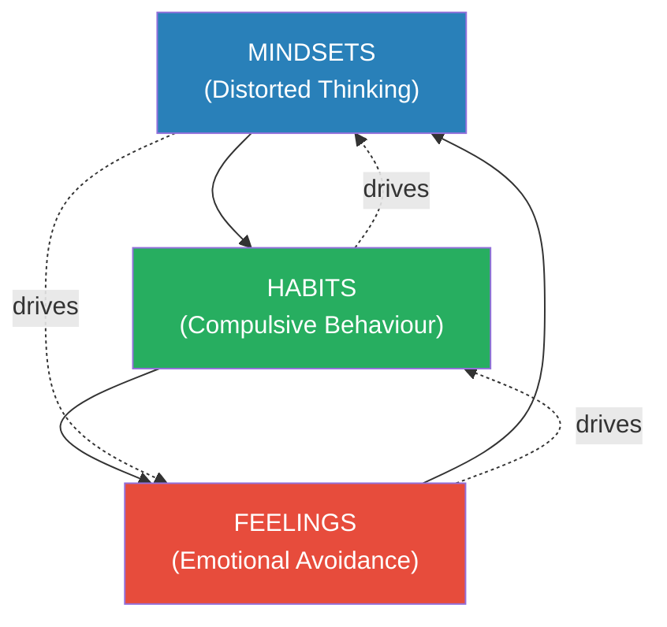
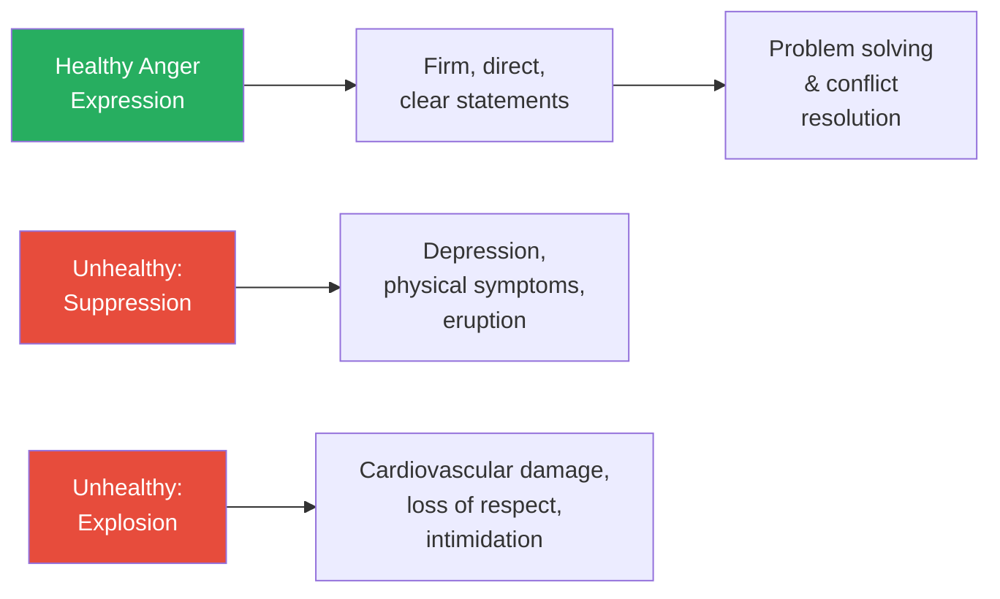
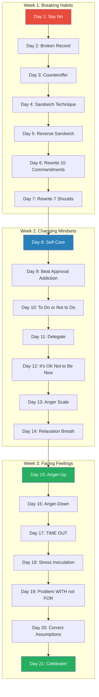
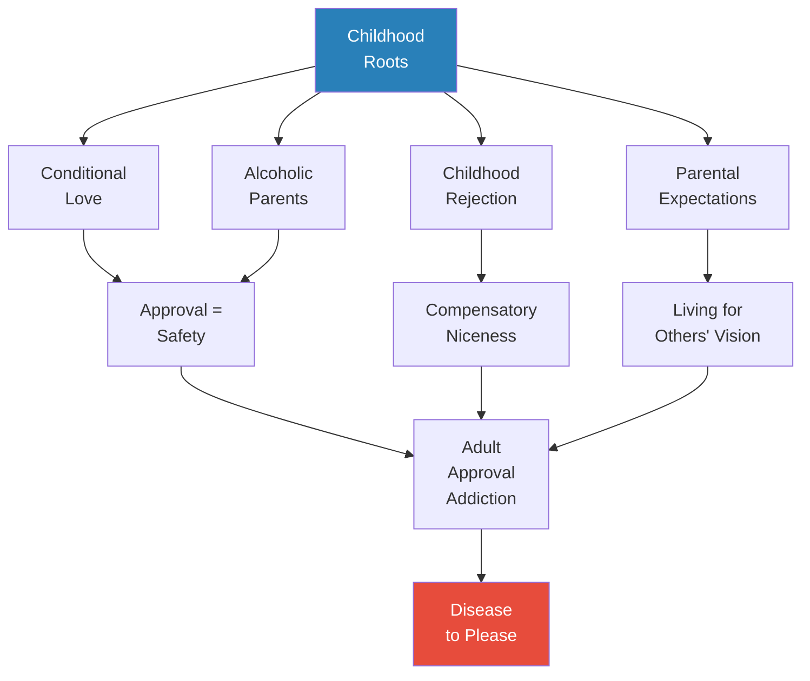
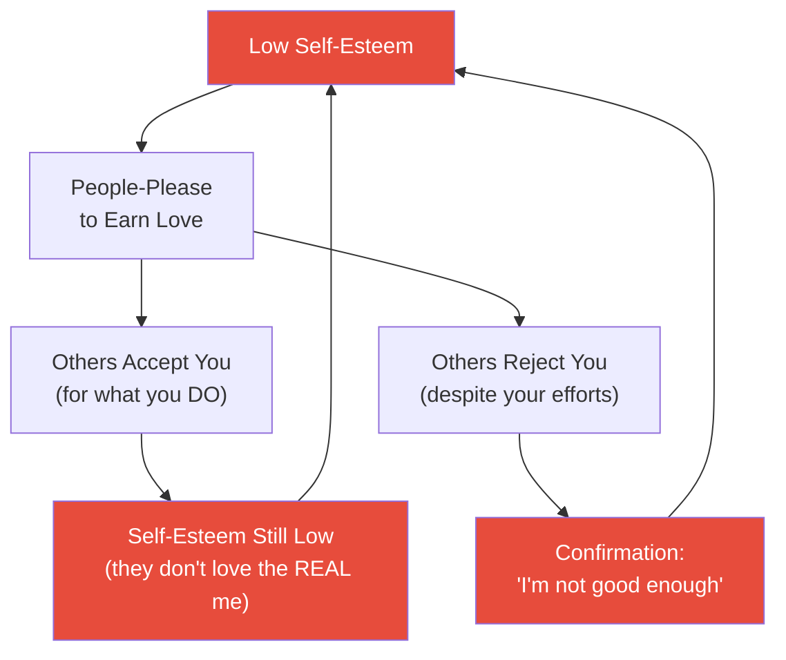

# The Disease to Please — Harriet B. Braiker

> *The Disease to Please is a compulsive — even addictive — behaviour pattern. As a people-pleaser, you feel controlled by your need to please others and addicted to their approval. At the same time, you feel out of control over the pressures and demands on your life that these needs have created.*

---

## About the Author

*Dr. Harriet B. Braiker was a clinical psychologist, management consultant, and bestselling author who spent over twenty-five years treating people-pleasers in clinical practice. She held a PhD from UCLA in social and clinical psychology, and her first book, The Type E Woman, identified people-pleasing as a core cause of women's stress problems. Braiker appeared on Oprah in 1999 to discuss people-pleasing — it was Oprah who personally encouraged her to write this book. She is also the author of [[Who's Pulling Your Strings - Harriet B. Braiker]], which addresses manipulation resistance. Braiker's distinctive strength was combining rigorous cognitive-behavioural science with practical, step-by-step recovery programmes — she didn't just diagnose the problem, she gave you a 21-day plan to cure it. She passed away in 2004, but her work remains the definitive clinical treatment of the people-pleasing syndrome.*

---

## The Big Idea

People-pleasing is not a personality quirk or a harmless tendency to be nice — it is a <b style="color: #e74c3c">compulsive, self-defeating syndrome with far-reaching consequences for your health, relationships, and identity</b>. The Disease to Please operates as a triangle with three interconnected sides: <b style="color: #2980b9">distorted thinking (mindsets), compulsive behaviour (habits), and emotional avoidance (feelings)</b>. Each side causes and reinforces the others, creating a self-perpetuating cycle. The breakthrough insight is that you only need to make a small change in any one side of the triangle to begin disrupting the entire system. Braiker provides a structured <b style="color: #27ae60">21-Day Action Plan</b> that attacks all three sides, moving you from diagnosis to cure through daily, incremental practice.

> [!tip] Core Insight
> People-pleasing is driven by emotional fears — fear of rejection, fear of abandonment, fear of anger, fear of confrontation. Your niceness is not generosity; it is armour. And armour that prevents you from feeling pain also prevents you from experiencing genuine love.

---

## Key Concepts at a Glance

| Concept | One-line summary |
|---------|-----------------|
| **The Disease to Please Triangle** | Mindsets + Habits + Feelings form a self-reinforcing cycle; change one side to disrupt all three |
| **Three Types of People-Pleasers** | Cognitive (thought-driven), Behavioural (habit-driven), Emotionally Avoidant (fear-driven) |
| **Approval Addiction** | Excessive need for universal approval, rooted in conditional love |
| **Niceness as Armour** | Belief that being nice protects from rejection, anger, and hurt |
| **Ten Commandments of People-Pleasing** | Rigid "should" rules that demand self-sacrifice |
| **Seven Deadly Shoulds** | Expectations of what others should give back for your niceness |
| **Enlightened Self-Interest** | Taking care of yourself IS taking care of others — not selfish |
| **The Fear of Anger** | Anger seen as two-gear (on/off), dangerous, potentially lethal |
| **Hurt vs. Harm** | Words can wound deeper than sticks and stones |
| **21-Day Action Plan** | Structured daily programme: saying no, broken record, counteroffers, rewriting shoulds, anger management |
| **Conditional vs. Unconditional Love** | Conditional: doing good = being good; Unconditional: you are loved for being, not doing |
| **Primacy of Others** | The buried belief that others' needs are more important than yours |

---

## At a Glance

- **The Problem:** Millions of people are trapped in a compulsive cycle of pleasing others at the expense of their own health, relationships, and identity — and most believe they're simply being "nice"
- **The Insight:** People-pleasing is not about generosity but about fear — fear of rejection, anger, and abandonment. Your niceness is a defence mechanism that paradoxically makes your fears worse, not better
- **The Method:** A cognitive-behavioural approach: identify your dominant type (thinking, habits, or feelings), then follow a structured 21-Day Action Plan that attacks all three sides of the triangle
- **The Provocation:** <b style="color: #e74c3c">Nobody loves an over-giver — excessive selflessness makes others uncomfortable, suspicious, or dependent, and ultimately pushes away the very people you're trying to keep</b>

---

## The 30-Second Version

"People-pleaser" sounds like a compliment, but it describes a <b style="color: #e74c3c">debilitating psychological problem</b>. Braiker identifies three types — those driven by distorted thinking ("I must be nice or I'll be rejected"), those driven by compulsive habits (can't say no, can't delegate, can't stop doing), and those driven by emotional avoidance (terrified of anger, conflict, and confrontation). These three forces form a self-reinforcing triangle. Your niceness doesn't protect you — it blinds you to exploitation, prevents authentic relationships, and turns your anger inward into depression and physical illness. Recovery requires <b style="color: #2980b9">changing your thinking (replacing "shoulds" with choices), breaking your habits (saying no, using the broken record technique), and facing your fears (learning that anger expressed constructively is healthy)</b>. The <b style="color: #27ae60">21-Day Action Plan</b> provides daily exercises that build incrementally — from your first "no" on Day 1 to celebrating your cure on Day 21.

---

## The 5-Minute Version

### The Disease to Please Triangle

*Braiker's central model explains why people-pleasing is so hard to break — and why small changes can produce big results.*

- The three sides of the triangle:
  1. **Mindsets** (distorted thinking) — "I must be nice," "Others must come first," "Niceness protects me"
  2. **Habits** (compulsive behaviour) — can't say no, do too much, never delegate, addicted to approval
  3. **Feelings** (emotional avoidance) — fear of anger, fear of confrontation, fear of rejection
- <b style="color: #27ae60">Each side is both a CAUSE and a CONSEQUENCE of the others</b>
- This means: change any one side and the others begin to shift

*The Disease to Please triangle — each side causes and reinforces the others, creating a self-perpetuating cycle that can only be broken by making a change in one side.*

#### Which Type Are You?

- **Cognitive people-pleasers:** driven by the need for everyone to like them; define identity by what they do for others
- **Behavioural people-pleasers:** driven by habitual over-giving; addicted to approval; can't stop doing
- **Emotionally avoidant people-pleasers:** driven by fear of anger and confrontation; people-please to avoid scary emotions

---

#### The Diagnostic Quiz

Braiker provides a 24-item quiz that not only diagnoses the severity of your people-pleasing but identifies your dominant type. Key items include:

- "It's extremely important to me to be liked by nearly everyone in my life" (Cognitive)
- "I'm hooked on doing things for others and pleasing them" (Behavioural)
- "Having to face a confrontation makes me feel so anxious that I almost get physically sick" (Emotional)
- "I must always please others even at the expense of my own feelings" (Behavioural)
- "It makes me very anxious to say or do anything that might make someone angry with me" (Emotional)

Scoring:
- **16-24 True:** Deeply ingrained, serious — taking a heavy toll on health and relationships
- **10-15 True:** Moderately severe — requires immediate attention
- **5-9 True:** Moderate — some strengths but still disruptive
- **4 or less:** Mild or absent — but the cycle can develop quickly

---

### The Hidden Cost of People-Pleasing

*People-pleasing may sound innocent, but Braiker catalogues its devastating consequences.*

- Your self-esteem becomes tied to how much you do for others — a formula that never works
- You become blind to exploitation — your niceness prevents you from seeing when others are using you
- <b style="color: #e74c3c">Repressed negative feelings emerge as migraines, back pain, stomach problems, high blood pressure</b>
- Resentment and frustration bubble underneath, threatening to erupt in uncontrolled hostility
- Eventually: chronic fatigue, depression, substance abuse, eating disorders, weight problems
- The ultimate irony: <b style="color: #e74c3c">the abandonment you worked so hard to avoid becomes reality when people take you for granted and your relationships collapse</b>

---

---

## Part One: People-Pleasing Mindsets

### How Your Mind Got Poisoned

*Before examining specific toxic thoughts, Braiker explains why people-pleasers think the way they do.*

- Your mind has been contaminated by flawed and erroneous ways of processing thoughts
- In techno-speak: your mind has a people-pleasing VIRUS that is messing up big portions of your hard drive
- People-Pleasing Mindsets are psychologically insidious because they let you:
  - Rationalise and justify your people-pleasing habits
  - Continue avoiding negative feelings — so you never learn to manage them
  - Blame yourself when others treat you badly (since niceness "should" have protected you)
- Some of these mindsets were appropriate in childhood — but as an adult, they are operating against you
- <b style="color: #2980b9">You need to repair your thinking because your current ways of thinking are simply not working anymore</b>
- Niceness is the psychological armour of the people-pleaser — but armour that prevents pain also prevents love

---

### Toxic Thoughts — The Ten Commandments

*Braiker identifies the rigid "should" rules that form the mental prison of the people-pleaser.*

> [!abstract] The Ten Commandments of People-Pleasing
> 1. I should always do what others want, expect, or need from me
> 2. I should take care of everyone around me whether they ask or not
> 3. I should always listen to everyone's problems and solve them
> 4. I should always be nice and never hurt anyone's feelings
> 5. I should always put other people first, before me
> 6. I should never say "no" to anyone who needs something of me
> 7. I should never disappoint anyone or let others down
> 8. I should always be happy and upbeat
> 9. I should always try to please other people and make them happy
> 10. I should try never to burden others with my own needs or problems

- These commandments are absolute, categorical, and impossible to fulfil
- The word "should" transforms preferences into demands — and demands that can never be met produce guilt, shame, and depression
- <b style="color: #2980b9">The Seven Deadly Shoulds</b> are the mirror image — expectations of what you should GET for being so nice:
  1. Others should appreciate me because of all I do
  2. Others should always like and approve of me
  3. Others should never reject or criticise me
  4. Others should be kind to me in return
  5. Others should recognise how hard I work for them
  6. Others should never take advantage of me
  7. Others should always reciprocate my efforts

---

### It's Okay Not to Be Nice

*Braiker dismantles the belief that niceness is protective armour.*

- <b style="color: #2980b9">Superstitious thinking</b>: "If I'm nice enough, bad things won't happen to me"
- This is magical thinking left over from childhood — and it simply doesn't work
- <b style="color: #e74c3c">Being nice to someone who is hurting you rewards their abusive behaviour</b>
- In a conflict situation, people-pleasing is equivalent to unilateral psychological disarmament
- The dangerous syllogism:
  - If life is fair, people get what they deserve
  - A bad thing happened to me
  - Therefore, I deserve it
- Corrective truth: life is NOT fair, and niceness does not create an invisible shield

> [!example] Susan — The People-Pleasing Pro
> - Susan, 38, mother of three, teacher, PTA leader, bookkeeper for husband's business, volunteer committee head
> - "I've always felt that I need to be super-nice to people or else they won't like me because I'm heavy"
> - As a child, she did other kids' homework, forged notes, let them copy tests — anything to avoid being called "the 3-letter F word: F-A-T"
> - As an adult: "I figure out what they need, and I give it to them" — without even being asked
> **The lesson:** When you please others to compensate for a perceived flaw, you confirm the belief that you're only worthy of love for what you do, not who you are.

---

### Putting Others First — The Primacy Trap

*The world of the people-pleaser is a dangerous place filled with powerful others whose needs must be served.*

- People-pleasers don't just think others' needs matter more — they <b style="color: #e74c3c">cannot even identify their own needs</b>
- The concept of <b style="color: #27ae60">enlightened self-interest</b>: taking care of yourself is not selfish — it's necessary for caring for others
  - Analogy: if you're solely responsible for feeding seven hungry toddlers and you stop eating to give them more, you'll eventually collapse and ALL of them will go hungry
- <b style="color: #e74c3c">Nobody loves an over-giver</b>:
  - Excessive giving makes others uncomfortable, suspicious of motives, or guilty
  - Refusing to receive is actually a form of rejection — you deny others the pleasure of giving
  - Giving with hidden strings ("I'll do this for you so you'll like me") is manipulation, not love

> [!example] Sarah — The Mom on Strike
> - Sarah, 40, devoted homemaker and mother of four, did everything for her family — cooking, cleaning, managing every aspect of their lives
> - When acute rheumatoid arthritis hospitalised her, her family displayed irritation and resentment at the inconvenience — not gratitude
> - After recovering, Sarah announced she was "on strike" until everyone assumed responsibility
> - Her breakthrough: "I was raising a bunch of lousy human beings. I've been teaching my daughters that women are doormats, and showing my sons how to wipe their feet on them"
> **The lesson:** People-pleasers train others not to take care of them — and the very competence that others admire becomes the prison that traps you.

---

### There's More to You Than How Much You Do

*Braiker challenges the people-pleaser's equation of self-worth with productivity.*

- People-pleasers often measure their value by how much they accomplish for others
- <b style="color: #e74c3c">Identity becomes indistinguishable from activity</b> — "If I'm not doing for others, who am I?"
- This creates a dangerous treadmill: the more you do, the more is expected, the more you must do
- Braiker's corrective: you have inherent worth as a human being, separate from what you produce
- "Your value is not a function of your output"
- The 5-item test: Can you sit still for 30 minutes without doing anything productive and feel okay? If not, your identity is too enmeshed with doing

### Nice People CAN Say No

*Braiker dismantles the belief that saying no is incompatible with being nice.*

- Many people-pleasers believe that saying no will:
  - Destroy the relationship
  - Prove they are selfish
  - Cause the other person unbearable pain
  - Make them a "bad person"
- Reality check: <b style="color: #27ae60">saying no to one thing is saying yes to something else — often something more important</b>
- Saying no to your boss's unreasonable demand is saying yes to your family's dinner
- Saying no to a friend's last-minute request is saying yes to your own planned evening
- The people who can't accept your no are the ones who were benefiting from your inability to say it

---

## Part Two: People-Pleasing Habits

### Approval Addiction

*Braiker traces the roots of people-pleasing to childhood — specifically to conditional love.*

- In families where love is conditional:
  - Doing good = being good = deserving love
  - Doing bad = being bad = losing love = abandonment
- <b style="color: #2980b9">Approval becomes the signal of safety</b>; disapproval becomes a fire alarm warning of danger
- Children raised this way become adults who are finely tuned to the slightest hint of disapproval
- In families with unconditional love, the message is: "We love YOU, but we don't like what you DID" — behaviour and worthiness are separated

#### Adult Children of Alcoholics

- People-pleasing as survival strategy in chaotic homes
- Children try to impose order on chaos by being "good" — if parents are pleased, maybe the drinking will stop
- When it doesn't stop, children blame themselves for not being nice enough
- As adults, they remain finely tuned to anger and disapproval — scrambling to placate

#### Still Seeking Parental Approval

- Two scenarios:
  1. Extravagantly praised as a child — no other source of approval matches it
  2. Perfectionist parents who withheld approval — always trying to reach what's just out of grasp
- <b style="color: #e74c3c">Living up to anyone else's expectations — even your parents' — at the expense of your own fulfilment is too high a price</b>
- "You are living your own life, not theirs"

---

### Love at All Costs

*Braiker addresses the particularly dangerous intersection of people-pleasing and romantic relationships.*

- Many women use people-pleasing as silken handcuffs — making a man so dependent he can never leave
- This strategy backfires catastrophically:
  - The dependent partner becomes resentful and emasculated
  - The people-pleaser suppresses her own needs until she breaks
  - The dependency creates love based on deficiency, not wholeness

> [!example] Jennifer and Ron — When Niceness Drives Love Away
> - Jennifer devoted her marriage to "spoiling" Ron — channelling all her needs into making him need her
> - After two years, Ron lost sexual interest. After four, he left for another woman
> - His letter: "I never felt like you needed me, and that made me stop feeling like a man. You deserve a much better husband"
> **The lesson:** In healthy relationships, the feeling is "I need you because I love you." In unhealthy ones, it's "I love you because I need you." These are not subtle distinctions — they are critically different emotional postures.

#### Controlling Men and People-Pleasing Women

- <b style="color: #e74c3c">The Disease to Please serves as a mating call to controlling men</b>
- The controller chips away at your identity — appearance, opinions, relationships, career
- You cooperate because your people-pleasing habits tell you that compliance = love
- The cruel irony: by becoming his fantasy, you make yourself LESS desirable (his fantasy is an extension of himself)

> [!example] Gail and Bruce — Identity Erosion
> - Bruce, a famous film director, systematically redesigned Gail: hair, makeup, wardrobe, breast implants, cheek implants
> - "As long as he pays for them, why shouldn't he choose my clothes?"
> - Eventually: "When I look in the mirror, I see Bruce's image of me instead of seeing myself"
> - Bruce left anyway: "The saddest thing is that when he's done playing with you, you will have some serious reparative work to do on a self you may hardly recognise"
> **The lesson:** The more you change yourself to please someone, the less of you there is for them to love.

---

### Romantic Addiction — The Deepest Trap

*Braiker dedicates a full chapter to the most extreme consequences of people-pleasing in romantic relationships.*

- Some women lose themselves completely in the service of a man's desires
- The spectrum ranges from mild identity compromise to life-threatening exploitation

> [!example]- Dina and Paul — The Escalation of Sexual Compliance
> - Dina, 28, moved in with Paul, a self-made multimillionaire, after their first date
> - Paul warned her: "My biggest problem with women is that I get bored easily, especially sexually"
> - Dina promised he would never be bored — not understanding what that would cost her
> - Over five years, Paul escalated from threesomes to sex clubs to prostitutes — each time threatening to leave if she refused
> - Dina developed sexual dysfunction, considered suicide, turned to alcohol and drugs
> - "I kept telling myself this was just some phase and if I loved him enough, he would change"
> - When she finally said no, Paul's response: "Marry you? How could I marry someone who does the things you do sexually?"
> - The cruelest twist: he used HER compliance as evidence of HER unworthiness
> - After crisis therapy and returning to her family, Dina wrote to Braiker years later — married, a mother, and committed to teaching her daughter that "the first word she would learn was an emphatic NO"
> **The lesson:** When people-pleasing enters the bedroom, the stakes become existential. Compliance designed to prevent abandonment can destroy everything — including your sense of self.

- The man's perspective (from Braiker's male patient): "I used to love getting a woman hooked who just wanted to please me. Then I realised I'm sitting in the boat all alone. I don't want the kind of woman who will do anything to please me anymore. It's boring and lonely"
- Another man: "I like steak because it gives me something to chew on. A woman who gives up her own substance just because she's trying to please me — there's nothing to chew on. No challenge. I just get bored"
- <b style="color: #27ae60">The paradox: by becoming exactly what he says he wants, you become exactly what he doesn't want</b>

---

## Part Three: People-Pleasing Feelings

### The Fear of Anger

*For people-pleasers, anger is the most dangerous emotion — and avoiding it drives most of their behaviour.*

- People-pleasers experience anger as a <b style="color: #2980b9">two-gear emotion: fully ON (explosive rage) or totally OFF (suppressed)</b>
- They never learned there's a middle ground — firm, direct, constructive anger expression
- The myth of "blowing off steam": <b style="color: #e74c3c">explosive rage is NOT cathartic — it damages the exploder's cardiovascular system and destroys the recipient's respect</b>
- The real danger lies in expressing rage, not in controlling it

*There are not two but three ways to handle anger — and only the middle path (firm, direct expression) is healthy. People-pleasers never learned it existed.*

> [!example] Arlene — "Can Anger Kill?"
> - Arlene, 33, had a full-blown panic attack when her husband Gary expressed mild anger at her
> - Root cause: at age 15, her father died in a car accident after an argument with her — her mother had always warned "Don't upset your father or he'll have a heart attack and die"
> - For 18 years, Arlene believed her anger had killed her father
> - The truth: her father was a heavy drinker who lost control of his car while intoxicated
> - Breakthrough: "When I saw Gary start to get angry, all I could hear was my mother's voice telling me he was going to die because I made him angry"
> **The lesson:** The fear of anger is often rooted in childhood experiences where anger was associated with catastrophe. Understanding the real cause breaks the spell.

#### What Healthy Anger Sounds Like

- "When you do xyz, I feel upset and angry" (not "You MAKE me angry")
- "I'm so angry that it's difficult for me to talk to you right now" (not fist-pounding)
- Take responsibility for your anger — others don't MAKE you feel emotions
- Blame, accusation, threats, and ultimatums play no role in constructive anger
- <b style="color: #27ae60">You express anger NOW so you don't have to be angry AGAIN over the same issue</b>

---

### Words Can Really Hurt You

*Braiker addresses the lasting damage of verbal and emotional abuse.*

- The old chant — "sticks and stones may break my bones, but words will never hurt me" — is <b style="color: #e74c3c">patently false</b>
- Broken bones heal relatively quickly; words leave wounds that sometimes never heal
- <b style="color: #2980b9">Teasing, by definition, is hostile</b> — whenever a joke is at someone's expense, anger is the undercurrent
- "Total honesty" can be a disguise for cruelty — "I'm just being honest" doesn't justify devastating remarks
- Telling a child "don't take it personally, I'm only teasing" is as bewildering as telling her not to cry when slapped "because the assaulter was just having fun"

> [!example] Molly — Dinner Wasn't Over Until Someone Cried
> - Molly, 23, grew up in a family where verbal barbs were a blood sport: "Our family joke was that dinner wasn't over until someone cried and left the room"
> - She learned to fight back with a sharp tongue — then felt guilty and people-pleased even harder
> - "Most of the time I'm a real people-pleaser because I'm afraid of what will be said if there's a confrontation. If someone gets angry, my fear flips me into attack mode"
> **The lesson:** People-pleasers who were verbally abused often swing between extreme compliance and explosive counter-attacks — never finding the constructive middle ground.

---

### Words Can Really Hurt You — Verbal Abuse and Teasing

*Braiker addresses the lasting damage of verbal and emotional abuse — often dismissed as "just words."*

- "Sticks and stones may break my bones but words will never hurt me" is <b style="color: #e74c3c">patently false</b>
- You probably cannot describe a single stick or stone from childhood — but you remember with crystal clarity the words that caused the most pain
- Physical scars heal; verbal wounds sometimes never do
- <b style="color: #2980b9">Teasing, by definition, is hostile</b> — whenever a joke is at someone's expense, anger is the undercurrent
- In some families, teasing is a blood sport — "Our family joke was that dinner wasn't over until someone cried and left the room"
- Telling a child "don't take it personally, I'm only teasing" is as bewildering as telling her not to cry when slapped
- "Total honesty" can disguise cruelty — "I'm just being honest" does not justify devastating remarks
- People-pleasers are rarely the perpetrators of this kind of abuse — but they are frequently on the receiving end

> [!example] The Cancer Patient's Husband
> - A woman diagnosed with breast cancer was advised to have a preventative double mastectomy and full hysterectomy
> - Her husband told her he would have "a lot of trouble" still seeing her as a woman and responding to her sexually after the surgery
> - When she began to cry, he snapped: "Why are you so insecure? I'm just being totally honest. That's what you want, isn't it?"
> - Using "honesty" as a shield to rationalise cruelty is a corruption of moral intent. Kindness, too, is a moral value
> **The lesson:** True honesty can be softened with tact and mitigated by empathy. There is nothing admirable about devastation disguised as candour.

---

### Mixed Messages — When Love and Anger Get Confused

- In abusive families, love and violence share the same cycle: abuse → remorse → honeymoon → abuse
- Children absorb the message: love hurts; if you're getting hurt, you're being loved
- As adults, they may trust neither intimacy nor anger — and people-please to avoid both
- <b style="color: #e74c3c">"I love you because I hit you" and "He beats me because he loves me" are the same toxic confusion</b>
- Recovery requires separating love from pain and learning that genuine love does not require suffering

---

## The 21-Day Action Plan

*The 21-Day Action Plan moves through three phases — breaking habits, changing mindsets, and facing feelings — building skills incrementally.*

### Week 1: Breaking Habits (Days 1-7)

**Day 1: Don't Say Yes When You Want to Say No**
- The most basic skill: pause before responding to any request
- Buy time: "Let me think about that and get back to you"
- Evaluate: Do I really want to do this? Am I saying yes out of fear?
- Practice your no — this is the foundation for everything that follows

**Day 2: The Broken Record Technique**
- When someone pushes back on your no, simply repeat your position
- Acknowledge their feelings, then restate: "I understand you're disappointed, but I won't be able to do that"
- Do not argue, explain, or justify — just repeat

**Day 3: The Counteroffer**
- Instead of a flat no, offer an alternative on YOUR terms
- "I can't do what you're asking, but I can do [smaller thing]"
- This maintains the relationship while protecting your boundaries

**Day 4: The Sandwich Technique**
- Wrap your no between two positive statements:
  - Positive: "I appreciate you thinking of me"
  - Negative: "Unfortunately, I can't help this time"
  - Positive: "I hope it goes really well"

**Day 5: The Reverse Sandwich Technique**
- For when the counteroffer needs firmer framing:
  - Negative: "I won't be able to help you all day"
  - Counteroffer: "But I can come for one hour in the morning"
  - Negative: "If that won't work, I'm afraid I just can't make it at all"
- <b style="color: #e74c3c">Critical rule: when the other person says "I'll call someone else" — say "Okay" and STOP TALKING</b>

**Day 6: Rewrite the Ten Commandments**
- Replace each "should" with a choice statement
- Instead of "I should always do what others want" → "If and when I want, I can CHOOSE to fulfil the needs of others who are important to me"
- Write the corrected versions, post them where you'll see them daily

**Day 7: Rewrite the Seven Deadly Shoulds**
- Same process with the expectations of what others "should" give you
- Post "No Shoulds!" reminder notes when you catch yourself backsliding

---

### Week 2: Changing Mindsets (Days 8-14)

**Day 8: Taking Care of You**
- Schedule self-care as non-negotiable appointments
- The more you take care of yourself, the more energy you have for others

**Day 9: Talking Yourself Out of Approval Addiction**
- Identify whose approval you're still chasing
- Separate your value as a person from what others think of you
- <b style="color: #27ae60">"The person whose acceptance you most need is your own"</b>

**Day 10: To Do or Not to Do**
- Audit your to-do list — which items are YOUR responsibilities and which are other people's?
- Cross off anything that belongs to someone else

**Day 11: Tag, You're It (Delegation)**
- Practice asking others for help — start small
- Delegating is not lazy; it's healthy boundary-setting

**Day 12: It's Okay Not to Be Nice**
- Sit with the discomfort of not being nice
- Notice: the world does not end when you express a preference or decline a request

**Day 13: The Anger Scale**
- Learn that anger is not on/off — it develops on a graduated scale
- Identify where you are on the scale before it reaches explosion

**Day 14: The Relaxation Breath**
- A physiological tool for calming anxiety when anger or confrontation triggers arise
- Breathe in for 4 counts, hold for 4, out for 8 — repeat

---

### Week 3: Facing Feelings (Days 15-21)

**Day 15: Anger-Up**
- Practice accessing and expressing suppressed anger in safe settings
- Write, speak aloud, or use physical activity to release stored anger

**Day 16: Anger-Down**
- Learn to de-escalate when anger threatens to become explosive
- Use the relaxation breath, take a physical step back, lower your voice

**Day 17: TIME OUT**
- The most powerful de-escalation tool: pause the conversation
- "I need a few minutes to collect my thoughts. Let's come back to this"

**Day 18: Stress Inoculation**
- Gradually expose yourself to mildly stressful conflict situations
- Build tolerance through practice, not avoidance

**Day 19: Solve a Problem WITH a Friend, Not FOR a Friend**
- Shift from doing to supporting — help others help themselves
- "What do you think you should do?" instead of "Here's what I'll do for you"

**Day 20: Correcting Faulty Assumptions**
- Review all your corrected mindsets and identify any remaining distortions
- Challenge any "if/then" assumptions: "If I say no, they'll leave me"

**Day 21: Celebrate Your Cure**
- Acknowledge how far you've come in 21 days
- Commit to ongoing practice — recovery is a process, not a destination

---

### How Far Would You Go to Avoid a Confrontation?

*Braiker examines the avoidance cycle that keeps people-pleasers trapped.*

- The White Door Avoidance Cycle:
  1. A situation arises that could involve conflict
  2. Anxiety rises — you imagine the worst possible outcome
  3. You find a way to avoid the confrontation entirely (the "white door")
  4. Relief floods in — confirming that avoidance "works"
  5. Next time, the threshold for anxiety is even lower
  6. You avoid even smaller and smaller conflicts
  7. Eventually, you cannot express any negative feeling at all
- <b style="color: #e74c3c">Each avoidance makes the next confrontation scarier</b> — it's a self-reinforcing trap
- The only way to break the cycle is to walk through the door you've been avoiding
- Start small — express a mild preference, disagree about something trivial
- Each small success proves that confrontation does not destroy relationships
- <b style="color: #27ae60">The paradox: avoiding conflict to protect relationships actually damages them more than any honest conversation ever would</b>

---

### Fear of Hurting Others

- Many people-pleasers avoid confrontation not because they fear being hurt — but because they fear hurting the other person
- This sounds noble but is actually a form of disrespect — you're treating the other person as too fragile to handle honest feedback
- By withholding truth, you deny the other person the information they need to treat you better
- <b style="color: #2980b9">You express anger NOW so you don't have to be angry AGAIN over the same issue</b>
- Constructive conflict is not the enemy of relationships — it is their maintenance system

---

## The Roots of People-Pleasing

*The roots of people-pleasing almost always trace back to childhood — where niceness was either the only path to love, the only shield against chaos, or the only way to compensate for a perceived flaw.*

---

### Conditional Love

- <b style="color: #2980b9">The most common root</b>: parents who made love contingent on behaviour
- "We love you WHEN you're good" becomes "I'm loveable ONLY when I'm good"
- The implicit contract: approval = safety; disapproval = danger of abandonment
- Unconditional love separates the child's worth from their behaviour: "We love you. We don't like what you did"

### Adult Children of Alcoholics

- Chaotic, unpredictable homes create hyper-vigilant, people-pleasing children
- The child tries to control the uncontrollable by being "good enough" to stop the drinking
- As adults: finely tuned to anger, scrambling to placate, terrified of disapproval

#### Samantha — The Military Brat Who Pleased to Survive

> [!example] Samantha — People-Pleasing as Social Entry Strategy
> - Samantha grew up in a military family, moving from school to school due to her father's career
> - Every few years she was the new kid — facing the social challenge of entering established friend groups
> - Her mother, socially adept and always put-together, modelled the people-pleasing approach: "Be nice to everyone, and they'll be nice to you"
> - Samantha perfected this strategy — but it came at the cost of never developing a stable identity
> - As an adult, she still calibrated her behaviour to gain approval from every new social group
> - Her parents had perfectionist standards — approval was always just out of reach
> - She got hooked on trying to reach what could never be grasped: consistent parental love
> **The lesson:** When pleasing others is your survival strategy from childhood, it becomes so automatic you don't even recognise it as a problem — it just feels like "who you are."

---

### Childhood Rejection

- Teasing, exclusion, perceived "flaws" (weight, appearance, disability) create compensatory niceness
- "If I'm nice enough, they won't notice my flaw"
- The real flaw is the strategy, not the appearance

### The Fear of Success

- Many high-achieving women harbour misgivings about whether their accomplishments will boomerang in relationships
- Some split their personality: assertive and competitive at work, passive and submissive at home
- This masquerade creates inner conflict, anxiety, identity confusion, and lowered self-esteem
- <b style="color: #e74c3c">An exceedingly unhealthy dynamic develops when a high-achieving, people-pleasing woman participates with a controlling man in her own mistreatment</b>

> [!example] Helene — The CEO Who Submitted
> - Helene was a wealthy, powerful corporate executive who held sway in business, politics, and community affairs
> - Her companion Bob, ten years younger, was a middle-management underachiever who resented women's advancement
> - Behind closed doors, Bob treated Helene abusively — dominating, demeaning, devaluing her verbally and sexually
> - Helene defended him: "I understand how difficult it is for a man to stand in my shadow"
> - In public, she was a prime mover in the women's movement with a zero-tolerance policy on sexual harassment
> - In private, she was rewarding a man for treating her abusively
> **The lesson:** The Disease to Please can create two separate selves — one powerful, one powerless. The gap between them is where the damage accumulates.

---

### Still Seeking Parental Approval

- Two paths to approval addiction from parents:
  1. **Extravagantly praised** — nobody else's approval matches what your parents gave; you keep conforming to maintain it
  2. **Approval withheld** — perfectionist parents who never quite approved; you keep reaching for what's always just out of grasp
- Either way, the adult child makes major life choices based on parents' wishes rather than their own desires
- <b style="color: #e74c3c">Living up to others' expectations at the expense of your own fulfilment is always too high a price</b>
- Corrective truths:
  - You may WANT your parents' approval, but you don't NEED it to be a happy, fulfilled person
  - Your own children have their own lives to live — they are not here to fulfil YOUR expectations either
  - If your parents don't approve of your life, that doesn't have to make you upset — it's more important that YOU respect and approve of yourself
  - The healthiest way to heal the wound of missing parental love: love your own children the way you wish your parents had loved you

---

### Romantic Patterns

- People-pleasing women + controlling men = a dangerous, repeating cycle
- The woman loses her identity to keep the man; the man loses respect for what remains
- <b style="color: #e74c3c">Healthy relationships are balanced and interdependent — both partners responsive to each other's needs</b>

---

### The Nobody-Loves-an-Over-Giver Principle

*One of the hardest lessons people-pleasers must learn — and Braiker delivers it with clinical precision.*

- Making yourself a martyr is no way to make friends
- <b style="color: #e74c3c">When you give too extravagantly and refuse to receive anything in return, your motives become suspect</b>
- You may inadvertently diminish the receiver by making them feel inadequate to reciprocate
- You may create the unintended effect of making others indebted or obligated to you
- While you operate out of the best intentions, others may feel resentful and angry because you've manipulated them into an uncomfortable position
- Refusing to receive is actually a form of rejection — you deny others the pleasure of giving
- <b style="color: #27ae60">By allowing others to repay your kindnesses, you do them a bigger favour than leaving them in your debt</b>

> [!example] Miranda — Why Nice Women Stay Single
> - Miranda, 35, attracted men easily — but none of her relationships lasted
> - She would shower new partners with attention, gifts, and availability
> - Pattern: after a few weeks of intensive people-pleasing, the men would pull away
> - "I was their dream girl for exactly six weeks. Then they all said the same thing: 'You're too nice. You're too available. There's no mystery'"
> - Miranda was training men to take her for granted by eliminating any need for them to invest effort
> - When she learned to hold back, set limits, and maintain her own life, her relationships began to last
> **The lesson:** Relationships require reciprocity. When you do all the giving, you rob the other person of the opportunity to invest — and investment is what creates commitment.

---

## Key Corrective Principles

> [!abstract] Attitude Adjustments (from Braiker)
> - Being nice won't always protect you from unkind treatment
> - Don't reward people who treat you badly by acting nice and pretending it's okay
> - If you have to compromise your own values, needs, or identity, the price of nice is too high
> - It's far better to say what's on your mind than to stuff your thoughts and become depressed
> - It's okay not to be nice
> - Anger does not work on an on/off switch — it develops on a graduated scale
> - You are not responsible for controlling the anger in others
> - Constructive conflict is an enormously healthy force in relationships
> - Your own children are not here to fulfil your expectations — they're here to live their own lives
> - The person whose acceptance you most need is your own

---

---

## The Cycle of People-Pleasing — How It Perpetuates Itself

*Whether people accept or reject you, the Disease to Please cycle keeps your self-esteem wounded. If accepted, you discount it ("they only like what I do"). If rejected, you confirm your worst belief ("I'm not good enough"). The only exit is to stop making your worth contingent on others' responses.*

---

## Summary: What Changes and What Stays the Same

### What Changes:
- You learn to say no — and the world doesn't end
- You discover that most people respect limits more than compliance
- Your relationships become more honest and more satisfying
- You have energy left over for yourself
- The physical symptoms of stress begin to ease
- You feel anger without terror — and express it without destruction
- You make choices based on what YOU want, not what others expect

### What Stays the Same:
- You still care about people — that's not a disease
- You still enjoy giving — when it's freely chosen
- You can still be kind — without it being compulsive
- Some people still won't like you — but now you can tolerate that
- <b style="color: #27ae60">The difference between a recovered people-pleaser and an active one is not in what they do — it's in WHY they do it</b>

---

## Verdict

Braiker's greatest contribution is treating people-pleasing with the clinical seriousness it deserves. Where other books acknowledge that being too nice is a problem, Braiker diagnoses it as a syndrome with identifiable types, traceable roots, and a structured cure. The Disease to Please Triangle is a brilliantly simple framework — once you see that thoughts, habits, and feelings are all reinforcing each other, the path to change becomes clear: disrupt any one side.

The 21-Day Action Plan is the book's most practical asset. Each day builds on the previous one, providing scripts, techniques, and exercises that move from simple (buying time before saying yes) to complex (stress inoculation and confrontation practice). The anger education in Part Three is particularly valuable — many people-pleasers have never been taught that anger has a healthy middle ground between suppression and explosion.

The book's weaknesses include some dated references (Oprah appearance, defunct websites) and a few case studies that feel extreme (Dina and Paul's story may distract rather than illuminate). Some sections are repetitive, circling back to the same points from slightly different angles. But these are minor flaws in an otherwise rigorous and deeply practical work.

This is the book for anyone who knows they are a people-pleaser but has never had a structured programme for change. It pairs naturally with [[Who's Pulling Your Strings - Harriet B. Braiker]] for understanding how others exploit your people-pleasing, [[Not Nice - Aziz Gazipura]] for a complementary permission to prioritise yourself, [[Fawning - Ingrid Clayton]] for understanding people-pleasing as a trauma response, and [[When I Say No I Feel Guilty - Manuel J. Smith]] for additional assertiveness techniques.

---

## Detailed Day-by-Day Techniques (Selected)

### The Broken Record Technique (Day 2)

When someone pushes back on your no, the Broken Record prevents you from being argued out of your position:

1. Listen to the other person's objection
2. Acknowledge their feelings: "I understand you're disappointed"
3. Restate your position — using the exact same words
4. Repeat steps 2-3 as many times as needed
5. Do NOT add new arguments, justifications, or explanations

Example:
- Friend: "But I was really counting on you!"
- You: "I know you're disappointed, but I won't be able to help this time"
- Friend: "Won't you just think about it?"
- You: "I understand this is frustrating, but I won't be able to help this time"
- Friend: "You've never let me down before!"
- You: "I know, and I value our friendship. But I won't be able to help this time"

> [!tip] Core Insight
> The Broken Record works because it refuses to engage with the CONTENT of the objection. Instead, you reflect the EMOTION and restate your boundary. This is not coldness — it is kindness with limits.

### The Counteroffer (Day 3)

- Instead of a flat no, offer an alternative on YOUR terms
- This preserves the relationship while protecting your boundaries
- Example: "I can't help you move all day Saturday, but I can help you load the truck for two hours in the morning"
- If the counteroffer isn't accepted: "I'm sorry, but that's the most I can do. If it won't work, I'll have to pass this time"
- <b style="color: #e74c3c">Critical: after saying this, STOP TALKING. Do not backpedal into compliance</b>

### Rewriting the Ten Commandments (Day 6)

The exercise in detail:

| Original Commandment | Corrected Thought |
|---------------------|-------------------|
| "I should always do what others want" | "If and when I want, I can CHOOSE to fulfil the needs of others who are important to me" |
| "I should take care of everyone" | "I can choose to help people who genuinely need and deserve my help" |
| "I should always be nice" | "I can choose kindness — but I also have the right to be honest, even when honesty isn't 'nice'" |
| "I should always put others first" | "My needs are as legitimate as anyone else's. Sometimes they come first" |
| "I should never say no" | "Saying no to one thing is saying yes to something else — often something more important" |
| "I should never disappoint anyone" | "I am not responsible for other people's reactions to my healthy choices" |
| "I should always be happy" | "I'm a complete human being with a full range of emotions, including sadness and anger" |
| "I should always try to please others" | "I can try to be considerate without making others' happiness my full-time job" |
| "I should never burden others" | "Allowing others to help me is not a burden — it's a gift to them as well as to me" |

---

### The Anger Scale (Day 13)

Braiker teaches that anger develops on a graduated scale, not an on/off switch:

| Level | What It Feels Like | What to Do |
|-------|-------------------|-----------|
| 1-2 | Mild annoyance, irritation | Notice it; name it; decide if it needs expression |
| 3-4 | Frustration, displeasure | Express it calmly: "I'm bothered by this" |
| 5-6 | Genuine anger | Express it firmly: "I feel angry about what happened" |
| 7-8 | Strong anger, approaching rage | Take a pause; use relaxation breath; express when calmer |
| 9-10 | Rage, loss of control | TIME OUT immediately; physical activity; do NOT speak |

- <b style="color: #27ae60">The goal is to catch anger at levels 3-5 and express it constructively — before it reaches 8-10</b>
- People-pleasers typically suppress anger at levels 1-7, then explode at 9-10
- Learning to express at lower levels prevents the explosive build-up
- Healthy anger at level 5: "When you cancel plans at the last minute, I feel frustrated and disrespected. I need you to give me more notice"
- Unhealthy anger at level 9: screaming, threatening, slamming doors, saying things you'll regret

### Stress Inoculation (Day 18)

- Gradual exposure to mildly stressful conflict situations
- Start with very low stakes: expressing a restaurant preference, returning an unsatisfactory purchase
- Build to moderate stakes: declining a social invitation, telling a friend you disagree
- Work toward high stakes: confronting a family pattern, setting a major boundary with a parent
- <b style="color: #2980b9">Each small success inoculates you against the next, slightly larger challenge</b>
- Think of it like building immunity — small doses of discomfort make you resistant to larger ones

### Solve a Problem WITH a Friend, Not FOR a Friend (Day 19)

- Shift from doing to supporting
- Instead of: "Here's what I'll do for you" → "What do you think you should do?"
- Instead of: "I'll handle it" → "How can I support you in handling it?"
- Instead of: "Don't worry, I've got this" → "What's your plan? How can I help?"
- <b style="color: #27ae60">This respects the other person's autonomy and prevents the creation of unhealthy dependency</b>
- It also protects YOU from the resentment that inevitably follows when you take on other people's problems

---

## The Complete Recovery Mindset

Braiker asks recovered people-pleasers to internalise these truths:

- My value as a person does not depend on how much I do for others
- I have the right to say no without guilt or explanation
- I am responsible for my own feelings, and others are responsible for theirs
- Anger, when expressed constructively, is a healthy communication tool
- Conflict is not the enemy of relationships — avoidance of conflict is
- I can be kind without being compliant
- I can love without losing myself
- My needs are as legitimate as anyone else's
- I am worthy of love for who I am, not for what I do
- I choose freely — and that choice is what makes my giving genuine

---

---

## Quick Reference: The Three Types of People-Pleasers

| Type | Driven By | Entry Point for Change | Key Technique |
|------|----------|----------------------|--------------|
| **Cognitive** | Need for everyone to like them; define self by what they do | Correct distorted thinking | Rewrite the Ten Commandments; replace "shoulds" with choices |
| **Behavioural** | Habitual over-giving; can't say no; approval addiction | Break compulsive habits | Broken Record; Counteroffer; Sandwich Technique |
| **Emotionally Avoidant** | Fear of anger, conflict, confrontation | Face and manage emotions | Anger Scale; Stress Inoculation; constructive anger expression |

---

## The Complete People-Pleasing Cycle vs. the Recovery Cycle

### The Disease Cycle
1. Feel unworthy → 2. People-please to earn acceptance → 3. Get accepted (for doing, not being) → 4. Self-esteem doesn't improve → 5. Do more → 6. Burn out → 7. Feel MORE unworthy → repeat

### The Recovery Cycle
1. Recognise the pattern → 2. Make one small change (say no once) → 3. The world doesn't end → 4. Feel a flicker of self-respect → 5. Make another small change → 6. Relationships become more honest → 7. Self-esteem begins to grow → 8. Give freely from choice, not compulsion → repeat

---

## The Bill/Connie Story — Fear of Anger in Men

> [!example] Bill and Connie — When a Man's Fear of Anger Almost Costs Everything
> - Bill, 40, and Connie, 35, had lived together for seven years
> - Bill wanted to get married but kept postponing it
> - The reason: Bill was terrified of anger — his own and others'
> - As a child, his father would fly into rages over minor things: "spilled milk, a stain on the carpet, a jacket left on the couch"
> - His mother would cower; young Bill would try to mediate
> - As an adult, Bill structured his entire life to avoid conflict — which meant never committing to marriage (what if it led to arguments?)
> - Connie finally gave an ultimatum: commit or I leave
> - Bill couldn't face the anger that commitment might produce — so Connie left
> - After six weeks apart, Bill realised he had lost the woman he loved most
> - Connie insisted on two conditions for return: marriage AND therapy for Bill's anger avoidance
> - They married, and by all reports are "happily ever after" — though occasionally they have healthy anger and conflict
> **The lesson:** The Disease to Please doesn't just affect women. Men who fear anger can people-please their way out of the relationships they most want.

---

Braiker's ultimate message: the Disease to Please is not a life sentence. "You CAN stop the progression and you CAN change NOW. To do so, you need only begin with a small change in any one area. As one change at a time inevitably builds on the next, you will soon see rapid results as your people-pleasing habits, like stacked dominoes, fall over in defeat."

---

## Summary: Braiker's Most Important Distinctions

| People-Pleasing Belief | Corrected Understanding |
|----------------------|----------------------|
| Being nice protects you | Niceness is armour that also blocks love |
| Others' needs come first | Enlightened self-interest serves everyone better |
| Saying no is selfish | Saying no to one thing is saying yes to something else |
| Anger is dangerous | Anger is a communication tool when expressed constructively |
| Conflict destroys relationships | Conflict avoidance destroys relationships; constructive conflict strengthens them |
| Love means never setting limits | Love without limits is codependency, not love |
| If they reject me, I deserve it | Rejection says more about the rejecter than the rejected |
| I should be able to please everyone | No human being can please everyone — and trying is the surest path to pleasing no one |
| Approval = safety | Safety comes from self-respect, not from others' opinions |
| If I stop pleasing, I'll be alone | The people who only stayed because you pleased them were never truly with you |

---

## The Final Word — From Braiker's Patients

- Ron (who left Jennifer): "I never felt like you needed me, and that made me stop feeling like a man"
- Dina (after Paul): "The first word I intend to teach my daughter is an emphatic 'no'"
- Sarah (after her strike): "I believe my family respects me and loves me more for making them into better people"
- The man who dated people-pleasers: "I don't want the kind of woman who will do anything to please me. It's boring and lonely"
- <b style="color: #27ae60">The universal truth from every recovered people-pleaser: "I thought saying no would end my relationships. Instead, it made them real."</b>

---

## Three Questions Every People-Pleaser Should Ask Daily

Braiker suggests these as a daily diagnostic:

1. **Am I doing this because I WANT to, or because I'm AFRAID not to?**
   - Want = healthy giving
   - Afraid = people-pleasing

2. **If this person knew the real reason I'm saying yes, would they still want my help?**
   - If your help is motivated by fear of rejection, the other person would likely prefer you to be honest

3. **Will I resent this tomorrow?**
   - If the answer is yes, you are giving past the love point and into the resentment point
   - <b style="color: #27ae60">True giving fills you up. People-pleasing drains you dry</b>

---

## A Note to Partners and Friends of People-Pleasers

- If someone you love has the Disease to Please, the best thing you can do is NOT exploit their inability to say no
- Instead: ask them what THEY want, insist on reciprocity, and accept their no with grace when they finally learn to give one
- When they start setting limits, don't punish them — celebrate their courage
- The person who emerges from recovery will be more authentic, more present, and more genuinely loving than the compliant shell you were used to
- <b style="color: #27ae60">They are not becoming less nice. They are becoming more real.</b>

The people-pleaser in recovery is not losing something — they are gaining everything they sacrificed to keep others comfortable. Their relationships will deepen. Their health will improve. Their identity will solidify. And for the first time, when they choose to give, it will be a genuine gift — freely offered, gratefully received, and enriching for everyone involved. That is what it means to be cured of the Disease to Please.

Recovery is not about becoming cold, selfish, or uncaring. It is about becoming authentic. The recovered people-pleaser still cares deeply about others — the difference is that they also care about themselves. They still give generously — but from overflow, not from emptiness. They still want connection — but they no longer trade their identity for it. And when they say "I'm happy to help," you can trust that they mean it — because they have learned, at last, that the most powerful word in the English language is also the simplest: No.
