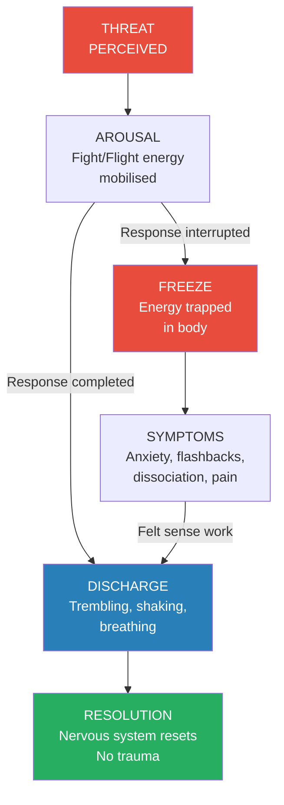
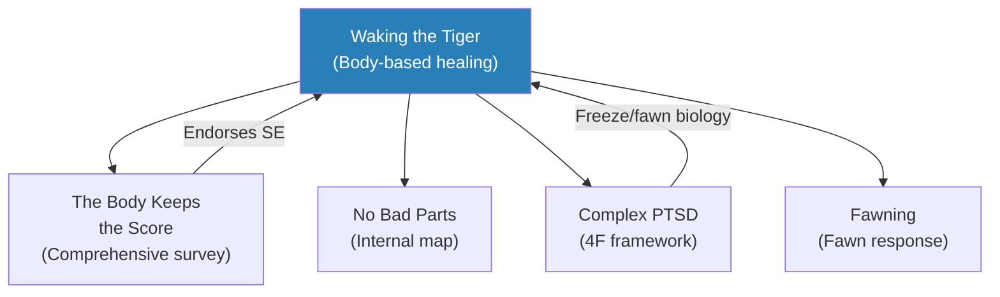

# Waking the Tiger — Peter Levine

> Peter Levine spent decades studying how animals in the wild face life-threatening danger daily yet rarely become traumatised, while humans — equipped with far more sophisticated brains — carry the imprint of overwhelming experiences for years, decades, or lifetimes. His central discovery explains why: animals complete their survival responses naturally, discharging the enormous energy mobilised for fight or flight through trembling, shaking, and spontaneous movement. Humans, cursed with a neocortex that can override instinct, suppress this natural discharge out of fear, shame, or cultural conditioning. The energy that was meant to power an escape or a counterattack remains locked in the body, and it is this trapped energy — not the event itself — that creates the symptoms we call trauma.
> Trauma, Levine argues, is not a disease. It is a dis-ease — a disruption of the body's natural ability to return to equilibrium after threat. And the solution is not to relive the event, not to analyse it, not to medicate it away, but to complete the body's interrupted response. This is done through the "felt sense" — a moment-to-moment awareness of internal body sensations that serves as the portal to the frozen survival energy. When approached gradually and with respect, this energy can be released, and the organism can return to wholeness.
> This is the foundational text of Somatic Experiencing — the body-based trauma therapy that has since been validated by neuroscience and adopted worldwide. It remains, nearly three decades after publication, the clearest articulation of why the body is the healer and how to let it do its work.

---

## About the Author

- Peter A. Levine holds a PhD in medical and biological physics from the University of California, Berkeley, and a doctorate in psychology from International University
- He studied stress and psychophysiology for more than forty years, drawing on ethology (animal behaviour), neuroscience, and cross-cultural healing traditions
- His breakthrough moment came in 1969 while working with a woman named Nancy who had suffered from severe anxiety and agoraphobia for years — a spontaneous encounter with an imaginary tiger freed her from decades of frozen trauma in a single session
- That experience launched his life's work: understanding the biological basis of trauma and developing a gentle, body-based method for resolving it
- He developed Somatic Experiencing (SE) and founded the SE Trauma Institute, which has trained thousands of practitioners worldwide
- He has treated trauma survivors from all contexts: combat veterans, accident victims, childhood abuse survivors, and indigenous communities
- He was nominated for a Nobel Peace Prize for his contributions to understanding and treating trauma

---

## The Big Idea

- <b style="color: #e74c3c">Trauma is not in the event — it is in the nervous system</b>
  - Two people can experience the identical event; one is traumatised, the other is not
  - The difference is not about toughness or character — it is about whether the body's survival response was completed
  - When the body mobilises enormous energy for fight or flight but the response is interrupted (by overwhelm, restraint, or anaesthesia), the energy stays trapped
  - It is this trapped energy — not the memory of the event — that creates symptoms
- <b style="color: #2980b9">Animals hold the key</b>:
  - Prey animals face life-threatening danger constantly but rarely develop trauma symptoms
  - After a near-death encounter, an animal that played dead (froze) will emerge from immobility with intense trembling, shaking, and spontaneous running or fighting movements
  - This discharge completes the survival cycle and resets the nervous system
  - The animal then returns to normal — alert, relaxed, and ready for the next challenge
- <b style="color: #e74c3c">Humans override this natural process</b>:
  - Our highly developed neocortex can override the instinctual discharge
  - We suppress trembling because it feels scary, embarrassing, or out of control
  - We avoid the intensity of the survival energy because it feels like dying, going crazy, or becoming violent
  - Cultural messages reinforce suppression: "Pull yourself together," "Get on with your life," "Grin and bear it"
- <b style="color: #27ae60">The solution: complete the interrupted response through the felt sense</b>:
  - The "felt sense" is a bodily awareness of your internal state — not thoughts, not emotions, but physical sensations
  - By tracking sensations with gentle attention, the frozen energy can begin to thaw
  - The discharge happens gradually — through trembling, shaking, waves of warmth, changes in breathing
  - This is not reliving the event; it is completing the body's response to the event
  - When the cycle completes, the symptoms resolve — often permanently

Trauma occurs when the arousal cycle is interrupted — the energy mobilised for survival gets trapped in freeze. Healing happens when the felt sense guides a gradual completion of the interrupted response.

---

## Key Concepts at a Glance

| Concept | One-line summary |
|---------|-----------------|
| **Trauma as physiology** | Trauma is a biological event in the nervous system, not primarily a psychological one |
| **The freeze response** | The last-resort survival mechanism — playing dead — where fight/flight energy gets trapped |
| **The felt sense** | A bodily awareness of your internal state that serves as the portal to frozen trauma energy |
| **Somatic Experiencing** | A gentle, gradual method for completing interrupted survival responses through the felt sense |
| **The three brains** | Reptilian (instinct), limbic (emotion), neocortex (thought) — the neocortex overrides instinct |
| **Discharge** | The natural release of trapped survival energy through trembling, shaking, and movement |
| **Renegotiation** | Completing the interrupted survival response with new resources — contrasted with re-enactment |
| **Re-enactment** | Unconsciously repeating trauma patterns without resolution — the trap most people fall into |
| **The trauma vortex** | The pull of frozen energy toward constriction, dissociation, and helplessness |
| **The healing vortex** | The pull of life force toward expansion, grounding, and vitality |
| **Pendulation** | The natural oscillation between activation and calm that characterises healthy discharge |
| **Hyperarousal** | The state of excessive activation — racing heart, hypervigilance, panic, insomnia |
| **Constriction** | Narrowing of perception, muscle tension, breathing restriction — the body braces against threat |
| **Dissociation** | Disconnection from body, numbing, "leaving" — the ultimate protective withdrawal |
| **Orienting response** | The instinctual scanning of the environment for safety and threat — disrupted by trauma |

---

## Section I: The Body As Healer

### The Animal Model — Why Animals Don't Get Traumatised

*Levine opens by establishing the paradox: animals face death daily yet stay psychologically healthy. The answer lies in biology, not psychology.*

- <b style="color: #2980b9">The impala and the cheetah</b>:
  - A cheetah chases an impala at full speed
  - If the impala cannot outrun the cheetah, it collapses — not from exhaustion, but from the freeze response
  - To the cheetah, the impala appears dead; predators often lose interest in dead prey
  - If the impala survives, it emerges from immobility with violent trembling and shaking
  - Its legs may run in the air while it's still lying down — completing the escape it couldn't finish
  - After the discharge, the impala stands, shakes itself off, and returns to the herd
  - No PTSD. No flashbacks. No avoidance behaviour. The cycle is complete.
- Why the freeze response exists:
  - It is the last-resort survival mechanism when fight and flight have failed
  - It serves multiple purposes: the animal may not be noticed (predators avoid carrion), pain is numbed by endorphins, and if death is coming, it will be relatively painless
  - It is not a choice — it is an automatic, instinctual response controlled by the reptilian brain
  - The energy mobilised for fight or flight doesn't disappear in freeze — it remains trapped, like a car with the accelerator floored and the brakes locked

> [!example] Nancy — The Original Breakthrough (1969)
> - Nancy had suffered from severe anxiety, agoraphobia, fibromyalgia, and chronic fatigue for years
> - During a relaxation session with Levine, she suddenly began showing signs of intense arousal — trembling, racing heart, constriction
> - Levine spontaneously said, "Nancy, you are being attacked by a large tiger. See the tiger as it comes toward you. Run!"
> - In her mind's eye, Nancy ran from the tiger — and simultaneously, her body erupted in intense trembling and spontaneous running movements
> - The energy that had been locked in her body for decades discharged in minutes
> - Her symptoms — the anxiety, the agoraphobia, the pain — resolved dramatically
> - This was the birth of Somatic Experiencing
> **The lesson:** The body holds the key to healing trauma. Nancy didn't need to understand what happened to her — she needed to complete the survival response her body had been holding for years.

- The three-brain model:
  - **Reptilian brain (brainstem):** The oldest brain — controls instinct, freeze/immobility, basic survival functions (breathing, heart rate, sleep, hunger, sex)
  - **Limbic brain (mammalian brain):** Emotional processing, social bonding, memory formation — shared with other mammals
  - **Neocortex:** Rational thought, language, planning, self-reflection — uniquely developed in humans
- <b style="color: #e74c3c">The neocortex is both our greatest asset and our greatest vulnerability</b>:
  - It can override the instinctual discharge process
  - It tells us that the trembling feels like "going crazy" or "losing control"
  - It associates immobility with death — and humans vehemently avoid anything that feels like death
  - It generates shame about involuntary body responses
  - It follows cultural messages that equate vulnerability with weakness

> [!tip] Core Insight
> "If we allow ourselves to experience the death-like sensation of being frozen, and at the same time, uncouple the fear that accompanies it, we would be able to move through immobility." The key to healing trauma is not confronting the traumatic event — it is learning to tolerate the body's intense survival energy long enough for it to complete its natural cycle.

---

### The Felt Sense — Perseus's Shield

*Levine introduces the concept that transforms trauma treatment: approaching the body's frozen energy not through the story but through physical sensation.*

- The myth of Medusa as metaphor:
  - Anyone who looked directly at Medusa turned to stone — "such is the case with trauma"
  - If we try to confront trauma head-on (reliving the event, forcing the memory), we risk re-traumatisation
  - Perseus defeated Medusa by using his polished shield as a mirror — he looked at her reflection, not at her directly
  - The felt sense is Perseus's shield — it reflects trauma through body sensation, allowing us to work with it without being overwhelmed
- <b style="color: #2980b9">What the felt sense is</b>:
  - Eugene Gendlin coined the term: "A felt sense is not a mental experience but a physical one. A bodily awareness of a situation or person or event"
  - It encompasses everything you feel and know about something at once — not detail by detail
  - Like seeing a television image rather than individual pixels, or hearing a melody rather than individual notes
  - It is the medium through which we experience the totality of sensation
- How the felt sense works in trauma healing:
  - Instead of asking "What happened?" you ask "What do you notice in your body right now?"
  - Sensations serve as signposts: tightness in the chest, heaviness in the legs, tingling in the hands
  - By following these sensations with gentle attention, you are following the trail of frozen energy
  - The sensations shift and change as the energy begins to move — this movement IS the healing
- The changing nature of the felt sense:
  - It is never static — it moves, transforms, evolves moment to moment
  - When you stay with a sensation long enough, it will shift to something different
  - This "pendulation" between different states is the body's natural rhythm of healing
  - The key: follow the body's lead rather than imposing your own agenda

---

### How Biology Becomes Pathology — The Freeze Response

*Levine explains the precise mechanism by which the freeze response, designed as a temporary survival strategy, becomes chronic pathology.*

- "As they go in, so they come out":
  - This expression from Army M.A.S.H. medics describes how injured soldiers emerge from anaesthesia in the same state they entered it
  - If a soldier was terrified and fighting when he went under, he may come out thrashing and attacking
  - Similarly, when humans begin to emerge from freeze, they experience the same intense activation that preceded the freeze
  - <b style="color: #e74c3c">This is where the trap occurs</b>: the intensity of the emerging energy — rage, terror, desperate escape — is so frightening that the person re-freezes
- The vicious cycle of trauma:
  - Overwhelming event → fight/flight energy mobilised → overwhelm → freeze
  - Begin to emerge from freeze → intense activation (rage, terror) → fear of the activation → re-freeze
  - Each cycle of freezing and re-freezing adds more trapped energy
  - More trapped energy requires more symptoms to contain it
  - The immobility response becomes chronic and intensifies over time
- Why the freeze response feels like death:
  - The physiology of the immobilised animal acts as though it were dead
  - Animals can actually die from "immobility response overdose" — the reptilian brain registers "dead" and complies
  - Humans understand what death means and we fear it — we avoid even dreams of falling or being killed
  - This fear of the death-like quality of immobility is another reason humans stay frozen

> [!example] Chowchilla — When Trauma Hits a Community
> - In 1976, a bus carrying 26 schoolchildren was hijacked in Chowchilla, California
> - The children and driver were buried alive in a van underground for 16 hours
> - Researchers studying the survivors found a wide range of trauma responses
> - Some children developed severe PTSD; others were relatively unaffected
> - The difference was not in the event (identical for all) but in each child's available resources: age, temperament, support, prior experience
> - This case demonstrated conclusively that trauma is not about the event but about the organism's response to the event
> **The lesson:** Trauma occurs when an event exceeds the organism's capacity to respond. The same event can traumatise one person and leave another unscathed.

- Symptoms as safety valves:
  - Symptoms are the body's attempt to regulate the undischarged energy
  - They are not pathology — they are the organism's best available solution to an impossible problem
  - "Pathology can be thought of as the maladaptive use of any activity designed to help the nervous system regulate its activated energy"
  - Functions regulated by the reptilian brain — sleep, eating, sex, activity — become the fertile ground for symptoms
  - Anorexia, insomnia, promiscuity, manic hyperactivity are symptoms of dysregulated survival energy

---

### The Core Symptoms of Trauma

*Levine identifies four core elements that make up the traumatic reaction, along with the constellation of symptoms that develop from them.*

- **Hyperarousal:**
  - The nervous system is stuck in "on" — perpetually scanning for danger
  - Increased heart rate, rapid breathing, cold sweats, muscle tension, racing thoughts
  - Hypervigilance — startling easily, difficulty relaxing, chronic insomnia
  - "Traumatized people have a deep distrust of the arousal cycle"

- **Constriction:**
  - The body narrows its field of attention to the perceived threat
  - Muscles tighten, breathing becomes shallow, blood vessels in the skin constrict
  - Perception narrows — tunnel vision, reduced hearing
  - This constriction is designed to focus all resources on survival, but when chronic, it produces chronic pain, tension, and restricted movement

- **Dissociation:**
  - The ultimate protective withdrawal — disconnecting awareness from the body
  - Ranges from mild (spacing out, feeling detached) to severe (depersonalisation, derealization, amnesia)
  - Evolved to protect the organism from unbearable pain
  - "Loss of skin sensation is a common physical manifestation of the numbness and disconnection people experience after trauma"
  - Dissociation and constriction work together to create a person who is physically present but psychologically absent

- **Helplessness:**
  - The sense that nothing you do can change your situation
  - The core emotional experience of freeze — "I can't move, I can't fight, I can't flee"
  - When chronic, it becomes learned helplessness — a pervasive sense of powerlessness that colours every aspect of life
  - It is this sense of helplessness, more than any other symptom, that makes trauma so devastating
  - Helplessness compounds: the failure to help oneself creates shame, which creates more helplessness
  - Breaking the cycle requires restoring even one experience of successful active response — however small

- **The interaction between symptoms:**
  - These four core symptoms do not exist in isolation — they interact and reinforce each other
  - Hyperarousal leads to constriction (the body braces) → constriction leads to dissociation (awareness retreats) → dissociation leads to helplessness (you cannot act if you cannot feel)
  - The cycle spirals: more hyperarousal → more constriction → more dissociation → more helplessness → more hyperarousal
  - Breaking into this cycle at any point can begin to unwind it
  - SE typically enters through the body — working with constriction and hyperarousal through the felt sense
  - As the body begins to discharge, dissociation lifts, helplessness recedes, and arousal normalises

- **The cumulative effect:**
  - Trauma symptoms don't develop overnight — they build over weeks, months, years
  - Each unresolved incident adds to the load
  - A person may carry the cumulative effects of dozens of "minor" events that individually seem insignificant
  - This explains why someone can suddenly "break down" after a seemingly trivial event — it was the straw that broke the camel's back
  - It also explains why resolution of one event can cascade into dramatic improvement — when the load drops below a threshold, the system can self-regulate again

- The full symptom list reveals the breadth of trauma's impact on every system of the body:
  - Nervous system: anxiety, panic, hypervigilance, insomnia, nightmares, startle response
  - Muscular: chronic tension, pain (especially neck, back, jaw), bracing patterns
  - Digestive: IBS, nausea, appetite changes, cramping
  - Immune: frequent illness, autoimmune conditions, slow healing
  - Cardiovascular: palpitations, blood pressure fluctuations, chest pain
  - Reproductive: sexual dysfunction, menstrual irregularity
  - Cognitive: difficulty concentrating, memory problems, confusion, foggy thinking
  - Emotional: mood swings, depression, rage, emotional flooding or numbing
  - Behavioural: avoidance, addiction, self-harm, attraction to danger, excessive timidity
  - Relational: difficulty trusting, fear of intimacy, isolation, codependency

> [!abstract] The Full Symptom List
> **Early symptoms (appear shortly after the event):**
> - Hyperarousal, hypervigilance, intrusive images, mood swings, exaggerated startle, nightmares, sleep disruption, fatigue, abrupt mood swings
>
> **Later symptoms (develop over time if unresolved):**
> - Panic attacks, anxiety, phobias, depression, amnesia, dissociation, psychosomatic symptoms (headaches, neck/back pain, chronic fatigue, immune problems, gastrointestinal issues), avoidance of situations, emotional flooding, reduced capacity for love and intimacy, feeling like you're "going crazy"
>
> **Final-stage symptoms (deep chronicity):**
> - Chronic pain, fibromyalgia, excessive shyness, diminished emotional responses, inability to commit, chronic fatigue syndrome, attraction to dangerous situations or people

---

### Dissociation — The Body Without a Soul

*Levine explores dissociation as the most severe symptom of trauma — the disconnection of awareness from embodied experience.*

- Dissociation exists on a continuum:
  - Mild: daydreaming, spacing out, driving on autopilot
  - Moderate: feeling detached from your body, watching yourself from outside, emotional numbing
  - Severe: depersonalisation (feeling unreal), derealisation (the world feels unreal), amnesia for events, multiple personality states
- The mechanism:
  - When the organism cannot fight, flee, or freeze its way to safety, it disconnects consciousness from the body
  - This serves a survival purpose: if you cannot escape the pain, you can at least escape the awareness of it
  - The body continues to function, but the "soul" has departed
  - Rod Steiger described his decades-long post-surgical depression: "I began going slowly into a greasy, yellow, jelly fog that permeated into my body... into my heart, my spirit, and my soul"
- Dissociation and constriction work together:
  - Constriction narrows the physical field — muscles brace, breathing restricts
  - Dissociation narrows the experiential field — awareness retreats from the body
  - Together, they create a person who appears present but is actually absent
  - "Loss of skin sensation is a common physical manifestation of the numbness and disconnection people experience after trauma"
- <b style="color: #e74c3c">The danger of chronic dissociation</b>:
  - When dissociation becomes a habitual response, the person loses access to their body's signals
  - They cannot feel hunger, pain, pleasure, fatigue, or emotion normally
  - They may be accident-prone because they are not fully aware of their physical environment
  - Relationships suffer because genuine emotional connection requires embodied presence
  - The body continues to accumulate stress without the person being aware of it — leading to psychosomatic illness

---

### Hypervigilance — The Sentinel That Never Rests

*When the threat detection system becomes permanently activated, ordinary life becomes a minefield.*

- How hypervigilance develops:
  - The orienting response — the instinctual scanning of the environment for safety and threat — becomes locked in "threat" mode
  - The person is constantly scanning faces, sounds, shadows, exits
  - They startle easily, sleep lightly (or not at all), and cannot relax in unfamiliar environments
  - Their muscles are chronically tense, especially in the neck, shoulders, and jaw

> [!example] Mrs. Thayer — Hypervigilance as a Way of Life
> - Mrs. Thayer, a middle-aged woman, came to Levine with chronic migraines, neck pain, and insomnia
> - She couldn't sit still, constantly scanning the room and repositioning herself
> - Her orienting response was stuck — her nervous system was continuously searching for a threat that wasn't there
> - Through felt sense work, she gradually became aware of the chronic tension patterns in her body
> - As the tension released, her migraines decreased and she began sleeping through the night
> **The lesson:** Hypervigilance is not "being careful" — it is the body's threat-detection system running on permanent high alert, consuming enormous energy and preventing rest.

- The relationship between hypervigilance and traumatic coupling:
  - Traumatic coupling occurs when a specific stimulus (a sound, smell, colour, physical sensation) becomes linked to the traumatic event
  - The sound of a car backfire triggers a combat veteran's freeze response
  - The smell of cologne triggers a sexual assault survivor's panic
  - These couplings are formed at the level of the reptilian brain and limbic system — they bypass conscious thought
  - They can be undone through SE, which uncouples the stimulus from the threat response through graduated exposure via the felt sense

---

### Traumatic Anxiety and Psychosomatic Symptoms

*When trauma goes unrecognised, the body expresses what the mind cannot articulate.*

- Traumatic anxiety differs from ordinary anxiety:
  - It is not about a specific worry or concern
  - It is a pervasive sense of dread with no clear object
  - "I don't know of one thing I don't fear. I fear getting out of bed in the morning. I fear walking out of my house"
  - It is the body's alarm system firing continuously without a clear trigger
- Psychosomatic symptoms — the body's language:
  - Chronic pain that migrates or has no medical explanation
  - Gastrointestinal distress — IBS, nausea, cramping
  - Immune system dysfunction — frequent illness, autoimmune conditions
  - Respiratory problems — shortness of breath, chronic hyperventilation
  - Cardiovascular symptoms — chest pain, palpitations, blood pressure fluctuations
  - "As many as seventy-five percent of the people who go to doctors have complaints that are labeled psychosomatic because no physical explanation can be found"
- The connection to trauma:
  - These symptoms are not "all in your head" — they are in your body
  - They are the physical manifestation of undischarged survival energy
  - The energy, unable to complete its intended action (fight/flee), expresses itself through the body's systems
  - Treating the symptom without addressing the trapped energy is like cutting the wire to a fire alarm without putting out the fire

---

### Memory, Trauma, and False Memories

*Levine addresses one of the most controversial aspects of trauma treatment — the nature of traumatic memory and the risk of "false" memories.*

- How traumatic memory differs from ordinary memory:
  - Ordinary memory is narrative — a story with a beginning, middle, and end
  - Traumatic memory is fragmented — sensory fragments (images, sounds, smells, body sensations) without coherent narrative
  - These fragments are stored at the level of the body and the limbic system, not the neocortex
  - They can be triggered involuntarily — a flashback is the intrusion of traumatic memory fragments into present awareness
- The felt sense and memory:
  - Through the felt sense, previously inaccessible memories may surface
  - These are often body memories — sensations, movements, postures — rather than cognitive memories
  - They feel intensely real because they engage the same neural circuits as the original event
- <b style="color: #e74c3c">The false memory caution</b>:
  - "The dynamics of trauma are such that they can produce frightening and bizarre 'memories' of past events that seem extremely real, but never happened"
  - The body's sensory fragments can be assembled into a narrative that feels true but may not be
  - This is why SE focuses on completing the body's response rather than reconstructing the story
  - "With IFS, we can retrieve and unburden that child without having to know if the memory is accurate or acting on it in the outside world" — a principle SE shares
  - Healing does not require establishing the historical truth of a memory — it requires completing the body's interrupted response

---

## Section II: Transformation — The Healing Path

### Renegotiation vs. Re-enactment

*Levine makes a crucial distinction between the unconscious repetition of trauma (re-enactment) and the conscious, resourced completion of interrupted survival responses (renegotiation).*

- <b style="color: #e74c3c">Re-enactment</b> — the trap:
  - Traumatised people unconsciously recreate the dynamics of their trauma — in relationships, careers, and bodily symptoms
  - The person who was controlled as a child either becomes controlling or seeks controlling partners
  - The person who was abandoned keeps choosing unavailable partners
  - War veterans may seek high-risk occupations or drive recklessly
  - The drive to complete the incomplete response is so powerful that it compels repetition
  - But re-enactment without awareness simply re-traumatises — the cycle repeats

- <b style="color: #27ae60">Renegotiation</b> — the healing path:
  - Renegotiation is the conscious, resourced completion of the interrupted survival response
  - It uses the felt sense to gradually approach the frozen energy without being overwhelmed
  - It builds new resources (strength, aggression, escape capacity) before confronting the trauma core
  - It completes the actions that were thwarted — running, fighting, protecting — in the body, not just in the mind
  - "Successful renegotiation of trauma occurs when the adaptive resources of the person increase simultaneously with the arousal"

> [!example] Marius Kristensen — The Polar Bear Pants
> - Marius, a young Eskimo man, was attacked by wild dogs at age eight and bitten badly on his right leg
> - For years, he suffered from anxiety, weak legs, and nausea when around men he admired
> - His only memories: bloody torn pants, and his father seeming annoyed
> - In session, Levine noticed his new pants were polar bear fur — a gift from his mother, the same pants hunters wore
> - When Marius felt the pants on his legs, his legs felt "very strong, like the men when they are hunting"
> - Through guided imagery, Marius tracked a polar bear, made the kill, and eviscerated it — his body trembling with excitement and power
> - Empowered, Marius was directed back toward the village — and for the first time, saw the dogs and the telephone pole
> - His legs wanted to run — the escape response that had been frozen since age eight
> - At the critical moment, Levine asked him to turn and face the dogs — he grabbed a roll of paper towels and strangled it with astonishing force
> - He screamed in rage and triumph, killed the imagined dogs, then completed the running escape by climbing the pole
> - Looking down: "They're dead and I'm safe"
> - Then: "He's carrying me... my father... he's very upset, he's not angry at me... he's very worried... he loves me"
> - The reinterpretation of his father's reaction — from rejection to fear — was the final piece of healing
> - A year later, Marius no longer suffered from the anxiety
> **The lesson:** Renegotiation builds resources BEFORE approaching the trauma core. Marius' polar bear hunt gave his body the strength, aggression, and competence it needed to face the dogs — and this time, he could fight back, run, and win.

---

### The Elements of Renegotiation

*Levine identifies the essential components that make renegotiation successful, distilled from thousands of sessions.*

- <b style="color: #2980b9">Developing the felt sense</b>:
  - The foundation of all SE work — learning to track internal body sensations with curiosity
  - Not interpretation, not analysis — just noticing what is happening moment to moment
  - Exercise: feel the way your body makes contact with the surface supporting you → notice your clothes on your skin → notice sensations beneath your skin → identify what makes the experience comfortable → recognise that the feeling of comfort comes from your felt sense, not from the chair

- <b style="color: #2980b9">Grounding</b>:
  - Establishing a connection with the body and the earth
  - "In love we are swept off our feet; in trauma our legs are knocked out from under us"
  - Marius re-established connection with his legs through the felt sense of the polar bear pants
  - Grounding provides the literal base from which to face threat
  - Exercise: feel your feet on the floor → notice the weight of your body → sense the support beneath you

- <b style="color: #2980b9">Resilience and springiness</b>:
  - The ability to bounce back — literally and metaphorically
  - Marius' legs became "like springs, light and strong" as he jumped from rock to rock
  - Resilience is the dynamic form of grounding — the capacity to yield without breaking
  - Like a tree that bends in the wind but doesn't uproot

- <b style="color: #2980b9">Restoring healthy aggression</b>:
  - Aggression (from Latin "to move toward") is the biological ability to be vigorous and energetic
  - In freeze, assertive energies become inaccessible — the person feels helpless and passive
  - Marius' spearing of the imagined polar bear restored his access to predatory aggression
  - This is not about becoming violent — it is about reclaiming the energy that was lost in overwhelm

- <b style="color: #2980b9">Completing the orienting response</b>:
  - After discharge, the organism needs to look around and verify that it is safe
  - Marius climbing the pole and looking down completed his orienting response
  - This uncouples the remaining fear from the excitement of being alive
  - Without this step, the nervous system remains on alert

The Somatic Experiencing renegotiation follows a precise path: build resources through felt sense and grounding, then gradually approach the frozen energy, allow discharge, and complete with orienting.

---

## Section III: The Broader Context

### Trauma and Shamanic Healing

*Levine draws a striking parallel between Somatic Experiencing and the oldest healing tradition on Earth.*

- Throughout history, shamanic healers have addressed what they call "rape of the soul" — the most widespread cause of illness:
  - Trauma separates the soul from the body
  - "My father stole my soul when he had sex with me" — the language trauma survivors use mirrors shamanic understanding
  - Rod Steiger on post-surgical depression: "I began going slowly into a greasy, yellow, jelly fog that permeated into my body... into my heart, my spirit, and my soul"
- Shamanic healing methods share core principles with SE:
  - Community support creates the container for healing
  - Drumming, chanting, and dancing create rhythmic regulation of the nervous system
  - The healing often continues for days — gradual, not sudden
  - <b style="color: #27ae60">Critically: the beneficiary almost always shakes and trembles as the event nears its conclusion</b> — the same biological discharge that SE facilitates
  - "Soul retrieval" parallels the completion of the interrupted survival response
- The importance of community:
  - After the 1994 Los Angeles earthquake, families who camped, ate, and played together fared better
  - Those who remained isolated, obsessively watching disaster replays, were more susceptible to trauma
  - "Each of us must take the responsibility for healing our own traumatic injuries. We must do this for ourselves, for our families, and for the society at large"

---

### The Instinctual Responses — Our Built-In Survival System

*Levine describes the hierarchy of survival responses that evolution has built into every organism — and how understanding this hierarchy is essential to understanding trauma.*

- The orienting response:
  - The first response to any novel stimulus — a sound, a movement, a change in the environment
  - The head turns, the eyes focus, the ears prick up
  - The body assesses: Is this interesting? Is this dangerous? Is this irrelevant?
  - When the orienting response determines "danger," the next level activates
  - In trauma, the orienting response becomes locked — the person is constantly scanning for threat, unable to settle

- The flight response:
  - The first active survival response — get away from the threat
  - Legs energise for running, blood flows to large muscles, breathing accelerates
  - The eyes scan for escape routes, the body prepares to move fast
  - If flight is possible and successful, the energy mobilised is discharged in the running — no trauma
  - If flight is blocked (trapped, restrained, too young to run), the energy remains

- The fight response:
  - If you can't run, you fight — the body mobilises for aggressive defence
  - Jaw clenches, fists form, muscles brace for impact
  - Enormous rage and strength are available in this state
  - If fighting is possible and effective, the energy discharges through the struggle — no trauma
  - If fighting is futile (the threat is too powerful, you are too small), the energy remains

- The freeze response:
  - The last resort — when both flight and fight have failed
  - The body collapses into immobility, muscles go slack, heart rate drops dramatically
  - Endorphins flood the system — reducing pain to near-zero
  - The organism appears dead to predators
  - ALL the energy mobilised for flight and fight is still present but locked in the frozen body
  - This is where trauma lives — in the gap between the energy mobilised and the response completed

- <b style="color: #27ae60">The hierarchy is always the same</b>: orient → flee → fight → freeze
  - Therapy that skips levels (going straight to "fighting back" without first establishing orientation and escape capacity) risks re-traumatisation
  - SE respects the hierarchy: first establish orientation and safety, then build escape resources, then restore aggression, then finally approach the freeze

---

### Rhythm and the Felt Sense

*Levine identifies rhythm as a fundamental element of the felt sense and of healing.*

- All life is rhythmic:
  - Heartbeat, breathing, walking, the cycle of sleep and waking
  - The healthy arousal cycle itself is a rhythm: activation → peak → deactivation → rest
  - Trauma disrupts these rhythms — sleep becomes erratic, breathing shallow, movement restricted
- Healing restores rhythm:
  - The pendulation between trauma vortex and healing vortex IS a rhythm
  - Trembling and shaking have their own rhythm — the body finds its frequency
  - Shamanic healing uses drumming and chanting to entrain the body's rhythms toward health
  - Modern applications: bilateral stimulation in EMDR, rhythmic movement in somatic therapies
- The pulsing shower exercise works because:
  - The rhythmic stimulation of water re-establishes awareness of the body's surface
  - The alternation between different body regions creates a gentle pendulation
  - The naming of each body part ("This is my head... I welcome you back") reconnects cognitive and somatic awareness

---

### The Courage to Feel

*One of the most moving passages in the book — Levine's exploration of what it takes to face the body's frozen energy.*

- Why healing requires courage:
  - The sensations that arise when approaching frozen trauma energy are intense — they were designed to power life-or-death responses
  - The body may produce heat, cold, trembling, shaking, nausea, dizziness, numbness, or intense emotion
  - These experiences can feel overwhelming, especially for someone who has spent years suppressing them
  - <b style="color: #27ae60">"Desire and healing" — you must want to become whole more than you fear the process</b>
- What the courage looks like:
  - It is not gritting your teeth and forcing your way through
  - It is the willingness to sit with discomfort, moment by moment, trusting the body's intelligence
  - It is following the felt sense even when it leads into unfamiliar territory
  - It is allowing trembling to happen without clenching against it
  - It is trusting that what goes up must come down — that the activation will peak and subside
- The reward:
  - Not just the absence of symptoms, but the presence of vitality
  - "The transformation of trauma is an inherently mythic-poetic-heroic journey"
  - Those who complete it gain access to the full range of human experience — including the exhilaration of being alive that trauma had stolen
  - "Within every injury is the seed of healing and renewal"

---

### Causes of Trauma — Broader Than You Think

*Levine expands the definition of traumatic events far beyond war and abuse to include the ordinary events that can overwhelm the nervous system.*

- Events that can cause trauma:
  - Obvious: war, sexual/physical/emotional abuse, violence, natural disasters, accidents
  - Less obvious: childhood surgery (especially with ether anaesthesia), medical procedures, dental procedures, falls
  - Subtle: prolonged immobilisation (casting, splinting), high fevers, loss of a parent, fetal trauma, birth trauma
  - <b style="color: #e74c3c">Even "benign" medical events register as life-threatening to the body</b>:
    - "Though a person may recognise that an operation is necessary... on a primal level, our bodies do not"
    - The body perceives that it has sustained a wound serious enough to place it in mortal danger
    - "Where trauma is concerned, the perception of the instinctual nervous system carries more weight — much more"

> [!example] The Four-Year-Old's Surgery
> - A child describes his tonsillectomy:
> - "I struggled with masked giants who were strapping me to a high, white table"
> - "Silhouetted in the cold, harsh light... someone coming towards me with a black mask"
> - "I spun into a dizzying, black tunnel of horrific hallucinations"
> - "I felt utterly and completely abandoned and betrayed"
> - "For years after this annihilating experience, I feared bedtime and would sometimes wake up gasping for breath"
> - A child psychiatrist's response: she focused on his attachment to a stuffed dog, missing the traumatic origin entirely
> - The "therapy worked" — he threw the dog away — but his anxiety continued for decades
> **The lesson:** What appears benign to adults can be annihilating to a child's nervous system. Childhood medical procedures are among the most underrecognised sources of trauma.

> [!example] Robbie's Knee Surgery — "Am I Alive?"
> - A father describes his son Robbie's "minor" knee surgery
> - "The doctor tells me that everything is okay. The knee is fine"
> - "But everything is not okay for the boy waking up in a drug-induced nightmare, thrashing around on his hospital bed"
> - "A sweet boy who never hurt anybody, staring out from his anesthetic haze with the eyes of a wild animal"
> - He was "striking the nurse, screaming 'Am I alive?'"
> - The father had to grab his arms; the boy stared right into his eyes "and not knowing who I am"
> - The father did "what you do in the suburban United States — buy your kid a toy so that you'll feel better"
> - Millions of parents are left feeling helpless, unable to understand the changes in their children's behaviour after such events
> **The lesson:** The body perceives surgery as a life-threatening wound regardless of the medical necessity. The boy's "Am I alive?" is the freeze response emerging — the most primal question an organism can ask.

- What determines whether an event becomes traumatic:
  - The event itself — intensity, duration, repetition
  - Context — support from family/friends, health, stress level, nutrition
  - Physical characteristics — genetic resilience, age, developmental stage
  - Learned capabilities — an infant has no capacity to self-regulate; an adult can complain, leave, or fight back
  - Experienced sense of capacity — do you feel capable of meeting the danger?
  - External resources — safety in the environment, helpful people, hiding places
  - Internal resources — instinctual action plans, prior success in facing threats
  - History of success or failure — prior successful responses build resilience; prior failure builds vulnerability

---

### The Arousal Cycle and Why It Matters

*Levine explains the fundamental biological rhythm that trauma disrupts — and that healing restores.*

- The healthy arousal cycle:
  - Challenge or threat → arousal rises → mobilisation (fight/flight) → arousal peaks → arousal actively brought down → relaxation and satisfaction
  - "Deep satisfaction is one of the fruits of a completed arousal cycle"
  - We seek out challenges — bungee jumping, skydiving, competitive sports — because we need the exhilaration of a completed arousal cycle
  - War veterans often report not feeling fully alive since the "heat of battle" — they are addicted to the uncompleted arousal cycle
- What trauma does to the cycle:
  - Arousal becomes coupled with the overwhelming experience of immobility and fear
  - The traumatised person prevents or avoids completion of the cycle
  - They remain stuck in a cycle of fear rather than a cycle of challenge-and-mastery
  - <b style="color: #27ae60">"What goes up must come down" — this simple natural law is the key to healing</b>
  - When we can trust the arousal cycle and flow with it, healing begins

> [!tip] Core Insight
> "Human beings long to be challenged by life, and we need the arousal that energises us to meet and overcome those challenges." Trauma doesn't just cause suffering — it robs us of the vitality that comes from successfully meeting life's challenges. Healing trauma restores not just peace but aliveness.

---

### The Trauma Vortex and the Healing Vortex

*Levine uses the metaphor of two counter-rotating vortices to describe the competing forces at work in every traumatised person.*

- <b style="color: #e74c3c">The trauma vortex</b>:
  - A downward spiral of constriction, dissociation, helplessness, and hyperarousal
  - It pulls the person toward the frozen core of their traumatic experience
  - The closer you get to the core, the more intense the sensations and emotions
  - Without resources, approaching the core means being sucked in and re-traumatised
  - This is why "reliving" or "cathartic" approaches to trauma can be counterproductive

- <b style="color: #27ae60">The healing vortex</b>:
  - A counter-rotating upward spiral of expansion, grounding, vitality, and connection
  - It represents the organism's innate drive toward health and wholeness
  - It is powered by the felt sense, by grounding, by resourcefulness, by healthy aggression
  - The healing vortex is always present — even in the most traumatised person, life force persists

- <b style="color: #2980b9">Pendulation</b> — the key to healing:
  - Healing occurs not by staying in either vortex but by oscillating between them
  - Contact the trauma vortex briefly (through felt sense) → then return to the healing vortex (through grounding and resources)
  - Each oscillation allows a small amount of frozen energy to discharge
  - Over time, the trauma vortex weakens and the healing vortex strengthens
  - "Like slowly peeling the layers of skin off an onion, carefully revealing the traumatised inner core"

- What pendulation looks like in practice:
  - Sensation intensifies (moving toward trauma vortex) → notice without fighting → sensation peaks → sensation shifts (the body's intelligence redirects toward healing vortex) → relaxation, warmth, deeper breathing → next wave of activation
  - The therapist's role is to help the client stay in the "sweet spot" of activation — enough to discharge, not so much to overwhelm
  - If the client is pulled too deep into the trauma vortex, the therapist helps them re-orient to the present: "Feel your feet on the floor. Look around the room. What do you see?"

---

### The Instinctual Self and Modern Alienation

*Levine argues that our disconnection from our animal nature is not just a factor in trauma — it is a factor in the general malaise of modern life.*

- When humans roamed as hunter-gatherers, our existence was closely linked to the natural world:
  - Every moment, we were prepared to defend ourselves and our families
  - The exercise of our survival capacities made us feel "exhilarated and alive, powerful, expanded, full of energy"
  - Being threatened engaged our deepest resources and allowed us to experience our fullest potential
- Modern life offers few overt opportunities for this:
  - Our survival depends increasingly on thinking rather than physical response
  - "Most of us have become separated from our natural, instinctual selves — in particular, the part of us that can proudly, not disparagingly, be called animal"
  - Without easy access to instinctual resources, "humans alienate their bodies from their souls"
- The consequence: vulnerability to trauma
  - People more in touch with their natural selves tend to fare better with trauma
  - "In order to stay healthy, our nervous systems and psyches need to face challenges and to succeed in meeting those challenges"
  - When this need is not met, we lack vitality and are unable to fully engage in life

> [!tip] Core Insight
> The instinctual self is not a primitive vestige to be transcended — it is the source of our vitality, our resilience, and our capacity for healing. Trauma cuts us off from it; healing reconnects us.

---

### The Woman on the Dark Street — Instinct in Action

> [!example] The Woman Who Walked Toward Danger
> - A woman is walking home in the dark when she sees two men approaching from the opposite side of the street
> - Something about them doesn't feel right — she becomes immediately alert
> - As they come closer, one angles across the street toward her; the other circles behind
> - Her heart rate increases, her mind races: Should she scream? Run? Where?
> - She has too many options and not enough time — she is paralysed by indecision
> - Then instinct takes over: without consciously deciding, she walks with firm, quick steps straight toward the man crossing the street
> - Startled by her boldness, the man veers off; the man behind melts into the shadows
> - She is safe — not because she was stronger, but because her instincts gave her the optimal response when her conscious mind was overwhelmed
> **The lesson:** Thanks to her ability to trust her instinctual flow, this woman was not traumatised. The body knows what to do when the mind is overwhelmed — if we let it.

---

## Practical Applications

### First Aid for Trauma — Adults

- After an overwhelming event, the most important thing is to prevent the freeze from becoming chronic:
  - Ensure physical safety first
  - Help the person orient — look around, notice where they are, what year it is
  - Encourage gentle, pulsing contact with the body (not forced movement)
  - Allow trembling and shaking if it occurs — do NOT suppress it
  - Stay present and calm — your nervous system helps regulate theirs
  - Avoid forcing the person to "talk about what happened" — the body needs to process first
  - Do not rush the person — resolution takes time

### First Aid for Trauma — Children

- Children are particularly vulnerable to trauma because:
  - They have fewer coping resources and less life experience
  - They cannot leave dangerous situations on their own
  - Their developing nervous systems are more easily overwhelmed
  - What seems minor to an adult can be annihilating to a child
- What to do:
  - Stay calm — your calm regulates their nervous system
  - Hold them gently but don't restrain them — allow natural movement
  - Let them cry, tremble, shake — these are healthy discharge responses
  - Do NOT say "You're fine" or "It wasn't that bad" — validate their experience
  - Observe for changes in behaviour in the days and weeks following — sleep disruption, clinginess, regression, nightmares, unexplained tantrums
  - If symptoms persist, seek professional help from a trauma-informed practitioner

---

### The Pulsing Shower Exercise

> [!abstract] Body Reconnection Exercise
> 1. Each day, take a gentle, pulsing shower (a pulsing shower head costs $15-40)
> 2. At cool or slightly warm temperature, expose your entire body to the pulsing water
> 3. Put your full awareness into the region where the stimulation is focused
> 4. Move through every body part: hands, wrists, face, shoulders, underarms, head, neck, chest, back, legs, pelvis, hips, thighs, ankles, feet
> 5. Pay attention to sensation in each area — even if it feels blank, numb, or painful
> 6. As you do this, say "This is my head, my neck..." etc. "I welcome you back"
> 7. An alternative: gently slap different parts of your body briskly

This exercise begins to welcome the soul back to the body — an important first step toward bridging the split between body, mind, and spirit.

---

### The Felt Sense Exercise — Developing Your Shield

> [!abstract] Felt Sense Awareness Exercise
> 1. Make yourself comfortable wherever you are reading this
> 2. **Feel** the way your body makes contact with the surface supporting you
> 3. **Sense** into your skin — notice how your clothes feel
> 4. **Sense** underneath your skin — what sensations are there?
> 5. Now, gently remembering these sensations: **How do you know you feel comfortable?** What physical sensations contribute to that overall feeling?
> 6. **Does becoming more aware** of these sensations make you more or less comfortable? Does this change over time?
> 7. Sit for a moment and **enjoy** the felt sense of comfort
>
> The experience of comfort comes from your *felt sense* of comfort — not from the chair itself. As a visit to any furniture store will reveal, you can't know a chair is comfortable until you sit in it and get a bodily sense of how it feels.

- Developing the felt sense further:
  - The felt sense is always present — even when you are not aware of it
  - It tells you where you are and how you feel at any given moment
  - It communicates the overall experience of the organism, not the interpretation of individual parts
  - With practice, you can learn to follow its shifts and changes — each shift is information
  - The more familiar you become with your felt sense, the more readily you can use it to navigate difficult experiences

---

### The Organism's Communication System

*How the body communicates through the felt sense — the language we must learn to read.*

- The organism communicates through:
  - **Sensations:** The primary language — pressure, temperature, movement, pain, pleasure, vibration, tingling, numbness
  - **Images:** Visual fragments that arise from the body's experience — not necessarily memories, but the body's symbolic language
  - **Behaviour:** Postures, movements, gestures, facial expressions — often involuntary
  - **Affect (emotion):** Fear, anger, sadness, joy — but in SE, emotion is secondary to sensation
  - **Meaning:** The cognitive interpretation that the neocortex assigns — useful but potentially misleading
- The hierarchy matters:
  - Sensation is the most direct, reliable channel — closest to the body's actual experience
  - Images and behaviour emerge from sensation and can amplify it
  - Emotion is more processed — further from the raw experience
  - Meaning is the most processed and the most likely to be distorted by the neocortex's tendency to create narratives
  - In SE, you start with sensation and let meaning emerge naturally — not the reverse

---

### Why Talk Therapy Alone Often Fails

*Levine explains the fundamental limitation of approaches that rely primarily on narrative and insight.*

- The limitation of story-based approaches:
  - Trauma is stored in the reptilian brain and limbic system — structures that do not process language
  - Talking about the event engages the neocortex, which may produce insight — but insight alone does not change the body's state
  - You can understand perfectly why you are anxious and still be anxious — because the anxiety lives in a part of the brain that words cannot reach
  - "The core of traumatic reaction is ultimately physiological, and it is at this level that healing begins"
- When talk therapy can help:
  - It provides a relational context — the presence of an attuned other is healing in itself
  - It helps integrate the experience after body-level discharge has occurred
  - It can identify patterns of re-enactment and help the person make different choices
  - It addresses the meaning-making dimension — what the experience means in the context of the person's life
- When talk therapy becomes counterproductive:
  - When it becomes a way of staying in the head and avoiding the body
  - When the story is rehearsed so many times it becomes a fixed narrative rather than a living experience
  - When "processing" the event actually means re-activating the freeze without completing it
  - <b style="color: #e74c3c">When it leads to "false memories"</b> by interpreting body sensations as evidence of events that may not have occurred
- The SE integration:
  - SE does not reject talking — it integrates it with body-level work
  - The felt sense provides the body's input; narrative provides the meaning; together they create complete healing
  - "Reliving the event in itself may seem valuable, but too often it is not. Traumatic symptoms sometimes mimic or recreate the event that caused them; however, healing requires an ability to get in touch with the process of the traumatic response"

---

### Trauma Is Trauma, No Matter What Caused It

*A key principle of SE: the body's response to overwhelm is the same regardless of whether the cause is a car accident, a sexual assault, or a childhood surgery.*

- The common thread:
  - All traumatic reactions share the same core: arousal that could not complete its cycle
  - The symptoms — hyperarousal, constriction, dissociation, helplessness — are the same regardless of the precipitating event
  - This means the treatment approach can be the same: complete the body's interrupted response
- The implication:
  - You do not need to know what caused the trauma to heal it
  - The body knows what happened even when the mind does not
  - Following the felt sense will lead you to the frozen energy regardless of whether you have a conscious memory
  - This is liberating for people who have symptoms but no clear traumatic memory — their body's response is valid regardless

---

## The Arousal Exercise — Experiencing Trauma's Signature

> [!abstract] Arousal Recognition Exercise
> 1. Sit comfortably with a clock visible. Contact your felt sense — feel your body, your clothes, the support beneath you
> 2. **Part One:** Imagine you're in an airplane at 30,000 feet. There has been some turbulence. Suddenly you hear a loud explosion — BOOM — followed by complete silence. The engines have stopped.
> 3. Notice your body's response: breathing, heartbeat, temperature, muscle tension, posture, eyes, neck, abdomen, legs. Write brief notes.
> 4. Note the time. Take a deep breath. Let your body return to comfort. Note the time again — this is how long it takes your body to recover from activation.
> 5. **Part Two:** Imagine sitting on friends' steps on a warm day. A man begins running straight toward you, screaming and waving a gun. Notice the same body responses.
> 6. Compare your responses — the physiological signature is similar regardless of the cause, because trauma is about the body's response, not the event.

This exercise demonstrates that the body responds to imagined threat almost identically to real threat — because the nervous system cannot distinguish between the two. This is why traumatic memories feel so real, and why the felt sense can be used to access and resolve them.

---

## What Healing Looks Like — Signs of Progress

- Physical signs of discharge:
  - Trembling, shaking, vibration (especially in legs, arms, and belly)
  - Waves of warmth spreading through the body
  - Sweating (warm, moist — different from cold stress sweats)
  - Spontaneous deep breathing and sighing
  - Yawning (a parasympathetic response indicating downregulation)
  - Stomach gurgling (the digestive system coming back online)
  - Tingling, especially in extremities
  - Spontaneous movement — limbs twitching, body shifting position
- Emotional signs of resolution:
  - Tears of relief (different from tears of distress — these feel cleansing)
  - Laughter — sometimes spontaneous and unexpected
  - A sense of lightness — "a weight has been lifted"
  - Increased energy and vitality
  - Feelings of warmth and connection
  - Renewed interest in life, activities, relationships
- Cognitive signs:
  - New perspective on the traumatic event — "I see it differently now"
  - The memory becomes a story with a beginning, middle, and end — no longer fragmented
  - Reduced emotional charge when recalling the event
  - Increased ability to be present — less dissociation, less hypervigilance

---

## Levine's Contribution to the Broader Trauma Field

*Where Waking the Tiger sits in the landscape of trauma treatment — and what it uniquely offers.*

- Before Levine, trauma treatment was dominated by two approaches:
  - **Talk-based approaches** (psychodynamic, CBT): Focus on the story, the cognitions, the meaning
  - **Pharmacological approaches:** Manage symptoms with medication — SSRIs, benzodiazepines, mood stabilizers
  - Neither addressed the body directly — and neither resolved the biological core of trauma
- What SE added:
  - A biological model that explains WHY talk therapy often fails
  - A method for working directly with the body's survival responses
  - An understanding of the freeze response as the central mechanism of trauma — not just fight/flight
  - The concept of "discharge" — that the trapped energy needs to be released through the body, not just understood by the mind
  - The principle of gradual approach — "titration" — working at the edge of activation without being overwhelmed
- The legacy:
  - SE has been adopted worldwide and integrated into treatment for PTSD, complex trauma, developmental trauma, and somatic disorders
  - Neuroscience has subsequently validated many of Levine's claims about the freeze response, polyvagal regulation, and the role of the body in trauma
  - Stephen Porges' polyvagal theory provides the neurophysiological framework for Levine's three-brain model
  - Bessel van der Kolk has called body-based approaches "the most promising frontier in trauma treatment"
  - IFS, EMDR, sensorimotor psychotherapy, and other body-informed approaches all build on the foundation Levine established

---

## Key Quotes

- "Traumatic symptoms are not caused by the 'triggering' event itself. They stem from the frozen residue of energy that has not been resolved and discharged"
- "The body has been designed to renew itself through continuous self-correction. These same principles also apply to the healing of psyche, spirit, and soul"
- "Nature's plan: Trauma is a fact of life. It does not, however, have to be a life sentence"
- "The key to resolving traumatic symptoms in humans is in our ability to mirror the natural process that occurs in wild animals"
- "If we attempt to confront trauma head on, it will continue to do what it has already done — immobilize us in fear"
- "Healing trauma is a heroic journey that will have moments of creative brilliance, profound learning, and periods of hard tedious work"
- "Real heroism comes from having the courage to openly acknowledge one's experiences, not from suppressing or denying them"
- "In order to stay healthy, our nervous systems and psyches need to face challenges and to succeed in meeting those challenges"
- "We are all human animals. The fundamental challenges we face today have come about relatively quickly, but our nervous systems have been much slower to change"
- "Trauma is so arresting that traumatized people will focus on it compulsively. Unfortunately, the situation that defeated them once will defeat them again and again"
- "In love we are swept off our feet; in trauma our legs are knocked out from under us"
- "Every life contains difficulties we are not prepared for. Read, learn and be prepared for life and healing" — Bernard Siegel
- "The organism has been designed to renew itself through continuous self-correction"
- "When we can trust the arousal cycle and are able to flow with it, the healing of trauma will begin"
- "The drive to complete the freezing response remains active no matter how long it has been in place. When we learn how to harness it, the power of this drive becomes our greatest ally"
- "Trauma can be healed, and even more easily prevented. Its most bizarre symptoms can be resolved if we are willing to let our natural, biological instincts guide us"
- "My belief is in the blood and flesh as being wiser than the intellect. The body-unconscious is where life bubbles up in us" — D.H. Lawrence, quoted by Levine

---

## Verdict

- **The book's greatest contribution:** Levine gives trauma a biological explanation that makes intuitive sense and immediately demystifies the experience. The insight that animals hold the key — that they complete their survival responses naturally while humans suppress them — is one of those ideas that, once heard, cannot be unheard. It explains why talk therapy often fails to resolve trauma (you cannot think your way out of a body response), why medications only manage symptoms (they suppress the nervous system without completing the cycle), and why certain experiences (art, dance, martial arts, yoga) can be profoundly healing (they engage the body in ways that allow discharge). The concept of the felt sense — approaching trauma through body sensation rather than story — is a genuine innovation that has influenced every body-based therapy developed since.

- **The book's weaknesses:** Written in 1997, the book lacks the neuroscientific validation that has since emerged for its claims. Levine relies heavily on anecdote and analogy, and his writing can be discursive — circling back to the same points multiple times. The animal model, while compelling, is presented with more confidence than the evidence strictly warrants (the comparison between human and animal trauma is more complex than Levine suggests). Some of the exercises are vaguely described, and the book would benefit from more structured, step-by-step guidance. The shamanic material, while interesting, may alienate readers looking for rigorous science.

- **Who benefits most:** Anyone who has experienced trauma and found that talking about it doesn't resolve the symptoms. People with chronic pain, anxiety, or psychosomatic complaints that have no medical explanation. Therapists seeking to understand why body-based approaches work. Parents who want to understand how to help their children after overwhelming events. Readers of [[The Body Keeps the Score - Bessel van der Kolk]] who want to go deeper into the body-based approach that van der Kolk endorses.

- **How it compares:** Where [[The Body Keeps the Score - Bessel van der Kolk]] surveys the entire landscape of trauma treatment (from neuroscience to yoga to EMDR to IFS), this book goes deep on a single approach — the biological completion of survival responses. Where [[No Bad Parts - Richard Schwartz]] maps the inner world of parts and Self, this book maps the body's survival system and its disruption. Where [[Complex PTSD - Pete Walker]] focuses on relational trauma and the 4F responses, Levine focuses on the underlying biology that all trauma responses share. Together, they provide complementary lenses on the same phenomenon.

---

## Connections

**Companion works in this vault:**
- [[The Body Keeps the Score - Bessel van der Kolk]] — Van der Kolk's comprehensive survey of trauma treatment, which endorses Levine's approach
- [[No Bad Parts - Richard Schwartz]] — IFS provides the internal map; SE provides the body-based method
- [[Complex PTSD - Pete Walker]] — Walker's 4F framework (fight/flight/freeze/fawn) builds on the biology Levine describes
- [[Fawning - Ingrid Clayton]] — The fawn response as a trauma-driven survival strategy

These books form a comprehensive trauma library — Levine provides the biology, van der Kolk the neuroscience, Schwartz the internal map, and Walker the relational framework.

---

## The Medusa Metaphor — A Summary of Method

*The myth that opens the book also serves as its best summary.*

- Medusa turns anyone who looks at her directly to stone — just as trauma immobilises anyone who confronts it head-on
- Perseus defeated Medusa using his polished shield as a mirror — approaching her reflection, not her face
- From Medusa's slain body emerged:
  - **Pegasus, the winged horse** — symbolising instinctual grounding (horse) and transformation through embodiment (wings)
  - **Chrysaor, a warrior with a golden sword** — symbolising absolute truth, the hero's ultimate weapon of defence, clarity, and triumph
- Together, the winged horse and golden sword represent what traumatised people discover through healing:
  - The instinctual body (horse) is not a liability but a resource
  - When given wings (the felt sense, grounding, discharge), the body transforms
  - The truth (sword) — that you survived, that you are not broken, that your body knows how to heal — becomes your protection
  - <b style="color: #27ae60">"Since the horse represents instinct and body, the winged horse speaks of transformation through embodiment"</b>
- The felt sense IS the polished shield:
  - It reflects the trauma through body sensation rather than confronting it through story
  - It gives us the power to approach the Medusa of our trauma without being turned to stone
  - It reveals the gold hidden in the monster: the vitality, the strength, the aliveness that were frozen along with the pain
- The promise:
  - "Within every injury is the seed of healing and renewal. At the moment our skin is cut or punctured by a foreign object, a magnificent and precise series of biochemical events is orchestrated through evolutionary wisdom. The body has been designed to renew itself through continuous self-correction. These same principles also apply to the healing of psyche, spirit, and soul."

---

## Final Note

Levine closes the book with an image that captures its spirit: the tiger, caged for years, pacing the same narrow path — yet when the cage door opens, the tiger does not pace. It stretches, shakes, roars, and runs. The cage was never the problem. The problem was the closed door. Somatic Experiencing opens the door. The body does the rest.

---

*"Nature's Plan: Trauma is a fact of life. It does not, however, have to be a life sentence."* — Peter A. Levine

---

## Summary of the Somatic Experiencing Principles

| Principle | Explanation |
|-----------|-------------|
| **Trauma is physiological** | It lives in the nervous system, not in the story |
| **The body is the healer** | The same biological system that creates trauma can resolve it |
| **Follow the felt sense** | Track body sensations, not thoughts or emotions |
| **Gradual approach** | Titrate exposure to frozen energy — small doses, not floods |
| **Complete the response** | The interrupted survival action must be finished in the body |
| **Discharge is essential** | Trembling, shaking, warmth, breathing shifts are signs of healing |
| **Pendulation heals** | Oscillate between activation and calm — never stay in one |
| **Resources first** | Build strength and safety before approaching the trauma core |
| **Orient to the present** | After discharge, look around — verify safety — complete the cycle |
| **Trust the body's wisdom** | The drive to heal is innate and persistent — it never gives up |
