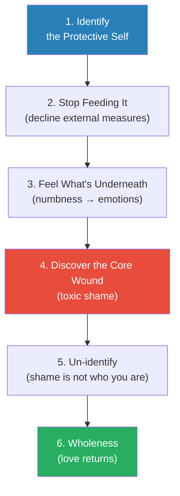
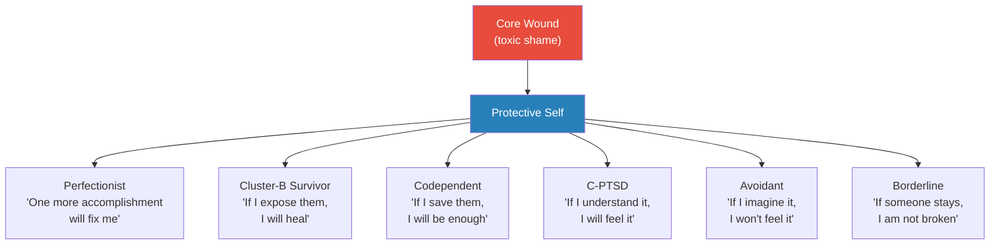
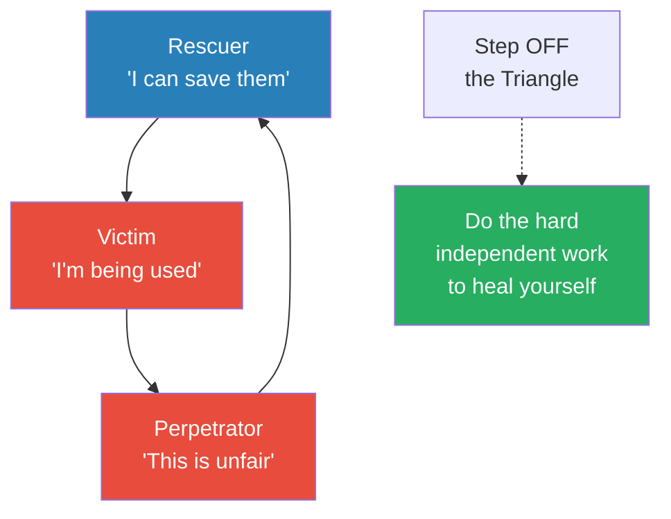
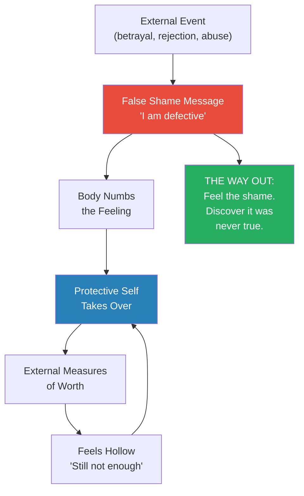
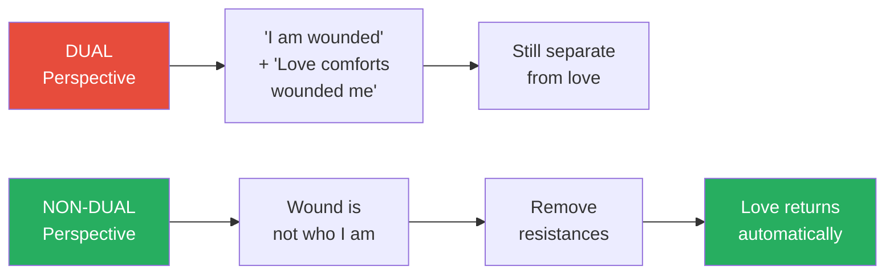
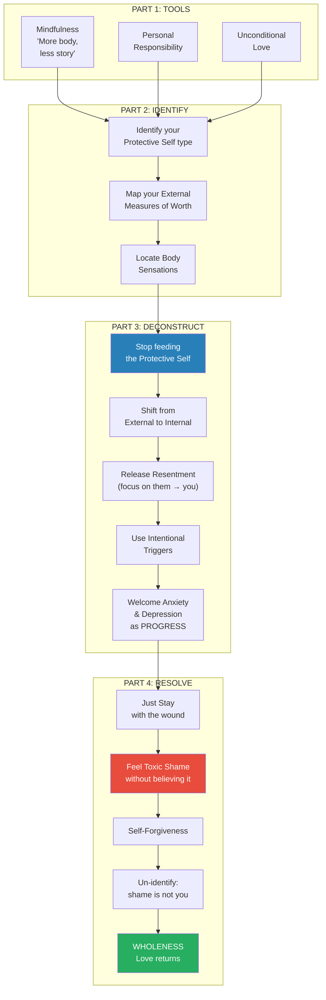

# Whole Again — Jackson MacKenzie

> *After toxic relationships and emotional abuse, a "protective self" forms — a defence mechanism that blocks you from feeling the core wound underneath. This protective self seeks external validation to prove you are NOT defective. But no amount of external validation reaches the actual wound — it just feeds the protective self. MacKenzie, founder of the 30,000-member Psychopath Free community and himself a survivor of narcissistic abuse, maps the entire journey from numbness to wholeness: identify the protective self, stop feeding it, feel what is underneath, and discover that the shame living in your body was never true. The book's radical claim is that conventional self-help, therapy, and even forgiveness exercises often FAIL — because the protective self hijacks the healing process itself.*

---

## About the Author

Jackson MacKenzie is a survivor-researcher, not a therapist. After his first relationship with a narcissistic partner ended, he spent five years with a constant "tight feeling" in his heart that no treatment could touch — talk therapy, CBT, EMDR, antidepressants, acupuncture, hypnosis, cardiologists, or special diets. He founded PsychopathFree.com, which grew into a community of over 30,000 members, and published the bestselling *Psychopath Free*. That first book helped people identify abuse; this one addresses what his community kept asking: "I understand what happened — so why don't I feel better?" MacKenzie spent years in private conversations with survivors of every type — codependents, Cluster-B abuse survivors, people with C-PTSD, borderline personality disorder, and avoidant personality disorder — tracking their progress and testing what actually worked. *Whole Again* is endorsed by Dr. Jerold Kreisman (coauthor of *I Hate You — Don't Leave Me*), Dr. Stan Tatkin (developer of PACT therapy), and trauma therapist Shannon Thomas.

---

## The Big Idea

- After toxic relationships, betrayal, or childhood abuse, a <b style="color: #e74c3c">false shame message</b> gets stored in the body — "I am defective and somehow caused this because I am inadequate / worthless / crazy"
- This message is so unbearable that the body <b style="color: #2980b9">numbs it out</b> — creating sensations of emptiness, tightness, hollowness, or boredom in the heart, stomach, or chest
- A <b style="color: #2980b9">protective self</b> then takes over to disprove and distract from the pain — seeking worth through accomplishments, people-pleasing, analyzing others, fantasies, substances, or rescuing
- The protective self is "who you are" — your default way of thinking, the lens through which you approach everything, including healing
- This is why <b style="color: #e74c3c">conventional self-help fails</b>: perfectionists use spirituality to become the "perfect spiritual person," codependents use forgiveness to take down all boundaries, C-PTSD survivors use analysis to "think" their way into feelings they cannot feel
- External validation — accomplishments, relationships, approval — <b style="color: #e74c3c">never reaches the actual wound</b>, because the protective self intercepts everything
- The only path to wholeness: <b style="color: #27ae60">stop feeding the protective self, feel what is underneath, and discover that the toxic shame was never true</b>

---

## Key Concepts at a Glance

| Concept | One-line summary |
|---------|-----------------|
| **The Protective Self** | A defence mechanism that hijacks healing by keeping you focused externally — on doing, proving, rescuing, or analyzing |
| **Core Wound** | The unbearable false shame message stored in the body: "I am defective / worthless / not enough" |
| **Toxic Shame** | Not "I did something bad" but "I AM bad" — installed by parents, partners, or trauma |
| **External Measures of Worth** | Accomplishments, approval, relationships, substances, fantasies — anything the protective self uses to stay alive |
| **Six Protective Self Types** | Perfectionist, Cluster-B Abuse Survivor, Codependent, C-PTSD, Avoidant, Borderline |
| **The Drama Triangle** | Karpman's Rescuer → Victim → Perpetrator cycle that keeps everyone distracted from their own wounds |
| **More Body, Less Story** | The core mantra — shift from analysing the story of what happened to feeling the sensations in the body |
| **Resentment as Protection** | Resentment keeps you focused on THEM so you never have to feel your OWN wound |
| **Intentional Triggers** | Deliberately entering uncomfortable situations to access the buried emotions the protective self avoids |
| **R.A.I.N.** | Tara Brach's mindfulness method: Recognize, Allow, Investigate, Non-identification |
| **Un-identifying** | The final step — realizing the wound is not who you are, so it does not need healing — it needs dismissing |
| **Self-Forgiveness** | Dissolves shame by removing the need to prove you are "good enough" — even your darkest fears are forgiven |

---

## At a Glance

- **The Problem:** After toxic relationships, a protective self forms that blocks you from feeling the core wound — and hijacks every attempt at healing
- **The Insight:** External validation (accomplishments, relationships, approval, even therapy) never reaches the wound because the protective self intercepts it all
- **The Method:** Stop "doing" and start feeling — identify your protective self type, stop feeding it external measures of worth, sit with the unbearable numbness until the real emotions surface, and discover the shame was never true
- **The Toolkit:** External Measures of Worth checklist, Body Sensations inventory, six protective self profiles, Karpman Drama Triangle, intentional triggers, R.A.I.N. mindfulness, self-forgiveness practice, "the llama meditation"

---

## The 30-Second Version

You survived something awful and your body numbed the pain to keep you functional. A <b style="color: #e74c3c">protective self</b> took over — seeking worth through accomplishments, rescuing, analysing, or fantasies. No matter how much you achieve or how many right books you read, something still feels hollow. That is because <b style="color: #2980b9">external validation never reaches the internal wound</b>. The wound is a false shame message: "I am defective." Healing requires stopping the external seeking, sitting with unbearable feelings, and eventually realizing the shame was never true. <b style="color: #27ae60">When you stop identifying with the wound, unconditional love comes rushing back — because that is who you actually are.</b>

---

## MacKenzie's Own Story: The Feeling in My Heart

*The book opens with MacKenzie's five-year struggle with a physical sensation that no treatment could reach — a story that becomes the book's emotional spine.*

- After his first relationship ended (a partner who cheated on him and replaced him immediately), MacKenzie developed a constant "tight, squeezing sensation" in his heart
- It was not painful or sharp — just numb, squeezing, present from the moment he woke up to the second he fell asleep, every single day for five years
- He tried everything:
  - Talk therapy, CBT, hypnosis, EMDR
  - Antidepressants, benzodiazepines, acupuncture
  - Cardiologists, endocrinology, thyroid tests, genetic tests
  - Special diets, vitamins, herbs, quitting coffee and alcohol
  - He even tried imagining the tightness as "a little boy hugging my heart" and asked him to hug less hard — nothing changed
- The feeling persisted, so he worked extra hard to seem "non-damaged":
  - Aced his courses, found a great job, started a website, started a non-profit, published his first book
  - He introduced himself on dates as a humble list of accomplishments
  - Brief bursts of approval when people complimented his success — but they never lasted
- Then he started spending time alone, drinking wine by the river, dreaming of new book ideas — fantasising about characters, imagining himself waging a battle between "bad people" (psychopaths) and "good people" (people like him)
- Hypervigilance set in: noticing when people walked too close behind him, feeling the supermarket closing in, irritable about sirens and crowds
- Anxiety and depression followed: insomnia, nightmares of a masked man hunting him, inability to breathe correctly
- At his lowest point, he told his mother: "I don't feel like a person anymore"
- She gave him Tara Brach's *True Refuge* — and on the earmarked page, he found a description of a woman with the exact same tight feeling in her heart
- He devoured the book, tried forgiveness exercises — and felt the tightness EXPLODE into unbearable pain:
  - "You are bad. You need to admit you are bad. Everything you do is bad"
  - He desperately longed for the old numbness — at least numbness was bearable
- The breakthrough: he realised this horrible "bad self" sensation was not NEW — it was an old wound un-numbing itself
  - His body had locked it away because it was too self-destructive to function with
- This time, instead of running: **he stayed**
  - Stopped writing, backed away from his website, stopped taking new projects
  - Dedicated every morning and night to meditation and prayer
  - Shifted from "how do I get rid of this feeling" to "what IS this feeling?"
  - Held his hand over his heart on morning walks
- After six months: "There is a new feeling in my heart. It's not numb, it's not tight, and it's not intolerable pain. It's a flood of light, tingly energy that runs through my body like a river and calms everything"

> [!tip] Core Insight
> MacKenzie's personal arc IS the book's thesis in miniature: external measures of worth (accomplishments, website, books, fantasies) → failed for five years → stopped feeding them → felt much worse → stayed with the pain → discovered the shame was not true → love returned.

---

## The 5-Minute Version

### How the Fracture Happens

*MacKenzie maps the five-step sequence from wholeness to the protective self — the mechanism underlying all the suffering this book addresses.*

- **Step 1:** You start out whole, able to freely love and receive love
- **Step 2:** You experience betrayal, trauma, abandonment, or rejection from a trusted person
- **Step 3:** A false internal shame conclusion forms from the external experience: "I am defective and somehow caused this"
  - This belief blocks you from your true self — your inner source of joy and the sense of being unconditionally loved
  - This is the <b style="color: #2980b9">Core Wound</b> (also called the False Core, the Narcissistic Wound, or Toxic Shame)
- **Step 4:** The body numbs the pain — manifesting as emptiness, tightness, hollowness, or boredom in the heart, stomach, or chest
- **Step 5:** A <b style="color: #2980b9">protective self</b> takes over to disprove and distract from the wound through external measures of worth

> [!tip] Core Insight
> Recovery is not about managing symptoms (the "buckets catching rain"). It is about fixing the hole in the roof — the false shame message stored in the body. Everything else (people-pleasing, perfectionism, mood swings, anxiety, depression, resentment) stems from that core wound.

### Why Conventional Healing Fails

- The protective self hijacks every healing approach:
  - Perfectionists turn spirituality into another accomplishment project
  - Codependents use forgiveness as an excuse to take down all boundaries
  - C-PTSD survivors "think" their way into feelings they cannot actually feel
  - Borderlines use therapy to seek sympathy, having "breakthroughs" that never last
- As Stephen Wolinsky writes: "Any treatment to try to heal or transform a False Conclusion is organized by the False Self"
- <b style="color: #e74c3c">The protective self IS the thing doing the analysing and healing</b> — which is why you run in circles

### The Path Out

*The journey is not linear — it takes months or years and involves feeling much worse before feeling better. But once the protective self is broken, there is no going back to the old numbness.*

---

## Part 1: The Three Foundation Tools

*Before addressing the protective self, MacKenzie establishes three tools that will be needed throughout the journey: mindfulness, personal responsibility, and unconditional love.*

### Mindfulness: Getting Comfortable with Discomfort

- Mindfulness is not clearing your thoughts — it is <b style="color: #27ae60">noticing what is going on in a non-judgmental way</b>
- The goal is not to stop thoughts or feelings you dislike, but to allow them to be there — building a friendly, curious relationship with whatever is inside you
- The core mantra of the entire book: **"More body, less story"**
  - The mind's default protective reaction is to focus on the story
  - Trauma survivors can repeat their story in crystal-clear detail — but none of it touches the body
  - Mindfulness shifts attention from the story to the sensations in the body
- Fear-based thinking creates an infinite loop: rigid analytical thinking → more rigid analytical thinking
  - Saying "Stop it, nasty thoughts" → frustration when they don't stop → more nasty thoughts
  - Being gentle with the thoughts breaks the feedback loop
- Everything is welcome — including the voice that says "This is stupid, it's fake, you're just trying to avoid the truth that you're bad"
  - That voice is exactly the one you need to get in touch with

> [!abstract] Key Feelings to Learn
> MacKenzie provides a vocabulary for the feelings that surface during this work:
> - **Inadequacy:** You are not enough; others are better than you
> - **Rejection:** You and your feelings are unwanted
> - **Unlovable:** No one could love you as you are
> - **Worthlessness:** You have no real value
> - **Guilt:** You have done something wrong
> - **Shame:** You (or your feelings) ARE wrong
> - **Powerlessness:** You have no control
> - **Emptiness:** You are not real, something is missing

### Personal Responsibility: Owning Your Healing

- The guiding principle: <b style="color: #27ae60">"My feelings are my own responsibility. The feelings of others are their own responsibility."</b>
- The protective self always believes the solution is external:
  - The codependent just needs to rescue one more person
  - The perfectionist just needs one more accomplishment
  - The Cluster-B survivor just needs their ex's new relationship to fail
  - The borderline just needs a knight in shining armour
- This is equivalent to "the heroin addict just needs a little more heroin, then they'll be happy"
- External validation will not make you happier — your personal happiness must be based on YOU

### Unconditional Love: The Foundation

- The mind has a scientifically proven negative bias — especially after trauma
- Negativity has "accidentally become our religion" — we are so convinced it is truth because that is what the mind wants us to think
- Unconditional love is not religious — it is the innate sense of being good, having purpose and joy for no external reason
  - A college student who scoffs at spirituality but feels no inherent "badness" is connected to their spirit
  - A spiritual person who dedicates their life to helping others but feels "not enough" is disconnected
- <b style="color: #e74c3c">Conditional love</b> says: "I receive love if I do good things"
- <b style="color: #27ae60">Unconditional love</b> says: "I am loved even (especially) when I stumble"
- The goal is to move from THINKING love to FEELING love — sitting without moving a muscle and feeling it flood through the body
- If your higher power convinces you to change jobs, reconcile with an abusive ex, or accomplish a new project — that is not a higher power, that is your ego enabling itself

---

## Part 2: The Six Protective Self Types

*MacKenzie identifies six common patterns the protective self takes. Overlap is normal — you may see yourself in more than one. Each type has a core wound, a protective strategy, and a characteristic way of hijacking healing.*

### The Six Types at a Glance

| Type | Core Wound | Protective Strategy | Hijacked Healing |
|------|-----------|---------------------|------------------|
| **Perfectionist** | Defectiveness ("something is wrong with me") | Prove worth through accomplishments, being "nice," perfecting appearance | Turns healing into another managed project; judges self for making mistakes |
| **Cluster-B Abuse Survivor** | Rejection / inadequacy ("I am not enough") | Obsessive analysis, hyper-vigilance, diagnosing others, "empath" identity | Focuses on the abuser instead of the wound; seeks external validation of story |
| **Codependent** | Worthlessness ("I am never enough") | Rescue others, people-please, over-give, absorb everyone's problems | Uses forgiveness to take down all boundaries; tries to be even MORE selfless |
| **C-PTSD** | Powerlessness / guilt ("everything is my fault") | Analysis, labelling, intellectual understanding, revenge fantasies | "Thinks" their way into feelings; equates forgiveness with "letting them win" |
| **Avoidant** | Rejection / humiliation | Emotional withdrawal, fantasy worlds, imagined characters | Tries to forgive everyone instantly; heals through fiction rather than feeling |
| **Borderline** | Abandonment / defectiveness | Oversharing, "favourite person," intensity addiction, dramatic crises | Constant "breakthroughs" that never last; uses therapists for validation |

*All six types share the same core mechanism: a wound too painful to feel, a protective self that blocks it, and external measures of worth that keep the distraction going. The label does not matter — the pattern does.*

### Looking for Patterns: The Infinite Loop

*Before diving into each type, MacKenzie asks readers to identify their own repeating patterns — the "movie" that keeps playing on loop.*

- Imagine life is a movie that keeps repeating — same characters, same storyline, same ending
- The characters do not know they are in a movie — they think it is reality
- What is YOUR role in this movie?
  - Are you the damsel in distress, always looking to be saved?
  - Do you keep ending up in abusive, unfulfilling relationships?
  - Are your days filled with endless drama and crises?
  - Do you always help people, only to end up unappreciated and resentful?
- Protective selves play roles with other protective selves:
  - If your role is the victim → you need a perpetrator and a rescuer
  - If your role is the rescuer → you need a victim to take care of
  - If your role is obsession with control → you need someone to dominate
  - If your role is the polite selfless listener → you need someone who never stops talking
- Wolinsky's critical insight: <b style="color: #e74c3c">"All False Cores reinforce themselves"</b>
  - They intentionally choose situations, people, and thoughts that CONFIRM the protective self's deepest fears
  - A codependent continues choosing emotionally unavailable people → reinforces "I am never enough"
  - A borderline fears abandonment → does things that make people abandon them
  - The protective self is keeping you stuck, setting you up for failure so it can stay in control
- To move forward: shift perspective from the eyes of the character to the eyes of someone WATCHING the movie
  - The characters will happily repeat the story forever
  - The viewer can explore why and how they do what they do — and eventually change the channel

---

### The Perfectionist

*MacKenzie opens Part 2 with the type most likely to seem "fine" on the outside — the high-achiever running on the hamster wheel of never-enough.*

- Perfectionists believe that if they do everything right all the time, they can finally be loved
- They introduce themselves as a humble list of accomplishments — describing what they have DONE, not who they ARE
- No matter how big the list becomes, they never feel insulated or worthy enough
- A nagging voice tells them each success was "too easy" or "not real" — that anyone could have done it
- <b style="color: #e74c3c">The core wound is defectiveness</b> — imposter syndrome is common, with a fear of being discovered as a fraud
- The protective self tries to prove the opposite: you are NOT defective, through accomplishments, being overly nice, or perfecting appearance

> [!example] Conversation with Sarah
> - Sarah is incredibly accomplished and always taking on new projects at work
> - She volunteers to lead everything because "no one else can be trusted to do it right"
> - She just finished a huge project her boss loved — but when congratulated, she says: "That's exactly the problem. I poured my heart into it, and now that it's over, I just feel numb again"
> - She has already volunteered for the next project, an even bigger one, plus running her volleyball league
> - When asked if the numbness is better when she works, she brightens: "It actually feels a lot better when I'm working. So maybe the solution is just to keep busy"
> **The lesson:** The protective self wants you to keep accomplishing so you never slow down — because slowing down means feeling the wound underneath.

**Sarah's homework:** Stop taking on new projects. When you get the urge to accomplish something newer and bigger, notice that urge and politely decline it. Sit with the numbness instead.

> [!warning] The Perfectionist Trap in Healing
> Perfectionists approach healing the same way they approach everything — as a managed project that must be done "right." They judge themselves for making mistakes in recovery, then judge themselves for being judgmental. The exit: learning to be more easygoing and humorous with the process. Healing is not about doing everything right — it is about accepting both the successes and the mistakes.

---

### The Cluster-B Abuse Survivor

*The survivor who has identified the abuser's disorder but still cannot feel whole — because understanding what happened is not the same as healing from it.*

- After Cluster-B relationships (with narcissists, sociopaths, or borderline partners), survivors feel disconnected from what once made life worth living
- Standard breakup advice ("time heals all wounds") does not apply — it is getting worse, not better
- Survivors rebuild identity through "empath" labels, personality quizzes, and hyper-awareness of others' moods
  - This hyper-awareness was a survival skill to predict the abuser's reactions — but it now makes every social interaction exhausting
- <b style="color: #e74c3c">The core wound is deep rejection and inadequacy</b>: "I am not enough. Others are better than me"
- The protective self keeps focus external — analysing the abuser, diagnosing psychopathy, seeking validation from communities
- <b style="color: #27ae60">Key insight: what happened had very little to do with YOU</b>
  - Cluster-B individuals are unknowingly lost in a never-ending quest to fill an internal void
  - They mirror your hopes and dreams because they don't have an identity of their own
  - No amount of your love can fill their void, because it is a void centred around a protective self
  - You were neither the "perfect saviour" of the idealisation period nor the "crazy partner" of the devaluation

> [!example] Conversation with Mel
> - Mel was dumped by a narcissistic man who replaced her with another woman in weeks
> - She cannot stop checking his Facebook page, looking for proof their relationship will fail
> - She takes on new identities as an "empath" and "highly sensitive person" — the opposite of him
> - She says: "I just wish he'd break up with the new girlfriend. Then I'd know I'm not crazy, and I'd be able to move on"
> - When asked if learning about psychopathy helps heal the void: "The void feeling is still there, but it's a lot less noticeable when I focus on that other stuff"
> **The lesson:** Focusing on the abuser's disorder is the protective self's way of keeping you distracted from your own wound. Understanding their psychology does not resolve your pain.

**Mel's homework:** Stop checking his Facebook page. Sit with the "void" feeling. Do not try to analyse it or form a story around it.

#### What If They're Not Cluster B?

- One of the most common questions: "Was he really a sociopath? What if I'm just saying that to feel better about myself?"
- Survivors ask this over and over because the alternative is the Cluster-B's reality: "You are crazy, jealous, sensitive, unwanted"
- So they oscillate between two realities: "bad other" or "bad self"
- The problem: your sense of self hinges on someone else being bad — this is not sustainable
  - It leads to analysing and judging everyone (including yourself), frustrated that people are not behaving the way they "should"
  - Underneath is the nagging voice: "What if it was all me? What if it's my fault?"
- If you try forgiveness without resolving this: you feel teleported back in time — cognitive dissonance, self-doubt, wondering if you should reach out to the abuser
  - Without the security blanket of "bad other," you are stuck with "bad self" again
- <b style="color: #27ae60">The question "What if they're not really Cluster B?" loses all significance when you love yourself regardless of the answer</b>
  - The healthy, pure love you find from this journey naturally guides you toward the same authenticity in others
  - "Sociopath" or "borderline" will not erase the shame — only unconditional love will do that

---

#### The Dog Who Wants to Be a Cat

- MacKenzie uses a vivid analogy to explain why no amount of love can fix a Cluster-B disordered person:
  - Imagine a dog who wants to be a cat — he runs around getting everyone to tell him he is a cat
  - When they tell him he is a cat, he feels validated and rewards them
  - But he still looks in the mirror and sees a dog — he hates the dog, cannot love the dog
  - He blames everyone else for failing to convince him he is a cat, and finds another hundred people
- <b style="color: #e74c3c">No amount of your love, validation, or sympathy will fix this issue</b>
- Cluster-B individuals never attached to you, despite all their sweeping words
  - They mimic attachment through seduction, flattery, and mirroring
  - They see "love" as receiving constant attention and adoration
  - This is what they give and what they expect in return
- When you understand the sheer magnitude of psychological damage required to cause these disorders, you stop wondering if the relationship could have worked

#### "But We Were So in Love"

- The "love" that Cluster-B individuals want is like the drug an addict wants — not love, but a constant source of external validation, reassurance, and attention
- MacKenzie distinguishes two types of love:

| Love Rooted in Narcissism | Real Love |
|--------------------------|-----------|
| You are perfect, flawless | Open to flaws |
| Constant communication is good | Independent |
| Adoration, praise, attention | Kind and humorous |
| Negative emotions unacceptable | All emotions welcome |
| Consumes your entire life | Freeing |
| Frantic and intense | Calming |
| Addictive | Patient and infinite |

- "All I want is love" sounds much cuter than "all I want is heroin," but when it comes to Cluster-B disorders, it is the same thing
- <b style="color: #27ae60">When you discover real love — the kind that comes from within — you will never again be interested in the "love" found in Cluster-B relationships</b>

> [!example] Conversation with Elliot
> - Elliot's borderline girlfriend accuses him of "taking a tone with her" when he calmly asks her to take out the trash
> - Within minutes she is yelling that he does not appreciate her and is "manipulating the situation"
> - When asked how HE feels, Elliot says: "I don't know anymore. Honestly, I don't have time to think about myself. Her problems are always so much more dramatic and important than mine"
> - He finally admits: "It just feels like a big ball of dread and numbness. It's honestly easier to focus on her problems"
> **The lesson:** When your entire focus is on someone else's drama, you have no attention left for the wound in your own body.

---

### The Codependent

*The caretaker who is so busy saving everyone else that they have completely abandoned themselves — MacKenzie's favourite type to work with, because they are "the most caring and compassionate people on the planet."*

- Codependents spend all their time thinking about others: anticipating needs, avoiding conflicts, doing everything right
- The same kindness they extend to others is NOT offered inward
  - They doubt their intuition, blame themselves when others misbehave, and feel crazy for having needs
  - <b style="color: #e74c3c">They feel responsible for EVERYTHING</b>
- Even when they do everything right, it is NEVER enough
- They stay in toxic relationships far longer than anyone else would — because they doubt themselves and feel guilty about standing up
- <b style="color: #2980b9">The core wound is worthlessness and "not enough"</b> — afraid of being rejected and abandoned
- The protective self tries to prove you ARE enough by taking care of others, playing therapist, rescuing, and people-pleasing

#### People Pleasing: Where It Comes From

- People pleasers typically come from high-conflict households:
  - A parent who always had to argue → child learns to sacrifice opinions to keep peace
  - A parent with anger issues → child learns to anticipate bad moods and calm them
  - A parent with addiction → child learns to manage another person's illness
  - A parent with borderline personality → child learns to soothe inappropriate crises
  - A parent with control issues → child learns to just do what they want
- The underlying theme: <b style="color: #e74c3c">people pleasers feel personally responsible for the mental and emotional well-being of others</b>

#### The Drama Triangle

*The Drama Triangle (Stephen Karpman, 1968) explains why codependents keep finding themselves in dramatic, toxic situations. The rescuer saves the victim → feels exploited → becomes the victim → resents the original victim → becomes the perpetrator → the cycle repeats. The only exit is stepping OFF the triangle entirely.*

- When we insulate someone from the consequences of their own behaviour, we deny them the chance to grow
- No matter how much the rescuer does, it will never be enough to cure the victim's inner issues
- <b style="color: #27ae60">"You're the only one who can save yourself"</b>

> [!example] Conversation with Tony
> - Tony dates and befriends people who need him — he believes his love can cure any problem
> - He is eternally nice, tipping far more than necessary "just to see a happy reaction"
> - He spends all night planning ways to fix his friends' problems — and has offered to pay off his best friend's student debt as a surprise
> - When asked about the "blocked up" feeling in his stomach and chest, he dismisses it: "It's not a big deal. It's just a stupid feeling, not the end of the world"
> - His focus is entirely on others: "These people need me because I'm giving them love and support they've never received before"
> **The lesson:** When every ounce of your energy goes toward saving others, you have nothing left for the wound in your own body. The "blocked up" feeling IS the wound — and it will not heal by being ignored.

**Tony's homework:** Stop playing therapist with others. Imagine what you would feel without the approval and appreciation of others. Sit with the "blocked up" feeling.

#### Guilt for Having Emotions

- Codependents have no problem with angry outbursts, weird quirks, or insecurities in OTHER people
- But if they have the slightest angry THOUGHT themselves, they immediately feel guilty
- Even when they finally gather the courage to talk about a toxic relationship with a friend or therapist, they feel guilty afterward and wish they had not
- <b style="color: #e74c3c">"You're afraid that you're ruining relationships by acknowledging reality"</b> — as if it is your responsibility to hide another person's unacceptable behaviour to keep the relationship afloat
- The truth: most of your relationships would not exist if you were not absorbing problems and pretending everything was fine
  - Your relationships work because you brush things under the rug — until one day you snap
  - Then your loved ones wonder what happened, because from THEIR perspective, everything worked fine
- Codependents' intuition is actually really good — the problem is, they doubt it
  - Their friends meet a person for a few hours and say: "They seem weird, I don't want to hang out with them" — easy for them, because they do not shame themselves for noticing negative qualities
  - The codependent noticed the same things but felt guilty, or was afraid to be alone, and stuck around for months or years of misery
- **Melody Beattie:** "We need to stop telling ourselves we're different for doing and feeling what everyone else does"

#### Codependents and Cluster-B Partners: A Magnetic Pull

- The combination makes perfect sense:
  - One person completely focused on their own needs (Cluster-B) + one person completely focused on the needs of others (codependent) = magnetic attraction
  - During the honeymoon phase: narcissists get constant adoration; codependents feel finally appreciated and valued
  - The narcissist quells the codependent's anxious inner voice by constantly offering approval and validation
- Then it goes sour:
  - Narcissists become increasingly selfish and hostile
  - Codependents implode, blaming themselves and trying harder
  - The narcissist says "it's all about you" or "you're so selfish" — and the codependent adds this to their growing list of self-doubts instead of recognising the blatant projection
- <b style="color: #27ae60">It is not your job to manage the emotions of others</b> — it is an exhausting role that offers temporary bursts of self-worth but ultimately drains the life from you

---

### C-PTSD

*The survivor whose analytical mind has become both their greatest strength and their prison — they can explain everything about the trauma except what they actually feel.*

- After ongoing abuse, C-PTSD survivors are "blasted into a world dictated by an overactive mind that is constantly analysing, obsessing, and ruminating"
- They may spend years repeating the story to others — but something inside still feels broken
- Fantasies of revenge and justice are common — reimagining the past where they stand up to the abuser
- They have learned to stop trusting their own feelings — so they "think" their way into everything
- <b style="color: #2980b9">The core wound is powerlessness and guilt</b> — "everything is my fault"
- The protective self tries to prove you DO have power, that you are NOT at fault — through analysis, labelling, diagnosing, and proving the abuser's behaviour was wrong
- C-PTSD may blast people in opposite directions:
  - Total lack of energy (depression, exhaustion, withdrawal)
  - False manic energy (creative, prolific, antagonistic, engaged in "grand battles of good versus evil")

> [!example] Conversation with Anna
> - Anna blogs about the man who abused her and fantasises about him being brought to justice
> - She wants to write a book: "A guidebook for empaths on how to survive and avoid evil"
> - She speaks about a "battle between good and evil" in the world
> - When pressed about the hollow feeling in her heart, she deflects: "What does that have to do with anything?"
> - MacKenzie points out that her grand battles and fantasies keep her focused externally — so the pain in her body stays numbed: "So you can feel WEIRD instead of BAD"
> - Anna finally admits: "It just feels hollow and numb"
> **The lesson:** The big-picture perspective — battles, causes, awareness missions — keeps the mind focused externally so the true pain in the body stays numbed out.

#### The Five Blame-Shifting Techniques

*MacKenzie catalogues the specific tactics that leave C-PTSD survivors with lasting resentment and powerlessness — essential knowledge for understanding where the wound came from.*

1. **Playing Victim:** You ask them to stop criticising you → they bring up something unrelated where YOU hurt THEM → you end up apologising
2. **Minimising Your Feelings:** You calmly express hurt → they laugh, dismiss, or ridicule: "You're too sensitive. Calm down!" → the blame shifts from their misbehaviour to your reaction
3. **Arguing About the Argument:** Every conflict becomes a metadiscussion about tone, semantics, and accusations of doing exactly what THEY are doing → your legitimate concern is never addressed
4. **Guilt Tripping:** You point out something hurtful → they start talking about their abusive childhood → you are now comforting THEM, even though they hurt YOU
5. **The Stink Bomb:** When caught blatantly, they throw an unfounded terrible accusation — "You abused me," "You cheated on me," "You're mentally ill" → your slam-dunk case is now a defence of yourself against wild accusations

- The temptation is to explain yourself, defend your name, prove your point — but <b style="color: #e74c3c">that is exactly what they want</b>
- Al-Anon's principle: "Don't JADE" — Justify, Argue, Defend, Explain
  - When you defend against a false accusation, you legitimise it by acknowledging it
  - The only response: stand up and walk away
- These techniques leave long-lasting feelings of resentment and powerlessness — the sense that there is no justice, that abusers can get away with anything
- <b style="color: #27ae60">"How to win against an abuser? Don't try to win"</b> — as soon as you engage in the win/lose mentality, you abandon your heart and forget what matters: vulnerability and love

#### C-PTSD vs. Borderline: Key Differences

*MacKenzie addresses the common confusion between these two conditions — essential because C-PTSD survivors often fear they have BPD.*

| C-PTSD | Borderline (BPD) |
|--------|------------------|
| Despises drama and conflict, to the point of being avoidant | May say "I hate drama" but it appears frequently — peace is uncomfortable |
| Seeks consistency and stability; "boring" is fine | Tends to sabotage consistency and stability |
| Avoids exes; happy with one romantic focus | Keeps exes around, even ones they called abusive |
| Gets along fine with coworkers and friends | Significant issues with coworkers and friends; repeated intense crises |
| Extremely hesitant to share emotions; seems calm when inner world is falling apart | Great difficulty containing emotions; bursts into tears or rage around near-strangers |

- Both share: mood shifts, guilt, low self-worth, feeling disconnected
- But BPD also involves: episodes of rage, self-harm, impulsiveness, unstable identity, unstable relationships, frantic avoidance of abandonment
- <b style="color: #e74c3c">Do not diagnose yourself with a personality disorder because of behaviour in the aftermath of trauma</b> — give yourself time to heal before determining if symptoms are anomaly or pattern
- If you are a codependent who has been in a Cluster-B relationship, you may worry you are a psychopath — your incessant guilt and fear IS the proof that you are not one

#### How to Win Against an Abuser

- MacKenzie gets this question constantly — his answer is always: **Don't try to win**
- As soon as you engage in win/lose mentality, you abandon your heart
- Recovery should not be about proving you do not care — presumably you cared deeply
- "You do not need anger or resentment to maintain No Contact. Self-love and vulnerability are far more effective motivators"
- <b style="color: #27ae60">"Winning and justice may be what your protective self wants, but love and authenticity is what your heart longs for"</b>

---

### The Avoidant

*The person so afraid of taking up space that they have retreated into imagination — pleasant to everyone, but living largely in isolation.*

- Avoidants are agreeable and polite, despising drama or conflict
- Their aversion to conflict comes at the sacrifice of boundaries — they end up surrounded by exactly the type of people who make them uncomfortable
- They make themselves smaller and smaller until they feel like "friendly robots"
- They project their feelings into fictional characters because it is easier to imagine other people having intense emotions than to feel them directly
- <b style="color: #2980b9">The core wound is rejection, specifically humiliation or ridicule</b>
- The protective self is quiet, polite, and agreeable — ensuring no one can humiliate them by constantly presenting a friendly face

> [!example] Conversation with a Therapist (MacKenzie's own experience)
> - MacKenzie describes his novel: a political thriller about a congressman's scandal, told through three characters
> - Annie (the ex-wife) lives alone with anger and revenge; Phil (the betrayed husband) deals with inadequacy; Stacey (the therapist) judges and diagnoses everyone
> - His therapist asks: "Were they inspired by your own anger and inadequacy?"
> - MacKenzie responds: "No. Like I told you, I'm happy. I don't have those kind of emotions"
> - The therapist suggests his body is expressing itself THROUGH his characters, even though he cannot feel the emotions himself
> - In the novel, Annie softens when she meets Phil, they fall in love, and they leave the judgmental therapist behind — "They're all parts of you," the therapist says
> **The lesson:** When we cannot feel our own emotions, they sometimes express themselves through creative work, fantasy, and imagination. The avoidant protective self keeps you in a fictional world so you never have to enter your own body.

---

### Borderline

*The most challenging protective self to penetrate — because the core wound was so painful that the body makes it almost completely inaccessible, masked by emptiness and boredom.*

- People with BPD suffer from deep abandonment wounds — they believe no one will ever want their true self
- The protective self cycles between idealisation (being "perfect" for others) and episodes of rage, shame, and self-loathing
- <b style="color: #e74c3c">The "Favourite Person" dynamic</b> is the biggest distraction from recovery:
  - The FP becomes the source of identity — obsessed with, mirrored, flattered
  - Devastated if the FP takes too long to reply to a text
  - Like heroin to a heroin addict — external obsessions ARE the drug
- The cycle of oversharing and rejection repeats endlessly:
  - Meet new person → get super excited → mirror and flatter → overshare trauma → person withdraws → feel abandoned → repeat
- <b style="color: #27ae60">MacKenzie does not coddle the BPD protective self</b> — because it is NOT who you truly are
- Validation and sympathy only strengthen the protective self's hold
- The BPD protective self reinforces itself by sabotaging relationships, then saying "See? Everyone always abandons you"

> [!example] Conversation with Linda
> - Linda bonds with others by sharing childhood trauma stories, seeking sympathy and comfort
> - She has a great boyfriend but is terrified he will leave — she needs constant reassurance
> - She bursts into tears at the start of conversations, rapidly shifting topics between Roger's texting, childhood bullies, shopping plans, and journaling discoveries
> - When pressed repeatedly about the "emptiness" in her body, she becomes impatient: "Here we go again with the emptiness. The emptiness is probably there BECAUSE of all these bad things that keep happening to me"
> - After a guided meditation, she finally reports: "The emptiness is in my stomach and my head. Just this empty void. And I have no idea what it is. It's mind-numbingly boring"
> **The lesson:** The protective self uses dramatic stories, crises, and emotional unloading to keep you away from the emptiness in the body. The emptiness IS the gateway to healing — but it feels boring, which is exactly why the protective self works so hard to avoid it.

#### The Favourite Person (FP) Dynamic

- The FP is a person the BPD individual becomes obsessed with — mirroring, flattering, caretaking, and idealising
- Not necessarily a romantic partner — can be a close friend or peer
- Those with BPD use their FP as a source for their own identity:
  - Spend most of their time thinking about this person
  - Offer gifts and favours, become devastated if the person takes too long to reply to a text
  - Become jealous if their FP makes new friends or takes on separate hobbies
- <b style="color: #e74c3c">The FP is the biggest distraction from BPD recovery — it is like heroin to a heroin addict</b>
- Can heroin addicts recover while actively using heroin? Of course not
  - For BPD, external obsessions ARE the drug — they need to be diminished to begin recovery
  - How can you find your true self when you are frantically modifying yourself to become someone else's "perfect" non-abandonable mirror image?

#### The Oversharing-Rejection Cycle

1. Meet a new person → get obsessively excited
2. Mirror and flatter them — things seem to go great
3. Trust is established → share past trauma, childhood issues, abusive exes (within hours, days, or weeks)
4. The person starts withdrawing
5. Try not to worry, practice DBT or mindfulness
6. Suspicions confirmed — they stop talking to you altogether
7. Conclude: "Everyone abandons me. This world hates emotions and vulnerability"
8. Complain to others about the latest abandonment → repeat

- Healthy individuals withdraw because they do not wish to play the rescuer role — this is not "abandonment," it is an adult making an adult decision
- Sharing trauma to bond is not healthy connection — it puts the other person in an impossible position:
  - If they are kind, it intensifies your infatuation
  - If they set boundaries, you feel abandoned
- <b style="color: #27ae60">When you stop looking for an FP and instead build a relationship with unconditional love from within, the external obsessions melt away</b>

#### Romanticising Mental Illness

- MacKenzie takes a direct stance: demanding others perceive your disorder in a certain way is a losing battle that distracts from recovery
- "If external love and acceptance cured personality disorders, they wouldn't exist anymore"
- People with BPD do not need cheerleaders or another "favourite person" — they need professionals who non-judgmentally hold them accountable, help them forgive inappropriate behaviour, challenge them to change, and help them dive into the emptiness underneath
- "There is hope for recovery, and just like with an alcoholic, it comes from the sufferer deciding: 'This is a serious problem,' NOT 'I'm special'"

---

### The External Measures of Worth Checklist

*MacKenzie provides a comprehensive list of external things the protective self relies upon. Any of these in moderation may be fine — but the protective self does not do moderation.*

| Category | Examples |
|----------|---------|
| **Achievement** | Accomplishing things, making money, perfectionism, workaholism |
| **Approval** | Attention seeking, sympathy seeking, approval seeking, validation seeking, social media |
| **People Focus** | Analysing people, diagnosing or labelling, being overly "nice," people pleasing |
| **Obsession with Others** | Obsessing about those who wronged you, exposing them, stalking |
| **Substances & Impulse** | Alcohol, stimulants, depressants, sex, overeating, undereating, reckless behaviour |
| **Fantasy** | Revenge fantasies, justice fantasies, fantasies of unlimited love, the perfect relationship, a knight in shining armour, rejecting the person who rejected you, excessive daydreaming |
| **Control** | Blame, resentment, rumination, saving others, being saved, creating crisis, creating drama, paranoia |
| **Flight** | Changing careers, moving constantly, impulsive behaviour |

**The homework:** Over the coming weeks, experiment with NOT doing the items you circled. When you stop, turn your attention to the internal bodily sensations.

---

### Body Sensations Inventory

| Body Location | Common Sensations |
|--------------|-------------------|
| Head, Throat, Neck, Shoulders | Pressure, tension, tightness |
| Chest, Heart | Tight, squeezing, constricted, aching, burning |
| Core, Stomach | Empty, void, hollow, hole, blocked up |
| Pelvis, Legs | Weak, deadness, numb |
| General | Numb, bored, tired, "can't explain it," missing, black hole |

---

### Other Protective Selves

*MacKenzie briefly identifies several additional types beyond the core six.*

- **Workaholic:** Uses endless projects and late hours as a badge of honour — the protective self scoffs at the idea of work-life balance because slowing down means facing the body's discomfort
- **Narcissistic Personality Disorder:** The protective self is obsessed with attention, image, and winning. It does not experience shame or remorse because those are numbed away. Its primary distraction tool is BOREDOM — constantly seeking new thrills and never slowing down. Even when trying to meditate, it sends persistent messages of ridicule
- **Paranoid:** Believes everything is a conspiracy — external battles against grand schemes keep the inner agitation from being felt. Anyone who tries to help is seen as part of the conspiracy. The protective self reinforces itself by being aggressive and cold, then when people react negatively, it proves "people are not to be trusted"
- **Blamer:** Constantly criticises everyone else but reacts badly to the slightest criticism. The ironic wound: they secretly believe THEY are to blame for everything — but the wound is buried so deep that all they do is project it outward

> [!tip] Core Insight
> "The labels are not who you actually are. They are who the protective self is." From this point forward in the book, MacKenzie asks readers to stop worrying about labels — because regardless of which type resonates, the underlying structure is identical: core wound → protective self → external measures of worth.

---

## Part 3: Deconstructing the Protective Self

*Once you have identified the protective self, the next step is to stop feeding it. This section covers the practical process of shifting from external to internal — and what to expect when the numbness starts to crack.*

### The Radio Station Metaphor

- Imagine you are listening to one radio station every day
- Trauma occurs, and your mind switches you to a different station to protect you from the pain
- The pain still exists on the old station — but your mind keeps you tuned to the "safe" station with an infinite list of distractions
- <b style="color: #2980b9">The protective self's promise: "If [external thing] just happens, then you will feel better"</b>
- This is the trick — it will keep you hungering for external measures of worth until you take back control
- You would not expect an alcoholic to recover while still drinking — you cannot expect progress while still relying on external measures of worth

### Beyond Numbness: The Highway Metaphor

*MacKenzie uses one of his most effective analogies to explain why you cannot access your own emotions.*

- Imagine your body as a highway where a fifty-car pileup occurred years ago
- The police blocked off that section and rerouted traffic — the detour becomes "normal"
- You forget there was ever a crash, but the detour is getting more and more congested
- This is what your body does with emotional trauma — it numbs the crash site and routes around it
- <b style="color: #27ae60">The numbness is actually where the true self is stored</b>
- To begin: meditate on the numbness and ask your body to allow you to experience what is there
  - Do NOT try to label or analyse the sensations
  - Do NOT tell yourself a story about the sensation ("This must be sadness about my mother")
  - You cannot "think" your way into feeling — it is about SLOWING DOWN your thinking

### Avoidant and Numbness: MacKenzie's Breakthrough with His Therapist

*In one of the book's most revealing passages, MacKenzie describes how his therapist finally broke through his avoidant numbness — by pointing to his fictional characters.*

- His therapist asks: "In the novel you're writing, you described characters dealing with inadequacy, rage, shame, self-doubt, judgment, and rejection. Those don't sound very cheerful!"
- MacKenzie responds: "I haven't felt those things myself"
- The therapist: "What if parts of your body are trying to express themselves through your characters, even if you're not feeling them yourself?"
- She then asks: "Your characters end the story how? Annie softens when she meets Phil — they fall in love and leave the judgmental therapist behind. They're all parts of you"
- She tells him: "Look at how hard your body and mind are working to protect you. I think that fact alone will start to soften your heart"
- When MacKenzie asks if he should stop listening to music (his gateway to fantasy), she says: "Your imagination is a great gift. Don't stifle it — redirect it. Use music and imagination on YOURSELF — imagine unconditional love being offered to you, in your body, in the present moment. Not a far-off fantasy"
- Her warning: "Be prepared for some very difficult emotions to surface"
- MacKenzie: "I would rather feel bad feelings than numbness"

> [!tip] Core Insight
> The avoidant protective self channels emotions into fictional characters, creative expression, and daydreaming — because experiencing those emotions directly feels too dangerous. The redirect is not to stop imagining, but to imagine unconditional love being offered to YOURSELF, right now, in your body.

---

### BPD and Numbness: The Hardest Redirect

> [!example] Linda Confronts the Emptiness
> - Linda says: "I'm starting to realise that I'm just not meant for this world. I have so much love to offer, but no one wants it"
> - MacKenzie redirects her from stories to the body — she is resistant: "Here we go again with the emptiness. I had so much I wanted to talk about today"
> - She closes her eyes and within moments is sobbing, telling stories about her abusive mother — convinced that is what her emptiness is hiding
> - MacKenzie gently interrupts: "The stories work you up into a frenzy, THINKING your way into extreme emotions that make it difficult to focus on the emptiness"
> - Linda: "This is so invalidating. It's just like my abusive mom"
> - MacKenzie: "I could offer you all the validation in the world, but I care for you. I don't think external validation is the key to feeling better. I want you to feel happy on your own, without my validation"
> - After minutes of silent meditation, Linda reports: "The emptiness is in my stomach and my head. Just this empty void. It's mind-numbingly boring"
> - MacKenzie: "Awesome. Just keep doing that meditation"
> - Linda: "God, you're annoying"
> **The lesson:** The BPD protective self will use emotional outbursts, trauma stories, and accusations of invalidation to avoid the emptiness. The emptiness — boring, void-like, seemingly meaningless — is the actual gateway.

---

### External to Internal: The Critical Shift

- The protective self tricks you into focusing ALL energy externally
  - Boredom and emptiness convince you to DO something to relieve them
  - Workaholics get new "ideas" for projects; codependents become consumed with "helping"
  - BPD sufferers are prey to a constant stream of tragic stories and impulses
- With mindfulness, learn to DECLINE the external focus
  - When you get the overwhelming urge to "do" something, notice it and decline
  - The worse you feel in the short term, the closer you are to the wound
- MacKenzie describes his own experience in detail:
  - At his peak, he was juggling: a full-time job, writing his third book, coordinating a mass migration to new website software for a forum with millions of visitors, and running a non-profit organisation
  - The website migration was perfect — traffic surged from 200 new posts per day to 2,000. Mission accomplished!
  - But instead of feeling better, he felt WORSE: "The numb feeling in my heart wasn't getting any better, even though I got exactly what I had fantasised about"
  - Rather than slowing down, his protective self said: "Upgrade the servers! Create more plug-ins! Help moderate another website! Become a CEO of a non-profit!"
  - Eventually he had a nervous breakdown — which turned out to be "the first good thing that had happened to me in a very long time"
  - He dialled back everything: no more writing, closed the website, dissolved the non-profit
  - When he got the urge to fantasise about a new project, he used mindfulness to quell those thoughts
  - <b style="color: #e74c3c">"The feeling in my heart got SO much worse. Without my old external measures of worth, my protective self was crumbling. As it dies, the underlying wound exposes itself. And it doesn't feel good."</b>

> [!example] Sarah Confronts the Internal World
> - Sarah reports she cannot even slow down: "If I slow down, I will lose everything I've worked for"
> - MacKenzie: "That is the protective self talking. It hangs on to this manufactured world for dear life, convincing you that if you stop giving it your full attention, something terrible will happen"
> - He warns her honestly: "I think you're going to start feeling pretty bad"
> - Sarah: "Way to sell it, Jackson!"
> - MacKenzie: "Imagine if you didn't have to try so hard. Imagine if you could just feel light and free in your own body, without being surrounded by any accomplishment"
> - Sarah sighs: "That sounds like bliss"
> **The lesson:** The perfectionist's worst fear — slowing down — is exactly what healing requires. The "bliss" of feeling light without accomplishment is what awaits on the other side of the pain.

#### The "Constant" — A Self-Correction from Psychopath Free

- In *Psychopath Free*, MacKenzie wrote about the idea of a "constant" — someone you can always rely on, who never disappoints, who serves as your baseline for healthy love
- He now recognises this was the protective self's greatest desire and distraction:
  - It keeps you constantly searching EXTERNALLY to set your INTERNAL gauge
  - It relies on another human being to be a perfect source of unconditional love — then wonders why nobody meets this impossible standard
  - It uses a person in place of your own intuition, keeping you hinged on the reactions of others
- <b style="color: #27ae60">The real "constant" is unconditional love from within — not from another person</b>

> [!tip] Core Insight
> As long as you feel any form of numbness, your protective self is still in charge. You are stuck in distraction mode. Once the protective self fails, it fails permanently — and then true healing can begin.

---

### Resentment: The Protective Self's Favourite Tool

*One of the book's most important chapters — resentment is not just an emotion, it is the protective self's primary mechanism for keeping you away from your wound.*

- <b style="color: #e74c3c">Resentment keeps you focused on THEM</b> — their behaviour, their injustice, their wrongness
- As long as you focus on "bad other," you are distracted from the pain of "bad self"
- This is not a conscious distraction — the manic, obsessive energy of resentment keeps you in a "high" state
- Grandiosity often follows: imagining big, sweeping things about yourself and your future
- What lives BEHIND resentment: shame, worthlessness, inadequacy, and sadness
- The protective self creates opposites:
  - Perfectionists secretly believe they are imperfect → prove they are flawless
  - Codependents secretly believe they are worthless → prove they are enough through giving
  - Borderlines secretly feel they don't exist → constantly try to prove their existence
  - Avoidants secretly believe they have no value → find it in fantasy
  - Sociopaths believe they are powerless → seek to dominate
- <b style="color: #27ae60">You cannot release resentment with your mind</b> — you cannot THINK your way out of it
  - You need the tool you do not have: soothing, love
  - Use rumination as an opportunity: next time you are ruminating, play the role of a friendly observer watching you ruminate

> [!example] Codependent and Resentment — Tony's Breakthrough
> - Tony reports having trouble with resentment — he realises he has been feeling "used and unappreciated"
> - He helped his ex with school, bills, rent — "I literally went broke because of her. She cheated on me"
> - MacKenzie tells him: "You're allowed to acknowledge when someone does a shitty thing. That's not being unforgiving"
> - Tony returns days later with crucial messages: "I'm frustrated because I think I deserve better. I noticed obvious red flags but kept trying to help. I am so sick of feeling like I'm never enough for people, but I'm the one who keeps wasting my time on people who are never happy"
> - MacKenzie: "You discovered some part of you saying 'I matter and I deserve better.' If you work with that message, the bitterness will subside on its own"
> **The lesson:** Resentment dissolves when you listen to what it is trying to tell you — not about THEM, but about YOUR needs that are not being met.

---

### Intentional Triggers

*Later in recovery, MacKenzie recommends deliberately entering uncomfortable situations — not to re-traumatise, but to access the buried emotions the protective self avoids.*

- Old definition of triggers: "This person did X, so they are the reason I feel bad. If they stop, I'll feel okay"
- New definition: <b style="color: #27ae60">"This person did X, which activated a pre-existing fear inside me. If I resolve that fear, then X will not impact me"</b>
- The moments you feel bad and shrink away from are the EXACT moments to lean into
- Examples of opportunities to use intentional triggers:
  - New date not interested in you
  - Person you care about not replying to texts
  - Old song or photo that reminds you of someone who rejected you
  - Thinking about the new person who "replaced" you
- Use R.A.I.N. (Recognize, Allow, Investigate, Non-identification):
  - Recognize when a new uncomfortable emotion surfaces
  - Allow it to exist rather than trying to make it go away
  - Investigate it with kindness — where in the body? what is behind the anxiety?
  - Un-identify with it: it is REAL but not necessarily TRUE

> [!example] MacKenzie's Intentional Trigger — Visiting His Ex's City
> - After his first relationship, MacKenzie disliked being in the entire city where his ex lived
> - When he visited, he got an indescribable dread — he would distract himself with music and fantasies until it passed
> - One day he decided to STAY with the feeling — his mind presented memories and stories about why he felt uncomfortable
> - He looked at the building where his ex had been seeing someone else during their actual relationship
> - The sensation behind the anger and jealousy was something more confusing: INADEQUACY
> - "Some part of me had decided that a person cheating on me was a direct result of my not being good enough. Because I was replaced so quickly and effortlessly, I was not enough as I was"
> - He had been desperately trying to disprove this inadequacy with all his accomplishments and people-pleasing: "Nobody can reject me if I'm successful and do everything perfectly, right? Ha"
> **The lesson:** The intentional trigger revealed the exact shame message the protective self had been running from for five years. Once named, it could be felt — and once felt, it could be released.

#### The Thorn Story

*MacKenzie tells a parable that crystallises the entire concept of triggers and the protective self.*

- A little girl gets a thorn prick in her side but does not know how to remove it — she puts a bandage on it
- When her mom hugs her, the hug pushes against the thorn — she resolves never to hug
- When she falls off the monkey bars, the sweater was not enough — she resolves never to play
- Eventually she wears so many layers she looks like an Eskimo in summer — safe from pain, but unable to live
- <b style="color: #27ae60">Triggers are our key back to the core wound — the thorn — so we can finally resolve what we are trying to hide</b>
- Once the thorn is removed, there is nothing left to hurt — she puts on a T-shirt, hugs her mom, and plays again

---

### BPD and Intentional Triggers: Finding the Real Trigger

> [!example] Linda Finds Her Real Trigger
> - MacKenzie asks Linda to think of an emotional trigger — she offers childhood stories of food being thrown at her, her mother screaming
> - He redirects: "Last time you mentioned Roger takes a long time to reply to texts"
> - Linda: "What does that have to do with anything? That's not as traumatising as my other stories"
> - But it LED her to go on a spending spree — an impulsive behaviour triggered by the discomfort
> - When she describes what it felt like waiting for his text: "My heart was burning. I thought he wasn't responding because he secretly wanted to break up with me, so I wanted to hurt him first. I even blocked his number so I could feel like I ignored him first"
> - MacKenzie: "You've found a REAL trigger. And like most triggers, it gave you an overwhelming urge to ACT on the discomfort. A shopping spree, or anything to make it go away"
> - Linda is embarrassed: "I can't tell you those things or you'll think I'm insane"
> - MacKenzie: "The next time you feel this same discomfort, instead of acting on it or being afraid of it, just STAY with it. Welcome it. It is the part of you that needs your attention the most"
> **The lesson:** The "big" trauma stories are often the protective self's distractions. The "small" triggers — a delayed text, a perceived slight — are the ones that bypass defences and reveal the actual wound.

---

### The Box: A Parable for Borderline Personality

*One of the book's most moving passages — a fairy tale that captures the entire BPD cycle in a single story.*

- A little girl's parents teach her messages that parents should never teach: "You don't matter. Your feelings are wrong. You are bad"
- An angel gives her a box: "Put those messages in here"
- She puts the messages in the box and the angel closes it — suddenly she does not hurt so much, but she does not feel good either: just emptiness, disconnection
- As she grows, more pain arrives (bullies, abusive relationships) — she puts it all in the box
- To avoid the emptiness, she fantasises about finding perfect love — copies other people so they will never leave
- But the same thing keeps happening, and the box starts to overflow
- She screams: "All I need is the perfect lover, and then I will be happy! But you keep sending me pain!"
- The angel appears in her dreams: "The world loves you. I love you. I am trying to burst open your box so you can feel the pain from long ago — and heal it. But every time I remind you of this pain, you feel betrayed and block it away"
- The angel continues: "I gave you the box because you were only a child and had no other way to cope. But you are an adult now. You can experience the pain inside, and find the true love on the other side"
- <b style="color: #27ae60">When the girl awoke, she looked down at the box and said: "Okay, I'm ready"</b>

> [!tip] Core Insight
> The box IS the protective self. The angel's message IS unconditional love. The "okay, I'm ready" IS the moment you stop running from your wound. MacKenzie wrote this parable for people with BPD, but it applies to every protective self type.

---

### Fear: Anxiety and Depression as Progress

- As you get closer to the core wound, expect the world to feel like it is closing in
- <b style="color: #27ae60">If you are experiencing depression and anxiety, you are actually making progress</b>
  - You are finally in touch with your body
  - You are no longer dissociated from your true feelings
  - Sleep disturbances and energy drops are the body regulating the protective self's false energy
- The protective self's last-ditch response: intrusive thoughts — your mind becomes a "total jerk" and intentionally tries to think of things that upset you
- Do not try to stop the intrusive thoughts — watch them non-judgmentally
- Leslie Temple-Thurston: "The fear is the warning sign on the gate that says do not go past this point at all costs! Fear is just the veil, designed to hold the boundaries of the ego in place"

---

## Part 4: Resolving the Core Wound

*The protective self is broken. You are face-to-face with the wound — guilt, shame, worthlessness, rejection. This final part maps the path from "feeling really bad" to wholeness.*

### Just Stay

- The protective self was always searching outwardly for solutions
- Now you have the rejected self that feels incredibly unbearable
- All you need to do is <b style="color: #27ae60">stay with it</b> — like you would with a wounded animal
  - Do not try to fix or save it
  - Slow down, offer love, sit with it
  - Like an ice cube, it will continue to melt and expose new parts of itself
- This can take months or years — there is no rush
- Expect energy levels to drop significantly, sleep to be disturbed, old coping methods to stop working
- What you are looking for is where your body or mind RESISTS this love

### Toxic Shame: The Core of Everything

*The deepest layer of the wound — and the reason the protective self exists at all.*

- Guilt is "I made a mistake." <b style="color: #e74c3c">Shame is "I AM a mistake"</b>
- Toxic shame is the internalised false message that we are not loved because we are personally defective
- The shame gets planted by external events from trusted people:
  - Abandoned after repeated efforts → "I can never do enough"
  - Blamed for everything → "It's all my fault. I must prove I am good"
  - Called crazy and abusive → "I am bad and need to hide my feelings"
  - Cheated on and replaced → "I must be inadequate. Others are better"
  - Shared trauma and was dismissed → "I am a liar. My experience isn't true"
- As long as we carry toxic shame, it is a literal struggle to exist in our own bodies
  - We are constantly thrashing about, like a fish out of water, desperately trying to get away from the unbearable sensation
  - No matter how much we distract, how much we run — our bodies are always with us, and so is the shame
- The shame operates like imposter syndrome: we always have this big secret we hope nobody discovers
  - We work overtime to hide our secret, masking it with external enhancements
  - We are constantly afraid others have figured us out
  - The only reason you feel like a fraud is because you are hiding an integral part of yourself from others AND yourself
- Leslie Temple-Thurston: "When the ego feels it has suffered a loss, the mental, emotional, and physical bodies contract and lose their light. This loss of life force brings up deep-seated fears that make it react with certain behaviours — the need to defend and protect itself from further loss"
- We carry this shame hoping to prevent it from happening again — but that is like hitting yourself with a frying pan every day to remember it hurts

> [!example] Avoidant and Toxic Shame — MacKenzie in Therapy
> - MacKenzie tells his therapist he is now experiencing "this constant gross feeling of rejection and inadequacy" — plus a mean, judgmental voice telling him it is all his fault
> - He realises the voice is his former "psychologist friend" — the one who told him the breakup was his fault: "How weird, like I've adopted it as my own inner voice"
> - "Even when I'm talking to you, I have her relentless voice that says I'm lying and I'm bad and I have to admit I'm bad"
> - The therapist reminds him of his novel: "The angry lady learned to relax and take care of the inadequate guy, and they left the judgmental therapist behind. They're all parts of you"
> - MacKenzie asks: "Do I need to heal the mean voice too?"
> - Therapist: "No. Your book had the right answer. You have to let go of shame. You have to leave it behind"
> **The lesson:** Toxic shame does not need to be healed or understood. It needs to be left behind — like a judgmental voice that was never yours to begin with.

*The infinite loop: shame → numbness → protective self → external seeking → hollow → more seeking. The only exit is through the shame itself — feeling it, and discovering it was a lie.*

### Self-Doubt: The Gaslighter's Legacy

- Gaslighting implants a constant self-doubting voice:
  1. The abuser provokes you
  2. You deal with it calmly, thinking the conflict is resolved
  3. They repeat provocations many, many times
  4. Eventually you react less calmly
  5. They victimise themselves: "Oh wow, you're so crazy/sensitive/mean!"
  6. You end up apologising for a onetime reaction, even though they hurt you repeatedly
- <b style="color: #e74c3c">The issue was not your reaction — it was the repeated abuse that led you to react</b>
- Gaslighting creates a false equivalency: "my abuse = your reaction"
- Mindfulness helps you become aware of this voice and realise it is not your own — it is the voice of an abuser

### Self-Forgiveness: Dissolving the Walls

- Shame comes from "bad self" — self-forgiveness dissolves shame because when all is forgiven, there is nothing left to be ashamed about
- This is NOT a get-out-of-jail-free card — your lessons and wisdom are not going anywhere
- The biggest obstacle: "What if it really WAS all my fault? Then I can't forgive myself!"
  - <b style="color: #27ae60">The whole point: even if your darkest fears were true, you are still forgiven and loved</b>
  - You do not need to prove yourself anymore — that is the power of unconditional love
- Shaming ourselves only causes MORE shameful behaviour — an infinite loop
  - Shame → feel terrible → act out → more bad decisions → more shame
  - Forgiveness breaks the cycle and starts a virtuous loop instead
- You did not ask for the protective self to take over — it was a physiological response made without your approval

#### The Virtuous Cycle of Self-Forgiveness

- Without self-forgiveness: shame → feel terrible → act out → more bad decisions → more shame → infinite loop
- With self-forgiveness: forgiveness → heart unlocks → behave in ways you are proud of → more forgiveness → virtuous cycle
- Self-forgiveness is not a onetime "breakthrough" — it is a practice repeated until it becomes a constant state of living
- Practice this whenever it feels right — do not force it
  - For a long time, your analytical brain will be in charge, trying to make connections and problem-solve
  - That is fine — the more the mind focuses on self-forgiveness, the more the body will start to catch up
- As the body catches up (which may take many months): waves of raw emotion — guilt, inadequacy, jealousy, shame
  - The old analytical mind will snatch back control, terrified of vulnerability
  - As you watch your mind try to take back control, the feelings only grow stronger
  - Eventually you see how much you are suffering from these walls — and sense something much better on the other side

#### Carl Jung and the "Unwillingness" Myth

- Jung wrote: "The foundation of all mental illness is the unwillingness to experience legitimate suffering"
- MacKenzie agrees with a caveat: "unwilling" implies a conscious choice
- With these conditions, you may have all the willpower in the world — but your body has decided to keep you out
- You must forgive yourself for this — so you can stop being at war with your own body
- "You didn't ask for the protective self to take over. This was a physiological response from your own body. Decisions were made without your approval or awareness"

---

### Forgiveness of Others

- Forgiveness is NOT:
  - Understanding the abuser's past and feeling sorry for them
  - Taking down all boundaries and reconciling
  - Pretending the abuse "wasn't that bad"
- Forgiveness IS:
  - Learning the lessons from the experience so you are not hurt that way again
  - Releasing resentment and betrayal because they have nothing more to teach you
  - An internal process of letting go — it has nothing to do with the other person
- <b style="color: #27ae60">You do not need anger or resentment to maintain No Contact</b>
  - Self-love and vulnerability are far more effective motivators
  - When you recover the soft place in your heart, you would never want to put it in harm's way

### Boundaries: The Natural By-Product of Self-Love

- Boundaries are not walls — they are the natural result of actually liking yourself
- When we care about the person inside us, we want what is best for that person
- Without self-love, boundaries are volatile:
  - You accept unacceptable treatment for a long time → your body says "No more!" → you lash out → people wonder what happened
- With self-love, boundaries are calm and consistent:
  - "It's okay, body. You can relax. I've got this now"
- The goal is not to remove all protection — it is to transform resentment's volatile protection into a <b style="color: #27ae60">loving guardian that actually cares for the heart</b>

> [!example] Elliot's Boundary Breakthrough
> - Elliot's girlfriend calls him a "pussy" and "pathetic bitch" for not doing the dishes correctly
> - For the first time, he calmly tells her she cannot speak to him that way — it is unacceptable
> - She cries and accuses him of being "just as abusive as she is"
> - He refuses to accept forgiveness for something he did not do and walks out
> - He reflects: "All my life I prided myself on being nice and compassionate. I still have those qualities, but I'm not interested in using them to fix people anymore. In the past, I would have doubted myself and apologised for something I never did"
> - "You never told me to 'run,' like everyone else. But you taught me to like myself. And now that I like myself, I can't tolerate being with someone who disrespects me"
> **The lesson:** Boundaries come naturally when you stop doubting your own worth. You do not need resentment to protect yourself — liking yourself is sufficient.

---

### Changing Life: What Happens When the Protective Self Dies

*As the protective self crumbles, the external life it built no longer makes sense — this section addresses the disorienting process of rebuilding from the inside out.*

- The protective self kept you on a constant quest for external things, convincing you "one more thing" would make you happy
- Without the protective self to satisfy, you probably do not want those things anymore — in fact, they feel draining
- MacKenzie describes his own experience:
  - At the peak: full-time job + writing his third book + mass website migration + CEO of a non-profit
  - After his protective self crumbled: he felt stressed and unhappy with all of it
  - He slowly dialled back: disabled new website registrations, made the site private, dissolved the non-profit
  - His morning walks changed from fantasising about accomplishments to meditating on the sensations in his heart
- <b style="color: #27ae60">"No matter what chaos we create for ourselves, it can always be rectified. It doesn't happen overnight, but it happens"</b>

#### How Each Type's Life Changes

- **Codependents:** Surrounded by needy people who depend on them — now that helping no longer provides self-worth, it becomes draining
  - People will try to restore the old dynamic through guilt-tripping, manipulation, and crisis-manufacturing
  - When you stop feeling attracted to people who need rescuing, relationships naturally become more fulfilling
  - You start selecting partners based on who they ARE, not who they COULD be
  - Pity is not the same thing as love
- **Cluster-B Survivors:** The intense, passionate relationship dynamic is no longer desirable
  - You start seeking consistency, stability, security, and authenticity rather than love-bombing
  - Your interest in analysing psychopathy fades — you no longer need to think about psychopaths all day to keep yourself safe
  - "What I want most for you is to never need any of my resources again"
  - When old wounds dissolve, new challenges no longer snowball onto existing pain — there is nothing for them to "land on"
- **BPD:** Impulsive life changes, spending sprees, and chaotic identity shifts start to calm
  - You realise you are content with stability — even if it is not your "dream job"
  - Rejection no longer triggers the inner wound — you can experience it without organising your life around avoiding it
  - Your true identity has been locked away by the protective self — as you do this work, you find the real parts of yourself that have been missing
  - <b style="color: #27ae60">"When you restore your own inner light, you no longer require the energy of others to feel alive"</b>
- **C-PTSD:** The biggest transition is a dwindling interest in suffering and trauma
  - The perpetrator who once seemed dominating is not on your mind anymore
  - You may feel ready for lighter things — a team sport, a pet, a loving relationship
  - It is easier to just laugh and have fun again, without thinking of past injustices

---

## The Final Shift: From Dual to Non-Dual

*MacKenzie saves his most radical idea for last — and it reframes everything that came before.*

### The Llama Meditation

- You can spend a lifetime trying to "heal" toxic shame, but this is not the best approach
- Toxic shame is a FALSE message absorbed from external events — it was never true
- If someone calls you a llama, you do not spend your life saying "I am NOT a llama." You already know you are not a llama — you dismiss it
- <b style="color: #27ae60">Toxic shame is equally untrue and goofy</b> — but much more sneaky and parasitic
- Instead of striving for "I am enough," DROP the belief "I am not enough"
- Author Robert Burney: "We use external things — success, looks, productivity — to try to cover up the personal defectiveness that we felt caused our hearts to be broken. And that personal defectiveness is a lie"
- Stephen Wolinsky: "You cannot heal a False Conclusion, because it is False. You must 'see' it as a False Conclusion and discard it. You can never overcome your False Core, you can only be free of it by realising it is not you"

### Un-Identifying with the Wound

*The dual perspective keeps you identified as "the wounded one" being helped by a separate love. The non-dual perspective dismisses the wound from your identity entirely — and love comes rushing back because it was always there, blocked by shame.*

- When we comfort the wound, we are accepting it as part of our identity — the "sufferer" being helped by a separate "love"
- But the core wound is NOT who we are
- When we let go of the tension and resistances in the body that arise from shame, unconditional love automatically comes rushing back
- It is not about declaring "I am love" — it is about letting go of what you are NOT
- "The sun is always there. You might not be able to see it on a cloudy day, but that doesn't mean it has gone away"
- <b style="color: #27ae60">Instead of a black hole absorbing external measures of worth, you become a source of light radiating outward</b>

### Whole Again

- The fracture is not like broken glass that remains cracked even when mended
- In Hindu traditions, the heart is called **anahata** — "unstruck"
- It is the BELIEF of brokenness that causes suffering — underneath is love, unstruck by any of this
- The protective self's greatest fear is unconditional love — because the last time you knew love, it was followed by chaos and rejection
  - And so the protective self was born not only to protect the wound, but to BLOCK the love
  - Love washes everything else away and allows us to return to our bodies in the present moment
  - We pre-reject ourselves constantly, hoping to beat others to the punch
- But unconditional love does not know or care about rejection — if you accept it as your identity, there is nothing left to fear
  - If someone harms you, it is a reflection of their demons, not your own — it does not stick to you because it is not who you are
- We must still take measures to avoid betrayal, set boundaries, and trust our intuition — but we can do this with a <b style="color: #27ae60">loving presence that wants the best for us, rather than clinging to tight resentment around the heart</b>
- <b style="color: #27ae60">None of the steps could have been skipped</b> — you could not have gone from numb to love, because the pain had to be un-numbed to find the love
  - In the time spent with the wound, you learned patience and compassion — not the saviour kind, but genuine understanding and empathy for the human condition
- The protective self looks back and thinks everything would have worked fine if everything just went right
  - But the universe conspires to ensure those things do NOT happen — because the protective self is destined to fail
  - All experiences, especially the failures, are responsible for bringing you to this exact moment
  - "Some of the world's greatest gifts are the opposite of what we think we want most"
- The unconditional love you developed throughout this journey grew stronger as you suffered more — so it could carry everything
  - It gave you faith when you had none; it deflects fear and self-doubt
  - It never stops loving you, even (especially) when you stumble
  - <b style="color: #27ae60">That is who you truly are: your Spirit</b> — the thing that locked away the pain long ago to protect you, and that you have now invited back home

### The Afterword: Angel

*MacKenzie ends the book with a story about his family's rescue cat — a final parable that mirrors the entire healing journey.*

> [!example] Angel the Rescue Cat
> - MacKenzie's family adopts a cat named Angel from a shelter — she had been in a hoarding situation for three years, mistreated, with a big scar on her arm
> - When brought home, Angel sprints under the couch — terrified of people, she tenses up and makes herself as small as possible whenever anyone approaches
> - MacKenzie picks her up and repeats: "It's okay, you're safe" — within minutes she calms, starts purring, flopping over, face-butting his hands
> - Over weeks, he builds pillow forts in every room so she has safe, confined spots — she immediately runs into them and relaxes
> - By Christmas, everything has changed: Angel wanders around the house like she owns the place, no longer needs pillow forts, does not even flinch when doors slam
> **The lesson:** In the presence of unconditional love and consistent kindness, we can let down our guard to tend to our wounds. The protective layers that once kept us safe become unnecessary — and our true self emerges.

- "No more pillow forts. Just the freedom to play around, be frisky, and snuggle. That's how it's supposed to be."

---

## The Healing Path: Complete Map

*The complete healing path from MacKenzie's four-part structure. Each stage builds on the previous one. The process is not linear — expect to cycle through stages multiple times over months or years.*

---

## Cross-References

| Book in Vault | Connection |
|--------------|------------|
| [[Complex PTSD - Pete Walker]] | Walker's 4F types map directly to MacKenzie's protective selves: Fight = Narcissistic, Flight = Perfectionist, Freeze = Avoidant, Fawn = Codependent. Walker focuses on the INNER CRITIC; MacKenzie focuses on the PROTECTIVE SELF — same mechanism, different names |
| [[Fawning - Ingrid Clayton]] | Clayton's fawning IS MacKenzie's codependent protective self — both describe the same pattern of over-giving, boundary collapse, and self-abandonment from different angles |
| [[Not Nice - Aziz Gazipura]] | Gazipura's "Nice Person" IS the codependent protective self — the compulsion to be liked at the cost of authenticity |
| [[The Gaslight Effect - Robin Stern]] | Stern's Stage 3 (depression/surrender) corresponds to the moment the protective self fully takes over after gaslighting |
| [[In Sheep's Clothing - George K. Simon]] | Simon explains the abuser's tactics; MacKenzie explains what happens INSIDE the victim after those tactics succeed |
| [[Children of the Self-Absorbed - Nina W. Brown]] | Brown's "positive revenge — living well" aligns with MacKenzie's "changing life from an integrated place" rather than from resentment |

---

## The Verdict

*MacKenzie has written the book that the recovery community was missing — the one that addresses what happens AFTER you identify the abuse.*

- **The book's greatest contribution** is the concept of the protective self hijacking healing. Most recovery books stop at identification: "You were abused, here is what they did, here is what it is called." MacKenzie goes further: "Now you know what happened — so why do you still feel broken? Because understanding is not healing. Your protective self has intercepted every attempt at recovery and turned it into another external measure of worth." This insight alone is worth the entire book. It explains why people can read every right book, attend years of therapy, and join every support group — and still feel hollow. The protective self is running the healing show, and the actual wound never gets touched.

- **The book's weaknesses** are worth noting. MacKenzie is not a therapist, and it shows in places where clinical precision would help — particularly around BPD, where his directness occasionally tips into bluntness that could feel dismissive to someone in crisis. His spiritual framework (unconditional love, higher powers, "the universe conspiring") will alienate readers who want evidence-based methodology, despite his genuine effort to offer secular alternatives. The conversations with Sarah, Mel, Tony, Anna, and Linda are illustrative but somewhat idealised — real recovery is messier and less linearly progressive than these vignettes suggest. And the book's central mechanism (feel worse to get better) needs the safety net of professional support that MacKenzie acknowledges but cannot provide.

- **Who benefits most** are survivors who have already done the identification work — they know what Cluster-B disorders are, they understand what happened, they have read [[In Sheep's Clothing - George K. Simon]] and [[Complex PTSD - Pete Walker]] — but they still feel that tight, numb, hollow sensation. They have been running on the hamster wheel of analysis and external validation, and they are finally ready to ask: "What is actually underneath all of this?" If you are in the early stages of leaving an abusive situation, read [[The Gaslight Effect - Robin Stern]] and [[In Sheep's Clothing - George K. Simon]] first. Come to MacKenzie when you are safe, stable, and asking: "Now what?"

- **How it compares**:
  - Pete Walker's [[Complex PTSD - Pete Walker]] provides the clinical map of WHAT is happening inside the trauma survivor — the 4F types, the inner critic, the emotional flashbacks
  - MacKenzie provides the experiential map of HOW to move through it — stopping the external seeking, sitting with the unbearable, and discovering the shame was never true
  - Walker is the diagnostic manual; MacKenzie is the field guide for the journey through the darkness
  - Together, they form arguably the most complete recovery toolkit in the vault
  - Where Walker gives you the "13 Steps for Managing Flashbacks," MacKenzie gives you the radical instruction to stop managing and start feeling
  - Ingrid Clayton's [[Fawning - Ingrid Clayton]] zooms in on the codependent mechanism that MacKenzie covers as one of six types
  - Aziz Gazipura's [[Not Nice - Aziz Gazipura]] provides the assertiveness training that MacKenzie's codependents desperately need but that this book does not offer in practical detail
  - Robin Stern's [[The Gaslight Effect - Robin Stern]] explains the process by which gaslighting wounds are installed; MacKenzie explains what to do once they are there
  - George Simon's [[In Sheep's Clothing - George K. Simon]] maps the abuser's tactics; MacKenzie maps the aftermath inside the victim
  - Read them all, in the order that matches where you are in your journey — but understand that MacKenzie's book is the one that finally asks you to stop reading and start feeling
