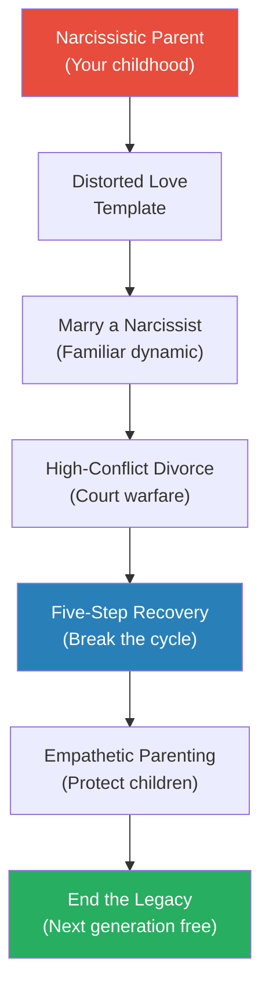
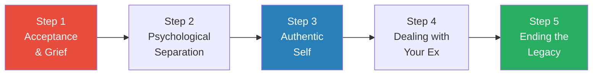

# Will I Ever Be Free of You? — Karyl McBride

> Karyl McBride's first book told adult daughters of narcissistic mothers that their pain was real. The thousands of letters that followed asked a question she had not anticipated: "I married one too — now how do I get out?" This book is the answer. McBride — a therapist with thirty-plus years' experience, forensic interview expertise, and courtroom testimony behind her — walks you through the legal minefield, the emotional warfare, and the recovery process of divorcing a narcissist. Her central warning: the court system assumes both parties share blame in a high-conflict divorce, but when one partner is a narcissist, that assumption is dangerously wrong. One person can single-handedly create all the conflict. Your job is to protect yourself and your children, and this book gives you the professional toolkit, the emotional strategies, and the five-step recovery model to do exactly that.

---

## About the Author

Dr. Karyl McBride is a licensed marriage and family therapist with over thirty years of clinical experience specialising in narcissistic families. Her first book, *Will I Ever Be Good Enough? Healing the Daughters of Narcissistic Mothers*, became a quiet phenomenon as readers worldwide recognised their own families in its pages. McBride's practice includes forensic interviewing, expert-witness testimony, and extensive interaction with the court system, attorneys, judges, law enforcement, and social services. She has conducted research on how narcissism in families affects children and adult relationships. This second book extends her work from the parent-child dynamic to the spouse-to-spouse battlefield.

---

## The Big Idea

- <b style="color: #2980b9">Narcissists cannot love</b> — they place primary importance on "what you can do for me" and expend enormous energy on appearances
- A relationship with a narcissist follows a predictable arc: whirlwind seduction → gradual revelation → total consumption of your identity
- The biggest risk factor for marrying a narcissist is having been raised by one — it creates an unconscious compulsion to "make this person love me" in a way your parent never could
- Divorcing a narcissist is categorically different from a normal divorce because narcissists <b style="color: #e74c3c">cannot compromise, cannot see the other person's perspective, and will weaponise children</b>
- The court system's assumption that "it takes two to tango" is wrong — one narcissist creates all the conflict while the other parent scrambles to protect the children
- <b style="color: #27ae60">Recovery requires a five-step model: Acceptance & Grief → Psychological Separation → Authentic Self → Dealing with Your Ex → Ending the Legacy of Distorted Love</b>

The intergenerational cycle of narcissistic abuse: raised by a narcissist, you unconsciously marry one, and only through deliberate recovery can you break the chain for your children.

---

## Key Concepts at a Glance

| Concept | One-line summary |
|---------|-----------------|
| **The 9 Traits of NPD** | Grandiosity, fantasy, specialness, admiration-hunger, entitlement, exploitation, lack of empathy, envy, arrogance |
| **Three Stages of Relationships** | La-La Land → Move to the Country → Mature Love — narcissists never reach Stage Three |
| **The Ten Stingers** | 10 relationship dynamics from being raised by a narcissistic parent that set you up for marrying one |
| **Narcissistic Injury** | Narcissists never get over perceived rejection — they hold grudges indefinitely |
| **Projection** | Attributing their own intolerable feelings to you — "You are the one who is jealous/cheating/angry" |
| **The 50-Question Checklist** | Self-assessment to determine if your partner is a narcissist |
| **Parallel Parenting** | Not co-parenting — disengaging emotionally while maintaining boundaries |
| **The Five-Step Recovery Model** | Acceptance & Grief → Psychological Separation → Authentic Self → Dealing with Ex → Ending Legacy |
| **Double Duty Parenting** | The non-narcissistic parent must parent for two — the narcissist cannot provide emotional attunement |
| **The AIMS Pilot Project** | McBride's proposed court reform using a therapeutic team approach |

---

## Part One: Recognizing the Problem

### Chapter 1 — Am I in a Relationship with a Narcissist?

*McBride brings the nine DSM traits of narcissism to life through vivid client stories.*

**The 9 Traits of NPD (with Relationship Examples):**

1. <b style="color: #2980b9">Grandiose sense of self-importance</b> — exaggerates achievements, expects recognition without accomplishments
   - Jackie, a finance executive, expected the family to organise all activities around her
   - She reminded everyone constantly how smart she was — "They would be bankrupt without her!"
   - Everyone in her orbit was clearly beneath her

2. **Fantasies of unlimited success, power, brilliance, beauty, or ideal love**
   - Paul would call real estate agents on holiday pretending to be a wealthy investor
   - "We really need a property with a private landing strip"
   - His income was middle-class; his fantasy life was billionaire

> [!example] Paul and the Real Estate Agents
> - On every vacation, Paul called local real estate agents pretending to be in the market
> - He presented himself as a wealthy investor needing properties with private landing strips
> - His wife Vicky felt embarrassed and ashamed to be deceiving strangers
> - His income was middle-class but his persona was unlimited
> **The lesson:** Narcissists live in a fantasy world of status and superiority — and they will drag you into maintaining that fantasy.

3. **Believes he or she is "special" and unique** — can only be understood by other special people
   - If a judge rules against them, the judge is "stupid"
   - McBride observed a woman yelling at a judge, "You are just ridiculous. I am going to get a new judge!" — surprised when security removed her

4. **Requires excessive admiration**

> [!example] Julia's Staircase Entrance
> - Whenever the family was going somewhere special, Julia would always be the last one dressed
> - The whole family would gather impatiently in the hall
> - Julia would make her entrance, coming down the stairs, preening and turning
> - She was waiting for everyone to go "Oooooooooh" and "Aaaaaaaaah"
> - The kids and her partner went over-the-top admiring her — they knew they were not leaving until she got the admiration she wanted
> **The lesson:** The narcissist's need for admiration is not vanity — it is a compulsion that holds everyone hostage.

5. **Sense of entitlement** — expects automatic compliance from others
   - Marcy felt entitled to pay less and demand more from her law firm
   - She refused to speak with paralegals, demanded only the attorney
   - Her favourite saying: "I will demand attention and be heard immediately, and if you don't believe me, just watch"
   - Her lawyer dropped her right before proceedings began

6. <b style="color: #e74c3c">Interpersonally exploitative</b> — takes advantage of others to achieve own ends

> [!example] Jeff and His Daughter as Accessory
> - After divorce, Jeff realised "there is nothing that makes a single man more attractive to women than walking around looking like a devoted father"
> - He insisted his three-year-old daughter dress in upper-class clothes for late-night restaurant outings
> - When she became ill while visiting him, he checked into a hotel so the staff would clean up after her vomiting
> - Jeff felt that he should not have to do this — his daughter was a prop, not a person
> **The lesson:** To a narcissist, children are accessories — valued for the image they project, not for who they are.

7. **Lacks empathy** — unwilling to recognise or identify with the feelings of others

> [!example] Peter's Secretary's Cancer
> - Peter came home and said: "You know how my secretary has that bad breast-cancer gene? Well, she's finally been diagnosed with breast cancer."
> - His reaction: "I can't believe this is happening to ME. My business cannot handle this right now!"
> - He was unable to process another person's life-threatening illness except through the lens of personal inconvenience
> **The lesson:** Narcissists view every situation through one lens: what does this mean for ME?

8. **Often envious or believes others are envious**
   - Beth could not enjoy her husband Brian's career success
   - His law firm threw a party to celebrate a hard-won trial victory
   - Right before leaving, Beth decided to stay home: "I have better things to do!"
   - She told Brian: "You couldn't have done it without me. I don't have time to do that for you."

9. **Shows arrogance** — haughty behaviours or attitudes
   - Jake attended his son Mick's parent-teacher conference
   - When the teacher praised Mick's math scores, Jake interrupted: "I can see where he gets his brilliance! I was always a star in mathematics. This kid gets his smarts from his dad."
   - The teacher was trying to give Mick the experience of being praised; Jake made it about himself

> [!tip] Core Insight
> These nine traits describe why narcissists cannot love. They place primary importance on "what you can do for me." In a relationship with a narcissist, you will eventually realise that this person does not see the real you. You are an object to be manipulated for their goals and needs.

---

### The 50-Question Partner Checklist

- McBride provides 50 yes/no questions to assess your partner's narcissism
- Key questions include: Does your partner blame everyone but themselves? Are they unable to tune in to your or your children's feelings? Do you feel "not good enough"? Do they lie? Manipulate? Tell different people different stories?
- The more questions you check, the more likely your partner falls on the narcissism spectrum
- <b style="color: #e74c3c">Narcissists are good at training you to doubt yourself — the checklist may be a shocking reality check</b>

> [!example] Jeff's Store Window Reflection
> - Jeff had been partnered with Larry for eighteen years
> - Walking down the street, he noticed a stylish young man with good hair and tailored clothes
> - He admired the man's subtle and thoughtful style
> - Then he realised he was looking at his OWN reflection in a store window
> - Larry had made him feel so ugly that he did not recognise himself
> **The lesson:** Narcissistic partners distort your self-image so completely that you cannot see who you actually are.

---

### Is It Narcissism or Something Else?

- Narcissism can be confused with other conditions — most notably Asperger's syndrome
  - People with Asperger's are not as sensitive to emotional cues but do NOT mean to hurt others
  - Narcissists generally KNOW when they are hurting someone and do not care
- McBride shares a story from Dr. Mark Gouldston: a father with Asperger-like features came with his daughter to his office
  - When the daughter became distressed, the father looked bewildered, then started to cry
  - "My little girl is in awful pain and I think I somehow caused it. But I love her"
  - He empathised — something narcissists are incapable of doing
  - He perceived he was responsible for her distress — narcissists do not feel accountable
- People who are sociopathic, psychopathic, or abusive are extreme examples of narcissism
- <b style="color: #2980b9">Narcissism is a spectrum disorder</b> — ranging from a few narcissistic traits to full-blown NPD
- The APA estimates NPD manifests in less than 1% of the general population — but McBride believes it is much more common
- Twenge and Campbell: "Nearly 1 out of 10 Americans in their twenties has experienced symptoms of NPD"

---

### Chapter 2 — This Is Not the Person I Married

*Everyone can be duped by a narcissist — the question is why YOU were particularly vulnerable.*

**Three Stages of Relationships:**

1. **La-La Land** — the romantic whirlwind of falling in love
   - Senses are flooded; everything is dreamy; you are not even hungry
   - If fear arises, you ignore it — you discount intuition and refuse to see red flags
   - Although this period is highly sexual and makes you feel vulnerable and important, you do not gain true emotional intimacy

2. **Move to the Country** — reality sets in and power struggles emerge
   - Normal couples negotiate through this stage — they learn to accept each other's differences
   - <b style="color: #e74c3c">Narcissists cannot do this</b> — they escalate, manipulate, and demand compliance
   - The narcissist's charm evaporates and is replaced by control
  - Power struggles that normal couples resolve through compromise become permanent warfare

3. **Mature Love** — where healthy couples arrive after working through conflict
   - Built on mutual respect, acceptance, and genuine emotional intimacy
   - Narcissists NEVER reach this stage — they are incapable of the vulnerability it requires

---

**Who Is Most Vulnerable?**

- <b style="color: #2980b9">The primary risk factor: being raised by a narcissistic parent</b>
  - Children of narcissists learn that love is about "what I can do for you" or "what you can do for me"
  - They grow up with crippling self-doubt and a feeling of not being good enough
  - Subconsciously: "If my own mother or father could not love me, who will?" becomes "I am going to make sure this person loves me"
- Other risk factors: past failed relationships, loneliness, low self-esteem, body-image issues, dating too early after last relationship, valuing materialism over emotional honesty

**The Ten Stingers — Legacy of a Narcissistic Parent:**

1. You constantly attempted to win your parent's love, attention, and approval — but were never able to please
2. Your parent emphasised "how it looks" rather than how it feels
3. Your parent showed jealous tendencies toward you
4. Your parent did not support your healthy expression of self
5. It was always about the narcissistic parent
6. Your parent was unable to empathise
7. Your parent could not deal with feelings
8. Your parent was critical and judgmental
9. You were treated more like a peer than a child
10. Your family had no healthy boundaries; you had little personal space or privacy

- <b style="color: #e74c3c">Raised amid these dynamics, you grow up feeling unimportant and unlovable</b>
  - Your feelings were not validated — you learned to doubt yourself
  - Can you see how this would set you up to fall into the arms of the familiar narcissist?
  - And why you may not have trusted the red flags that were screaming at you?

**Other Vulnerability Factors:**
- Past failed relationships
- Loneliness and isolation
- Low self-esteem and body-image issues
- Starting to date too early after a previous relationship
- Seeking status from relationships
- Valuing materialism over love, respect, and emotional honesty

---

### The Difference Between Narcissism and Asperger's

- People sometimes confuse narcissism with Asperger's syndrome because both involve reduced sensitivity to emotional cues
- The critical difference: people with Asperger's do not mean to hurt others and FEEL distress when they learn they have
- Narcissists KNOW they are causing pain and do not care
- A parent with Asperger's will say: "I am so sorry I hurt you. I didn't realise."
- A narcissistic parent will say: "You're too sensitive. That's YOUR problem."

**The Healthy Relationship Checklist:**

- McBride provides 15 criteria for evaluating a potential partner
- Includes: Is this person kind? Committed? Capable of empathy? Do they bring out the best in you? Are they authentic?
- <b style="color: #27ae60">The checklist deliberately excludes looks, wealth, career, and status — the very things narcissistic culture trains you to prioritise</b>
- McBride specifically instructs: "Throw out the old criteria of how we choose partners"
  - Forget "Is this person gorgeous?" or "Does this person drive a cool car?"
  - Instead: "Is this person kind? Does this person bring out the best in me? Is this person authentic?"
- The client who described it best: "I was so falling in love with this guy. One day, walking down the street, a truck driver leaned out and yelled, 'Hey lady! What's the secret? Why are you so happy?'"
  - That feeling — unselfconscious, visible joy — is what a healthy relationship produces
  - If you have never experienced it, that is what you are working toward

---

### Why Todd and Suzie Finally Understood

> [!example] Todd's Painful Realisation
> - Todd struggled to keep his voice steady: "It is just so hard for me to realise that my wife is not capable of love"
> - "Our whole relationship was a farce. How could I have not seen it?"
> - "It hurts me so much for our children as well. She can really never be the mother they need."
> - "None of our emotional needs were met, and I am just now understanding this."
> **The lesson:** The moment of recognition — that your partner CANNOT love — is devastating, but it is the beginning of freedom.

> [!example] Suzie's Wedding Day Revelation
> - Suzie noticed early that her husband would exaggerate stories and was often obnoxious to service workers
> - "There seemed to be something missing in him. There wasn't a soul of deepness to him."
> - "He would fake this charming cuteness"
> - On their wedding day: "His body was turned to face all the people in the audience. I whispered to him that he was supposed to be looking at me."
> - "He thought he was on a damn stage."
> **The lesson:** The narcissist's wedding day is a performance for an audience — the bride or groom is just another prop.

---

### The Bait and Switch — Client Stories

*McBride's clients describe the same pattern: a whirlwind romance followed by a complete personality transformation.*

> [!example] Mary Beth and George the Musician
> - George was fun and nurturing during courtship — he helped Mary Beth heal from a car accident
> - But soon after marriage, everything changed — if they were doing things HE enjoyed, he was happy; otherwise, cold
> - When their first child was born, George believed Mary Beth only cared about the baby
> - He became quick to anger, punching holes in walls and breaking things
> - He started having affairs; they tried three different counsellors — George did not like what any of them said about him
> - One night a fight got physical and Mary Beth ended up in the hospital
> - After she filed for divorce, George hacked her email and Facebook, placed a webcam in the house, and hired a private investigator
> **The lesson:** The charming courtship persona was never real — it was a performance designed to secure supply.

> [!example] Nancy and Chad — The Father's Warning
> - Nancy had a gut feeling before the wedding that something was not right
> - On her wedding day, she mentioned reservations to her father
> - Her father stopped in his tracks: "Nance, if you want to call this off, I will go in there and explain to everyone. You can take my car and leave right now."
> - Nancy did not call it off — but later wished she had
> - Chad turned out to be a narcissist who controlled every aspect of her life
> - Her greatest regret: having two children with someone who does not know how to love them
> **The lesson:** Trust your intuition — and the intuition of people who love you. The red flags visible before the wedding only multiply after it.

> [!example] Steven and Sherri — The Beautiful Wreck
> - Sherri was gorgeous, sexy, fun, and smart — life was good until they married
> - After marriage, Sherri began drinking more and demanding more attention
> - When pregnant, she obsessed about getting fat and relapsed into bulimia
> - She did not want to breast-feed because it was "not sexy"
> - She developed anorexia and began drinking heavily
> - Steven came home to find his toddler wandering the house while Sherri was passed out on the couch
> - He filed for divorce that day
> **The lesson:** Narcissistic partners may have comorbid issues (addiction, eating disorders, body-image obsession) that intensify after the "performance" phase ends.

---

### The Internalized Messages

*In narcissistic relationships, you internalise false beliefs about yourself.*

- The most common internalized messages from a narcissistic partner:
  - I feel unlovable
  - I feel never good enough
  - I feel empty
  - I have crippling self-doubt
  - I feel valued for what I do rather than for who I am
  - I don't trust my own feelings
- <b style="color: #e74c3c">All of these can get triggered when dealing with a narcissist — causing depression or anger</b>
- If you internalised self-doubt from your upbringing, when insulted by your narcissistic ex, you doubt yourself again
- If you felt unlovable growing up, it is easy to believe that no one can love you
- Becoming aware of these messages is the first step to disengaging from the narcissist's power

---

### Your Own Triggers and History

- If raised by a narcissistic parent, certain actions or phrases will trigger unexpectedly strong reactions
- These triggers connect present-day events to childhood wounds

> [!example] Jessica's Abandonment Trigger
> - Jessica's narcissistic mother told her she would never find a man to love her
> - In her marriage, she had a nagging feeling that her husband didn't really love her
> - If she felt her husband was not tuning in, she experienced intense fear and panic attacks
> - She continued trying to please her husband — just as she had tried to please her mother
> - Through therapy she recognised the cycle: childhood abandonment fear → marriage to narcissist → same desperate pleasing behaviour
> **The lesson:** Your triggers are not weaknesses — they are wounds from childhood that the narcissist exploits. Recognising them is the first step to breaking the cycle.

> [!example] Carolina's Perfectionism Trigger
> - In Carolina's family, "it was all about what you did and not about who you were"
> - She developed perfectionism that could get triggered if she felt she was not measuring up
> - Her narcissistic husband played into her triggers by constantly judging and criticising her
> - "How great would it be to have a relationship with someone who was into healing with you and not just stomping you into the ground?"
> **The lesson:** Narcissists identify your triggers from childhood and exploit them systematically.

---

### How to Handle Manipulation

- Narcissists use temper tantrums, rages, power plays, and control tactics
- They also sugarcoat manipulation by acting nice — but always follow up with more manipulation
- First, identify the PATTERN: "When she did this, I usually did this"
- Then, break it:
  1. **If they use anger:** Do not engage; walk away; use your I-statement
  2. **If they use sugar:** Recognise it as manipulation; say "No, thank you"
- <b style="color: #27ae60">Your goal: get to an emotional place of complete neutrality — where you can merely roll your eyes and say, "That's my ex"</b>

---

### The Digital World

- Many evaluators and therapists recommend communicating ONLY by email with a narcissistic ex
  - Creates a written record
  - Gives you time to think through responses rather than being reactive
- If your ex engages in "digital abuse" — print and keep copies FOREVER
  - Some narcissists never give up — one man's ex-wife sued him for their daughter's bat mitzvah money twelve years after the event
- Shared web calendars reduce the need for direct communication about children's activities
- Block your ex on all social media — this cuts off one avenue of harassment

---

## Part Two: Breaking Free

### Chapter 3 — Stay or Leave?

*The decision to divorce a narcissist involves unique considerations that normal divorce guides do not address.*

- McBride frames this as a question about what is best for the CHILDREN, not just for you
- Key consideration: narcissists do not change — their personality disorder is deeply wired
- The charming person you fell for will never return — that person never existed
- <b style="color: #e74c3c">Narcissists experience "narcissistic injury" when they feel rejected — they will make divorce as painful as possible</b>
- The DSM describes narcissistic injury as "vulnerability in self-esteem which makes narcissistic people very sensitive to 'injury' from criticism or defeat"
- They react with "disdain, rage, or defiant counterattack"

---

### Chapter 5 — The Divorce Process: Court Warfare

*When narcissism meets the adversarial legal system, the children lose.*

- <b style="color: #e74c3c">The costs of high-conflict divorce with a narcissist range from $50,000 to $1.2 million</b>
- The adversarial system is set up as a legal battlefield with both sides trying to "win"
- Narcissists LOVE this format — it is a place to perform, compete, and destroy

> [!example] The Bulletproof Car Evaluator
> - One seasoned parenting-time evaluator has had over a hundred lawsuits and grievances filed against him by narcissists
> - He now drives a bulletproof car and carries a concealed weapon
> - Another evaluator noted: "Retribution is extremely common with narcissists. It has driven out some very capable professionals from this field."
> **The lesson:** Narcissists do not just fight their spouses — they attack the professionals who do not agree with them.

- An attorney friend observed: "Narcissists tend to find narcissistic attorneys who enjoy the battlefield and the ongoing warfare"
- Another attorney summarised: "The narcissist who acts 'normal' with a cunning ability to lie has a distinct advantage in court disputes. The court battles become fun for them."
- <b style="color: #27ae60">Many seasoned professionals are leaving the field due to retribution from narcissists</b>

> [!example] The Judge and the Flu Shot
> - One judge described having to make decisions on who took the children for the flu shot and who took them for vaccinations
> - In another case, the judge had to enter an order on custody of the DOG — "I actually had to look at the best interest of the dog, and the dog needed a yard"
> - Multiple judges expressed the same frustration: "We want to problem-solve, but with a narcissist, you know they are going to come back"
> **The lesson:** The court system was not designed to handle a personality disorder that refuses to compromise, follow orders, or prioritise children.

---

### Chapter 6 — Getting Help: Troops to Defend You

*Practical guidance on building your professional team.*

**Choosing an Attorney:**
- Research law firm websites for signs they understand high-conflict divorce
- Interview at least three attorneys before deciding
- Key questions: Do they blog about narcissism? Are they concerned about children's issues? What is their experience with emotional abuse? What is their feeling about joint custody when a narcissist is involved?
- <b style="color: #e74c3c">Do NOT hire a "pit bull" attorney</b> — you will guarantee a fight that never ends
- You need a reasonable attorney who can move the process along — judges respond better to the reasonable attorney than to the attack dog
- Document EVERYTHING from day one — keep files organised, record dates of abusive events, track children's emotional reactions

**Mediation with a Narcissist:**
- Mediation can work wonderfully when two reasonable people truly want what is best for children
- <b style="color: #e74c3c">It almost never works with a narcissist</b> — they cannot compromise and perceive reality differently
- One client: "The mediator actually told me to ask my child what she could do to not make her father so upset"
- Another: "I watched my ex change her tone, cadence, and expression, and before I knew it, the mediator had begun to agree with everything she said"
- Darin's experience: "We were constantly in mediation. Within the first couple of months, the mediator threw up her hands and said you will have to take this woman back to court!"
- If your state compels mediation, take your attorney and document the narcissist's manipulation tactics
- When mediation fails (as it almost always does with a narcissist), your records will describe what happened

**The File Folder Amazon Review:**

> [!example] A Darkly Funny Amazon Review
> - McBride found this review while buying hanging file folders:
> - "If you're getting divorced you need these. These will help you organize your soul-crushing divorce into easy-to-find packets of misery when you have to go to court to battle your insane drug-addicted ex (again) over custody of your two traumatized children."
> - "Don't put your pain in a pile! Let these hanging file folders neatly catalog the narrative of how you undid the worst mistake you've ever made."
> - "Your lawyer will thank you."
> **The lesson:** Dark humour is a survival mechanism — and practical organisation really does help when you are drowning in legal paperwork.

**What Does "Best Interests of the Child" Mean?**
- Most states believe children should have frequent contact with both parents
- Courts rarely terminate a parent's rights — usually only in cases of documented physical or sexual abuse
- Colorado evaluates 14 conditions including:
  - Parents' living environments and financial stability
  - Parents' psychological health
  - Any prior domestic violence or child abuse
  - The developmental age and needs of the child
  - How each parent supports the other parent's relationship with the children
  - <b style="color: #27ae60">The ability of the parties to put their child's needs above their own</b>

**Choosing a Therapist:**
- Find someone who understands the dynamics of narcissism in intimate relationships
- They should also be familiar with the court system and experienced in testifying
- Three components of therapy: (1) learning about yourself and your history, (2) healing and recovery, (3) reframing your experience through a different lens

**Parenting-Time Evaluators:**
- McBride provides 20 detailed questions for vetting evaluators
- Critical: Are they familiar with narcissism? Can they spot a narcissist? What is their feeling about 50-50 parenting time when one parent is a narcissist?
- Let your attorney interview the evaluator — you do not want to give a wrong impression

---

## Part Three: Healing

### Chapter 7 — Post-Divorce Combat

*Practical strategies for surviving daily life with a narcissistic ex.*

**Narcissistic Injury and Projection:**

- <b style="color: #2980b9">Narcissistic injury</b> means they never get over perceived rejection — the issues remain indefinitely as "It's all your fault"
- <b style="color: #2980b9">Projection</b> means attributing their own intolerable feelings to you:
  - They are losing interest → "I don't think you like me anymore"
  - They are thinking of cheating → They accuse YOU of cheating
  - They are being a bully → They call YOU a bully
  - They hate their job → They say YOU want them to quit
  - They file motions to keep the case in court → "Look what this divorce is costing me because YOU are not reasonable!"
  - They do not honour parenting time → "You are keeping the kids from me!"

**Don't Take It Personally:**
- When you understand projection, you learn not to personalise the narcissist's messages
- It is something going on inside THEM — you do not have to take it on
- As Cecilia described: "He was like a snake in the grass, camouflaged, cunning — it was so hard to detect what he was doing until I got away from it"

**Setting Boundaries:**
- A boundary is simply drawing a line in the sand — what you will do and will not do
- <b style="color: #e74c3c">Narcissists feel they are above the law, so personal boundaries are easy for them to violate</b>
- Maintaining boundaries often means hanging up the phone, walking away, driving away, closing doors

> [!abstract] Boundary Dialogue Examples
> - **Ex:** "I'm stopping by after work to get my things from the garage."
> - **You:** "It is not okay for you to stop by my house anytime. Schedule a time that works with my schedule, or I will contact law enforcement about trespassing."
> - **Ex:** "I don't have the money for child support this month."
> - **You:** "We have court orders. I will expect the payment or I will contact my attorney to set up wage garnishment."
> - **Ex:** [Swears at you on the phone]
> - **You:** "I will not allow you to speak to me that way. Each time you do this, I will hang up the phone." [Hang up.]
> - **Ex:** [Disparages you in front of children]
> - **You:** "This is not good for the children. I will remove them from this situation."

**Clear Communication:**
- Use I-statements instead of You-statements
  - Instead of "You make me uneasy" → "I feel uneasy about this situation"
  - Instead of "Stop swearing at me!" → "I am not comfortable with this conversation"
- Do not justify your actions — justifications give narcissists more room for criticism
- Be accountable for your own mistakes — but do not expect accountability back
- <b style="color: #27ae60">Use the word "interesting" as a disarming response</b> — it throws narcissists because they have not gotten to you

**Pick Your Battles:**
- Some things are not worth fighting over
- If your ex wants to change visitation for one event that does not adversely affect the children — let it go
- Save your energy for the battles that actually matter for child safety
- Someone cannot fight with you if you are not willing

---

### Chapter 8 — Moving On: The Armor of Healing

*McBride's five-step recovery model, adapted from her work with daughters of narcissistic mothers.*

- As Frank Sinatra reportedly said: "The best revenge is massive success"
- McBride agrees — the best revenge is to reclaim your sense of self and life
- How deep is your hurt? It depends on your family background, how strong you were entering the relationship, how long the relationship lasted, and how bad it was
- Many adults treated by McBride have been diagnosed with post-traumatic stress disorder
- Some in your life will not understand — "Get over it already!" or "The past is the past"
  - You are not going to stay a victim forever, but you cannot skip the recovery work
  - If you do not process feelings, they will weigh you down and encumber your new life

> [!example] Anthony's Refurbishment
> - "I just got out of a horrible marriage. It feels like I have to be refurbished like a wrecked car."
> - "But my sisters and parents keep saying I am living in the past and need to be strong and just get over it."
> - "It's not that easy."
> **The lesson:** Recovery is not optional self-indulgence — it is necessary work. Unprocessed feelings from a narcissistic relationship will haunt every future relationship if left unaddressed.

**Step One: Acceptance and Grief**

- Accept that your partner has a disorder that cannot change
- Give up the belief that if you just love enough, do enough, be enough, you can change them
- <b style="color: #27ae60">Acceptance means letting go of unrealistic hopes — this frees you to focus on YOUR healing</b>
- Questions to assess acceptance: Do I continue to wish my ex will be different? Do I have expectations of them? Have I let go?
- Grief includes: denial, anger, bargaining, depression — but acceptance comes FIRST in McBride's model

**Grief and Trauma Work — Practical Exercises:**

1. **Journaling** — write down feelings daily, without judgment; you can burn or destroy the journal afterwards
2. **Sit with the pain** — allow 15-30 minutes of structured quiet to feel emotions; do not run from them
3. **Reflect on disappointments** — write a letter to yourself explaining the pain, what went wrong, how you lost yourself
4. **Write about your ideal love relationship** — what would it look like? What would your partner be like on the INSIDE?
5. **Reflect on parts of yourself that were lost** — what hobbies, activities, creative outlets did you give up?
6. **EMDR** — Eye Movement Desensitisation Reprocessing — effective trauma treatment, especially for PTSD
7. **Psychotherapy** — find a therapist who understands narcissism
8. **Watching movies** — for those whose feelings are deeply buried; movies can trigger necessary emotions

> [!example] Jackie's Codependency Trap
> - Jackie was the "fixer" in her family of origin — always trying to make things better for everyone
> - In her marriage to a narcissist, she kept thinking: "Maybe he will get it. Maybe he will realise what he is missing and start to change."
> - She had dreams that he would suddenly transform and all would be good
> - Every time she was kind or helpful, he used it to manipulate her
> - She learned the hard way that being nice to a narcissist works against you
> **The lesson:** Acceptance means giving up the hope that your goodness can change them — it cannot.

---

> [!example] Annie's Double Recovery
> - Annie was telling McBride about her custody battles with her ex when she suddenly said:
> - "Dealing with Brian was just like dealing with my mother. It made me realise I married my mother!"
> - "Brian and my mother were both manipulative. They used sugary, fake kindness to get their way, but if I resisted, it would turn into narcissistic rage."
> - "Neither was able to see me as I am with my own thoughts and feelings."
> - "It made me realise that I had to do double recovery."
> **The lesson:** If you grew up with a narcissistic parent AND married a narcissist, your grief work is more complex — you are processing two losses simultaneously.

> [!example] Heather's "Mistake" Photo
> - When Heather was in her early thirties, her narcissistic mother sent her a picture of herself smiling in a hospital bed
> - On the back: "Heather — This is your mom the day you were born. I know I have a picture of you, but I can't find it."
> - Heather's mother often called her "Missy" because she was a "mistake" — an unplanned pregnancy
> - She even introduced Heather to others saying, "This is Missy, our little mistake!"
> - Heather once asked her mother: "Why didn't you have an abortion?"
> - Internalised messages: "I am invisible," "I am not as important as Mom," "I was an unwanted child"
> **The lesson:** The messages planted in childhood become the beliefs that narcissistic partners exploit in adulthood.

---

**Step Two: Psychological Separation**

- Separate your identity from the narcissist's distorted reality
- Counter their negative messages with truth:
  - "You are lazy and dumb" → Journal your accomplishments and intelligence
  - "You are not attractive" → List what you like about your appearance; review genuine compliments
  - "No one else will ever love you" → Remind yourself that a match is out there when you are ready
  - "Your feelings are wrong" → You feel what you feel and have that right
- <b style="color: #27ae60">Only YOU get to define you. Do not go to a narcissist to define you — you will walk away carrying their self-loathing.</b>

**Step Three: Becoming Your Authentic Self**

- You likely got crushed in the relationship and need rebuilding
- **The "I Am" list** — start with simple facts (I am a mother; I am forty-six) and go deeper (I am an honest person; I am an empathetic parent; I am true to my word)
- **The collage of you** — cut out photos that represent your character, values, and identity
- **Write about your ideal relationship** — focus on what your partner would be like on the INSIDE, not the outside
- **Reflect on parts of yourself that were lost** — what hobbies, activities, creative outlets did you give up for the narcissist?

> [!example] Stacy's Rock Band
> - Stacy was trained from childhood to take care of others — she became a therapist just like her mom
> - She fell right into caretaking her narcissistic husband until she was utterly exhausted
> - "Now that I am divorced, I am able for the first time in my life to think about myself"
> - "I just joined a rock band and am expanding my music talent!"
> - "I was the classic codependent. It's sad that I had lost so much of myself, but I am catching up now."
> **The lesson:** Recovery is not just about healing wounds — it is about rediscovering the parts of yourself that the narcissistic relationship buried.

**Processing Grief — What It Actually Looks Like:**

- Many people confuse telling their story with processing feelings — they are different
- McBride's funeral analogy: you could describe a funeral factually and interestingly, but devoid of feeling
  - Or you could describe it while EXPERIENCING the sorrow, the memories, the connections
  - To process a loss, you must re-experience the feelings until the pain is worked through, not simply remembered
- The more feelings you embrace and discuss, the more desensitised you become to the sting
  - This does not mean you will never feel them again — but it dissipates their strength
- Mark, a client, was resistant to sitting still and feeling old emotions
  - He tried it late at night when the house settled down
  - "With a flood of feelings I started to cry. I did not realise how I had stuffed so many feelings"
  - "I can't say I love it, but in the long run, it will really help me get more in touch with me"
- Paula found a creative approach: writing letters to her "Mini-Me"
  - She visualised herself as a child and asked "Mini" how she was feeling
  - "It was easier to let her off the hook because I visualised her as mini — I did not blame her so much for staying so long!"
  - "Mini and I have had some great conversations. I'm also liking my little Mini, and that helps too!"

**EMDR — A Proven Trauma Treatment:**
- Eye Movement Desensitisation Reprocessing uses a rapid-eye-movement technique
- It helps you access, process, and desensitise deeply buried feelings simultaneously
- Originally developed for combat veterans with PTSD — now used broadly for trauma
- McBride was initially sceptical but uses it almost weekly in therapy sessions
- Needs to be done with a trained therapist — find one through emdria.org

**Watching Movies for Emotional Access:**
- Some clients' feelings are so deeply buried they seem unreachable
- Movies can trigger the emotions these people need access to
- McBride provides a list of recommended "Reel Therapy" films at the end of the book
- If you feel emotionally numb, movies may help you let yourself feel grief and other emotions again

> [!example] Ken's Lightbulb Moment
> - When writing about his ideal woman, Ken realised he was "totally focusing on beauty and sex and all the wrong things"
> - "Not one word about what kind of lovely and kind person she would be"
> - He also noticed narcissistic traits in his own writing: "There was a lot about what she would be doing for ME!"
> - He started to turn it around: "I think it will help me with dating when I am ready"
> **The lesson:** Recovery forces you to examine your own patterns — not just the narcissist's.

---

> [!example] Stephanie's Redefinition
> - Stephanie's ex-husband Ben constantly told her she was not good enough — too fat, house not clean, laundry not done, groceries too expensive
> - After divorce, she began therapy and started talking back to the negative messages
> - "When I began to look at who I am and not what I do, things began to change"
> - "Ben was about 'doing' and not 'being.' I got pulled into that."
> - "I am now making lists of what a great mom I am, how I can tune in to my kids"
> - "Although this is ongoing work, I am beginning to see me now and I like me."
> **The lesson:** The narcissist defined you by what you produced for them. Recovery means defining yourself by who you are.

---

**Step Four: Dealing with Your Ex in Recovery**

- You will still have to engage with your narcissistic ex because of the children
- Parallel parenting, not co-parenting — maintain boundaries while minimising engagement
- Communicate only by email when possible — this creates a written record and gives you time to think
- <b style="color: #e74c3c">If your ex engages in "digital abuse" (harassing texts, Facebook attacks), print and save EVERYTHING</b>
- Use shared web calendars (ShareKids, Our Family Wizard) to cut down on communication
- If your ex adds a stepparent or significant other:
  - Your ex's romantic life is not your business — let it go
  - The only factor that matters is whether this person is kind to your children
  - Do not disparage your ex's dating; explain to children that dating after divorce is normal
  - If the situation feels abusive, talk to your ex, get children into therapy, or speak to your attorney

**Step Five: Ending the Legacy of Distorted Love**

- The ultimate goal: break the intergenerational cycle of narcissistic abuse
- If you were raised by a narcissistic parent AND married a narcissist, you need "double recovery"
- Your children are watching — model healthy boundaries, emotional honesty, and accountability
- <b style="color: #27ae60">You are creating a safe emotional world for them to develop and grow — this is how the legacy ends</b>

---

### Chapter 9 — Empathetic Parenting: Your Wounded Child

*The non-narcissistic parent must do "double duty" — parenting for two.*

- The narcissistic parent cannot provide emotional attunement — so you must
- This means:
  - Validating children's feelings without disparaging the other parent
  - Helping children understand that the narcissist's behaviour is not their fault
  - Getting children into therapy with a specialist who understands high-conflict divorce
  - Modelling healthy boundaries and emotional expression
- <b style="color: #e74c3c">Do NOT disparage the narcissistic parent to the children</b> — they will figure it out eventually
- Children should not be messengers between battling parents — refuse triangulation
- When children complain about a new stepparent, listen and validate without criticising

**Trauma and Brain Development:**
- Traumatic experiences have an adverse effect on children's brain development
- Dr. Bruce Perry's research shows that for young children, traumatic events may change the brain's very framework — not just its functioning
- Each year, more than 1.25 million children are abused or neglected in the United States
- Children witnessing domestic violence show: disrupted attachment, excessive crying, eating and sleeping problems, regression, increased anxiety
- School-age children develop headaches, perform poorly in school, are less likely to have friends
- Adolescents develop fatalistic views of the future, increased risk-taking, and antisocial behaviour
- <b style="color: #e74c3c">A conservative estimate: more than 58,000 children a year are ordered into unsupervised contact with abusive parents following divorce</b>
- One adult survivor described the impact of even brief therapy: "I saw a psychologist five times under the court order. My mom tried to sue the therapist. He wasn't allowed to see me anymore. The last time I saw him, it really changed my life. I still remember his name."

**The Future of Your Children:**
- Early identification and intervention can influence development positively
- The brain is capable of changing in response to experiences — use that malleability for healing
- When you are attuned to your children's emotional world, they have the opportunity to grow into healthy people
- One client said, fifteen years after divorce: "I've gotten to a place where I pity my ex. She could have had a wonderful life and she blew it. My daughter loves her mom, but the older she gets, the more she chooses not to spend time with her. My daughter and I have been through a lot of pain, but we have learned and grown from it."

> [!tip] Core Insight
> Studies show that early identification and intervention with abused children can influence development in positive ways. The brain is capable of changing in response to experiences — and good professionals can help you use that malleability to heal traumatic episodes in your child's past.

---

### Protecting Children from Court Involvement

*Children should be shielded from the details of court proceedings.*

- Do not tell children when you go to court, what is happening, or what was decided
- It is too stressful and they do not understand it until they are at least teenagers
- Even then, knowing details only adds stress

> [!example] A Granddaughter's Innocent Understanding of Court
> - McBride tested her eight-year-old granddaughter's understanding:
> - **What is a lawyer?** "Oh, those guys that wear black suits and yell. They seem to be followers, not leaders."
> - **What is a judge?** "Oh, they pound hammers. I don't know what they are building, but they also yell at people when they do wrong things."
> - **What is court?** "A place you play basketball?"
> **The lesson:** This innocent confusion is a gift. Many children of high-conflict divorce are educated far beyond their years about judges, attorneys, and court — protect their naivety.

---

### The Narcissistic Family Wounds Survey

*McBride provides a 33-question checklist for assessing whether your own parents were narcissistic — adapted from her first book.*

- Key questions include:
  - Does your parent divert discussions to talk about themselves?
  - Does your parent act jealous of you?
  - Does your parent lack empathy for your feelings?
  - Have you consistently felt a lack of emotional closeness?
  - Do you feel manipulated in the presence of your parent?
  - Does your parent compete with you?
  - Do you feel valued for what you DO rather than who you ARE?
- The more questions you check, the more likely your parent has narcissistic traits
- <b style="color: #2980b9">If you recognise your parent in these questions, your recovery work needs to address BOTH your marriage AND your childhood</b>
- Thomas, a client: "It is the control I felt from my dad. I learned to be afraid of anger and conflict. When I got married, I tried hard to avoid conflict with my wife. Eventually she ran the show and lost respect for me. I felt small with her just like I did with my dad."

---

### The Cost of Litigation — Numbers That Matter

- In McBride's research, divorce costs with a narcissist ranged from $50,000 to $1.2 million
- Each motion filed can cost $15,000 to each side
- Magistrate Tims: "It can be a thousand dollars a month forever"
- Some families spend so much on litigation that children cannot go to college
- As Magistrate Tims tells parents: "Your children are not going to go to college with the cost of this litigation, but your lawyer's children are"
- <b style="color: #e74c3c">The highest cost is not financial — it is the childhood that is stolen from the children caught in the middle</b>

---

### Jack's Fear of the Charming Ex

> [!example] Jack's Divorce from Julie Ann
> - Jack feared his narcissistic wife could charm anyone — "She did it to me, she does it at work, and she is good at it"
> - "She will lie and manipulate to get what she wants. She loves to emasculate me to anyone who will listen"
> - "She recently told the kids that I am not a good father and that is why she is divorcing me"
> - "I have had to be the psychological parent since birth. The children don't show her any vulnerability."
> - "Now she is saying she will get full custody. I am terrified for my children that the evaluators will not see through it."
> **The lesson:** The narcissist's charm is their most dangerous weapon in court — they can fool evaluators, judges, and even their own children's therapists.

---

### Unbundled Legal Services and Cost Reduction

- If you cannot afford full legal representation, some attorneys offer "unbundled legal services"
  - The attorney handles certain parts of your case while you handle others
  - This can significantly reduce costs while still giving you legal representation in court
- Some states have Legal Aid organisations that represent people for free or reduced fees
  - Waiting periods may be long; some only handle documented abuse cases
- Some couples try getting the same attorney to oversee final paperwork — but that attorney will only officially represent one party
- <b style="color: #27ae60">Whatever your financial situation, do NOT try to navigate a divorce from a narcissist alone — you need professional help</b>

---

### Building Support Networks

- Consider 12-step programs (Al-Anon) if your narcissistic partner was also an addict
- Many survivors turn to "Google therapy" — searching terms like "my husband talks about himself all the time" or "my husband lies all the time"
  - One client: "When I figured out he was a narcissist, I was relieved to put a label on it. I devoured anything I could find about narcissism."
- Online support communities can feel like good group therapy — but they are NOT therapy
  - They are not private, not individual, and not run by professionals
  - Some online groups attract people who want to vent rather than recover
  - Choose your online groups carefully

---

### Accountability Without Reciprocation

- Being accountable for your own behaviour is essential for mental health
- Even when someone has been ugly to you, owning your mistakes feels better
- Example: if you lost your temper, say "I am sorry about how I handled that conversation. I will work on keeping my emotions under control."
- <b style="color: #e74c3c">Do NOT expect accountability back</b> — narcissists only own actions that make them look good
- Your job is to follow YOUR value system, not match theirs
- You are modelling appropriate behaviour for your children — they learn more from what they see than what you say
- Even though your child will learn bad behaviour from the narcissistic parent, you offset that by being a good role model
- This is "double duty" — not fair, but it is what it is

---

### Triangulation in Families

- A common narcissistic tactic: speaking to a third party hoping the message gets back to the intended target
- This indirect communication is damaging and hurtful
- When caught in triangulation, simply state you only speak directly to those you have messages for
- <b style="color: #e74c3c">Children should NEVER be messengers between battling parents</b>
- When your ex sends messages through children, tell the children: "Your other parent should talk to me directly. You do not need to give me messages."

---

### The Disarming Technique

- At times you will be caught off guard by your narcissistic ex
- Have a standard phrase ready: <b style="color: #27ae60">"Interesting. I will think about that."</b>
- Or simply: "Interesting."
- This throws narcissists because they have not gotten a reaction from you
- They have no idea what you mean — and you give them nothing more
- When narcissists are bullies, the best thing to do is walk away
- Eventually they find someone else to bully
- <b style="color: #27ae60">In the end, you are laying down your guns but keeping your armor of healing around you</b>

---

### When to Go Back to Court

- The definite time to return to court: when your child is being abused or harmed
- With emotional abuse or neglect, professionals can help you assess
- Some judges will hear children in chambers — but most prefer not to involve children
- One judge said that when children were of driving age, he was more likely to let them decide where to spend time
- In one case, children were allowed to speak to the judge after five years of custody battles — they were thrilled to finally be heard
- In general, keep children out of court conversations — it is too stressful even for teenagers

---

### Chapter 10 — The AIMS Pilot Project

*McBride's vision for reforming how courts handle high-conflict divorce.*

- **AIMS = "Am I Missing Something?"** — also: "Aiming for the best results for children of high-conflict divorce"
- Core problem: the courtroom is no place to solve these kinds of problems
  - As Judge Gail Meinster says: "The focus is so often on how to get back at the other parent"
  - Magistrate Tims says parents who cannot agree come back to court "every two years until the child is nineteen"
- The AIMS approach uses a therapeutic team:
  - **Case Manager** — coordinates all professionals, reports to judge quarterly
  - **Child Therapist** — provides children with emotional tools for dealing with the narcissistic parent
  - **Parent Coach 1** — teaches the narcissistic parent empathetic parenting skills
  - **Parent Coach 2** — supports the traumatised non-narcissistic parent
  - **Family Therapist** — reunification sessions, coparent therapy
- The project does NOT use the word "narcissism" — instead focuses on "impaired ability to empathise with children"
- This avoids demonising a parent and increases participation

**Referral Criteria:**
- Two conditions must be met: (1) a pattern of high conflict with repeated court appearances, and (2) one or both parents have demonstrated an inability to empathise with their children
- Only judges and evaluators can make formal referrals — this prevents manipulation of the process
- McBride provides a detailed checklist of questions for judges to ask: Does this parent initiate many court actions? Blame everyone but themselves? Never take accountability? Seem unable to tune in to children's feelings? Pursue power at all costs?

**What the Professionals Say:**

> [!example] Dr. Loizeaux on Narcissistic Parents and Children
> - "Children with narcissistic parents have trouble advocating for themselves and develop a distorted sense of self"
> - "Their safest strategy is to align with the narcissistic parent because it is self-protective"
> - "They speak and act in ways to either gain the narcissist's approval or avoid the narcissist's wrath"
> - "Clinicians can be manipulated by narcissists. When you have a savvy narcissist who presents well, the clinician may be seduced into the narcissist's distorted worldview."
> **The lesson:** Even trained professionals can be fooled — which is why a team approach is essential.

> [!example] Magistrate Tims on Children's Perception
> - "The children begin to question their own judgment. They have been told so many lies, their perception of reality is messed up."
> - "They learn not to follow their gut, as 'Mommy says Daddy doesn't love me,' or vice versa"
> - "Sometimes you keep track as a judge how long the child will have to endure this, and then eventually the kid will vote with his or her feet"
> **The lesson:** When adults fail to protect children from narcissistic warfare, children learn to distrust their own reality — the same wound their abused parent carries.

---

---

### McBride's Closing Message

*The hopeful and encouraging answer to "Will I ever be free of you?" is yes.*

- You can understand what turned your life upside down — because now you recognise narcissism
- You can break free and rediscover your authentic self — because you have the five-step recovery model
- You can free yourself and your children from the legacy of distorted love — because you are strong, wise, and loving
- <b style="color: #27ae60">Yes, you can be free.</b>

---

### Jessica's Vulnerability Insight

> [!example] Jessica on Fear-Based Vulnerability
> - "I think I was vulnerable to finding a narcissist, but it was primarily fear based"
> - "I had never been married, and we are socialized to get married"
> - "I was getting older and I wanted to start a family"
> - "I also think I wanted someone to take care of me"
> **The lesson:** Recognising your specific vulnerability — whether it is fear of loneliness, desire for status, or childhood wounds — is essential for not repeating the pattern.

---

### The Healthy Relationship Versus the Narcissistic Relationship

| Quality | Healthy Relationship | Narcissistic Relationship |
|---------|---------------------|--------------------------|
| **Communication** | Open, mutual, safe | One-sided, punitive, gaslighting |
| **Conflict** | Resolved through negotiation | Escalated through rage or silent treatment |
| **Empathy** | Both partners tune in | One partner's feelings are invisible |
| **Growth** | Both partners evolve together | One partner is crushed to serve the other |
| **Children** | Prioritised above adult needs | Used as pawns, weapons, or accessories |
| **Trust** | Built through consistent action | Destroyed through lies and projection |
| **Identity** | Both partners maintain selfhood | One partner's identity is consumed |
| **Accountability** | Both partners own mistakes | One partner absorbs all blame |

This table captures the fundamental asymmetry of narcissistic relationships — the structure is designed to serve one person at the total expense of the other.

---

### Barbara Shindell's Critical Observation

- "In a lot of ways, these cases are similar to domestic violence cases"
- "The nonnarcissistic parent participates in the battle and becomes dysregulated, and they can look like the problem"
- "Their reaction to the narcissistic parent, the power and control and the trauma, gets them into trouble"
- <b style="color: #e74c3c">The court system often reacts to the behaviour rather than the dynamic that produces it</b>
- "It requires a nuanced and systematic analysis to accurately diagnose and treat the family system"
- This is why the non-narcissistic parent often appears to be the "crazy" one in court — their distress is a RESPONSE to abuse, not evidence of instability

---

### Judge Carrithers on the Futility of Court Orders

- "We want to problem-solve, but with a narcissist, you know they are going to come back"
- "There is nothing more frustrating than crafting a thoughtful order and then seeing it come back"
- "We see a lot of conflict around money with narcissistic parents — it is a way to control things"
- "They either buy love or drive the other parent nuts"
- <b style="color: #27ae60">The court system was designed for disputes between reasonable people — it breaks down when one party is constitutionally incapable of reason</b>

---

### Magistrate Marshall Tims on the Real Cost

- She tells parents: "Your children are not going to go to college with the cost of this litigation, but your lawyer's children are"
- Judges get rotated through family law, which they call "pots and pans" court
- But as Tims says: "It is easier to talk about who gets the pots and pans than who gets Christmas Day with the kids"
- The statutes are written about the child's best interest, but "every parent thinks they alone know best"
- "This becomes a problem when children become pawns in the process"
- The highest cost of divorce she has seen: $250,000
- But each motion filed can cost $15,000 per side — "it can be a thousand dollars a month forever"
- Many of these cases come back to court every two years until the child is nineteen or beyond
- <b style="color: #e74c3c">By the time a really damaged kid shows up and the court can trace it back to the responsible parent, the damage is already done</b>

---

### Why the System Must Change

- High-conflict cases overwhelm the court system, cost thousands of dollars, and make children suffer
- Seasoned professionals are leaving the field due to narcissist retribution
- Judges are frustrated and burned out
- Children are left to "vote with their feet" — waiting until they are old enough to refuse contact
- As former Justice Kourlis wrote: "Recognizing the breadth and severity of the problem, it is now time to evaluate new approaches"
- <b style="color: #2980b9">The AIMS model is not a proven solution — it is a proposal for testing a different approach</b>
- But as McBride asks: "How will we know if we don't try it?"

---

## Verdict

- **Greatest contribution:** This is the only book in the Awareness & Protection category that addresses the legal and court dimensions of narcissistic abuse. The practical guidance — choosing attorneys, vetting evaluators, boundary dialogues, mediation warnings — fills a gap that purely psychological recovery books leave wide open. McBride writes with the authority of someone who has testified in court and seen the system fail families firsthand.

- **Weaknesses:** The AIMS pilot project chapter (Ch 10) is aspirational rather than proven — it reads as a policy proposal, not a tested intervention. McBride's perspective is heavily shaped by the Colorado legal system, so some specifics about evaluators and court procedures may not apply in other states or countries. The book could also benefit from a more structured discussion of financial survival strategies during high-conflict divorce — the costs are mentioned ($50K-$1.2M) but practical financial guidance is thin.

- **Who benefits most:** Anyone currently in or contemplating a high-conflict divorce from a narcissist, especially parents concerned about child custody. Also essential reading for adult children of narcissists who recognise they have married someone like their parent — McBride's integration of childhood wounds with adult relationship patterns connects directly to her first book, [[Will I Ever Be Good Enough - Karyl McBride]]. Attorneys, therapists, and parenting evaluators working in family law will also benefit from the detailed professional guidance. Readers who have already left but struggle with coparenting will find the post-divorce combat chapter immediately actionable.

- **The book's lasting message:** You did not bring this on yourself. You were conned by a skilled actor. You are better than you have been made to feel. You deserve better than what you received. And you CAN be free — not just legally, but emotionally, spiritually, and in the legacy you leave your children. The intergenerational cycle of distorted love ends with the parent who has the courage to recognise it, name it, and do the work to break it. That parent is you.

- **How it compares:** Where MacKenzie's *Psychopath Free* addresses the emotional journey of recovery from any toxic relationship, McBride specifically addresses the legal-procedural battlefield of divorce with children involved. Where Bancroft ([[Why Does He Do That - Lundy Bancroft]]) focuses on understanding abuser psychology, McBride focuses on practical survival strategies for the person leaving. The five-step recovery model is more structured than MacKenzie's grief stages but less clinically detailed than Pete Walker's Complex PTSD framework. For emotional blackmail tactics used during and after divorce, [[Emotional Blackmail - Susan Forward]] provides complementary depth. McBride's third book, [[Will the Drama Ever End - Karyl McBride]], extends these themes to the broader narcissistic family system.
