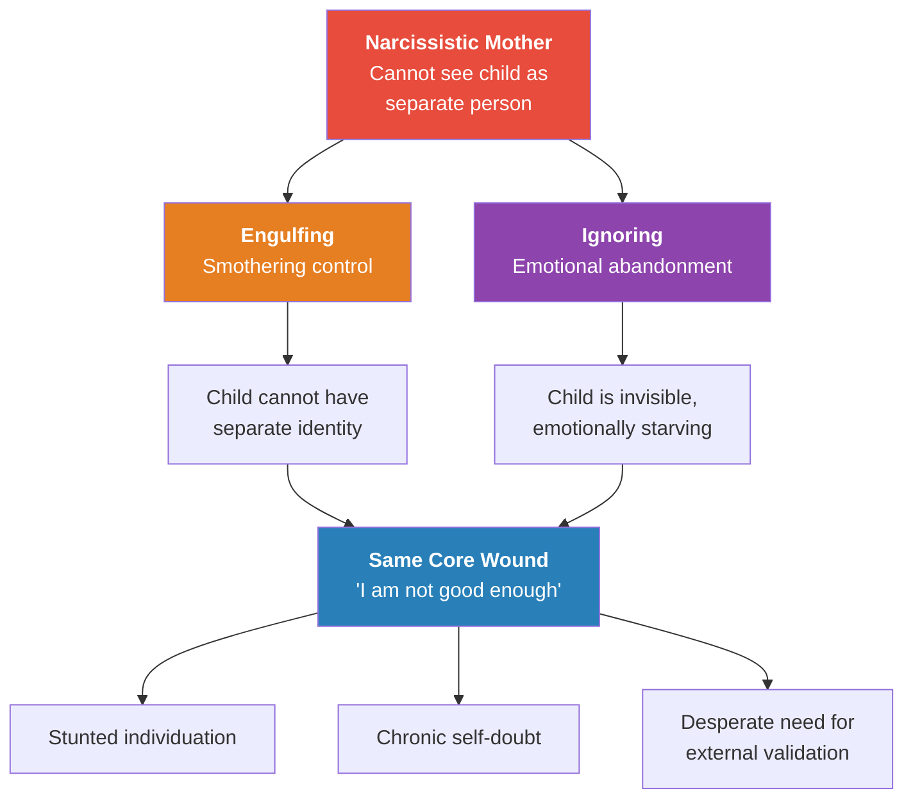
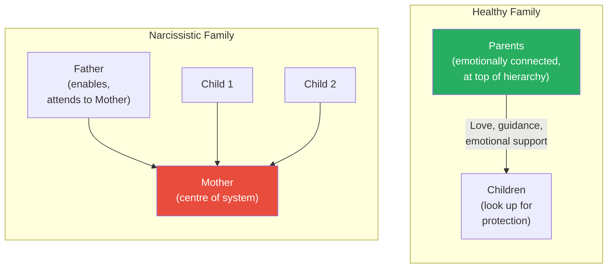
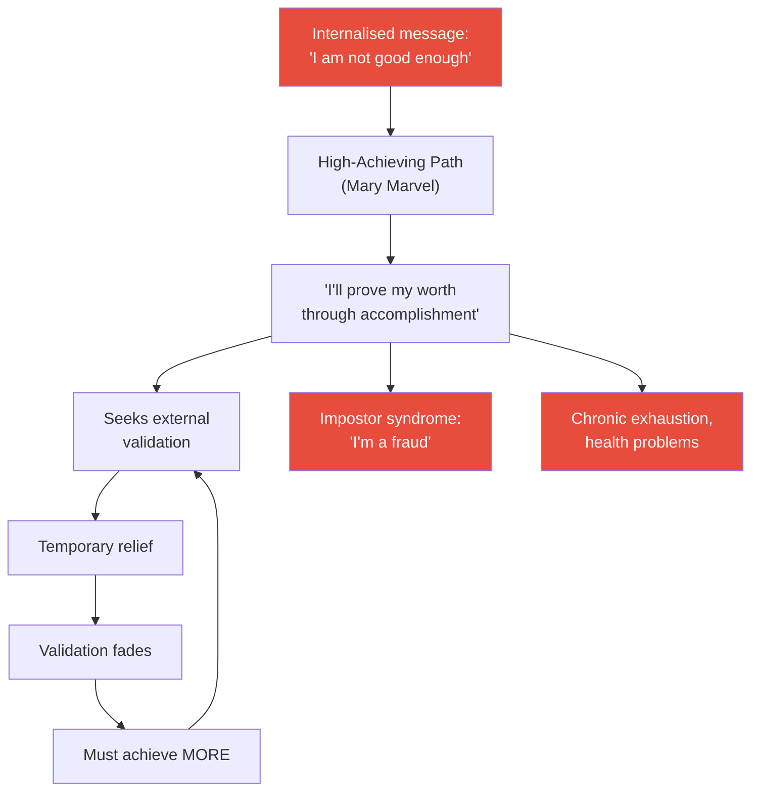
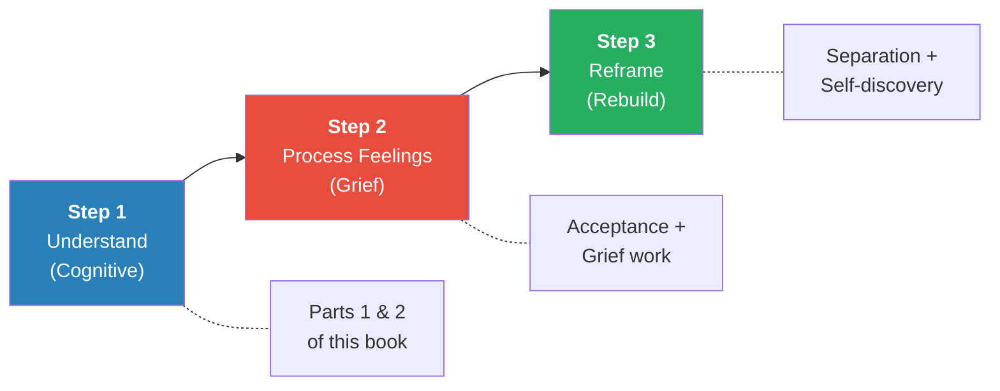
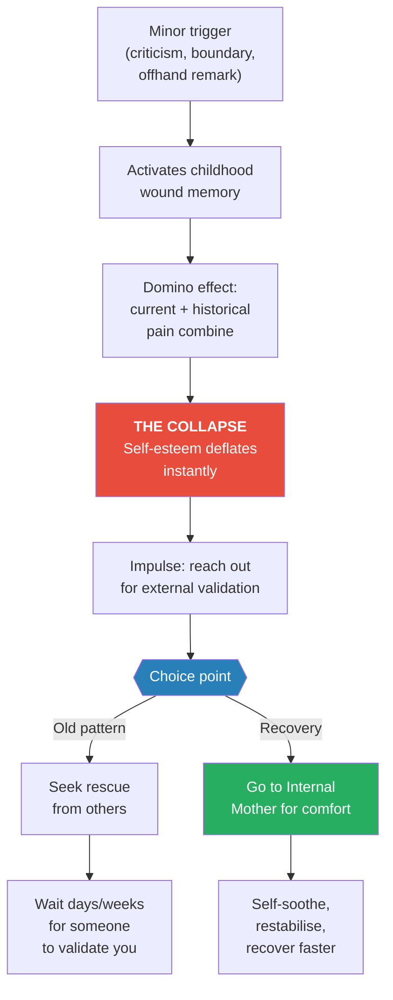
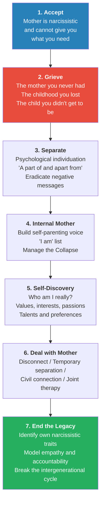
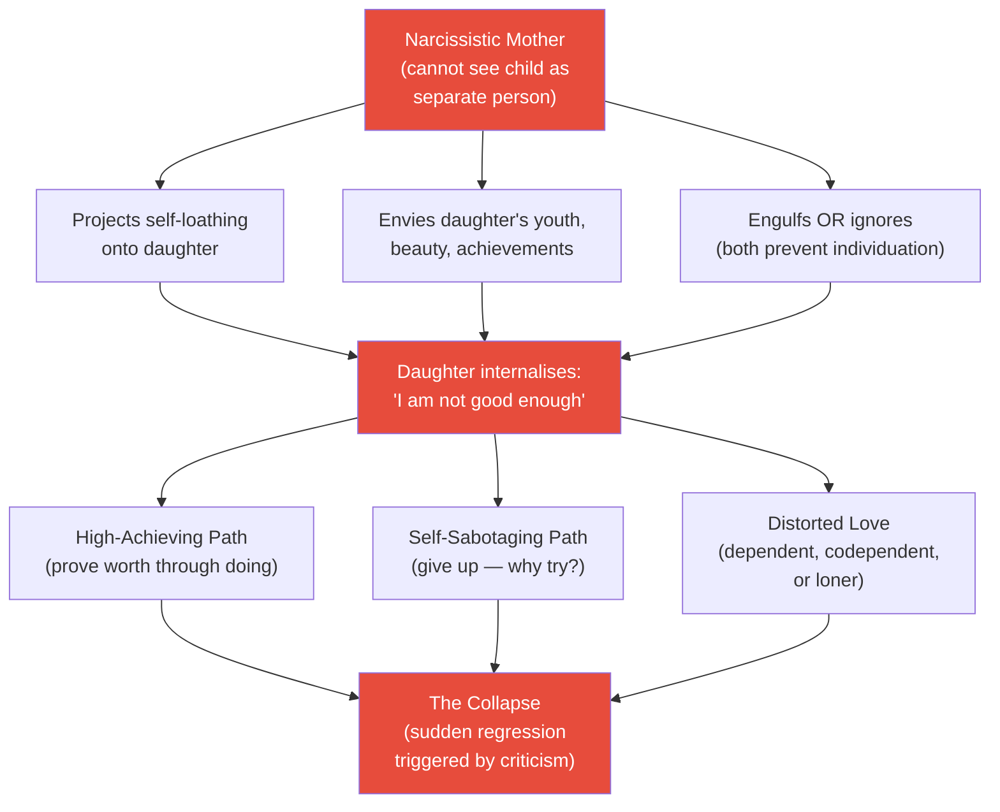

# Will I Ever Be Good Enough? — Karyl McBride

> **One-line summary:** A recovery manual for adult children raised by narcissistic mothers, showing how the wound of "never being good enough" forms, why it persists, and the precise steps to heal it.

---

> **A note on gender:** McBride writes specifically about daughters and mothers, because the mother-daughter dynamic involves unique pressures around identity-mirroring and role-modelling. However, she explicitly states that sons sustain the same core wound. The dynamics of engulfing, ignoring, projection, envy, and the collapse apply regardless of gender. Her 2023 sequel, [[Will the Drama Ever End - Karyl McBride]], broadens the lens to the entire narcissistic family system — fathers, sons, siblings, and spouses included. If you are a son reading this: this book is about you too.

---

## About the Author

Dr. Karyl McBride is a licensed marriage and family therapist with over twenty-eight years of clinical practice specialising in narcissistic family dynamics at the time of writing. She is herself the daughter of a narcissistic mother — a fact she shares openly and weaves throughout the book as both credential and compass. Her clinical research drew on hundreds of interviews and therapy sessions with daughters of narcissistic mothers. *Will I Ever Be Good Enough?* produced nineteen foreign translations and became the foundational text on maternal narcissism. She later wrote *Will I Ever Be Free of You?* (2015) on divorcing a narcissist, and [[Will the Drama Ever End - Karyl McBride]] (2023), which broadens her framework to the entire narcissistic family system.

---

## The Big Idea

- Most writing on narcissism focuses on the narcissist — their traits, tactics, and disorder
- <b style="color: #2980b9">McBride's contribution is isolating the specific wound narcissistic mothers inflict on their children</b> — not generic "bad parenting," but a precise pattern: the child exists as an extension of the mother's ego, never as a separate person, and absorbs the message "I am not good enough"
- This wound is delivered through two opposite styles — <b style="color: #e74c3c">engulfing (smothering control) or ignoring (emotional abandonment)</b> — but both produce the same internal damage: a collapsed sense of self, chronic self-doubt, and a desperate need for external validation
- The mother's narcissism also means she is envious of her child, projects her own self-loathing onto the child, and punishes the child for independent identity — creating a no-win situation where the child can neither succeed nor fail safely
- Recovery follows a strict sequence that cannot be skipped: <b style="color: #27ae60">accept the truth, grieve what you lost, separate psychologically, build an internal mother, rediscover your authentic self, and end the legacy</b>
- <b style="color: #e74c3c">Most people skip the grief step</b> — and when they do, nothing else in recovery works

---

## Key Concepts at a Glance

| Concept | One-line summary |
|---------|-----------------|
| **The "Not Good Enough" Wound** | The core injury: a deep, persistent conviction of unworthiness installed by a mother who could never be satisfied |
| **Engulfing vs. Ignoring** | Two opposite narcissistic mothering styles — smothering control or emotional absence — that produce identical internal damage |
| **The Empty Mirror** | The mother cannot reflect the child's true self back to her — the child sees only what the mother needs her to be |
| **The Ten Stingers** | Ten recurring dynamics in narcissistic mother-daughter relationships, from jealousy to boundary violations |
| **Mary Marvel vs. Self-Saboteur** | Two polar opposite daughter patterns — the overachiever who performs for worth, and the underachiever who gives up entirely |
| **The Collapse** | A sudden emotional regression triggered by criticism — the childhood wound activates and all self-esteem deflates |
| **The Internal Mother** | Your own self-parenting voice — the maternal nurturing you build from within to replace what you never received |
| **Separation-Individuation** | Becoming psychologically separate from your mother while potentially remaining in contact — "a part of and apart from" |
| **The Three-Step Recovery** | Understand the problem (cognitive) → Process the feelings (grief) → Reframe your beliefs (rebuild) |
| **The Civil Connection** | A managed, low-contact relationship with your mother — polite, light, with no expectation of emotional depth |

---

## At a Glance

| Aspect | Detail |
|--------|--------|
| **Core question** | Why do daughters of narcissistic mothers feel permanently "not good enough" — and how do they heal? |
| **Author lens** | Licensed marriage and family therapist + daughter of a narcissistic mother |
| **Structure** | Three parts: Recognise the Problem → See the Impact → Work the Recovery |
| **Recovery model** | Accept → Grieve → Separate → Build Internal Mother → Rediscover Self → End the Legacy |
| **Standout feature** | The only book in the vault focused exclusively on the narcissistic mother-child wound |
| **Best for** | Adult children of narcissistic mothers at any stage of awareness or recovery |

---

## The 30-Second Version

> Every daughter of a narcissistic mother carries a wound that says "I am not good enough." It doesn't matter whether the mother smothered or ignored — the damage is the same: a collapsed sense of self, chronic self-doubt, and relationships built on trying to earn love that was never available. McBride, herself a daughter of a narcissistic mother and a therapist who has treated hundreds more, lays out the precise anatomy of this wound and a step-by-step recovery program to heal it. The critical insight: you must grieve what you lost — the mother you needed, the childhood you deserved, the child you never got to be — before any other recovery work can take hold. Skip the grief, and nothing else sticks.

---

## Part 1: Recognising the Problem

### Chapter 1 — The Emotional Burden You Carry

*McBride opens with her own experience — the "gang of harsh critics" that followed her through every aspect of her life — and traces them back to a single source: maternal narcissism.*

- McBride describes years of relentless internal criticism — voices telling her she was never good enough, never smart enough, never thin enough, never successful enough
- These voices created such extreme sensitivity that she assumed everyone was judging her as harshly as she judged herself
- She eventually traced these internal critics to their origin: a psychologically identified pattern called <b style="color: #2980b9">narcissism</b> — specifically, her mother's narcissism
- The central discovery: many mothers are so emotionally needy and self-absorbed that they are unable to give unconditional love and emotional support to their daughters
- The crucial element missing was <b style="color: #27ae60">empathetic love</b> — the kind of nurturing where a mother sees, reflects, and validates who her child actually is

#### Why Focus on Mothers and Daughters?

- Both sons and daughters suffer from narcissistic parents
- But a mother is her daughter's primary role model for developing as an individual, lover, wife, mother, and friend
- <b style="color: #e74c3c">A narcissistic mother sees her daughter as a reflection and extension of herself</b> — more than she sees her son this way
- She puts pressure on her daughter to act and react to the world exactly as Mom would, rather than in a way that feels right for the daughter
- The daughter is always scrambling to find the "right" way to respond, not realising the behaviours that please her mother are entirely arbitrary, determined only by the mother's self-seeking concern
- Most damaging: the mother never approves of the daughter simply for being herself — which the daughter desperately needs in order to grow into a confident woman
- A daughter who doesn't receive validation from her earliest relationship learns she has no significance in the world
- She thinks the problem of rarely being able to please her mother lies within herself — this teaches her she is unworthy of love
- Her early, learned equation of love — pleasing another with no return for herself — has far-reaching negative effects on every future relationship

#### The Nine DSM Traits Applied to Mothers

McBride takes the nine clinical traits of narcissistic personality disorder from the *Diagnostic and Statistical Manual of Mental Disorders* and shows how each one plays out in the mother-daughter relationship:

| # | DSM Trait | How It Looks in a Narcissistic Mother |
|---|----------|--------------------------------------|
| 1 | Grandiose self-importance | Can only talk about herself and her accomplishments; never asks about her daughter |
| 2 | Fantasies of unlimited success | Believes her mundane activities will bring her fame and recognition |
| 3 | Believes she is "special" | Treats service workers like serfs; demands VIP treatment for herself and family |
| 4 | Requires excessive admiration | Demands gratitude for every small thing she does; reminds you of her sacrifices |
| 5 | Sense of entitlement | Expects to skip lines, receive special treatment, and have automatic compliance |
| 6 | Interpersonally exploitative | Chooses "friends" based on utility; drops people who can no longer serve her |
| 7 | Lacks empathy | Cannot see or validate what her daughter is feeling; corrects and criticises instead |
| 8 | Envious of others | Believes other women are jealous of her; is actually jealous of her own daughter |
| 9 | Arrogant and haughty | Decides which children are "good enough" for her family to associate with |

- Each trait produces behaviours that communicate the same two messages: **"It's all about me"** and **"You're not good enough"**
- Narcissists lack empathy and are unable to show love — they appear to have a superficial emotional life
- Their world is image-oriented, concerned with how things look to others
- Narcissism is a spectrum disorder — your mother may have a few traits or a full-blown personality disorder
- The American Psychiatric Association estimates approximately 1.5 million American women with full narcissistic personality disorder — but nonclinical narcissism is far more pervasive
- Even mothers with only a few narcissistic traits can produce the "not good enough" wound
- Without empathy and love from her mother, a daughter lacks a true emotional connection and feels that something is missing — in severe cases, the most basic parental care is absent; in subtle cases, daughters grow up feeling empty and bereft without understanding why

---

### The 33-Item Questionnaire: Does Your Mother Have Narcissistic Traits?

One of the book's most valuable practical tools — a checklist designed to help readers identify maternal narcissism. All questions relate to narcissistic traits. The more you check, the more likely your mother falls on the narcissistic spectrum.

| # | Question |
|---|----------|
| 1 | When you discuss your life issues with your mother, does she divert the discussion to talk about herself? |
| 2 | When you discuss your feelings with your mother, does she try to top the feelings with her own? |
| 3 | Does your mother act jealous of you? |
| 4 | Does your mother lack empathy for your feelings? |
| 5 | Does your mother support only those things you do that reflect on her as a good mother? |
| 6 | Have you consistently felt a lack of emotional closeness with your mother? |
| 7 | Have you consistently questioned whether or not your mother likes you or loves you? |
| 8 | Does your mother do things for you only when others can see? |
| 9 | When something happens in your life (accident, illness, divorce), does your mother react with how it will affect her rather than how you feel? |
| 10 | Is your mother overly conscious of what others think? |
| 11 | Does your mother deny her own feelings? |
| 12 | Does your mother blame things on you or others rather than own responsibility? |
| 13 | Is your mother hurt easily and does she carry a grudge for a long time without resolving the problem? |
| 14 | Do you feel you were a slave to your mother? |
| 15 | Do you feel you were responsible for your mother's ailments or sickness? |
| 16 | Did you have to take care of your mother's physical needs as a child? |
| 17 | Do you feel unaccepted by your mother? |
| 18 | Do you feel your mother is critical of you? |
| 19 | Do you feel helpless in the presence of your mother? |
| 20 | Are you shamed often by your mother? |
| 21 | Do you feel your mother knows the real you? |
| 22 | Does your mother act like the world should revolve around her? |
| 23 | Do you find it difficult to be a separate person from your mother? |
| 24 | Does your mother want to control your choices? |
| 25 | Does your mother swing from egotistical to depressed mood? |
| 26 | Does your mother appear phony to you? |
| 27 | Did you feel you had to take care of your mother's emotional needs as a child? |
| 28 | Do you feel manipulated in the presence of your mother? |
| 29 | Do you feel valued by your mother for what you do, rather than for who you are? |
| 30 | Is your mother controlling, acting like a victim or martyr? |
| 31 | Does your mother make you act different from how you really feel? |
| 32 | Does your mother compete with you? |
| 33 | Does your mother always have to have things her way? |

> [!tip] Core Insight
> All 33 questions relate to narcissistic traits. You do not need to check all of them for your mother's narcissism to have caused significant damage. Even a few checked boxes indicate a mother who could not see you as a separate person with your own needs and feelings.

---

### Chapter 2 — The Empty Mirror: My Mother and Me

*The central metaphor of the book: a child looks in the mirror of her mother's face and sees not herself, but whatever the mother needs her to be.*

- If you are a daughter of a narcissistic mother, you have likely internalised three core messages:
  - **"I'm not good enough"**
  - **"I'm valued for what I do rather than for who I am"**
  - **"I'm unlovable"**
- These messages produce a predictable constellation of symptoms:
  - Emptiness inside and lack of contentment
  - Longing for sincere, authentic people
  - Struggling with love relationships
  - Fearing you will become like your mother
  - Difficulty trusting people
  - Feeling your emotional development is stunted
  - Finding it difficult to create an authentic life

#### The Ten Stingers

McBride identifies ten recurring dynamics in narcissistic mother-daughter relationships:

| # | Dynamic | Core Pattern |
|---|---------|-------------|
| 1 | Can never win approval | You try endlessly to please her; nothing is ever enough |
| 2 | Image over feelings | How things look matters more than how you feel |
| 3 | Mother's jealousy | She is threatened by your looks, achievements, relationships |
| 4 | No support for self-expression | Your interests are tolerated only when they serve her needs |
| 5 | It's always about Mom | Every conversation, every event circles back to her |
| 6 | Unable to empathise | She cannot see, hear, or validate your emotional experience |
| 7 | Can't deal with feelings | Her emotional range is limited to cold, neutral, or angry |
| 8 | Critical and judgmental | Uses you as a scapegoat for her own bad feelings about herself |
| 9 | Treats you as a friend, not a daughter | You are her confidante, therapist, and emotional support system |
| 10 | No boundaries or privacy | You are treated as an extension of her, not a separate person |

#### McBride's Personal Story: The Internal Critics

- For years, McBride was accompanied by a gang of harsh internal critics
- While spring-cleaning: "This house will never be what you want it to be"
- While exercising: "Your body is falling apart and you're a wimp"
- Making financial decisions: "You were always a moron at math"
- About relationships: "You always pick the wrong men. Why don't you just give up?"
- About her children: "Your life choices have harmed your children; you should be ashamed!"
- These critics never gave her a moment's peace — always the same message: **no matter how hard you try, you will never be good enough**
- When she finally decided to trace their origin, her self-protecting denial reminded her: "I had a roof over my head, clothes to wear, food to eat. So what was my problem?"
- It took years to recognise the answer: maternal narcissism

---

> [!example] Jennifer's Coin Purse (Christmas, childhood)
> - Eight-year-old Jennifer watched her mother admire a beautiful coin purse in a department store
> - She skipped school lunches for weeks to save enough money to buy it
> - She wrapped it in shiny red paper and saved it for Christmas morning
> - When her mother opened it, she accused Jennifer of stealing it and threw it across the room, screaming "I don't want a gift from a thief!"
> **The lesson:** No amount of love, sacrifice, or effort can satisfy a narcissistic mother — the target is always moving.

> [!example] Addie's Modelling Career vs. Mom's Beauty Contest
> - As a high schooler, Addie was interested in modelling and started investigating programmes
> - She landed fun modelling jobs for local department stores and was excited
> - Her mother's jealousy intervened: Mom got on the Internet and found over-forty beauty contests
> - She asked Addie to enter her — and Mom won one of the contests
> - The family Christmas card that year was a picture of Mom in the beauty contest, with a blurb she wrote about "never being too old to do what you want in life"
> - Addie never said anything but was deeply disappointed and embarrassed
> - She never followed through with her own modelling ambitions — the competition with her mother felt too overwhelming
> - In therapy, Addie said sadly: "It never got to be about me"
> **The lesson:** A narcissistic mother cannot celebrate her daughter's success without hijacking it. The daughter's achievement becomes a platform for the mother's own ambitions.

> [!example] Gayle's Recurring Dream (childhood through adulthood)
> - Gayle dances through a green meadow carpeted with wildflowers
> - She spots a beautiful, flawlessly white horse grazing peacefully
> - She runs to it joyfully, offering an apple she picked from a nearby grove
> - The horse ignores the fruit and viciously bites her shoulder, then returns to grazing with complete indifference
> - Gayle told McBride sadly: "If my own mother can't love me, who can?"
> **The lesson:** The horse represents both the fantasy mother Gayle wished she had and the real mother who turned away. The recurring dream captures the cycle of hope and devastation that defines the narcissistic mother-daughter relationship.

---

### Chapter 3 — The Faces of Maternal Narcissism

*Two opposite mothering styles produce the same wound — the difference is in the delivery, not the damage.*

*Both the engulfing and ignoring styles prevent the child from developing a separate sense of self — the wound is identical even though the delivery looks opposite.*

#### The Engulfing Mother

- Tries to dominate and control every aspect of her daughter's life
- Makes all the decisions: what to wear, how to act, what to say, what to think, how to feel
- <b style="color: #e74c3c">Often appears to be a great mom</b> to outsiders — she is involved, active, engaged
- But the daughter has no room to grow, blossom, or find her own voice
- The daughter becomes an extension of the mother, not a person in her own right
- Showbiz mothers are a classic example — shepherding daughters through child beauty pageants, pushing them onto stages
- The key message: "You are me. Your job is to be what I need you to be."

> [!example] Miriam's Engulfing Mother vs. Her Fiance (age 28)
> - Miriam was engaged to be married, locked in a fierce struggle with her mother over control of her life
> - Her mother did not approve of the fiance and did everything conceivable to interfere
> - She spoke negatively about him to several people at his place of employment
> - Her mother's goal: "She hoped the word would get back to me that my fiance was a loser, or better still, that he would give up and leave town"
> **The lesson:** The engulfing mother cannot tolerate her daughter making independent life choices — especially choosing a partner who might take the daughter away from her orbit.

#### The Ignoring Mother

- Does not provide guidance, emotional support, or empathy
- Consistently discounts and denies the daughter's emotions
- May provide physical necessities — roof, food, clothing — but no emotional connection
- The daughter is invisible, dismissed, discounted
- The key message: "You don't matter. There isn't room in my heart for you."

> [!example] Marie and the Period (age 13)
> - When Marie started her period at thirteen, she could not go to her mother
> - Whenever any sexual topic came up, even on TV, her mother would say: "Don't talk to me about sex; I don't want to discuss it"
> - When Marie needed personal items, she had to call her sister or her teacher
> - Her teacher was the one who explained menstruation to her
> **The lesson:** The ignoring mother's emotional absence extends to the most basic parenting responsibilities. The daughter must find substitute adults for care that should have come from her mother.

#### Engulfing vs. Ignoring: Comparison

| Dimension | Engulfing Mother | Ignoring Mother |
|-----------|-----------------|----------------|
| **Control style** | Dominates every choice and decision | Withdraws, absent, emotionally unavailable |
| **Appearance to outsiders** | "Such an involved mother!" | "She lets her kids be independent" |
| **Message to daughter** | "You are an extension of me" | "You are invisible to me" |
| **Individuation damage** | Cannot develop separate identity | Cannot fill emotional tank to separate |
| **Daughter's response** | Conforms to mother's wishes, loses self | Keeps trying to merge with mother, seeking love |
| **Core wound** | "I don't exist as myself" | "I don't exist at all" |

> [!tip] Core Insight
> The engulfing and ignoring styles look like polar opposites from the outside. Inside the daughter, they produce the same result: a child who never learned she was a separate, worthy person with her own feelings, desires, and identity.

---

### Chapter 4 — Where Is Daddy? The Rest of the Narcissistic Nest

*The narcissistic family is not just one bad parent — it is an entire system organised around the mother's needs.*

- In a healthy family, parents sit at the top of a hierarchy, shining love down on the children
- In a narcissistic family, <b style="color: #e74c3c">the mother sits at the centre</b> with everyone else orbiting around her like planets around the sun
- Father typically enables the system — either by being passive or by actively supporting the mother's version of reality
- Children learn unspoken rules:
  - Don't discuss the dynamic
  - Don't rock the boat
  - Mask your real feelings
  - Pretend everything is okay
- <b style="color: #2980b9">Trust becomes the central development casualty</b> — without being able to rely on parents, children cannot develop confidence in themselves or safety in intimate connections

#### The Sisters Extreme

- When two daughters are raised by the same narcissistic mother, they typically take opposite paths:
  - One becomes the <b style="color: #2980b9">high achiever</b> — "I'll prove I'm worthy through accomplishment"
  - The other becomes the <b style="color: #2980b9">self-saboteur</b> — "I'll never be good enough, so why try?"
- The critical difference: the high achiever usually had someone — a father, grandmother, aunt, teacher — who gave her unconditional love
- The self-saboteur usually had no such person, or had them only briefly
- <b style="color: #27ae60">Despite wildly different external lives, both sisters carry the same internal wound</b> — the same negative messages, the same self-doubt, the same conviction of unworthiness

---

### Chapter 5 — Image Is Everything

*"Put a smile on that pretty little face" — the narcissistic family's relentless focus on appearance over authenticity.*

- Narcissistic families run on image — how things look to the outside world matters infinitely more than how anyone feels inside
- The mother's fragile ego requires a perfect facade, and the daughter is expected to polish and carry that facade
- <b style="color: #e74c3c">The daughter learns: "How you look is more important than who you are or how you feel"</b>
- This produces a double whammy: cultural pressure on women to be thin, fit, and beautiful PLUS maternal pressure to maintain a perfect image
- Daughters describe being put on diet pills at twelve, having makeup applied at fifteen, being told "It hurts to be beautiful"
- The relentless focus on image leaves no room for authentic feelings — the daughter is forced to be insincere

- McBride's own mother would tell her: "Put a smile on that pretty little face. Throw back your shoulders, hold up your head, and don't let the world know that you are unhappy"
- It hurts to smile when the feeling underneath is sadness, anger, or confusion
- The daughter's true feelings are irrelevant — only the presentation matters
- This message gets reinforced by the broader culture's obsession with female beauty, thinness, and perfection — making it a double whammy for daughters of narcissistic mothers

> [!example] Constance and the "Mother Look" (age 28)
> - Constance's mother was involved in every aspect of her life: how skinny she was, the clothes she wore, the right hair colour, even her career
> - Her mother put her on diet pills at age twelve and started doing her makeup at fifteen
> - Her mother's explanation: "Men leave women who let themselves go"
> - Even now, as an adult visiting her mother, Constance makes sure to have her "mother look" in place
> - She starves herself for two weeks before every visit to be thin enough
> **The lesson:** The image obsession doesn't end in childhood — it follows the daughter into adulthood, shaping her relationship with her own body for decades.

> [!example] Gladys and the Go-Go Boots
> - Gladys lost an audition for a high school play and felt dejected
> - She just needed a hug from her mother
> - Her mother couldn't tune in to her feelings — instead, she went out and bought Gladys a pair of go-go boots
> - She proudly announced: "If you feel bad inside, at least you can look good at school tomorrow"
> **The lesson:** When a mother cannot empathise, she substitutes image for connection. The daughter learns that her feelings are invisible — only her appearance is real.

---

## The Narcissistic Family System

*Before moving to the impact on adult life, McBride describes the architecture of the narcissistic family.*

*In a healthy family, love flows downward from parents to children. In a narcissistic family, all energy flows inward toward the mother — everyone orbits around her needs.*

- In the narcissistic family, the unspoken rule is: do not discuss this dynamic
- It becomes a family secret — children fear abandonment if they break the silence
- They mask real feelings and pretend everything is okay — a survival mechanism
- This sets them up for interpersonal difficulties later in life
- <b style="color: #2980b9">Trust becomes the central developmental casualty</b> — without trust in early years, children are set up with a major handicap in believing in themselves and feeling safe in intimate connections
- Communication becomes "triangulated" — instead of talking directly, the mother expresses criticism to another family member, hoping it will get back to the daughter; then she can deny saying it
- The narcissistic family is like <b style="color: #2980b9">a shiny red apple with a worm inside</b> — it looks good on the outside but hides profound pain

---

## Part 2: How Narcissistic Mothering Affects Your Entire Life

### Chapter 6 — The High-Achieving Daughter ("Mary Marvel")

*"I decided at age ten that working hard was the only way to feel good about myself. I wish someone had told me it wouldn't fill the bill."*

- The high-achieving daughter, McBride's "Mary Marvel," embarks on a whirlwind of accomplishment to prove her worth
- She bases her identity on what she does, not who she is — a "human doing" rather than a "human being"
- <b style="color: #e74c3c">No amount of achievement ever makes her feel accomplished on the inside</b>
- She never gives herself credit, constantly feels inadequate, and is chronically exhausted
- The root: "I am valued for what I do, not for who I am"

#### Three Mary Marvel Pitfalls

1. **Lack of self-care** — busyness becomes an addiction that numbs pain, leading to medical problems (MS, IBS, fibromyalgia, chronic exhaustion)
2. **Dependence on external validation** — praise from others temporarily fills the void, but because it is external, it can be taken away at any time, creating constant anxiety
3. **The impostor syndrome** — despite mountains of evidence of competence, the daughter remains convinced she is a fraud who will eventually be exposed

> [!abstract] The Impostor Syndrome in Daughters
> - Unable to accept accomplishments no matter how much evidence exists
> - Dismisses success as luck, timing, or the system being easy
> - Fears that someone will eventually "find out" she isn't really competent
> - Roots: growing up feeling never good enough makes it impossible to internalise genuine success
> - Even extended, repeated success does not diminish the impostor feeling — this is the lasting power of internalised messages
> - Family dynamics that contribute: unrealistic standards, excessive criticism, conflict and anger

> [!example]- Daughters Describe the Impostor Syndrome (composite)
> - Lonnie, 46, owns her own clothing company: "I have a knack for appearing competent when I don't think I really am. I'm always worried someone will find out I'm not really good at my job. I just know how to put on a good show"
> - Ellen, 57, a successful real estate agent: "Every time I make a big sale, I regard it as luck or just a fluke. I predict that the next time will be a failure"
> - Karena, 38, after receiving her Ph.D.: "I actually wrote that damn dissertation, but I won't let anyone read it. I don't want anyone to see how dumb it sounds. It is amazing I got that degree"
> - Lela, 59: "My husband often says, 'Do you have any idea how awesome you are?' I am truly astounded that I get awards. Why would they pick me? My resume is six pages long, but I can't even say 'You go, girl' to myself"
> - Cassidy, a medical doctor: "People call me 'Doctor' and look up to me. Even though I can see I have these important skills, I wonder if I dare allow myself credit. Mother always warned me, 'Don't get a big head'"
> **The lesson:** These are not insecure beginners — they are accomplished, seasoned professionals who cannot internalise their own success. The mother's voice is louder than every achievement.

#### McBride's Recurring Dream

- McBride shares her own dream from her early years:
  - She stands in front of a mirror trying to get dressed
  - She tries on outfit after outfit in arduous slow motion — nothing looks right
  - A voice in the hall calls: "Come on, you're okay just the way you are"
- She misinterpreted this dream for years as being about her husband's impatience
- She ultimately realised the voice in the hall was her own intuition — voicing the validation she could never give herself

#### When High Achievement Is Healthy

- McBride is careful to note: not every high achiever is driven by the wound
- Some daughters genuinely pursue what they love and give themselves credit
- High achievement becomes a problem only when you:
  - Have medical or mental health problems from not taking care of yourself
  - Seek only external validation to define your self-worth
  - Cannot give yourself credit for what you accomplish

*The high achiever's cycle: each accomplishment provides brief relief but never reaches the wound, so the cycle accelerates until health collapses.*

---

### Chapter 7 — The Self-Sabotaging Daughter

*The self-saboteur is the high achiever's internal twin — same wound, opposite expression.*

- Where Mary Marvel tries harder, the self-saboteur gives up: "I'll never be good enough, so why try?"
- <b style="color: #2980b9">Self-sabotaging behaviour is not a lack of talent or skill</b> — it is an internal struggle where negative messages override capability
- Common patterns:
  - Giving up before starting
  - Numbing pain with addictions (alcohol, drugs, food, sex, stealing)
  - Staying stuck in self-destructive lifestyles
  - Chronic underachievement despite obvious intelligence and ability
- The self-saboteur often had no one — no grandmother, no father, no aunt — to offset the mother's negative messages
- Left with buried, unprocessed feelings, she develops defence mechanisms: depression, eating disorders, addiction
- <b style="color: #e74c3c">The narcissistic mother may disown the self-saboteur</b> — the daughter's struggles cause too much shame and humiliation for a narcissistic mother to handle

#### Searching for Substitute Caregivers

- When children are not allowed to be dependent on their mothers, they search for substitute caretakers as they get older
- They attempt to get friends, relatives, lovers, society to take care of them
- This is another form of seeking external validation — just as high achievers seek it through accomplishment, self-saboteurs seek it through dependency
- McBride lists real examples: one daughter just released from prison, one on welfare with no car, one making tomato soup from ketchup packets, one at forty-five still in her parents' basement, one drinking every day, one just released from hospital after her boyfriend broke her arm
- <b style="color: #27ae60">Self-sabotaging behaviour is not a lack of talent or skill — it is an internal struggle</b> where the daughter clearly wants to do something but her internal messages say she cannot

> [!example] Janice and the Fear of Motherhood
> - Janice always wanted a family but was too frightened to have her own children
> - As a plain child, she was always compared unfavourably to other girls
> - Her mother was a child-minder, and when Janice was about nine, there was an incredibly pretty three-year-old girl in her mother's care
> - They would all go out together and her mother would pretend to strangers that this child was hers — and that the rest of them (her actual children) were those she minded
> - Her mother's favourite phrase: "When you grow up, I hope you'll have a daughter just like you; then you will know what it's like"
> - Having her own kids was just too scary: "What if I turned out like that?"
> **The lesson:** The "not good enough" message can be so powerful it prevents a daughter from pursuing her deepest desire. Janice did not avoid motherhood because she lacked maternal instinct — she avoided it because her mother convinced her she would poison everything she touched.

> [!example] Misty's Fantasy World
> - From an early age, Misty created a fantasy world where she was loved and talented
> - As a teenager, she would play music, close her eyes, and imagine being a great singer, dancer, or guitarist
> - At eighteen, she took guitar lessons but quit when she saw the UK champion — "What's the point?"
> - She also enjoyed line dancing but abandoned it after seeing how good the champions were
> - She cannot do anything for the pure fun of it — everything becomes a test she is certain to fail
> - "I flounder. Perhaps I am looking for a way to impress my mum before it's too late."
> **The lesson:** The "not good enough" message doesn't just prevent achievement — it poisons the capacity for joy. When every activity becomes an audition for maternal approval, nothing can be done for its own sake.

---

### Chapter 8 — Romantic Fallout

*"If my own mother can't love me, who can?" — how the maternal wound distorts every love relationship.*

- Daughters of narcissistic mothers learn that love means <b style="color: #e74c3c">what someone can do for you or what you can do for them</b> — a transactional, distorted version of love
- This distorted definition produces three relationship patterns:
  - **Dependent** — seeking a partner who will fill the maternal void
  - **Codependent** — becoming the caretaker, recreating the role she played with her mother
  - **Loner** — giving up on relationships entirely because the "relationship picker" is damaged
- The <b style="color: #2980b9">repetition compulsion</b> drives daughters to unconsciously choose partners who replicate the narcissistic dynamic — emotionally unavailable, critical, or controlling
- Daughters keep trying to "win at love where they failed with Mom"

#### Three Relationship Patterns in Detail

**The Dependent Daughter:**
- Searches for a partner who will fill the maternal void — someone to take care of her emotionally
- Unconsciously selects partners who are controlling or engulfing — recreating the familiar dynamic
- May tolerate poor treatment because any attention feels like love

**The Codependent Daughter:**
- Becomes the caretaker in every relationship — recreating the role she played with her mother
- Attracts needy, entitled, or narcissistic partners
- Gives endlessly without receiving, because she learned that love means serving someone else's needs

**The Unhealthy Loner:**
- Has decided she is so damaged or unlovable that she can never be in a relationship
- Usually after a series of failed relationships, she has given up
- Deeply wants love but believes nothing can change
- "I am not good enough" becomes a life mantra

> [!example] Marcia and the Dog (age 59)
> - Marcia trusts no one but her dog
> - "I am angry that I have spent the best years of my adult life in unhealthy relationships trying to capture the love and approval my mother withheld"
> - "Only because my life exploded on all fronts did I gain the perspective that I had been blind to the recurrences of unhealthy childhood dynamics"
> - "I'm nearly 60 years old now, so much life has gone by, and I'm basically alone today. Guess what? I'm staying that way! It's far too risky to do anything else"
> **The lesson:** McBride responds to this with compassion: "This woman just needs to complete her own recovery. You can't trust men without trusting yourself and your relationship picker. You can't have the word TRUST without the letter U."

> [!example] Felicity and the Stranger's Insult
> - A stranger visited Felicity's house to pick up a work cheque
> - Felicity welcomed her in, offered a beverage, chatted politely for about ten minutes
> - When the stranger left, she said: "Nice to meet you too, even though you have issues"
> - Felicity knew instinctively the comment was about the stranger's own problems
> - But it still felt like a punch in the stomach — and that feeling lasted for an entire day
> - One comment from a stranger activated decades of "you're not good enough"
> **The lesson:** The "collapse" turns a minor slight into a full regression to childhood. The stranger's words didn't cause the pain — they triggered it. The wound was already there, installed by years of maternal invalidation.

---

### Chapter 9 — Help! I'm Becoming My Mother

*The greatest fear of every daughter of a narcissistic mother: passing the wound to the next generation.*

- Giving birth triggers a specific fear in daughters: "Will I emotionally orphan my children the way my mother orphaned me?"
- This fear is real and warranted — <b style="color: #e74c3c">the behaviours we model for our children shout, while our direct parenting whispers</b>
- Even if you never tell your children they are "not good enough," they will absorb it if they see you treating yourself as not good enough

#### The Danger of Doing the Opposite

- Daughters often swing to the extreme opposite of their mother's style:
  - Engulfed daughters become so hands-off they ignore their children
  - Ignored daughters become so attentive they smother their children
  - Under-praised daughters overpraise until children feel like frauds
  - Over-controlled daughters remove all boundaries until children have no structure
- <b style="color: #27ae60">The goal is the middle ground</b> — not the opposite extreme
- The middle ground needs to be based on YOUR value system — it can include some of your mother's beliefs (a clean house, valuing education) while fundamentally changing how you attend to your child's emotional needs
- When you want to change something, the instinct is to think in black-and-white terms: explosive anger switches to total passivity, smothering switches to total neglect
- The goal in both cases is the assertive middle — it takes time to get there

> [!example] Jaime's First Day of Kindergarten
> - Jaime had an engulfing mother and was determined not to be overprotective
> - On her daughter Chelsea's first day of kindergarten, Jaime dropped her off and left immediately
> - Chelsea was found crying in the classroom — she wanted her mother to sit with the class for a while, like the other parents
> - Jaime had gone overboard in the opposite direction: trying so hard not to smother that she inadvertently abandoned
> **The lesson:** The opposite of engulfing is ignoring. The healthy middle is responsiveness — being present when needed, stepping back when appropriate.

> [!example] Kylie and "I See You, Lacy"
> - Having a child brought back many memories of Kylie's own childhood
> - "My mother did not connect with me. I felt like she never saw me"
> - Kylie felt she had to give her daughter what she hadn't received
> - Whenever her daughter would make a sound, Kylie would say: "I see you, Lacy. I see you"
> **The lesson:** Some daughters find a way to give exactly what they missed — the simple act of seeing and acknowledging their child. This is the wound being healed forward.

> [!example] Terra's Overpraising Backfire
> - Terra was never praised or encouraged by her narcissistic mother
> - She decided to shower her own daughter with constant praise and affirmations
> - Her sixteen-year-old daughter broke down in tears one day
> - The daughter felt she was a fake — trying to please her mother by living up to impossible praise
> - She felt she could never measure up to "all the wonderful things" her mother thought about her
> - The overpraising created the same "not good enough" feeling that underpraising would have
> **The lesson:** The opposite of dysfunction is still dysfunction. The middle ground requires seeing your child as she is — not as the mirror image of what you wish your mother had said to you.

---

## Part 3: Ending the Legacy — The Recovery Program

### The Three-Step Recovery Model

McBride's recovery follows a strict sequence that cannot be reordered or skipped:

*Step 2 is marked in red because it is the step most people skip — and when they do, Step 3 does not work.*

> [!tip] Core Insight — The Most Important Line in the Book
> "If you don't work on acceptance and grief, the rest of your recovery won't 'take.'" Most people like Step 1 and love Step 3. But they skip Step 2 — the painful middle — because who wants to feel pain? This is why many therapeutic programmes are unsuccessful. You have to clean out the trauma before you can learn to look at your situation in a healthy way.

---

### Chapter 10 — First Steps: How It Feels, Not How It Looks

*The most important chapter in the book — acceptance and grief as the foundation for everything that follows.*

#### Step 1: Acceptance

- Accept that your mother is narcissistic and that she hurt you
- Accept that she has limited capacity for love and empathy — probably always has, probably always will
- <b style="color: #e74c3c">Stop hoping she will be different the next time</b>
- This does not mean hating her or cutting her off — it means letting go of the expectation that she can give you what you need
- Narcissism is a spectrum: mothers with fewer traits may have some hope of change if motivated, but the further along the spectrum, the less likely she will ever change

#### How to Know You've Accepted

- You no longer wish and hope she will be different each time you talk
- You have no expectations of her
- You are not looking for someone else to meet your childhood needs
- You are relying on yourself to meet your own needs
- When someone is there for you, you see it as an added blessing, not your due

#### Step 2: Grief

McBride identifies three specific losses to grieve:

1. **The mother you never had** — the nurturing, empathic, loving mother you deserved
2. **The childhood you lost** — the years spent caretaking your mother instead of being a child
3. **The child you didn't get to be** — the little girl whose needs, dreams, and feelings were invisible

- <b style="color: #27ae60">Processing feelings is different from talking about them</b>
  - Talking: describing what happened, filling in details, telling the story
  - Processing: telling the story while simultaneously feeling the pain — tears, rage, physical release
  - Only processing releases trauma from the body
- The grief stages for daughters follow Kubler-Ross but with acceptance FIRST:
  1. **Acceptance** — you must accept first, or you stay in denial
  2. **Denial** — as children, you had to deny your mother's incapacity to survive
  3. **Bargaining** — you have spent your whole life hoping she will change next time
  4. **Anger** — intense rage at realising your emotional needs were not met
  5. **Depression** — intense sadness at letting go of the vision of the mother you wanted
- You will bounce through all stages, back and forth
- <b style="color: #e74c3c">Guilt will rear its head</b> — our culture teaches that "good girls don't hate their mothers"
  - Let yourself feel the guilt without letting it stop you
  - You are not advocating hatred — you are facing losses so you can get past blame
  - As Martha, 62, describes: "I had a guilt attack before this interview. My mother's favourite expression was, 'The bird shits in its own nest. Don't take it elsewhere.' She would be horrified and furious if she knew I had talked about her"

#### Practical Grief Techniques

- **Teach yourself to grieve:** Set aside time alone specifically for the grief process. Some women do best at home with shades drawn; others take long walks, go for drives, or sit in coffee shops
- **Let the feelings surface:** At first, you may sit there and nothing comes. But give yourself the time — eventually tears will leak, then pour. The trick is to let them be
- **Don't listen to well-meaning others:** Friends and family will say "Forget it already" or "Quit thinking about the past." They do not understand how important this work is. If you don't face the sadness, it will remain part of you forever
- **Use a journal:** Record feelings that surface. Writing them down is another way of getting them out of your system. Don't worry about spelling, grammar, or sentence structure — just write whatever is coming up
- **"Doll therapy":** Go shopping and find a little girl doll that resembles you between ages three and eight. Bring her home and talk to her. Keep her visible — on the bed, dresser, or couch — to remind you that she has needs

#### Grieving the Mother You Never Had

- Start with a list of what the ideal mother would look like to you
- Contrast what you wanted to what you actually had
- Face the disappointments and the pain

> [!example]- Daughters Describe Their Ideal Mother (composite)
> - "I would want someone I could call and tell things to. Someone who understood me. I could talk about my feelings and she wouldn't say a thing about herself"
> - "I would want a mom who talked about me and was proud of me in real ways. Interested in things I am interested in. Caring about my stuff. Not everything has to be about her"
> - "I always wanted to be able to let down and tell her the truth and know she would take care of me. I wanted to have feelings and have her stand there and feel them too"
> - "I so wanted a mom who dealt with real feelings and was strong emotionally. A mom who let me develop my real self and didn't expect me to be such a showpiece"
> **The lesson:** These descriptions are not extraordinary wishes. They are the basic requirements of functional mothering. The grief comes from recognising that what you needed was ordinary — and you still didn't get it.

#### Grieving the Child You Didn't Get to Be

- Think about what you might have been able to do if you had been allowed just to be a kid
- Imagine yourself doing those things right now
- Write them down and look at what you missed out on
- Allow feelings of sadness, anger, and loss

> [!example] The Rocking Chair Exercise (McBride's personal story)
> - After her children were in bed, McBride would sit in a rocking chair, close her eyes, and imagine herself as a small child
> - She would get a visual of a little girl with long blond braids and red cowboy boots
> - She would hold out her arms and ask the child to come and tell her what she needed
> - At first, the child was a sad, stomping, angry kid with flailing braids
> - But as the child talked, McBride became aware she had to take care of her now
> - "We would cry together in that rocking chair"
> - She spent many sessions doing this exercise repeatedly — it became the foundation of her grief work
> **The lesson:** Your inner child will talk to you if you invite her in. The grief work is not about being a victim forever — it is about acknowledging the wound so it can finally begin to heal.

---

### Chapter 11 — A Part of and Apart From: Separating from Mother

*Psychological separation is the bridge between grief work and becoming your own person.*

#### Why Separation Matters

- <b style="color: #2980b9">Individuation</b> — the developmental process of becoming a separate self — normally begins around age two ("no" and "mine") and continues throughout life
- Narcissistic mothers stunt this process:
  - The **ignored** daughter cannot work on separation because she is still trying to fill her emotional tank
  - The **engulfed** daughter is discouraged from seeing herself as separate
- Neither daughter's emotional needs are met; both have difficulty developing a sense of self

> [!example] "I'm Too Little for That" (McBride's personal story)
> - For many years, whenever McBride faced a big project or major life decision, she would say: "I'm too little for that"
> - During a therapy session about a breakup, her therapist asked why she didn't move to a smaller house — the one she shared with her ex was too big for one person
> - McBride responded: "I'm too little to move"
> - Her therapist smiled gently: "That's the issue right there"
> - When you haven't completed individuation, you are left emotionally immature — a half person aspiring to become whole
> **The lesson:** The phrase was not about physical capacity — it was an unconscious expression of incomplete psychological development. Until you separate from your mother, part of you remains the helpless child who needed her.

#### Three Steps to Release from the Mother Orbit

**1. Understand Projection**
- Projection is a process by which a person takes her own emotions and sees them as coming from someone else
- Narcissistic mothers project fragile ego and self-loathing onto their daughters
- The daughter doesn't understand this hatred and internalises it: "I must be bad or not good enough"
- Because this begins at such a young age, it feels normal and real

**2. Understand and Cope with Envy**
- Daughters of narcissistic mothers commonly feel their mothers' envy
- Being envied by your own mother is unnerving and awful — the daughter's sense of self is cancelled by disdain and criticism
- The daughter typically has difficulty discussing this openly because she doesn't want to appear arrogant
- But the envy was very real: comments about your looks, achievements, material wealth, weight, personality, friends, husband, or relationship with your father
- <b style="color: #27ae60">To release yourself, recognise your own goodness and strength</b> — the envy thrown your way does not belong to you
- McBride notes: "Is it any wonder that Cinderella is the favourite fairy tale mentioned by daughters of narcissistic mothers?"

**3. Eradicate Negative Internalised Messages**
- McBride asks a powerful question: Is it wise to take internalised messages from someone who was not authentic, loving, or empathetic — who could not establish an emotional bond, who projected her own feelings onto you, and who was envious of you — and believe them?
- Consider the source. Then:
  - Write down the negative messages in one column
  - In another column, write why they are not true
  - Each time a message pops into your mind, repeat this exercise
  - Eventually your persistence will pay off and the old messages will be replaced
- If you have difficulty, EMDR therapy (Eye Movement Desensitisation and Reprocessing) is particularly effective at processing these internalised messages

> [!example]- Daughters After Separation (composite success stories)
> - Erin, 40: "I never understood the individuation process until therapy. Now I can see her and keep me at the same time. I cannot tell you how much this means to me"
> - Annabel, 34: "Understanding the envy part was a big step. I always had to disparage myself to feel accepted. Now I can just be me"
> - Chloe, 62: "It always seemed like if I made mistakes, I was more accepted. When I did well, she always had something bad to say. Now I know she is not a reliable source to define me anymore"
> - Josette, 39: "I used to cry for days after talking to my mother on the phone. Now I can see she is not a reliable source. She has serious problems she always put onto me. I still think it sucks, but I no longer take it on"
> **The lesson:** Separation does not mean abandoning your mother. It means recognising that she is not a reliable source for defining who you are — and building that definition from within.

#### The Separation Criteria (adapted from James Masterson)

McBride adapts Masterson's capacities of the real self as signposts for successful separation:

- Capacity to experience a wide range of feelings deeply
- Capacity to expect appropriate entitlements (believing in yourself)
- Capacity for self-activation and assertion (pursuing your own goals)
- Acknowledgment of self-esteem (validating yourself regardless of external approval)
- Ability to soothe painful feelings (comforting yourself)
- Ability to make and stick to commitments
- Creativity and resourcefulness
- Intimacy without fear of abandonment or engulfment
- Ability to be alone and find meaning within
- Continuity of self through life's trials

---

### Chapter 12 — Becoming the Woman I Truly Am

*Two critical concepts: building the Internal Mother and understanding the Collapse.*

#### The Internal Mother

- <b style="color: #2980b9">The internal mother</b> is your own maternal instinct — the intuitive voice that wants to nurture, love, and mother you
- While you had to give up on your external mother meeting your needs, you can build an internal mother who is always available
- Many daughters feel sad and angry at the idea of "parenting yourself" — but when they accept these feelings, they reach inner strength and empowerment

**How to Build the Internal Mother:**

1. Find a quiet, healing place with solitude
2. Give her permission to be there — allow her kind, maternal voice to resonate
3. Create your **"I am" list**: "I am strong, I am intelligent, I am wise, I am loving, I am empathetic, I am honest, I am a person with integrity..."
4. Push away negative messages — if they persist, you have more grief work to do
5. Practice conferring with her regularly — especially in moments when you want to reach out for someone else to fix things
6. Treat yourself as you would treat a two-year-old child: gently, kindly, with understanding and sweetness

> [!tip] Core Insight
> The times to practise the internal mother are precisely the moments when you want to reach out for help from someone else because you don't know what to do. This is the time to go internally, find your intuitive answers, and build self-reliance. The more you confer with her, the stronger and more self-assured you become. This mother will never abandon you.

#### The Collapse

- <b style="color: #2980b9">The collapse</b> is the daughter's version of what clinicians call a "narcissistic injury" — but it is different from the narcissist's version:
  - The narcissist: holds grudges, seeks revenge, is haunted for years
  - The daughter: feels her self-esteem balloon pop — all the air rushes out — but she can forgive, forget, and restabilise
- <b style="color: #e74c3c">The collapse is triggered by anything that reminds the daughter of childhood wounds</b>
- A minor criticism, an offhand remark, even a reasonable boundary set by a friend can activate the "domino effect" — one trigger topples a row of unresolved childhood traumas
- This is the same mechanism as an <b style="color: #2980b9">emotional flashback</b> described in [[Complex PTSD - Pete Walker]]

*The collapse is the moment of choice in recovery: reach outward for rescue (the old pattern) or go inward to the Internal Mother (the new pattern). Each time you choose the Internal Mother, the collapses become shorter and less devastating.*

> [!example] Kristal and the Babysitting Request
> - Kristal stopped by her friend Beth's house to ask if Beth could babysit for a couple of hours
> - They do this for each other regularly — it is a normal, mutual arrangement
> - Beth asked: "How long will you be gone? I have laundry to do"
> - This was a perfectly reasonable question — just setting a boundary
> - But Kristal immediately interpreted it as: "You are a burden. She doesn't want to help you"
> - The reaction lasted for several days — it had triggered feelings of being a burden on her mother
> **The lesson:** The collapse makes a present-day situation feel much bigger than it really is, because it activates decades of stored pain. The friend's question was neutral. The daughter's reaction was to the mother, not the friend.

#### "The Sensitive One"

- Daughters were often labelled "the sensitive one" in the family
- They tire of being told they are overreacting
- <b style="color: #27ae60">Understanding the collapse reframes sensitivity</b>: any temporary collapse is a normal reaction to a trigger from your history, not evidence that something is wrong with you
- When you can identify and understand it, you can work to relieve it and prevent recurrence

> [!example] Joanie's Brother at the Barbecue (age 36)
> - At a family barbecue, Joanie was sparring with her brother as they often do
> - He told her she had gained too much weight: "Big!"
> - Joanie was hurt and went to her sister for sympathy
> - Her sister said: "Why would you let him bother you? Get over it"
> - Now Joanie was hurt by her brother AND angry at her sister for not supporting her
> - The incident reminded her of constant criticism about her weight from her mother growing up
> - She thought about it for an entire week
> - She could have shortened her distress by going to her Internal Mother — but she didn't have that tool yet
> **The lesson:** The collapse cascades: one trigger leads to seeking rescue, the rescue fails, and now there are two wounds instead of one. Building the Internal Mother short-circuits this cascade.

#### Self-Discovery: Who Am I Really?

- After building the Internal Mother and understanding the Collapse, McBride turns to the question daughters have avoided their whole lives: "Who am I when I'm not performing for Mother?"
- Many daughters cannot answer basic questions about their own preferences, values, and interests — they have been so focused on their mother's needs that their own identity was never developed
- McBride provides several exercises:
  - **The "If I Were Good Enough" exercise:** At the top of a journal page, write "If I were good enough, I would..." and list at least ten things you would do. Then start doing them
  - **The Values exercise:** List your beliefs and preferences across dozens of categories — education, politics, religion, parenting, love relationships, movies, music, fashion, leisure — to discover what you actually think and want
  - **The Memory exercise:** Think about what you liked to do as a small child. Childhood interests often translate directly into adult passions
  - **The Talent search:** Identify your innate talents and pursue them — not to be a superstar, but for yourself

> [!tip] Core Insight
> Being nice to yourself is not selfish. People who are fulfilled have an overflow of love and energy and can give freely to others. If your spirit is chronically depleted, you cannot care for others. Your own recovery is the best gift you can give everyone around you.

---

### Chapter 13 — My Turn: Dealing with Mother During Recovery

*You've changed, and she hasn't. Now what?*

McBride identifies four options for managing the relationship with your mother:

| Option | Description | Best When |
|--------|------------|-----------|
| **Complete disconnection** | No contact at all | Mother is truly toxic; every interaction causes significant emotional damage |
| **Temporary separation** | A hiatus during recovery work | You need space to heal without constant triggering |
| **The civil connection** | Polite, light, low-contact — no expectation of emotional depth | You've accepted her limitations and separated properly |
| **Mother-daughter therapy** | Joint sessions to work on the relationship | Mother has fewer narcissistic traits and genuinely wants to change |

#### The Civil Connection

- You maintain contact without having expectations
- Keep interactions light, civil, and polite
- Make no attempt to be emotionally close
- Works best after completing your own recovery — without adequate separation, you risk being sucked back into the narcissistic dynamics
- This is the option most daughters settle into — McBride's sequel [[Will the Drama Ever End - Karyl McBride]] later formalised this concept

#### Setting Boundaries with Mother

- Setting boundaries means clearly stating what you will and won't do
- Common fears that prevent boundary-setting:
  - "I'll hurt her feelings"
  - "She'll be furious"
  - "She'll cut me off completely — and I'll lose my mother"
  - "She'll cut me out of the will" — McBride's response: your mental health holds a higher value than money that may or may not be passed on
- <b style="color: #27ae60">The key to making boundaries stick is sticking to them yourself</b>
- You can be kind and firm simultaneously — no hostility required
- If she doesn't respect the boundary, remove yourself from the situation
- Repeat the boundary as many times as necessary

> [!abstract] Boundary-Setting Practice Examples (from McBride)
> **Mother says:** "Honey, there appears to be a lot of dust in your house. Your family deserves a clean, sanitary home."
> **You say:** "Mom, this is my house. I am comfortable with my level of housekeeping."
>
> **Mother says:** "I brought you some diet pills. I've noticed you've put on a few pounds."
> **You say:** "Mom, if I decide my weight is a problem, I will address it with my doctor."
>
> **Mother says:** "Every time I see my granddaughter, her hair looks like a damn rat's nest."
> **You say:** "Mom, I am very proud of my daughter and who she is becoming."
>
> **Mother says:** "I need you to call me every day. I could have a heart attack and you wouldn't know."
> **You say:** "If you're worried, they make safety alarms that alert 911. That's a practical solution."
>
> **Mother says:** "I can't believe you're getting a divorce. What did you do to mess up this marriage?"
> **You say:** "My relationship decisions are mine to make. It is hurtful when you cannot be supportive."
>
> **Mother says:** "What do you mean you're not coming for Thanksgiving? You know we always do Thanksgiving at my house!"
> **You say:** "Now that I'm married, I want to be involved with my husband's family also. Holidays will be different sometimes."

#### Taking Mother to Therapy

- When McBride asks clients if their mothers would attend therapy, most laugh
- The more narcissistic the mother, the less likely she will choose to attend
- If mothers with full NPD do attend, they typically:
  - Walk out when issues relate to something they've done wrong
  - Blame the daughter in front of the therapist
  - Worry only about how they look to the therapist
  - Drop out quickly, claiming the therapist has the wrong approach
- However, mothers with fewer narcissistic traits may genuinely be open to learning and growing
- Most daughters know instinctively whether their mother is a candidate for this or not

#### What If Mother Is Deceased?

- If your mother has passed away, the internal healing is still necessary
- The negative internalised messages stay stuck until you consciously loosen and release them
- Many daughters continue to have legacy issues throughout their lives even after their mother has died
- You still need to complete the recovery work — the wound does not die with the mother

> [!example] The $100 Bill on Fire (therapy session)
> - McBride was conducting a mother-daughter therapy session
> - She was explaining what constitutes good mother-daughter communication
> - The mother began frantically searching in her purse
> - She pulled out a $100 bill and her cigarette lighter
> - She lit the bill on fire, saying: "This is what I think of your therapy advice!"
> - McBride and the daughter put out the fire and ended the session quickly
> **The lesson:** The more narcissistic the mother, the less likely therapy will work. Some mothers cannot tolerate any suggestion that they need to change. You cannot fix someone who sets your advice on fire.

---

### Chapter 14 — Filling the Empty Mirror: Ending the Narcissistic Legacy

*The final step: ensuring you do not pass the wound to your own children.*

- <b style="color: #e74c3c">It is impossible to be the child of a narcissist and not be somewhat narcissistically impaired</b>
- This does not mean you are narcissistic — it means you likely acquired a few traits
- Identifying your own narcissistic traits and working on them IS responsible and self-nurturing — it proves you are taking yourself and your recovery seriously
- The most important discovery: even if McBride never told her children they were "not good enough," she still modelled it through her own struggle for worthiness
  - She spent years studying child development and working earnestly to parent differently
  - Despite all of this, she learned that how we behave in general **shouts** at our children, while our direct parenting interactions **whisper**
  - She never told her children they weren't good enough — but they saw in her own struggle for worthiness how she viewed herself
  - "It feels as if I inadvertently modelled that nasty message and so passed it on against my will"
- <b style="color: #27ae60">This is the best reason there is to embrace recovery</b> — not just for yourself, but because your children will absorb what you model, not what you say

#### Five Keys to Breaking the Legacy

1. **Empathy** — the cornerstone of healthy parenting
   - Identify the feeling: "I hear that you are angry"
   - Acknowledge it: "You are feeling sad"
   - Validate it: "It is okay to talk about mad feelings"
   - Empathising is not agreeing — it is acknowledging a real feeling
   - When a child says "I hate you, Nana" because she didn't get a cookie, the correct response is: "I know you don't hate your Nana, but you are mad right now because you want that cookie, and I understand that"
   - The temptation is to get angry back or punish — but this makes the child feel she has to stuff her feelings

> [!example] McBride's Son and the Dinner Plate (age 12)
> - McBride's son came home from school angry and began throwing things around
> - At dinner, he picked up a plate and slammed it on the table
> - Her first instinct was to tell him to knock it off and go to his room
> - Instead she said: "Honey, something is terribly wrong. You are very angry. Let's talk about what is wrong"
> - This immediately deflated the red balloon of anger — he was able to express his real feelings
> - If she had sent him to his room, the behaviour would have escalated and they would never have reached the true feelings
> **The lesson:** Whatever the child is angry about is much less important than acknowledging the feelings in the moment. He got to have a voice and be heard. McBride was rewarded by no broken dishes.

2. **Accountability** — being responsible for your own feelings and behaviour
   - No blame game — "No matter what happens to me, it is my responsibility to manage my own feelings and behaviour"
   - Teach children accountability through boundaries and age-appropriate consequences
   - Do not use harsh discipline or anything that creates shame or humiliation
   - If children are not taught accountability, they grow up with entitlement — a trait of narcissism

3. **No entitlement** — children should feel special in your eyes, not in everyone's
   - Do not overrate accomplishments — be realistic and honest
   - Teach that other people's needs are equally important
   - A child can learn to see herself as unique but also as one of many people in a community
   - She does not have to stand out from the crowd to be fulfilled
   - "Where are the bumper stickers that say 'My kid has a big heart,' 'My kid is honest,' 'My kid is kind'?"

4. **Values** — model honesty, integrity, kindness, empathy, compassion, self-respect
   - The best way to teach values is to live them
   - Use daily examples to discuss right and wrong without being harsh or judgmental
   - Make sure children's activities involve giving to others or helping in some way — giving back teaches that other people matter

5. **Authenticity** — encourage your child to be real
   - Do not teach them to lie, deny feelings, or maintain a facade
   - Allow them to express feelings even when those feelings upset you
   - No more elephants in the living room — no dysfunctional secrets the child is expected to keep
   - McBride witnessed a mother tell her crying child: "We don't cry. People don't like sad children." The child immediately clammed up. This teaches children to deny their feelings, sacrifice their true selves, and adopt an image acceptable to the parent

6. **Parental hierarchy** — your children are not your friends
   - Keep boundaries between parents and children — do not share adult information or burden them with adult problems
   - It is not their job to meet your needs — it is your job to meet theirs
   - Maintain appropriate boundaries for each person's separate space

#### The Self-Check: Am I Narcissistically Impaired?

McBride asks daughters to assess themselves against the same nine DSM traits they reviewed for their mothers:

1. Do I exaggerate my accomplishments or act more important than others?
2. Am I unrealistic about my thoughts regarding love, beauty, success?
3. Do I believe only the best institutions could understand me?
4. Do I need to be admired excessively?
5. Do I have a sense of entitlement?
6. Do I exploit others to get what I want?
7. Do I lack empathy?
8. Am I jealous and competitive, or do I believe others are jealous of me?
9. Am I haughty and arrogant?
10. *(McBride's addition)* Am I capable of authentic love?

> [!tip] Core Insight
> Very few daughters would answer all of these in the affirmative. But you may see areas that fit. Use this list as a measuring stick for personal growth, not as a source of shame. The two most important attributes for healthy selfhood and motherhood are the ability to love and the ability to show empathy. Most daughters possess an innate maternal instinct — it may simply need polishing.

---

## The Full Recovery Path

*The recovery path must be followed sequentially. Skipping grief (Step 2) makes everything after it fragile. Skipping self-discovery (Step 5) means dealing with your mother from a position of weakness rather than strength.*

---

## The "Not Good Enough" Wound: How It Forms

*The wound forms through three channels — projection, envy, and engulfing/ignoring — all delivering the same message. It then expresses through achievement, self-sabotage, or relationship dysfunction, with the Collapse as the recurring crisis point.*

---

## Love Relationships in Recovery

*After completing recovery work, McBride addresses what healthy love looks like — and what recovery tasks daughters must maintain in relationships.*

#### Choosing Differently

- Throw away the old criteria: "Is he good-looking? Financially well off? Impressive job? Classy car?"
- Ask different questions:
  - "Is he good-looking on the inside?"
  - "Can he manage his own feelings like he manages his company?"
  - "Can he show authentic feelings and display empathy?"
  - "Can he genuinely love himself and me?"
- McBride provides a checklist of meaningful factors for a lifetime partner:
  - Kind, compassionate, acts with integrity
  - Committed to lifelong learning and growing together
  - Capable of genuine empathy
  - Has his own personal style, life, interests, hobbies — separate from yours
  - Shares your core values and worldviews
  - Has a sense of humour without hostility
  - Wants to be your best friend and soul mate
  - Talks about feelings — his and yours
  - Can handle ambivalence and shades of grey
  - Brings out the best in you

#### Your Recovery Tasks in Love

Even with the right partner, daughters must continue their own work:

- **Reciprocate** — the relationship must be give-and-take, not one-directional
- **Love him for who he is**, not what he can do for you
- **When your mother-wound gets triggered**, go back to the healing steps — this is your work, not his
- **Tell him early** that your trust was impaired in childhood and that trust is a lifelong recovery issue
- **Fight dependency needs** — interdependency, not dependence or codependence
- **Keep personal boundaries** and encourage him to do the same
- **Be authentic** at all times
- **Take care of yourself** physically, emotionally, spiritually, intellectually
- If he ever tells you that you are acting "just like your mother," gently tell him never to say that again

---

## Daughters' Voices

McBride's clinical work is built on hundreds of interviews. These voices run throughout the book and collectively create its emotional texture:

> [!example]- Daughters Describe the "Not Good Enough" Wound (composite)
> - "I'm always second-guessing myself. I replay a conversation repeatedly, wondering how I could have handled it differently. Most of the time I realise there is no logical reason for me to feel embarrassed, but I still feel that way" (Jean, 54)
> - "People compliment me on my accomplishments — my master's degree, my PR career, the children's book I wrote — but I can't allow myself the credit. I beat myself up for what I think I've done poorly. I'm such a cheerleader for my friends; why can't I be that way for myself?" (Evelyn, 35)
> - "When I die, I've told my husband he can carve my tombstone with: 'She tried, she tried, she tried, she tried, and then she died'" (Susan, 62)
> - "I have never wanted children. I've never had that maternal feeling inside me" (unnamed daughter)
> - "My mother's favourite expression was: 'The bird shits in its own nest'" (Martha, 62)
> - "If my own mother can't love me, who can?" (Gayle)

---

## Connections to the Vault

This book is the focused origin — McBride's later work and other vault titles expand on its ideas:

| Vault Title | Connection |
|-------------|-----------|
| [[Will the Drama Ever End - Karyl McBride]] | The sequel. Broadens from maternal narcissism to the entire narcissistic family system — fathers, sons, siblings, spouses. Introduces the 5-Step Recovery model and the "Civil Connection" concept |
| [[Children of the Self-Absorbed - Nina W. Brown]] | Brown covers the narcissistic parent generally; McBride goes deeper on the mother specifically |
| [[Toxic Parents - Susan Forward]] | Forward's "controlling parent" type maps onto McBride's engulfing mother; Forward's "inadequate parent" maps onto McBride's ignoring mother |
| [[Complex PTSD - Pete Walker]] | The "collapse" McBride describes IS Walker's emotional flashback by another name. Walker provides the physiological explanation; McBride provides the relational one |
| [[Running on Empty - Jonice Webb]] | The ignoring narcissistic mother is Webb's emotionally neglecting parent. Webb focuses on the absence of what should have been there; McBride focuses on the presence of what should not have been |
| [[Adult Children of Emotionally Immature Parents - Lindsay C. Gibson]] | Gibson's four EI parent types map onto McBride's engulfing/ignoring framework. Gibson's "emotional loneliness" is McBride's "empty mirror" |
| [[Recovering From Emotionally Immature Parents - Lindsay C. Gibson]] | Gibson's EIRS (Emotionally Immature Relationship System) maps onto McBride's mother-child enmeshment. Gibson's "disengaging" strategies parallel McBride's civil connection |

---

## The Verdict

**The book's greatest contribution** is its relentless specificity about the narcissistic mother wound. Other books in this space discuss narcissistic parents in general, or emotionally immature parents, or toxic family systems. McBride zeroes in on one relationship — mother and child — and maps it completely: how the wound forms, how it manifests in adulthood (the high achiever, the self-saboteur, the romantic patterns, the fear of becoming your mother), and how to heal it step by step. The "not good enough" message is so precisely identified, with so many clinical voices confirming its universality, that reading this book can feel like someone has finally named the nameless thing you have carried your entire life.

**The book's weakness** is structural rather than substantive. The recovery programme in Part 3 is sound and clinically tested, but it is compressed relative to the space given to identifying the problem. The acceptance and grief chapters are thorough, but the practical exercises for building the Internal Mother, managing the Collapse, and achieving self-discovery are somewhat rushed. McBride acknowledges this by repeatedly recommending EMDR therapy and professional support — but a reader hoping to do recovery work entirely from the book may find Part 3 thinner than Parts 1 and 2 promise. Her sequel, [[Will the Drama Ever End - Karyl McBride]], partially addresses this by providing a more detailed five-step model with additional exercises.

**Who benefits most:** This book is for the adult child who senses something was wrong with her childhood but cannot name it. The woman who says "I had a roof over my head, food to eat, clothes to wear — so what is my problem?" The man who feels chronically inadequate despite objective success. The parent who is terrified of repeating the cycle. If you have been in therapy for depression or anxiety and nothing has worked, the missing piece may be that no one has investigated the family system that produced the symptoms. This book names the system.

**How it compares:** Within the vault, this book sits between [[Toxic Parents - Susan Forward]] (broader but less deep on maternal narcissism specifically) and [[Complex PTSD - Pete Walker]] (more clinical and focused on the physiological aftermath). It pairs perfectly with [[Will the Drama Ever End - Karyl McBride]] as the focused origin to the sequel's broader family-system view. For readers who recognise the engulfing/ignoring dynamic but want more on the emotional neglect angle, [[Running on Empty - Jonice Webb]] is the ideal complement. For those who want to understand the mechanism of the Collapse in clinical terms, [[Complex PTSD - Pete Walker]] provides the PTSD framework that McBride references but does not fully develop.

---

## McBride's Parting Message

McBride closes the book with a direct address to her readers:

- You now view yourself with an inner knowing and a sense of love
- You replaced the anxiety of your childhood with gratitude for having been given life AND this important journey
- You understand that your path was full of life lessons worth treasuring
- You have recognised your inner wisdom — something you can now share with your children and the world
- Your mother gave you special gifts, although they were disguised and hidden in trauma
- You are accountable for your own life. You depend on yourself to manage your emotions. You have stepped out of the shadows of a childhood filled with anxiety into the sunshine of confidence and competence
- <b style="color: #27ae60">You are quite good enough</b>

---

*Frontmatter last updated: 2026-04-03*
